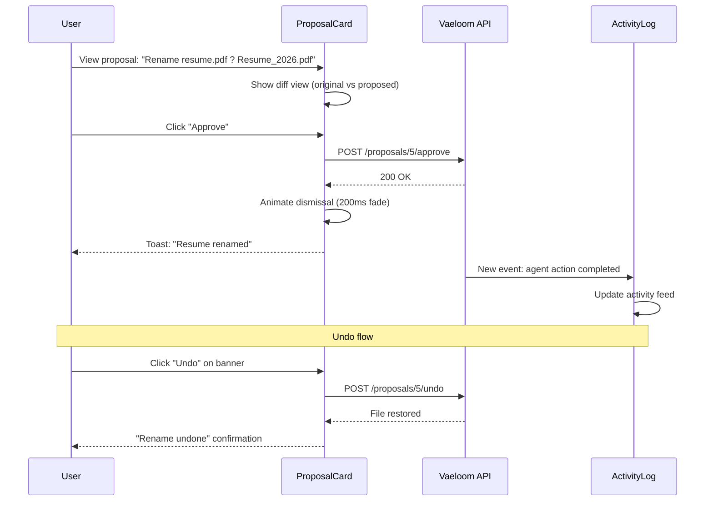

# UX Guidelines

> **Purpose:** Define UX principles, interaction patterns, and mobile strategy for Vaeloom's AI-driven agent interfaces
> **Status:** ? Upgraded to enterprise quality
> **Owner:** Frontend Team
> **Version:** 2.0
> **Last Updated:** 2026-07-17
> **Dependencies:** Accessibility.md, State-Management.md, Component-Library.md
> **Implementation Status:** ?? Spec Only
> **Review Checklist:** Standard
> **Canonical source:** docs/Frontend/UX-Guidelines.md

## Overview

Vaeloom's UX guidelines define how the application interacts with users across every touchpoint — from the dashboard that greets them on login to the agent proposals that organize their files and the chat interface that answers their questions. The guiding philosophy is "Proactive, Never Intrusive": the system suggests and notifies but never demands attention, batching notifications by priority and making every alert dismissible.

Trust Through Transparency is the second pillar — every agent action is visible in the activity log, every suggestion shows its reasoning, and every autonomous action is explainable. When an AI agent proposes renaming a file or applying to a job, the user sees not just the proposal but the reasoning behind it. This transparency is critical for building trust in autonomous AI actions.

Progressive Disclosure ensures new users aren't overwhelmed. The dashboard starts with 3-4 core widgets and reveals advanced features (memory graph editing, per-agent autonomy sliders, custom automation rules) as the user's engagement deepens over weeks. The Consistent Feedback Loop principle means every user action — approve, reject, correct, edit — has visible feedback within 100ms. Silence is interpreted as failure.

For Vaeloom's AI-driven workflows, these principles materialize in specific interaction patterns. Proposal cards show a visual diff of what will change before the user commits. Batch operations support undo with a 15-second window. Chat citations are clickable source references that let users verify information. Settings provide per-agent autonomy sliders, letting users decide how much authority each agent has.

## Goals

- Achieve sub-100ms feedback on every user action (button press, form submit, proposal response)
- Maintain 40%+ user approval rate for AI-generated proposals through relevant, well-reasoned suggestions
- Support undo for all destructive actions with a visible 15-second undo window
- Keep new user onboarding abandonment below 30% through progressive disclosure
- Achieve < 5% notification opt-out rate by batching and prioritizing alerts

## Scope

### In Scope

| Area | Description |
|------|-------------|
| Proposal UI | Card-based proposal UI with visual diff views and approve/reject/reject-with-feedback interactions |
| Batch Actions | Batch action patterns for file organization, job applications, and proposal approvals |
| Undo Mechanism | Undo mechanism with 15-second recovery window for all destructive agent actions |
| Notifications | Notification center with priority-based batching and per-agent frequency configuration |
| Autonomy Controls | Per-agent autonomy sliders in Settings for granular permission control |
| Activity Log | Activity log with chronological, searchable history of all agent actions |
| Chat Citations | Clickable citations in chat interface with source document links |

### Out of Scope

| Area | Reason |
|------|--------|
| Delayed/scheduled action execution | Future improvement, not in MVP |
| Multi-choice proposal cards | Future improvement for complex decisions |
| ML-optimized notification timing | Future improvement based on engagement patterns |
| AI auto-approval of low-risk proposals | Future improvement with user-defined rules |

## Functional Requirements

| ID | Description | Priority |
|----|-------------|----------|
| FR-UX-001 | System shall display agent proposals in card UI with visual diff of changes | P0 |
| FR-UX-002 | System shall support approve/reject/reject-with-feedback on proposals | P0 |
| FR-UX-003 | System shall provide undo within configurable window for destructive actions | P0 |
| FR-UX-004 | System shall batch notifications by priority with max 3 visible simultaneously | P1 |
| FR-UX-005 | System shall provide per-agent autonomy slider (Suggest Only / Auto-approve / Full Autonomy) | P1 |
| FR-UX-006 | System shall maintain chronological activity log with pagination | P1 |
| FR-UX-007 | System shall show clickable source references for chat citations | P1 |
| FR-UX-008 | System shall progressively disclose advanced features based on user engagement | P2 |

## Non-Functional Requirements

| ID | Description | Target | Measurement |
|----|-------------|--------|-------------|
| NFR-UX-001 | Visual feedback for every user action | < 100ms | Lighthouse/RAIL timing |
| NFR-UX-002 | Proposal approval rate | > 40% | Amplitude funnel |
| NFR-UX-003 | Undo window duration | >= 15s | Timer measurement |
| NFR-UX-004 | Notification opt-out rate | < 5% per month | Product analytics |
| NFR-UX-005 | New user time-to-first-action | < 7 days | Amplitude cohort |
| NFR-UX-006 | Activity log query latency (p95) | < 200ms | Grafana APM |
| NFR-UX-007 | Skeleton screen display delay | < 300ms post-navigation | PerformanceObserver |

## Architecture


## Components

| Component | Responsibility | Technology | Scale Strategy |
|-----------|---------------|------------|----------------|
| ProposalCard | Agent suggestion with approve/reject + diff view | React + diff library | Instance per proposal; batched in list with virtual scrolling |
| ActivityLog | Chronological list of all agent actions | TanStack Query + virtualized List | Paginated at 20 items; cursor-based; grouped by date |
| AutonomySlider | Per-agent permission level control | React + input range | Instance per agent; persists via debounced PATCH |
| NotificationBanner | Timed/dismissible alerts for agent actions | React + animation context | Queued with priority; max 3 visible simultaneously |
| UndoBanner | 15-second undo window with countdown | React + setTimeout | Instance per destructive action; auto-dismisses |

## Workflows

1. **Proposal review and approval**: Agent proposes file rename ? ProposalCard appears with diff view (original ? proposed) ? user reviews changes ? clicks "Approve" ? optimistic UI hides card ? server renames file ? success toast appears ? activity log updated
2. **Progressive disclosure onboarding**: New user signs up ? sees simplified dashboard with 3 widgets ? tooltip prompts "Try connecting Gmail" ? user connects ? new widgets appear ? over 2 weeks, advanced features gradually become visible
3. **Undo destructive action**: Agent organizes 10 files ? user reviews batch in proposal ? approves ? 5 files moved ? "Undo" banner appears (15s window) ? user clicks "Undo" ? files restored ? agent notified of reversal
4. **Notification batched delivery**: 3 agent actions complete within 2 minutes ? NotificationCenter batches them into single summary toast ? "3 files organized" with expandable details ? user expands ? sees individual actions ? dismisses all
5. **Autonomy slider adjustment**: User navigates to Settings ? selects agent ? drags autonomy slider from "Suggest Only" to "Suggest with Auto-approve" ? slider snaps to nearest level ? debounced PATCH saves preference ? confirmation toast appears

## Sequence Diagrams



## Data Flow

1. **Ingestion**: Agent actions generate proposal events ? events stored in `agent_actions` table ? WebSocket broadcasts to connected clients ? UI shows proposal card or notification
2. **Processing**: User response (approve/reject) sent to server ? server executes action ? if undo requested, server reverses with compensating action ? all actions logged to activity log
3. **Storage**: User preferences (autonomy sliders, notification settings) stored in `user_preferences` JSONB ? notification queue managed in Redis ? activity log in PostgreSQL with 90-day retention
4. **Retrieval**: Dashboard queries `/dashboard/summary` for widget data ? ActivityLog queries paginated endpoint ? proposals fetched via `useQuery(['proposals', workspaceId])`
5. **Deletion**: User deletes workspace ? all activity logs purged ? proposals cancelled ? notification queue cleared

## APIs

| Method | Path | Purpose |
|--------|------|---------|
| POST | `/api/proposals/{id}/approve` | Approve an agent proposal |
| POST | `/api/proposals/{id}/reject` | Reject an agent proposal with optional reason |
| POST | `/api/proposals/{id}/undo` | Undo a previously approved proposal |
| GET | `/api/workspaces/{wsId}/activity-log` | Fetch paginated activity log entries |
| PATCH | `/api/users/preferences` | Update user preferences (autonomy sliders, notification settings) |
| GET | `/api/dashboard/summary` | Fetch dashboard widget data |

## Database

| Table | Key Columns | Purpose |
|-------|-------------|---------|
| `agent_actions` | id, workspace_id, agent_id, action_type, status, created_at | Stores all agent actions for activity log |
| `user_preferences` | user_id, preferences (JSONB) | Stores autonomy slider settings, notification preferences |
| `notification_queue` | id, user_id, priority, body, created_at, expires_at | Redis-backed notification queue with TTL |

## Security

| Concern | Mitigation |
|---------|------------|
| Privacy in notification previews | Notification content should not display sensitive information in OS-level banners — use generic titles with "Tap to view" |
| Data exposure in search previews | Scope search preview text based on user's permission level |
| Session timeout feedback | Preserve work-in-progress (form drafts, pending approvals) when session expires — explain what happened |
| Proposal action authorization | Validate workspace membership before executing any proposal approve/reject/undo |

## Performance

| Concern | Budget | Measurement | Optimization |
|---------|--------|-------------|--------------|
| Perceived performance with skeleton screens | < 300ms post-navigation | PerformanceObserver | Show skeleton screens matching final layout |
| Optimistic UI for common operations | < 100ms feedback | User Timing API | Update UI immediately, sync in background |
| Predictive prefetching | < 500ms to next page | Navigation Timing | Prefetch likely next page after action |
| Activity log query | < 200ms p95 | Grafana APM | Cursor-based pagination; date range filters |

## Scalability

| Dimension | Current Limit | 10x Strategy | 100x Strategy |
|-----------|---------------|--------------|---------------|
| Concurrent visible proposals | 5 | Queue with priority; paginated at 10 | AI auto-approve low-risk proposals with user-defined rules |
| Activity log entries | 50 per page | 500 with cursor pagination + date range filter | Full-text search across all entries with Elasticsearch |
| Notification batch window | 2 minutes | Configurable batch window (30s to 5min) | ML-optimized batch timing based on user engagement patterns |
| Undo window | 15 seconds | Configurable per action type (5s for renames, 60s for deletions) | Infinite undo via activity log with "revert" action |

## Error Handling

| Scenario | Detection | Mitigation | Recovery |
|----------|-----------|------------|----------|
| Proposal approval fails on server | POST returns 4xx/5xx | Rollback optimistic UI; show retry banner | User taps "Retry" ? re-sends approval |
| Undo window expires | 15s timer runs out | Show "Undo expired" message; offer manual revert option | User manually reverts via file context menu |
| Notifications overwhelm user | > 10 notifications in 5 minutes | Batch into single digest notification; show count | User configures notification frequency in settings |
| Agent proposed action is no longer valid | Server rejects proposal as stale | Show "This proposal is no longer available" | Remove proposal card from UI; log to analytics |
| Autonomy slider save fails | PATCH returns error | Revert slider to previous position; show error toast | User re-adjusts and saves again |

## Monitoring

| Metric | Alert Threshold | Severity | Dashboard |
|--------|----------------|----------|-----------|
| User proposal approval rate | < 40% | Warning | Amplitude — Agent Engagement |
| Undo frequency | > 20% of actions undone | Info | Amplitude — UX Analytics |
| Notification opt-out rate | > 5% per month | Warning | Product — Retention Dashboard |
| Time-to-first-action for new users | > 7 days | Critical | Amplitude — Onboarding Funnel |
| Activity log query latency (p95) | > 200ms | Warning | Grafana — API Dashboard |
| Feedback loop latency (p95) | > 100ms | Critical | Grafana — Frontend Performance |

## Deployment

| Environment | Strategy | Rollback | Notes |
|-------------|----------|----------|-------|
| Development | Feature flags for new patterns | Toggle flag off | All UX patterns behind feature flags |
| Staging | Gradual rollout to internal team | Revert commit with hotfix | Test with real proposal data |
| Production | Canary (10% ? 50% ? 100%) | Disable feature flag; revert in < 5min | Monitor approval rate and undo frequency metrics |

## Configuration

| Variable | Purpose | Default | Required |
|----------|---------|---------|----------|
| `UNDO_WINDOW_MS` | Duration of undo window | 15000 | No |
| `MAX_VISIBLE_NOTIFICATIONS` | Max simultaneous notification banners | 3 | No |
| `NOTIFICATION_BATCH_WINDOW_MS` | Time window for batching notifications | 120000 | No |
| `ACTIVITY_LOG_PAGE_SIZE` | Items per page in activity log | 20 | No |
| `AUTONOMY_DEFAULT_LEVEL` | Default autonomy for new agents | 0 (Suggest Only) | No |

## Examples

### Proposal Card with Diff View

```tsx
interface ProposalCardProps {
  proposal: {
    id: string;
    description: string;
    original: string;
    proposed: string;
    reasoning: string;
  };
  onApprove: (id: string) => void;
  onReject: (id: string, reason?: string) => void;
}

function ProposalCard({ proposal, onApprove, onReject }: ProposalCardProps) {
  return (
    <Card className="proposal-card" role="region" aria-label="Agent proposal">
      <Card.Body>
        <p className="proposal-description">{proposal.description}</p>
        <DiffView original={proposal.original} proposed={proposal.proposed} />
        <details className="proposal-reasoning">
          <summary>Why this suggestion?</summary>
          <p>{proposal.reasoning}</p>
        </details>
      </Card.Body>
      <Card.Footer>
        <Button variant="primary" onClick={() => onApprove(proposal.id)}>Approve</Button>
        <Button variant="secondary" onClick={() => onReject(proposal.id)}>
          Reject
        </Button>
      </Card.Footer>
    </Card>
  );
}
```

### Undo Banner Pattern

```tsx
function UndoBanner({ action, onUndo, timeout = 15000 }: UndoBannerProps) {
  const [visible, setVisible] = useState(true);

  useEffect(() => {
    const timer = setTimeout(() => setVisible(false), timeout);
    return () => clearTimeout(timer);
  }, [timeout]);

  if (!visible) return null;

  return (
    <div className="undo-banner" role="alert" aria-live="polite">
      <span>{action.description}</span>
      <Button variant="link" onClick={() => { onUndo(action.id); setVisible(false); }}>
        Undo
      </Button>
    </div>
  );
}
```

### Per-Agent Autonomy Slider

```tsx
function AutonomySlider({ agent, value, onChange }: AutonomySliderProps) {
  const levels = [
    { value: 0, label: 'Suggest Only', desc: 'Ask before every action' },
    { value: 50, label: 'Suggest with Auto-approve', desc: 'Auto-approve low-risk actions' },
    { value: 100, label: 'Full Autonomy', desc: 'Act independently, log all actions' },
  ];

  return (
    <div className="autonomy-slider">
      <label htmlFor={`autonomy-${agent.id}`}>
        {agent.name} Autonomy
      </label>
      <input
        id={`autonomy-${agent.id}`}
        type="range"
        min={0}
        max={100}
        step={50}
        value={value}
        onChange={e => onChange(agent.id, Number(e.target.value))}
        aria-valuetext={levels.find(l => l.value === value)?.label}
      />
      <span className="autonomy-label">
        {levels.find(l => l.value === value)?.desc}
      </span>
    </div>
  );
}
```

## Best Practices

| # | Practice | Rationale |
|---|----------|-----------|
| 1 | Progressive disclosure of complexity | New users see Dashboard and basic actions; advanced features reveal themselves with engagement |
| 2 | Provide clear, immediate feedback for every action | Every button press, form submit, and proposal response must produce visible feedback within 100ms |
| 3 | Give users control over their data | One-click "export everything" and "delete everything" should be visible and unconditional from day one |
| 4 | Support undo for all destructive actions | Any action that modifies user data must have an undo mechanism with a visible timeline |
| 5 | Batch notifications by priority | Prevent notification fatigue by grouping non-critical alerts into digest summaries |
| 6 | Use optimistic UI for common operations | Show result immediately, sync in background — the 200-500ms saved per action makes the product feel responsive |

## Risks

| Risk | Likelihood | Impact | Mitigation |
|------|------------|--------|------------|
| Users ignore proposals due to notification fatigue | Medium | High | Batch notifications by importance; allow per-agent notification settings |
| Undo is not available for irreversible actions | Low | High | Warn before irreversible actions; require explicit confirmation |
| Progressive disclosure hides features users need | Medium | Low | Provide "Show all features" toggle; search-based feature discovery |
| Agent autonomy slider leads to unexpected behavior | Medium | Medium | Show clear description of what each autonomy level does; default to "suggest only" |
| Mobile responsive layout breaks complex patterns | Medium | Medium | Test all patterns at 320px breakpoint; simplify proposal cards on mobile |

## Limitations

| Limitation | Impact | Workaround | Future Resolution |
|------------|--------|------------|-------------------|
| No delayed/scheduled action execution | Users cannot set "remind me tomorrow" | Manual notification snooze in notification center | Scheduled actions with time-based triggers |
| Proposal cards limited to approve/reject binary | Complex multi-option proposals not supported | Break into sequential binary proposals | Multi-choice proposal cards with comparison view |
| Undo window fixed per action type | Complex multi-step actions may need longer undo | Extend undo window for batch actions (60s) | User-configurable undo duration per action category |
| Mobile undo banner overlaps content | Limited screen real estate | Fixed-position bottom banner with compact layout | Slide-in undo panel with gesture to dismiss |

## Future Improvements

| Improvement | Priority | Complexity | Timeline |
|-------------|----------|------------|----------|
| AI auto-approve low-risk proposals with user-defined rules | High | Medium | Q3 2027 |
| Scheduled/delayed action execution | Medium | Medium | Q2 2027 |
| Multi-choice proposal cards for complex decisions | Medium | High | Q4 2027 |
| User-configurable notification intelligence (ML-optimized timing) | Low | High | Q4 2027 |
| Mobile companion app with notifications + quick capture | Medium | High | Q3 2027 |

## Related Documents

- [Accessibility.md](./Accessibility.md)
- [Accessibility-Audit.md](./Accessibility-Audit.md)
- [Animation-System.md](./Animation-System.md)
- [Charts.md](./Charts.md)
- [Component-Library.md](./Component-Library.md)
- [Dashboard.md](./Dashboard.md)
- [Design-System.md](./Design-System.md)
- [Forms.md](./Forms.md)
- [Frontend-Architecture.md](./Frontend-Architecture.md)
- [Internationalization.md](./Internationalization.md)
- [Mobile-Architecture.md](./Mobile-Architecture.md)
- [Navigation.md](./Navigation.md)
- [Responsive-Design.md](./Responsive-Design.md)
- [State-Management.md](./State-Management.md)
- [Theme-System.md](./Theme-System.md)
- [UI-Architecture.md](./UI-Architecture.md)
