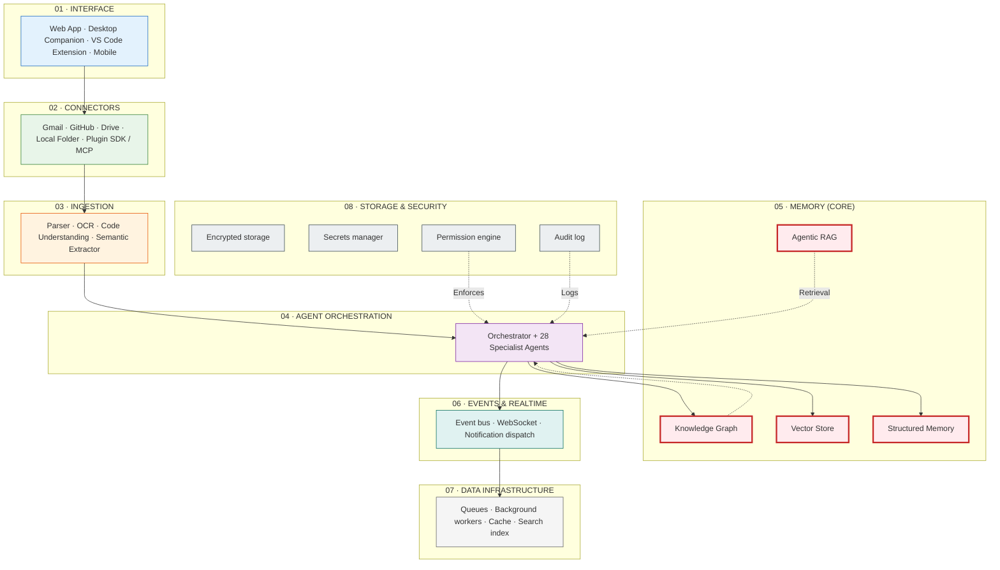

# Meridian — Complete Product Documentation

| Metadata         | Value                                                                |
|------------------|----------------------------------------------------------------------|
| **Purpose**      | Complete product and engineering documentation for Meridian |
| **Status**       | Living document — MVP validated architecture, Enterprise scope defined |
| **Owner**        | Product & Engineering Teams |
| **Last Updated** | 2026-07-13 |

## Overview

Meridian is a second brain for a person's education and career. It connects to the places a student or early-career professional already keeps their stuff — email, Drive, GitHub, a laptop folder — reads what's there, organizes it without being asked, and remembers it permanently. That memory then powers a set of agents that keep a resume always current, track deadlines before they're missed, and search for and apply to jobs and internships with the person's approval. This document is the complete product and engineering reference, covering the product story, system architecture, AI agents, memory system, features, screens, workflows, tech stack, database design, implementation plan, roadmap, and gap analysis.

## Goals

- Provide a single comprehensive reference for the entire Meridian product and engineering system
- Document product story, system architecture, AI agents, memory system, features, screens, and workflows
- Serve as the authoritative guide for engineers, designers, AI researchers, and investors
- Align MVP implementation with enterprise vision

## Scope

### In Scope
- Complete product story and system architecture (six-layer design)
- Eight-agent architecture with memory read/write permissions
- Six-type memory system: Profile, Document, Career, Episodic, Preference, Working
- Full tech stack, database design, and implementation plan
- Feature catalog, screen inventory, and workflow documentation
- Gap analysis and roadmap from MVP to enterprise

### Out of Scope
- Per-backend-service implementation details (in Backend/ docs)
- Code-level API documentation (auto-generated)
- Operations runbooks and incident response procedures (in Operations/)
- Security threat models and compliance certifications (in Security/)

## What it is, how it works, and how we build it

**Document type:** Complete Product & Engineering Documentation
**Status:** Living document — MVP validated architecture, Enterprise scope defined
**Audience:** Engineers, designers, AI researchers, investors, new team members

---

## Table of Contents

1. [What Is Meridian](#what-is-meridian)
2. [The Product Story](#the-product-story)
3. [How It Works — End to End](#how-it-works)
4. [System Architecture](#system-architecture)
5. [AI Agents](#ai-agents)
6. [Memory System, In Depth](#memory-system)
7. [Features](#features)
8. [Screens](#screens)
9. [Workflows](#workflows)
10. [Tech Stack](#tech-stack)
11. [Database Design](#database-design)
12. [Implementation Plan](#implementation-plan)
13. [Implementation Blueprint](#implementation-blueprint)
14. [Roadmap](#roadmap)
15. [Gap Analysis](#gap-analysis)
16. [Project Summary](#project-summary)
17. [Appendix: Glossary](#glossary)

---

## 1. What Is Meridian

<a id="what-is-meridian"></a>

**Meridian is a second brain for a person's education and career.** It connects to the places a student or early-career professional already keeps their stuff — email, Drive, GitHub, a laptop folder — reads what's there, organizes it without being asked, and remembers it permanently. That memory then powers a set of agents that keep a resume always current, track deadlines before they're missed, and search for and apply to jobs and internships with the person's approval.

It is not a chatbot with a bigger memory. It is a **memory system with agents attached to it**, one of which happens to be a chat interface. The chat is a view into the memory, not the product itself.

**Why it exists:** because right now, a person's professional life is scattered across a dozen disconnected tools, none of which know about the others, and all of that scattered information has to be manually re-assembled by hand every time it matters — updating a resume, remembering an achievement from two years ago, figuring out what to apply to next. Meridian's job is to make that re-assembly automatic and continuous instead of a periodic, dreaded chore.

**Who it's for:** students (the primary wedge — see §2), job seekers, early-career professionals, researchers, developers, freelancers, and — at the enterprise tier — universities and companies that want to offer this as a structured benefit to their population.

**What makes it different:** every other tool in this space (resume builders, job boards, note apps, file storage) requires the user to do the organizing. Meridian's core bet is that the organizing itself — reading a document, understanding what it means, connecting it to everything else the person has done — is the product, and everything else (resume, job matches, reminders) is just a view generated from that understanding.

**Vision, mission, philosophy, and long-term goal are covered in full in §16 (Project Summary)** — this section is deliberately just the plain-language "what is it," everything else builds from here.

---

## 2. The Product Story {#the-product-story}

### The current world

A student finishes a hackathon, forgets to add it to their resume. Six months later they're applying for internships and can't remember the exact dates, or what their role actually was, because that information lived in a WhatsApp group and a certificate PDF buried in Downloads. Their resume is a Google Doc last touched during finals week, always slightly behind reality. Their inbox has three internship-related emails they haven't opened, and one of them has a deadline that already passed. This isn't a story about a disorganized person — it's the default outcome of having no system, because building and maintaining one by hand is real work nobody has time for.

### Why existing tools fail

Resume builders are static — they format what you type, they don't know what you've done. File storage tools (Drive, Dropbox) organize by folder structure the user defines, not by what a file means. Note apps (Notion, Obsidian) are powerful but require the user to do all the linking and tagging themselves. Job boards search and let you apply, but forget you the moment you close the tab — no memory of what you tried before, what worked, what didn't. Generic AI chatbots can discuss any of this in the moment, but every new conversation starts from zero, because they have no durable, structured memory of *this specific person*.

### Why Meridian exists

Because the missing piece isn't a better chatbot, a better resume template, or a better job board — it's a memory layer that's always being written to, quietly, in the background, from real activity, that every one of those other tools could then be built on top of. Meridian is that layer, plus the first set of agents built to use it.

### How it changes everything

Once a memory layer like this exists and is trusted, everything downstream gets dramatically easier to build and dramatically more useful to use: a resume that writes itself from real activity instead of memory and guesswork; a job search that already knows what you're good at and what you've rejected before; a Monday morning digest that already read your weekend emails and knows which deadline actually matters today.

### Why users will love it

Because the payoff compounds. The first week, Meridian is a decent file organizer. Six months in, it's the only place that has an accurate, complete record of everything the person has actually done — more complete than the person's own memory of their own achievements. That's the moment it stops being a tool someone uses and starts being infrastructure someone depends on.

### What makes it revolutionary

Not any single feature — every individual piece here (file organization, resume generation, job matching) has been built before, separately, by other products. What's new is refusing to treat them as separate products: one memory, many views, each view making the others better because they all write back to the same brain

---

## 3. How It Works — End to End {#how-it-works}

### 3.1 The full flow

```text
User opens the web app
   ↓
Signup (email or SSO)
   ↓
Onboarding (workspace created, empty memory namespace provisioned)
   ↓
Connect accounts (Gmail, GitHub, Drive, local folder, VS Code — each a separate scoped grant)
   ↓
Upload / sync files (direct upload, connector sync, or local folder watch)
   ↓
AI ingestion (parsing, OCR, code understanding, semantic extraction — §3.2 table, row "Ingestion")
   ↓
Memory creation (entities + relationships extracted, written to graph + vector store)
   ↓
Knowledge Graph (entities linked: skills ↔ projects ↔ organizations ↔ events)
   ↓
Vector Database (semantic embeddings stored for retrieval)
   ↓
AI Agents activate (Organization, Resume, ATS, Job Search, Gmail, Scheduler — each reads/writes memory)
   ↓
Automation runs (scheduled Gmail passes, deadline extraction, proactive suggestions)
   ↓
Dashboard (everything above surfaced as one at-a-glance view)
   ↓
Suggestions (system proactively surfaces what's worth the user's attention)
   ↓
Career Intelligence (job/internship search, ranked against memory)
   ↓
Resume (always-current master resume + tailored variants)
   ↓
Applications (tailored, tracked, outcome logged back to memory)
   ↓
Learning (skill gaps identified, roadmap generated)
   ↓
Everything above compounds — each cycle makes memory richer, which makes every module smarter
```

### 3.2 Per-module breakdown

Every module in the flow above follows the same anatomy. This table is the reference — implementation details for each row are expanded in their own section later in this document.

| Module | Purpose | Input | Processing | Output | Storage | Agents involved | Memory involved | AI involved |
|---|---|---|---|---|---|---|---|---|
| Onboarding | Provision a clean workspace | Signup form | Create namespace, default folders, empty graph | Ready workspace | Workspace DB record | — | none yet | none |
| Connectors | Bring external data in, scoped | OAuth grant | Token exchange, scope registration | Active connector | Secrets manager, connector registry | Connector Agent | none directly | none |
| Ingestion | Turn raw files into structured content | Uploaded/synced file | Parse, OCR if needed, extract structure | Parsed document | Object storage (raw) + document memory | Organization Agent | Document memory (write) | Parsing + vision models |
| Memory creation | Extract facts from content | Parsed document | Entity/relationship extraction, dedup | Structured memory record | Graph DB + vector store | Memory Agent | All types (write) | Extraction + embedding models |
| Knowledge Graph | Connect entities meaningfully | New entities/relationships | Merge, link, infer relationships | Denser graph | Graph DB | Memory Agent | Knowledge graph (write) | Entity resolution model |
| Vector DB | Enable semantic recall | Document/memory content | Generate embeddings | Stored vectors | Vector store | Memory Agent | Document memory | Embedding model |
| Agents | Act on memory | User request or trigger | Retrieve context (agentic RAG), reason, propose/act | Proposal or action | — | Relevant specialist agent | Read: relevant types; Write: outcome | Reasoning model per agent |
| Automation | Run without being asked | Schedule or event trigger | Scheduled/push-triggered agent runs | Digest, updated schedule | Schedule DB | Gmail Agent, Scheduler Agent | Episodic, Career | Classification model |
| Dashboard | Summarize everything | All modules' state | Aggregate read across memory + agent status | Rendered summary | — | Analytics Agent | Read-only, all types | Lightweight summarization |
| Suggestions | Surface what matters unasked | Memory patterns | Reflection pass over recent memory | Suggested action | — | Reflection Agent, Recommendation Agent | Read: all; write: suggestion log | Pattern-detection model |
| Career Intelligence | Find and rank opportunities | Career memory + connectors | Search, score against skill graph | Ranked shortlist | Career memory | Job Search Agent | Career, Skill (read); Career (write on outcome) | Ranking model |
| Resume | Maintain current resume | Profile + Career memory | Assemble, ask for gaps | Master resume + variants | Document store | Resume Agent | Profile, Career (read); Document (write) | Generation model |
| Applications | Apply with tailored materials | Approved shortlist | Tailor documents, submit or deep-link | Submitted/queued application | Career memory | Application Agent | Career (write) | Generation model |
| Learning | Close skill gaps | ATS gap output, goals | Compare current vs. target skills | Roadmap | Learning memory | Learning Agent, Planning Agent | Skill, Goal (read/write) | Planning model |

This table is the connective tissue between "how it works" (this section) and "how we build it" (§10–§13) — every row here becomes a concrete service, schema, and agent spec later in this document.

---

## 4. System Architecture {#system-architecture}

### 4.1 Layer stack

Eight layers, each existing to feed the memory layer at the center — this extends the six-layer MVP architecture with the operational infrastructure (events, queues, cache, realtime) needed to run it at scale.



### 4.2 Frontend

A single web application (the primary surface) built as a component-driven SPA, plus thin native surfaces (desktop companion, VS Code extension, future mobile) that talk to the same backend API rather than duplicating logic. The frontend never talks to the memory layer directly — everything routes through the API layer so permission checks are enforced in one place (§4.8).

### 4.3 Backend

A service layer exposing a typed API (REST or RPC) consumed by every frontend surface, responsible for auth, request routing to the Orchestrator, and enforcing the Permission Engine on every call before it reaches an agent or memory store.

### 4.4 AI layer

The model routing and agent-runtime layer (§9, §20 of the companion Enterprise Paper) — model selection per agent, tool-calling, prompt management, and evaluation, sitting between the Agent Orchestration layer and the underlying model providers.

### 4.5 Memory layer

The core described fully in §6 of this document — knowledge graph, vector store, and structured memory stores, accessed exclusively through the agentic RAG retrieval layer.

### 4.6 Events, realtime, and notifications

An event bus (every agent action publishes an event: `document.ingested`, `memory.updated`, `application.submitted`) that the realtime layer subscribes to and pushes to connected clients via WebSocket, and that the Notification dispatcher subscribes to for surfacing digests, reminders, and alerts. This decouples "something happened" from "who needs to know" — new notification channels (mobile push, later) subscribe to the same event stream without touching the agents that produce it.

### 4.7 Queues, workers, and caching

Ingestion (§3.2) is queue-driven — file uploads and connector syncs enqueue jobs processed by background workers, so a large batch sync never blocks the interactive app. Frequently-read, rarely-changed data (resume renders, dashboard aggregates) is cached with explicit invalidation on the relevant memory-write event, rather than time-based expiry, so the cache is never stale in a way the user can notice.

### 4.8 Authentication, permissions, and search

Auth is standard OAuth/SSO (§19 of the Enterprise Paper). Every request — from a user action or an autonomous agent action — passes through the Permission Engine, checked against connector scope, action type, and requesting agent before it's allowed to touch memory. Global Search (§17 of the Enterprise Paper) is powered by the same hybrid retrieval (vector + keyword + graph) used internally by agents, exposed as a first-class user-facing surface.

### 4.9 Analytics

A read-only consumer of the event bus and memory stores — analytics never writes back to memory, keeping the "what happened" record (memory) cleanly separated from "what we learned by observing it" (analytics), which matters both for correctness and for the audit story in §19.

---

## 5. AI Agents {#ai-agents}

### 5.1 Shared agent contract

Every agent in Meridian — regardless of what it does — is built to the same contract: a fixed mission it cannot exceed, a declared tool list it can only call within, explicit read/write memory permissions, a stated default autonomy level, and a required fallback behavior (ask the user, never guess) when it's uncertain. This is what makes twenty-eight agents auditable instead of twenty-eight black boxes.

### 5.2 Full roster

| Agent | Mission | Autonomy default |
|---|---|---|
| Orchestrator | Routes requests to the right specialist agent | Full |
| Workspace Agent | Maintains overall workspace structure and health | Suggest |
| Organization Agent | Names, files, deduplicates documents | Suggest → earned auto |
| Memory Agent | Extracts entities, maintains graph and vector store | Full (internal) |
| Resume Agent | Builds and maintains the master resume | Suggest |
| ATS Agent | Scores resume against job descriptions | Read-only |
| Career Agent | Tracks overall career trajectory and goals | Suggest |
| Learning Agent | Tracks courses, skills in progress, learning goals | Suggest |
| Research Agent | Organizes papers, notes, citations | Suggest |
| Coding Agent | Understands repos and coding activity | Suggest |
| GitHub Agent | Syncs repo activity, commit history | Read-only |
| Gmail Agent | Classifies mail, extracts deadlines/tasks | Suggest (drafts only) |
| Calendar Agent | Maintains calendar consistency | Suggest |
| Job Search Agent | Finds and ranks job/internship matches | Suggest |
| Internship Agent | Specialized search for internships/fellowships | Suggest |
| Application Agent | Tailors documents, submits or deep-links applications | Approval-gated |
| Document Agent | General-purpose document Q&A and summarization | Read-only |
| PDF Agent | Specialized parsing/filling for PDF forms | Suggest |
| Planning Agent | Builds learning/project/application roadmaps | Suggest |
| Scheduler Agent | Maintains deadlines, conflict detection | Suggest / full for reminders |
| Reminder Agent | Sends timely nudges for upcoming items | Full (notify only) |
| Analytics Agent | Surfaces patterns and trends across memory | Read-only |
| Recommendation Agent | Suggests next actions, skills, opportunities | Read-only |
| Security Agent | Monitors for anomalous access, enforces policy | Full (protective) |
| Plugin Agent | Manages plugin lifecycle and sandboxing | Full (internal) |
| Connector Agent | Manages connector health, token refresh | Full (internal) |
| Reflection Agent | Periodic higher-level pattern review of memory | Full (internal) |
| Self-Improvement Agent | Tracks agent accuracy, proposes prompt/tool refinements | Human-reviewed |
| Quality Assurance Agent | Validates other agents' outputs before they reach the user | Full (internal gate) |

### 5.3 Flagship agents, in full detail

<details>
<summary><strong>Memory Agent</strong> — the agent every other agent depends on</summary>

- **Responsibilities:** entity/relationship extraction from every agent's output; deduplication and merging; writing to the knowledge graph and vector store; running periodic consolidation.
- **Inputs:** raw output from any other agent (a parsed document, a chat exchange, an application outcome).
- **Outputs:** structured memory records, updated graph edges, updated embeddings.
- **Memory access:** full read/write across all memory types.
- **Permissions:** internal-only — never directly exposed to a connector or the outside world.
- **Workflow:** receive → extract entities/facts → check for existing matching entities (embedding + string + graph-context similarity) → merge or create → write → emit `memory.updated` event.
- **Prompt style:** structured extraction prompts with strict output schemas (JSON), not open-ended generation — precision matters more than fluency here.
- **Decision process:** merge decisions use a confidence threshold; below threshold, the entity is created as a new, unmerged node flagged for later reflection rather than guessed into an existing one — a missed merge is a correctable annoyance, a wrong merge silently corrupts two records.
- **Interaction with other agents:** every other agent's output flows through it; it does not call other agents.
- **Future upgrades:** learned merge-confidence calibration from historical correction data (§5.4, Self-Improvement Agent).

</details>

<details>
<summary><strong>Job Search Agent</strong> — search and rank, grounded in real platform constraints</summary>

- **Responsibilities:** search connected platforms; rank results against the user's skill graph and past outcomes; filter out previously-rejected roles; hand off to the Application Agent on approval.
- **Inputs:** a user request (explicit search) or a scheduled background pass (Opportunity Radar-style, §21 of the Enterprise Paper); Career and Skill memory.
- **Outputs:** a ranked shortlist with a stated fit reason per role.
- **Memory access:** reads Career, Skill, Preference memory; writes shortlist state.
- **Permissions:** read-only on connectors unless an official application API is configured (Application Agent handles the write path).
- **Workflow:** query platforms (API where available; otherwise structured scraping is explicitly out of scope — see §14 Gap Analysis) → score each result → filter against rejection history → return ranked list.
- **Decision process:** ranking combines skill-overlap score, stated preference alignment, and recency of similar past outcomes — always shown with its reasoning, never an opaque number.
- **Interaction with other agents:** hands approved selections to the Application Agent; reads ATS Agent's scoring output when available.
- **Future upgrades:** organization-consented data sources (e.g., a university career office's partner-employer list) factored into ranking without cross-tenant visibility.

</details>

<details>
<summary><strong>Reflection Agent</strong> — the agent that notices what no single document would reveal</summary>

- **Responsibilities:** scheduled (not per-event) review of recent memory for higher-level patterns.
- **Inputs:** recent memory writes across all types, on a rolling window.
- **Outputs:** suggested preference updates, flagged anomalies, consolidation candidates.
- **Memory access:** read across all types; writes only to a suggestion queue, never directly to Preference or Career memory.
- **Permissions:** internal-only.
- **Workflow:** batch-review recent activity → look for repeated patterns (e.g., three rejected frontend-heavy roles) → generate a suggestion → surface to the user for confirmation.
- **Decision process:** pattern confidence must clear a higher bar than single-fact extraction, precisely because it's inferring intent rather than reading a stated fact.
- **Interaction with other agents:** feeds the Recommendation Agent and Job Search Agent once a suggestion is user-confirmed.
- **Future upgrades:** cross-referencing patterns against Reflection output from similar (anonymized, consented) users to improve suggestion quality — enterprise/aggregate feature, not a default.

</details>

<details>
<summary><strong>Quality Assurance Agent</strong> — the gate before anything reaches the user or the world</summary>

- **Responsibilities:** reviews other agents' outputs — a proposed rename, a drafted email, an application about to be submitted — against correctness and policy checks before delivery or execution.
- **Inputs:** any agent's pre-delivery output.
- **Outputs:** a pass/flag decision; flagged items route back to the originating agent or to the user directly.
- **Memory access:** read-only, scoped to whatever context is needed to validate the specific output.
- **Permissions:** internal gate — sits structurally between every agent and the outside world/user surface.
- **Workflow:** receive candidate output → run correctness checks (schema validity, policy compliance, basic sanity) → pass through or flag with a reason.
- **Decision process:** deliberately conservative — a flagged-but-actually-fine output costs the user one extra confirmation click; a passed-but-wrong output costs trust.
- **Interaction with other agents:** sits inline between every action-capable agent and delivery — not called explicitly by other agents, invoked automatically by the Orchestrator on any consequential output.
- **Future upgrades:** per-agent, learned QA thresholds based on that agent's historical accuracy (a well-proven agent's output needs a lighter check than a newly added one).

</details>

### 5.4 Sequence: one file in, one application out

The same request path every consequential action follows — file upload through to a submitted job application:

```mermaid
graph TD
    User["👤 User"] -->|Upload| OA["Organization Agent<br/>Propose name/folder"]
    OA -->|Approval| MA["Memory Agent<br/>Extract, merge, write to graph + vector store"]
    MA --> RA["Resume Agent<br/>Fold into master resume, ask if missing"]

    User -->|\"find backend internships\"| OR["Orchestrator"]
    OR --> JS["Job Search Agent<br/>Reads skill graph + career memory"]
    JS -->|Ranked shortlist| RA

    RA --> ATS["ATS Agent<br/>Score each role, gap report"]

    User -->|Approves 3 of 8| APP["Application Agent<br/>Tailor docs"]
    APP --> QA["QA Agent<br/>Validate"]
    QA -->|Submit or deep-link| OUT["Outcome<br/>Logged to Career + Episodic memory"]

    OUT --> REF["Reflection Agent<br/>Next pass factors this in"]
    REF -.->|Feedback loop| MA

    classDef user fill:#e3f2fd,stroke:#1565c0,stroke-width:3px
    classDef agent fill:#e8f5e9,stroke:#2e7d32,stroke-width:2px
    classDef gate fill:#fff3e0,stroke:#e65100,stroke-width:2px
    classDef outcome fill:#f3e5f5,stroke:#7b1fa2,stroke-width:2px

    class User user
    class OA,MA,RA,JS,APP gate
    class ATS,QA gate
    class OUT,REF outcome
```

Every arrow in this diagram is a Permission Engine check (§4.8) and an event-bus publish (§4.6) — nothing here is a direct function call between agents; everything is mediated so it's observable and auditable.

---

## 6. Memory System, In Depth {#memory-system}

### 6.1 What memory is, and why it's the product

Memory in Meridian is not chat history. It's a structured, durable, continuously-updated model of who the person is and what they've done — built from real documents, real emails, real code, not from what they typed into a chat box. Every feature in this document (resume, job search, dashboard, chat) is a *read* against this model; every agent action that teaches the system something new is a *write*. If the memory is wrong or shallow, every feature built on top of it is wrong or shallow too — which is why memory quality, not feature count, is the primary engineering priority.

### 6.2 Memory lifecycle

```text
Creation → Retrieval (repeated, ongoing) → Evolution → Consolidation → (Expiration | Permanence)
```

**Creation.** A document, email, or conversation is parsed; the Memory Agent extracts entities and relationships; each extracted fact is written with a source pointer (provenance), an initial confidence score (based on source reliability and clarity), and a timestamp.

**Retrieval.** Covered fully in §6.5 (Agentic RAG) — every retrieval is itself an event the memory system can learn from (which memories actually got used answers "is this memory useful," feeding back into importance ranking, §6.7).

**Evolution.** A memory is not append-only. When new evidence confirms an existing fact, its confidence rises; when new evidence contradicts it, the system doesn't silently overwrite — it keeps both, marks the older one superseded, and surfaces the conflict if it's material (e.g., two different stated graduation dates) rather than guessing which is right.

**Consolidation.** Runs periodically (via the Reflection Agent, §5.3): many low-information memories about the same entity are compressed into fewer, denser ones, keeping retrieval fast and relevant as the graph grows over years rather than degrading into noise.

**Expiration vs. permanence.** Working memory expires at session end by design. Every other memory type is permanent by default — nothing quietly disappears — but low-confidence, low-importance, stale memories are down-weighted in retrieval (§6.7) long before they'd ever be a candidate for actual deletion, which only happens by explicit user action (§19.6 of the Enterprise Paper).

### 6.3 Knowledge graph

Entities (Person, Skill, Project, Organization, Certificate, Event, Job, Course, Publication) connected by typed, directional relationships (`worked_on`, `awarded_to`, `requires_skill`, `applied_to`, `mentored_by`). Built automatically as documents are processed — the user never manually links anything, though the Memory Graph screen (§8) lets them view and correct it.

### 6.4 Embeddings and the vector database

Every document, memory record, and conversation turn gets an embedding — a numerical representation capturing semantic meaning, not just keywords — stored in a dedicated vector database alongside a pointer back to the source record. This is what makes "find things related to machine learning" work even when the word "machine learning" never appears verbatim in the source document.

### 6.5 Agentic RAG — retrieval that chooses its own strategy

Traditional RAG runs one fixed retrieval pipeline for every query. Agentic RAG means the requesting agent decides, per query, which combination of strategies actually answers the question:

- **Semantic / vector search** — best for "find things conceptually related to X," where exact wording doesn't matter.
- **Keyword search** — best for exact terms: a course code, a tool name, an ID.
- **Graph traversal** — best for relationship queries: "everything connected to this skill," "who worked on this with me."
- **Hybrid** — most real queries combine at least two of the above; the agent's retrieval call can request a weighted combination rather than picking exactly one.

### 6.6 Context assembly

Once candidate memories are retrieved, they're not simply concatenated and handed to the model — they're re-ranked (§6.7) and pruned to the most relevant, non-redundant set that fits the requesting agent's context budget, with source provenance attached to each item so the agent's eventual output can be traced back to what supported it (this is what makes the Explainability guarantee in §19 of the Enterprise Paper actually implementable, not just a promise).

### 6.7 Ranking, freshness, importance, and confidence

Four distinct scores govern what surfaces in any retrieval:

| Score | What it measures | Effect |
|---|---|---|
| Relevance | How well a memory matches the current query | Primary ranking signal |
| Freshness | How recently a memory was confirmed true | Stale memories down-weighted |
| Importance | How central a memory is to the person's identity vs. incidental | Boosts core facts over trivia |
| Confidence | How strongly the system believes the fact, based on source count/reliability | Low-confidence memories flagged, not hidden |

### 6.8 Versioning and expiration

Every memory record keeps its full edit history — not just current state — so "why does the system think this" always has a traceable answer, and a bad extraction can be corrected without losing the record that it happened (useful input for the Self-Improvement Agent, §5.2). Expiration is scoped to Working memory only, by design (§6.2); everything else persists unless explicitly deleted by the user.

---

## 7. Features {#features}

| Feature | Problem it solves | Workflow | Primary screen | Backend | AI involved |
|---|---|---|---|---|---|
| Auto-Organization | Manual filing never happens consistently | Ingest → propose name/folder → approve | Workspace | Organization Agent, Ingestion pipeline | Classification, semantic extraction |
| Master Resume | Resumes go stale between updates | Memory changes → resume re-assembled → gaps flagged | Resume | Resume Agent | Generation model |
| ATS Scoring | No visibility into machine-readability | Resume + JD → score + gap list | Resume | ATS Agent | Scoring/matching model |
| Job & Internship Search | Manual, unranked search across platforms | Query/schedule → search → rank → shortlist | Jobs | Job Search Agent | Ranking model |
| Tailored Applications | Generic applications underperform | Approved role → tailored resume/cover letter → submit/deep-link | Applications | Application Agent, QA Agent | Generation model |
| Gmail Digest | Time-sensitive mail gets missed | Scheduled + push scan → classify → extract | Schedule, Dashboard | Gmail Agent | Classification model |
| Deadline & Conflict Detection | Deadlines collide unnoticed | All sources → unified schedule → conflict check | Schedule | Scheduler Agent | Constraint reasoning |
| Memory Graph Explorer | Users can't see what the system "knows" | Graph rendered, navigable, editable | Memory Graph | Memory Agent (read) | Graph layout |
| In-App Document Viewer & Chat | Context-switching to read source files | Open file → render → chat scoped to it | Knowledge | Document Agent | Q&A model |
| Global Search | Info scattered across memory types | Query → hybrid retrieval → ranked results | Search (global) | Agentic RAG layer | Hybrid search |
| Dashboard | No single view of overall state | Aggregate reads across all modules | Dashboard | Analytics Agent (read-only) | Lightweight summarization |
| Learning Roadmap | Skill gaps identified but not actioned | Gap output → sequenced plan | Learning | Planning Agent, Learning Agent | Planning model |
| Chat with Agents | Users want a direct line to a specific agent | Chat → Orchestrator routes → specialist responds | Chat | Orchestrator + any agent | Reasoning model per agent |
| Connector Management | Users need visibility/control over access | Connect/revoke, view scope and health | Connectors | Connector Agent | — |
| Per-Agent Autonomy Settings | Trust should be earned, not assumed globally | View track record → grant/revoke autonomy per action type | Settings, AI Agents | Permission Engine | — |

Every row in this table maps directly to a screen in §8 and a workflow in §9 — this table, the screen docs, and the workflow diagrams are three views of the same underlying feature set, not three separate specs.

---

## 8. Screens {#screens}

<details>
<summary><strong>Dashboard</strong> — full breakdown (representative depth for every screen below)</summary>

- **Purpose:** one at-a-glance view composed entirely from other modules — holds no unique logic of its own.
- **Widgets:** memory health card, knowledge growth sparkline, active applications list, upcoming deadlines strip, goal progress bars, recent activity feed, AI suggestions panel, per-agent status grid, workspace health summary.
- **Buttons/interactions:** approve/dismiss on any suggestion inline; click any widget to deep-link into its full screen; per-agent status click opens that agent's detail panel.
- **Backend APIs:** `GET /dashboard/summary` (aggregated read across memory + agent state), `POST /suggestions/{id}/respond`.
- **AI usage:** Analytics Agent (read-only aggregation), Recommendation Agent (suggestion generation) — no generative writes happen from this screen directly.

</details>

| Screen | Purpose | Key widgets | Key actions | Backend APIs | AI usage |
|---|---|---|---|---|---|
| Workspace | Browse and manage files/folders | File tree, in-app viewer, tag chips | Upload, approve org proposals, restore from archive | `GET /files`, `POST /files/organize/approve` | Organization Agent |
| Memory Graph | Explore what the system knows | Interactive graph canvas, entity detail panel | Click-to-expand node, correct/merge entities | `GET /memory/graph`, `PATCH /memory/entity/{id}` | Memory Agent (read + correction write) |
| Resume | Manage the master resume and variants | Rich text editor, variant selector, version history | Edit, generate variant, answer gap-fill question | `GET /resume/master`, `POST /resume/variant` | Resume Agent |
| Jobs & Internships | Review and act on matches | Ranked card list, fit-reason tags, filters | Approve/reject match, view gap report | `GET /jobs/shortlist`, `POST /jobs/{id}/approve` | Job Search Agent, ATS Agent |
| Applications | Track submitted/queued applications | Status board (kanban-style), timeline per application | Mark outcome, view tailored documents | `GET /applications`, `PATCH /applications/{id}/status` | Application Agent |
| Chat | Talk to the Orchestrator or a specific agent | Message thread, agent picker, source citations | Send message, switch agent, cite-to-source click | `POST /chat/message` | Orchestrator + routed agent |
| Schedule | See deadlines and time-sensitive items | Calendar view, list view, conflict flags | Add/edit event, resolve conflict | `GET /schedule`, `POST /schedule/event` | Scheduler Agent, Gmail Agent |
| Connectors | Manage external access | Connector cards with status, scope viewer | Connect, revoke, re-authenticate | `GET /connectors`, `POST /connectors/{id}/revoke` | Connector Agent |
| History | Full activity/audit log | Filterable event log, per-entry detail | Filter by agent/date/type, undo (where reversible) | `GET /audit/log`, `POST /audit/undo/{id}` | — (read-only surface over the event bus) |
| Settings | Control permissions and privacy | Autonomy sliders per agent, data export/delete buttons | Grant/revoke autonomy, export all, delete all | `PATCH /settings/autonomy`, `POST /settings/export` | Permission Engine |
| Knowledge | Read and chat with documents | Document viewer, annotation layer, chat sidebar | Highlight, annotate, ask a question in context | `GET /documents/{id}`, `POST /documents/{id}/chat` | Document Agent |
| Search (global) | Find anything across memory | Unified search bar, faceted results | Query, filter by type, jump to source | `GET /search?q=` | Agentic RAG layer |
| Analytics *(enterprise)* | Usage and pattern insights | Trend charts, cohort views | Filter by cohort/date range | `GET /analytics/summary` | Analytics Agent |
| Admin *(enterprise)* | Tenant-level policy control | Policy editor, member list, consent status | Set retention policy, view (aggregated, consented) member status | `GET /admin/tenant`, `PATCH /admin/policy` | — (policy layer, no memory access) |

---

## 9. Workflows {#workflows}

Compact, implementation-oriented flows for the eight processes that matter most day to day.

**User workflow**

```text
Open app → Dashboard → notice suggestion or deadline → open relevant screen
   → review agent proposal → approve/reject/edit → done, memory updated
```

**AI (agent) workflow**

```text
Trigger (user request or schedule) → Orchestrator routes → specialist agent
   → agentic RAG retrieval → reasoning → QA Agent validation → deliver or execute
```

**Backend request workflow**

```text
API request → Auth check → Permission Engine check → route to Orchestrator
   → agent executes (may call tools/connectors) → memory write → event published → response returned
```

**Connector workflow**

```text
User initiates connect → OAuth consent screen → token exchange → token stored (secrets manager)
   → initial scoped sync enqueued → Connector Agent monitors health → auto-refresh before expiry
```

**Organization workflow**

```text
New/changed file detected → Ingestion pipeline (parse/OCR/extract) → Organization Agent proposes
   name + folder + tags → user approves (or auto-applies if autonomy earned) → Memory Agent writes
```

**Resume workflow**

```text
Memory changes (new project, skill, certificate) → Resume Agent checks master resume for gaps
   → if gap: ask user; if complete: silently update → version saved → variants regenerated on request
```

**Job search & application workflow**

```text
Trigger (user query or scheduled radar) → Job Search Agent queries connectors → ranks against
   skill graph + rejection history → shortlist shown → user approves subset → Application Agent
   tailors documents → QA Agent validates → submit via API or deep-link → outcome logged
```

**Email (Gmail Agent) workflow**

```text
Scheduled pass (default 6 AM) OR push notification (high-priority classifier match)
   → fetch new mail → classify → extract dates/tasks → cross-check Scheduler for conflicts
   → add to Schedule → generate digest entry → (never auto-send; drafts only)
```

---

## 10. Tech Stack {#tech-stack}

Chosen for a small team to move fast at MVP, with an explicit, deliberate upgrade path rather than a rewrite when enterprise scale demands it.

| Category | MVP choice | Enterprise evolution | Why |
|---|---|---|---|
| Frontend | React + TypeScript, Next.js | Same, with micro-frontend split if needed | SSR for fast first paint on the Dashboard; huge ecosystem and hiring pool |
| Styling | Tailwind CSS | Same | Fast iteration, keeps design tokens consistent without a heavy design-system build |
| Client data/state | TanStack Query | Same | Handles caching/sync with the backend without hand-rolled logic |
| Core API backend | Node.js + TypeScript (NestJS) | Same, horizontally scaled | Shared language with frontend reduces context-switching for a small team; strong async I/O |
| AI/Agent service | Python (FastAPI) | Same, scaled independently from the API layer | Python's AI/ML ecosystem is materially stronger for embeddings, model orchestration, evaluation tooling |
| Agent reasoning | Anthropic Claude API (tool-calling / Agent SDK) | Same, multi-model routing added (§4.4) | Strong native tool-use and long context match the MCP-shaped connector architecture directly |
| Relational database | PostgreSQL | Same, read replicas + partitioning | Mature, reliable, strong JSON support for flexible/evolving schemas |
| Graph database | PostgreSQL + Apache AGE (graph extension) | Dedicated Neo4j cluster | Avoids running two database systems at MVP; graduates when traversal performance demands a purpose-built engine |
| Vector database | pgvector (Postgres extension) | Dedicated vector DB (Qdrant) | One fewer moving part early; dedicated store once embedding volume and query latency demand it |
| Keyword search | Meilisearch | OpenSearch | Fast to stand up, good relevance defaults; OpenSearch for scale and advanced query needs |
| Object storage | S3-compatible storage | Same, multi-region | Industry standard, cheap, integrates cleanly with a CDN |
| Auth | Managed auth provider (OAuth/SSO out of the box) | Same, SAML/OIDC enterprise tier enabled | Avoids rebuilding a security-critical component in-house; SSO support ready for enterprise tenants |
| Queue / event bus | Redis + BullMQ | Kafka (durable event bus) | Simple to operate at MVP; durable, replayable event log needed once event-sourcing (§4.6) is under real multi-tenant load |
| Scheduler | Managed cron (e.g. EventBridge-style) | Same | Reliable timed triggers for Gmail Agent passes and Reflection Agent runs without custom infra |
| Cache | Redis | Same, dedicated cluster | Doubles as queue backend at MVP — one dependency to operate initially |
| Deployment | PaaS (e.g. Render/Fly.io) with Docker | Managed Kubernetes | Move fast pre-scale; graduate once multi-service, multi-tenant orchestration demands it |
| Observability | OpenTelemetry + hosted APM | Same, expanded retention | Agent chains are multi-hop by nature — distributed tracing is how you debug a five-agent request path |
| Logging | Structured JSON → centralized log store | Same, longer retention for compliance | Every agent action must be queryable for the audit log (§19 of the Enterprise Paper) |
| CI/CD | GitHub Actions | Same, environment promotion pipelines | Tightly integrated with GitHub, which is already a first-class connector target |

---

## 11. Database Design {#database-design}

Three storage systems, each doing the job it's actually good at, unified by shared `workspace_id` scoping on every table/node (this is also the enforcement point for tenant isolation, §19 of the Enterprise Paper).

### 11.1 Relational schema (PostgreSQL) — core tables

| Table | Key columns | Purpose |
|---|---|---|
| `users` | `id`, `email`, `auth_provider`, `created_at` | Account identity |
| `workspaces` | `id`, `user_id`, `created_at` | One per person's memory namespace |
| `connectors` | `id`, `workspace_id`, `type`, `scopes[]`, `status`, `token_ref`, `last_synced_at` | Connector state (token itself lives in the secrets manager, not here) |
| `documents` | `id`, `workspace_id`, `source_connector_id`, `path`, `type`, `raw_storage_key`, `summary` | Ingested file metadata |
| `document_versions` | `id`, `document_id`, `version_number`, `storage_key`, `superseded_by` | Version chain for the Organization Agent |
| `memory_records` | `id`, `workspace_id`, `type`, `content (jsonb)`, `confidence`, `importance`, `freshness_at`, `source_document_id` | The structured memory store (§6) |
| `entities` | `id`, `workspace_id`, `type`, `canonical_name`, `aliases[]`, `embedding_id` | Knowledge graph nodes (relational half — see §11.2 for the graph half) |
| `relationships` | `id`, `workspace_id`, `from_entity_id`, `to_entity_id`, `relation_type`, `confidence`, `source_memory_id` | Knowledge graph edges |
| `resumes` | `id`, `workspace_id`, `variant_type`, `content (jsonb)`, `version`, `generated_from_snapshot` | Resume schema (§11.4) |
| `applications` | `id`, `workspace_id`, `job_external_id`, `platform`, `status`, `resume_version_id`, `cover_letter`, `submitted_at`, `outcome` | Career schema (§11.4) |
| `schedule_events` | `id`, `workspace_id`, `source`, `title`, `date`, `type`, `conflict_flag` | Scheduler data |
| `agent_actions` | `id`, `workspace_id`, `agent_name`, `action_type`, `input_ref`, `output_ref`, `status`, `created_at` | The audit log (§19 of the Enterprise Paper) |
| `permissions` | `id`, `workspace_id`, `connector_id`, `agent_name`, `action_type`, `scope`, `granted_at`, `revoked_at` | Permission Engine's source of truth |

**Indexing notes:** `workspace_id` is indexed on every table (tenant-scoped queries dominate); `memory_records(type, workspace_id)` composite index for type-scoped retrieval; `agent_actions(workspace_id, created_at)` for audit-log time-range queries; `documents(source_connector_id)` for connector-scoped resync operations.

### 11.2 Graph schema (property graph — Apache AGE at MVP, Neo4j at scale)

- **Nodes:** labeled by entity type (`Skill`, `Project`, `Organization`, `Person`, `Certificate`, `Event`, `Job`, `Course`, `Publication`), properties `{id, canonical_name, workspace_id, confidence, importance}`.
- **Edges:** typed and directional (`worked_on`, `awarded_to`, `requires_skill`, `applied_to`, `mentored_by`, `published_with`), properties `{confidence, source_memory_id, created_at}`.
- **Why separate from the relational `entities`/`relationships` tables:** the relational tables are the durable source of truth and audit trail; the graph engine (AGE/Neo4j) is a query-optimized projection rebuilt from them, so graph-store corruption or a future engine migration never risks losing data.

### 11.3 Vector schema

| Field | Purpose |
|---|---|
| `id` | Primary key |
| `workspace_id` | Tenant scope |
| `source_type` | `document` \| `memory_record` \| `entity` |
| `source_id` | Pointer back to the relational record |
| `vector` | The embedding itself |
| `model_version` | Which embedding model produced it — critical for safe model upgrades (re-embed rather than silently mixing vector spaces) |

### 11.4 Career and Resume schema, specifically

**Resume schema** (`resumes.content`, jsonb): `{sections: [{type, title, entries: [{summary, source_entity_ids[], date_range, tags[]}]}], variant_type, target_role_id (nullable), generated_from_snapshot (a memory version pointer, so any resume can be traced back to exactly what it was built from)}`.

**Career schema** (`applications` + linked `schedule_events`): every application row links to the exact `resumes` version used, the source job data, current `status` (`shortlisted → tailoring → submitted → interviewing → offer/rejected`), and an `outcome` field written back by the user or inferred from Gmail Agent classification (§5, Gmail Agent) — this is the record the Reflection Agent (§5.3) reads to detect patterns like repeated rejection from a specific role type.

---

## 12. Implementation Plan {#implementation-plan}

Seven phases, building from nothing to the full MVP, each with a clear exit criterion before starting the next. Enterprise-tier work (multi-tenancy, SSO, plugin marketplace) is deliberately Phase 7 — after the core loop is proven with real users, not before.

<details>
<summary><strong>Phase 0 — Infrastructure &amp; Scaffolding</strong></summary>

- **Objectives:** stand up the deployable skeleton before any feature work.
- **Deliverables:** empty NestJS API service, empty FastAPI AI service, Postgres + Redis provisioned, CI pipeline running lint/test/build on every PR, auth provider integrated.
- **Key folders:** `/apps/web`, `/apps/api`, `/apps/ai-service`, `/packages/shared-types`, `/infra`.
- **Backend:** health-check endpoint, auth middleware, workspace provisioning endpoint.
- **Frontend:** signup/login flow, empty dashboard shell.
- **Database:** `users`, `workspaces` tables migrated.
- **Testing:** CI runs unit tests on every service; a single end-to-end "can sign up and see an empty dashboard" test.
- **Deployment:** PaaS staging environment auto-deployed from `main`.
- **Milestone:** a new user can sign up and land on an empty, correctly-provisioned workspace.
- **Complexity:** S. **Dependencies:** none. **Risks:** over-engineering the scaffold before real feature pressure exists — keep it minimal.

</details>

<details>
<summary><strong>Phase 1 — Ingestion &amp; Memory Foundation</strong></summary>

- **Objectives:** get a file from upload to a queryable memory record.
- **Deliverables:** file upload endpoint, ingestion pipeline (parse/OCR/extract), Memory Agent v1 (extraction + basic dedup), `memory_records`/`entities`/`relationships` tables live, pgvector embeddings wired up.
- **Key folders:** `/apps/ai-service/ingestion`, `/apps/ai-service/memory-agent`, `/apps/api/documents`.
- **Backend:** queue-driven ingestion jobs (BullMQ), document CRUD API.
- **Frontend:** basic upload UI, a raw (unstyled) list of extracted memory records for internal QA.
- **Database:** full schema from §11.1–§11.3 for documents/memory/entities/relationships/embeddings.
- **Testing:** golden-file tests for each parser type (PDF/DOCX/image); extraction accuracy spot-checked against a hand-labeled sample set.
- **Deployment:** staging, feature-flagged off for real users until extraction quality clears an internal bar.
- **Milestone:** uploading a resume produces correct, queryable entities (skills, education, projects) in the graph.
- **Complexity:** L. **Dependencies:** Phase 0. **Risks:** extraction quality is the whole product — do not move to Phase 2 until this is genuinely solid.

</details>

<details>
<summary><strong>Phase 2 — Organization Agent &amp; Workspace</strong></summary>

- **Objectives:** turn raw ingestion into the user-facing file organization experience.
- **Deliverables:** Organization Agent (naming/foldering/dedup proposals), Workspace screen, approval flow, Archive (not delete).
- **Key folders:** `/apps/ai-service/organization-agent`, `/apps/web/workspace`.
- **Backend:** proposal generation endpoint, approve/reject endpoint, `document_versions` write path.
- **Frontend:** file tree, in-app viewer (PDF/image/text at minimum), proposal approval cards.
- **Database:** `document_versions`, `agent_actions` (audit log) live.
- **Testing:** proposal-approval-rate tracked from day one in staging with internal test users.
- **Deployment:** first real (small, opted-in) user cohort.
- **Milestone:** a real user's messy folder gets organized with a >90% approval rate on proposals.
- **Complexity:** M. **Dependencies:** Phase 1. **Risks:** a wrong rename/move is the fastest way to lose user trust — ship conservative, suggest-only, from day one.

</details>

<details>
<summary><strong>Phase 3 — Resume &amp; ATS</strong></summary>

- **Objectives:** the first "wow" feature — a resume that writes itself.
- **Deliverables:** Resume Agent, ATS Agent, `resumes` table, Resume screen with variant generation.
- **Key folders:** `/apps/ai-service/resume-agent`, `/apps/ai-service/ats-agent`, `/apps/web/resume`.
- **Backend:** resume assembly endpoint, ATS scoring endpoint, gap-fill question flow.
- **Frontend:** resume editor, variant picker, ATS score panel with specific suggestions.
- **Database:** `resumes` table, versioning.
- **Testing:** resume-quality review against a set of real (anonymized, consented) sample profiles.
- **Deployment:** same cohort as Phase 2, feature-flagged on.
- **Milestone:** the master resume is generated correctly from memory and a user can produce a role-tailored variant in under a minute.
- **Complexity:** M. **Dependencies:** Phase 1 (needs solid memory). **Risks:** silently wrong resume content is worse than a visible gap — keep the "ask, don't guess" rule strict.

</details>

<details>
<summary><strong>Phase 4 — Career Intelligence</strong></summary>

- **Objectives:** job/internship search, ranking, and tailored (approval-gated) applications.
- **Deliverables:** Job Search Agent, Application Agent, QA Agent (first real use of the QA gate), `applications` table.
- **Key folders:** `/apps/ai-service/job-search-agent`, `/apps/ai-service/application-agent`, `/apps/ai-service/qa-agent`, `/apps/web/jobs`, `/apps/web/applications`.
- **Backend:** platform connector integrations (API-based first, per §14 Gap Analysis), shortlist ranking endpoint, application submission/deep-link endpoint.
- **Frontend:** shortlist cards, approval flow, application status board.
- **Database:** `applications` table, `schedule_events` linkage.
- **Testing:** ranking quality reviewed manually against known-good matches; QA Agent false-positive/negative rate tracked explicitly.
- **Deployment:** cohort expansion, application submission still gated behind explicit per-application approval (no earned autonomy yet).
- **Milestone:** a user can go from "find me X" to a submitted, tailored application inside one session.
- **Complexity:** L. **Dependencies:** Phase 3 (needs Resume + ATS). **Risks:** platform ToS constraints (§14) — do not build scraping-based auto-apply against a platform's terms.

</details>

<details>
<summary><strong>Phase 5 — Communication &amp; Time</strong></summary>

- **Objectives:** close the loop on time-sensitive information.
- **Deliverables:** Gmail Agent (scheduled + push hook), Scheduler Agent, Schedule screen.
- **Key folders:** `/apps/ai-service/gmail-agent`, `/apps/ai-service/scheduler-agent`, `/apps/web/schedule`.
- **Backend:** Gmail connector integration, classification pipeline, conflict-detection logic.
- **Frontend:** Schedule calendar/list views, daily digest surfaced on Dashboard.
- **Database:** `schedule_events` fully wired to all upstream sources.
- **Testing:** classification accuracy tracked per category; false-negative rate on "urgent" mail specifically monitored (missing an interview email is the worst failure mode here).
- **Deployment:** full cohort.
- **Milestone:** a same-day-urgent email reliably surfaces within minutes, not the next scheduled pass.
- **Complexity:** M. **Dependencies:** Phase 1 (memory), Phase 4 (career context for deadline relevance). **Risks:** over-notifying erodes trust as fast as under-notifying — tune classifier thresholds carefully.

</details>

<details>
<summary><strong>Phase 6 — Polish, Autonomy, Dashboard, Settings</strong></summary>

- **Objectives:** the trust-building layer that turns a feature set into a product.
- **Deliverables:** Dashboard (aggregating everything built so far), History/audit log screen, per-agent autonomy settings, data export/delete controls.
- **Key folders:** `/apps/web/dashboard`, `/apps/web/settings`, `/apps/web/history`.
- **Backend:** aggregation endpoints, autonomy-grant endpoint (Permission Engine writes), export/delete endpoints.
- **Frontend:** Dashboard widgets, Settings autonomy sliders, one-click export/delete.
- **Database:** `permissions` table fully wired; audit log queryable end-to-end.
- **Testing:** full end-to-end test suite across every phase's critical path; a specific "delete everything actually deletes everything" test, run on every release.
- **Deployment:** public MVP launch.
- **Milestone:** a new user's full first-week journey (§3.1 of the companion MVP spec, §3 User Journey of the Enterprise Paper) works without a single manual intervention from the team.
- **Complexity:** M. **Dependencies:** all prior phases. **Risks:** scope creep — this phase is about polish and trust infrastructure, not new agent capabilities.

</details>

<details>
<summary><strong>Phase 7 — Enterprise (post-MVP)</strong></summary>

- **Objectives:** multi-tenancy, the consent model, SSO, and the plugin/MCP ecosystem.
- **Deliverables:** tenant-scoped provisioning, SAML/OIDC SSO, Admin console, Plugin SDK v1, Marketplace v1.
- **Key folders:** `/apps/api/admin`, `/apps/api/plugins`, `/packages/plugin-sdk`.
- **Backend:** tenant isolation enforcement in the Permission Engine, plugin sandbox runtime.
- **Frontend:** Admin console, Plugin management screen.
- **Database:** `tenants` table, tenant-scoped policy tables.
- **Testing:** tenant-isolation penetration testing specifically (cross-tenant data leakage is the single highest-severity risk at this phase).
- **Deployment:** enterprise design-partner rollout, gated.
- **Milestone:** an institution can provision accounts for its population without ever gaining access to individual memory contents without explicit consent.
- **Complexity:** L. **Dependencies:** Phase 6 (MVP proven with real users first). **Risks:** this entire phase is deferred exactly because getting the consent model wrong is a trust failure the product may not recover from — no shortcuts here.

</details>

---

## 13. Implementation Blueprint {#implementation-blueprint}

### 13.1 Monorepo folder structure

```text
meridian/
├── apps/
│   ├── web/                      # Next.js frontend
│   │   ├── app/
│   │   │   ├── dashboard/
│   │   │   ├── workspace/
│   │   │   ├── memory-graph/
│   │   │   ├── resume/
│   │   │   ├── jobs/
│   │   │   ├── applications/
│   │   │   ├── chat/
│   │   │   ├── schedule/
│   │   │   ├── connectors/
│   │   │   ├── history/
│   │   │   └── settings/
│   │   └── components/
│   │
│   ├── api/                      # NestJS core API service
│   │   ├── auth/
│   │   ├── workspaces/
│   │   ├── documents/
│   │   ├── connectors/
│   │   ├── permissions/          # Permission Engine
│   │   ├── audit/
│   │   └── events/                # event bus publisher
│   │
│   └── ai-service/                # FastAPI agent runtime
│       ├── orchestrator/
│       ├── agents/
│       │   ├── organization_agent/
│       │   ├── memory_agent/
│       │   ├── resume_agent/
│       │   ├── ats_agent/
│       │   ├── job_search_agent/
│       │   ├── application_agent/
│       │   ├── gmail_agent/
│       │   ├── scheduler_agent/
│       │   ├── reflection_agent/
│       │   └── qa_agent/
│       ├── ingestion/
│       │   ├── parsers/
│       │   ├── ocr/
│       │   └── code_understanding/
│       ├── retrieval/             # agentic RAG layer
│       └── tools/                 # MCP-shaped tool definitions
│
├── packages/
│   ├── shared-types/               # TypeScript + Python-shared schema definitions
│   ├── plugin-sdk/
│   └── ui-kit/
│
├── infra/
│   ├── docker/
│   ├── migrations/                 # Postgres schema migrations
│   └── ci/
│
└── docs/
```

### 13.2 API structure

REST-first, resource-oriented (`/workspaces/{id}/documents`, `/workspaces/{id}/resume`, `/workspaces/{id}/applications`), with a single internal RPC boundary between `apps/api` and `apps/ai-service` so the agent runtime can be scaled, versioned, and deployed independently of the core CRUD API. Every endpoint passes through the same auth + Permission Engine middleware — there is no endpoint that bypasses permission checks, including internal service-to-service calls.

### 13.3 Agent architecture pattern

Every agent in `apps/ai-service/agents/` follows an identical internal structure: `prompt.py` (versioned system prompt), `tools.py` (declared tool list, MCP-shaped), `handler.py` (the agent's core logic — retrieve context, reason, produce output), and `permissions.py` (declared read/write memory scopes, checked at runtime, not just documented). This uniformity is what makes the Self-Improvement Agent (§5.2) able to operate generically across all twenty-eight agents instead of needing bespoke logic per agent.

### 13.4 Memory architecture recap

Three coordinated stores (§11): PostgreSQL as the durable source of truth for structured memory and the audit trail, a graph engine as a query-optimized projection for relationship traversal, and a vector store for semantic retrieval — all written to exclusively through the Memory Agent, all read through the agentic RAG layer, never accessed directly by other agents or the frontend.

### 13.5 Deployment architecture

```text
                        ┌────────────┐
                        │   CDN/LB   │
                        └─────┬──────┘
                              │
                 ┌────────────┴────────────┐
                 │                          │
          ┌──────▼──────┐           ┌───────▼───────┐
          │  apps/web    │           │   apps/api    │
          │ (Next.js)    │◄─────────►│  (NestJS)     │
          └──────────────┘           └───────┬───────┘
                                              │
                          ┌───────────────────┼───────────────────┐
                          │                   │                   │
                  ┌───────▼──────┐   ┌────────▼───────┐   ┌──────▼──────┐
                  │ ai-service    │   │  Redis (queue   │   │  Postgres    │
                  │ (FastAPI)     │   │  + cache)       │   │ (+ AGE + pgvector) │
                  └───────┬───────┘   └─────────────────┘   └─────────────┘
                          │
                  ┌───────▼───────┐
                  │  Model provider │
                  │  (Claude API)   │
                  └─────────────────┘
```

Background workers (ingestion, scheduled agent passes) run as separate processes consuming the same Redis queue, scaled independently from the request-serving API — a large connector sync never competes for resources with an interactive chat request.

---

## 14. Roadmap {#roadmap}

| Stage | Scope | Exit criteria |
|---|---|---|
| **Current — MVP (Phases 0–6)** | Ingestion, Organization Agent, 6-type memory, Resume + ATS, Job Search + Application (API-based platforms), Gmail + Scheduler, Dashboard, suggest-mode everywhere | Real users complete a full first-week journey with no manual team intervention |
| **Next — v1.5** | Earned autonomy rollout (per-agent, per-action-type), feedback-loop learning from corrections, deep-link application flow polish for non-API platforms | >80% of active users have granted at least one autonomous action type |
| **V2** | Full memory taxonomy (20 types), Reflection Agent, Memory Graph explorer, Global Search, Knowledge Workspace (in-app doc chat) | Memory-driven suggestions measurably outperform user-initiated actions in engagement |
| **V3** | Full 28-agent roster, Self-Improvement Agent, Analytics, richer connector catalog (Notion, Figma, coding-profile platforms) | Agent accuracy metrics tracked and demonstrably improving release over release |
| **Enterprise (Phase 7)** | Multi-tenancy, consent model, SSO/RBAC, Admin console, Plugin SDK + MCP ecosystem, Marketplace | First enterprise design partner live with verified tenant isolation |
| **Future vision** | Personal Digital Twin, Autonomous Career Manager, AI Mentor, Life Timeline Intelligence, Personal AI APIs (full list in §21 of the companion Enterprise Paper) | Structural bet (memory as core asset, agents as thin auditable wrappers) still holds as models improve |

---

## 15. Gap Analysis {#gap-analysis}

| Area | Current state | Why it matters | Proposed improvement |
|---|---|---|---|
| Job-platform ToS constraints | API-first, deep-link fallback (§9, Workflows) | Scraping-based auto-apply risks account bans and is explicitly out of scope | Prioritize official partner API integrations; explore logged-in-browser-assisted apply as a v2 middle ground |
| Same-day-urgent email | Scheduled + push hybrid (§9) | A purely scheduled check misses time-critical mail | Push-based classifier already in the design — needs tight false-negative monitoring at launch |
| Merge/dedup correctness | Confidence-threshold gating (§5.3, Memory Agent) | A wrong merge silently corrupts two records | Below-threshold entities stay unmerged and flagged rather than guessed — already designed in, needs strong test coverage |
| Autonomy trust-building | Suggest-mode default, per-agent grants (§5, §12 Phase 6) | Full autonomy from day one is the fastest way to lose trust | Concrete approval-rate thresholds needed per action type before v1.5 ships earned autonomy |
| Multi-tenant isolation | Deferred to Phase 7, consent model designed (§19 of Enterprise Paper) | Cross-tenant data leakage would be a severe trust failure | Penetration testing specifically scoped to tenant isolation before any enterprise design partner goes live |
| Cost at scale | Debounced re-processing, tiered model routing (§4.7, §10) | Re-embedding on every file touch is expensive and unnecessary | Needs real usage data from MVP to tune debounce windows and routing thresholds correctly |
| Mobile parity | Listed as a future access surface, not scoped | Users expect on-the-go visibility into deadlines/suggestions at minimum | Scope a companion (notification + quick-capture) mobile app before scoping full feature parity |
| Business model / pricing | Not yet specified anywhere in this document set | Needed before any GTM motion beyond a free MVP cohort | Requires real usage and willingness-to-pay data from the MVP cohort — sequenced deliberately after product validation |
| Formal accessibility audit | Not yet performed | A workspace/dashboard-heavy product needs to be usable via keyboard/screen reader | Schedule a full audit before public launch (Phase 6 exit), not as an afterthought |
| Internationalization | Not yet scoped | Resume format conventions already vary by region (§10, Resume Intelligence in the Enterprise Paper) | Region-aware resume formatting is designed for; broader UI localization is a V2+ concern |

---

## 16. Project Summary {#project-summary}

**What this project is.** Meridian is a second brain for a person's education and career — it ingests documents, code, and communications; builds a continuously updated, structured memory of who the person is and what they've done; and runs a set of specialized, permission-scoped agents on top of that memory to organize files, maintain a resume, search for and apply to opportunities, and track deadlines.

**Why it matters.** Because the alternative — the status quo — is a person manually re-assembling scattered information about their own life every time it matters, which is exactly the kind of work that never gets prioritized until a deadline forces it, at which point it's too late to do well.

**How it works.** A layered architecture (§4) turns raw files and connected accounts into structured memory (§6) via an ingestion pipeline and a Memory Agent; a roster of specialist agents (§5), each scoped to one job with explicit permissions, reads and writes that memory to power every user-facing feature (§7); everything is mediated through a Permission Engine and an event bus so every action is scoped, auditable, and reversible.

**What makes it unique.** Not any single feature, all of which exist elsewhere separately — the refusal to treat them as separate products. One memory, many views, each view making every other view smarter because they all write back to the same brain.

**How we're building it.** A pragmatic, phased plan (§12) that proves the core loop — ingest, organize, remember, assist — with real users before adding multi-tenancy, plugin ecosystems, or any enterprise-tier complexity (§13, §14). A tech stack (§10) chosen to move fast now with an explicit, deliberate upgrade path rather than a rewrite later.

**Current status.** MVP scope fully specified (companion MVP spec + this document); Enterprise scope fully specified (companion Enterprise Paper); implementation not yet started — this document set is the founding specification.

**Future vision.** A layer a person's entire professional identity is eventually built on top of — one that has watched their growth for years, that other tools (a company's ATS, a university's career office) read from and write to, with the person as the sole owner of the underlying memory, for as long as they choose to keep it.

---

## 17. Appendix: Glossary {#glossary}

**Agentic RAG** — retrieval where the calling agent selects the strategy (vector, keyword, graph, or a weighted combination) per query, rather than a single fixed pipeline.

**Agent contract** — the shared structure every Meridian agent follows: fixed mission, declared tool list, explicit memory permissions, default autonomy level, required fallback behavior.

**Consolidation** — the periodic process of merging duplicate or near-duplicate memory records into one canonical record.

**Event bus** — the internal publish/subscribe layer every agent action reports to, decoupling "something happened" from "who needs to know."

**Knowledge graph** — the structured store of entities and typed relationships between them, complementary to the vector store.

**MCP (Model Context Protocol)** — the tool-calling shape Meridian's connectors, plugins, and internal agent tools are all built around.

**Memory Agent** — the internal agent responsible for extracting, merging, and writing all other agents' outputs into the knowledge graph and vector store.

**Permission Engine** — the central system enforcing scoped access across every connector, agent, and plugin action, checked on every request.

**Provenance** — the traceable link from any stored fact back to the source document or event that produced it.

**QA gate** — the Quality Assurance Agent's role validating any consequential agent output before it reaches the user or executes in the world.

**Suggest-mode** — the default operating mode for any agent capable of a consequential action: propose, don't execute, until the user grants standing autonomy for that specific action type.

**Vector store** — the embedding-based store enabling semantic similarity search over document and conversation content.

**Workspace** — a single user's isolated memory namespace — the unit of tenant scoping throughout the database design (§11).

---

## Examples

### Create a memory record via the API

```typescript
await meridian.memory.create({
  type: "profile",
  data: { name: "Alex", skills: ["TypeScript", "React"], education: "MIT" }
});
```

### Run an agent pipeline

```python
from meridian import Orchestrator

orc = Orchestrator()
result = orc.run([
    {"agent": "organization", "files": ["resume.pdf"]},
    {"agent": "resume", "action": "update"}
])
```

### Query across document and memory stores

```bash
meridian search "internships using React" --hybrid --limit 5
```

## Future Improvements

- **Interactive diagrams** — embed clickable Mermaid diagram viewers for architecture exploration
- **Code example expansion** — add runnable code samples for key workflows (connector setup, agent creation, memory queries)
- **Video walkthroughs** — link to screencast demonstrations of each major feature area
- **API reference integration** — auto-generated API reference pages from OpenAPI spec
- **Versioned documentation** — maintain per-release documentation snapshots with changelog-driven updates
- **Search indexing** — add full-text search across all 17 sections with result relevance ranking

---

## Related Documents

| Document | Description |
|----------|-------------|
| [MVP Product Spec](01-Meridian-MVP-Spec.md) | v1/MVP product scope definition |
| [System Architecture](02-system-architecture.md) | Six-layer architecture diagram and contract |
| [Agent Workflow](03-agent-workflow.md) | End-to-end agent interaction flow |
| [Memory & Knowledge Graph](04-memory-knowledge-graph.md) | Memory system design in depth |
| [Enterprise Product Vision](06-Meridian-Enterprise-Paper.md) | Enterprise-scale vision and migration path |
