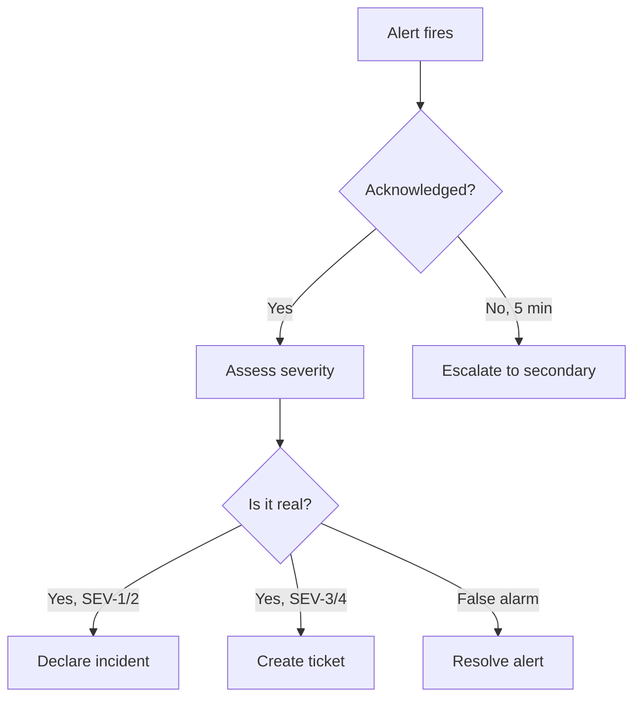
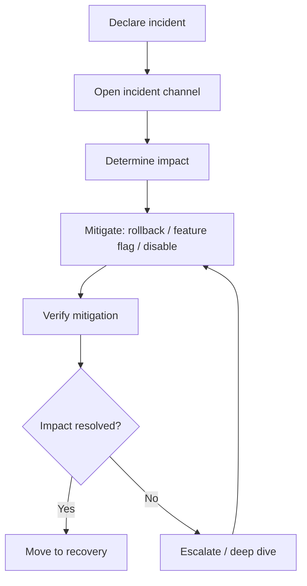

# Incident Response Plan

> **Purpose:** Standard procedures for detecting, responding to, and recovering from production incidents
> **Status:** Active
> **Owner:** Security Team
> **Last Updated:** 2026-07-13
> **Applies to:** Vaeloom platform — MVP and Enterprise deployments

---

## Table of Contents

1. [Incident Severity Levels](#1-incident-severity-levels)
2. [Incident Response Roles](#2-incident-response-roles)
3. [Incident Response Workflow](#3-incident-response-workflow)
4. [Communication Templates](#4-communication-templates)
5. [Common Incident Scenarios](#5-common-incident-scenarios)
6. [Post-Mortem Process](#6-post-mortem-process)

---

## 1. Incident Severity Levels {#1-incident-severity-levels}

### SEV-1: Critical — System Down or Data Loss

| Criteria | Response |
|----------|----------|
| All users cannot access the platform | Immediate response |
| Data loss or corruption detected | < 15 min to acknowledge |
| Agent system making incorrect autonomous decisions | < 15 min to acknowledge |
| Security breach or unauthorized data access | < 5 min to acknowledge |

**Response:** On-call engineer immediately. All other work suspended. CTO notified within 15 minutes.

### SEV-2: High — Major Feature Degraded

| Criteria | Response |
|----------|----------|
| Core feature (resume, job search, file organization) unavailable | < 30 min to acknowledge |
| Agent system not processing for > 30 minutes | < 30 min to acknowledge |
| API latency > 5s for > 15 minutes | < 30 min to acknowledge |
| Connector failures affecting > 10% of users | < 30 min to acknowledge |

**Response:** On-call engineer within 30 min. Feature team notified within 1 hour.

### SEV-3: Medium — Partial Degradation

| Criteria | Response |
|----------|----------|
| Non-critical feature degraded (dashboard widgets, history page) | < 2 hours to acknowledge |
| Connector failure affecting < 5% of users | < 2 hours to acknowledge |
| Agent approval rate dropping below 70% (model quality issue) | < 2 hours to acknowledge |
| Slightly elevated error rates (1–5%) | < 2 hours to acknowledge |

**Response:** Engineering team notified within 2 hours. Addressed in next deployment.

### SEV-4: Low — Cosmetic or Minor

| Criteria | Response |
|----------|----------|
| UI formatting issues | Next business day |
| Typo in copy | Next business day |
| Non-functional button states | Next business day |
| Minor performance degradation (< 2x baseline) | Next business day |

**Response:** Logged in issue tracker. Addressed in normal sprint cycle.

---

## 2. Incident Response Roles {#2-incident-response-roles}

### Incident Commander (IC)

- **Responsibilities:** Coordinates response, manages communication, makes severity/triage decisions
- **Assigned to:** First on-call engineer to respond
- **Hand-off:** Can transfer to another engineer after initial triage

### Subject Matter Expert (SME)

- **Responsibilities:** Technical investigation and mitigation
- **Assigned to:** Engineer with most context on the affected system
- **Multiple SMEs:** For incidents spanning multiple services

### Communicator

- **Responsibilities:** Updates status page, posts to Slack, drafts user-facing messages
- **Assigned to:** IC delegates this role once response is underway

### Scribe

- **Responsibilities:** Takes notes during the incident for post-mortem
- **Assigned to:** IC delegates this role once response is underway

---

## 3. Incident Response Workflow {#3-incident-response-workflow}

The incident response lifecycle is a **closed loop** — every incident feeds back into system improvements. Below is the end-to-end flow from detection through post-mortem.

```mermaid
flowchart TB
    %% ── Style definitions ──
    classDef detect fill:#e3f2fd,stroke:#1565c0,color:#000
    classDef triage fill:#fff3e0,stroke:#e65100,color:#000
    classDef mitigate fill:#fce4ec,stroke:#c62828,color:#000
    classDef recover fill:#e8f5e9,stroke:#2e7d32,color:#000
    classDef learn fill:#f3e5f5,stroke:#6a1b9a,color:#000
    classDef decision fill:#fffde7,stroke:#f9a825,color:#000
    classDef external fill:#eceff1,stroke:#37474f,color:#000,stroke-dasharray:5 5

    %% ── Subgraph: Detect ──
    subgraph Detect["🟦 1 -- Detect"]
        direction TB
        D1[Monitoring Alert] --> D2{Is this real?}
        D3[User Report] --> D2
        D2 -->|Yes| D4[Log incident in tracker]
        D2 -->|False alarm| D5[Resolve & document]
    end

    %% ── Subgraph: Triage ──
    subgraph Triage["🟧 2 -- Triage"]
        direction TB
        T1[On-call acknowledges] --> T2[Assess severity]
        T2 -->|SEV-1/2| T3[Declare incident]
        T2 -->|SEV-3/4| T4[Create ticket]
        T3 --> T5[Assign roles:
        IC · SME · Scribe]
        T4 --> T6[Handle in sprint]
    end

    %% ── Subgraph: Mitigate ──
    subgraph Mitigate["🟥 3 -- Mitigate"]
        direction TB
        M1[Open #incident-XXX] --> M2{Can we contain?}
        M2 -->|Rollback| M3[Deploy previous version]
        M2 -->|Feature flag| M4[Disable affected
        component]
        M2 -->|Scale out| M5[Increase capacity]
        M3 --> M6[Verify health check]
        M4 --> M6
        M5 --> M6
        M6 --> M7{Impact resolved?}
        M7 -->|Yes| M8[Stabilize]
        M7 -->|No| M9[Escalate / deep dive]
        M9 --> M2
    end

    %% ── Subgraph: Recover ──
    subgraph Recover["🟩 4 -- Recover"]
        direction TB
        R1[Apply permanent fix] --> R2[Run smoke tests]
        R2 --> R3[Re-enable disabled
        features]
        R3 --> R4[Monitor for 1 hour]
    end

    %% ── Subgraph: Post-Mortem ──
    subgraph PostMortem["🟪 5 -- Post-Mortem"]
        direction TB
        P1[Write post-mortem
        within 48h] --> P2[Identify root cause
        5 Whys]
        P2 --> P3[Define action items]
        P3 --> P4[Assign owners &
        deadlines]
    end

    %% ── Edges ──
    D5 -->|False alarm| D1
    D4 --> T1
    T3 -->|SEV-1/2| M1
    T5 --> M1
    M8 --> R1
    R4 --> P1

    %% ── Feedback loop ──
    P4 -.->|Action items complete|    I1["Update runbooks<br/>and monitoring"]
    I1 -.->|Improves detection| D1
    I1 -.->|Improves mitigation| M2

    %% ── Phase durations ──
    I2["⏱ SLA: SEV-1 &lt; 15m · SEV-2 &lt; 30m"]:::external
    I3["⏱ Post-mortem within 48 hours"]:::external

    %% Apply styles
    class D1,D3,D4,D5 detect
    class T1,T2,T3,T4,T5,T6 triage
    class M1,M3,M4,M5,M6,M8,M9 mitigate
    class R1,R2,R3,R4 recover
    class P1,P2,P3,P4 learn
    class D2,M2,M7 decision
    class I1 external
```

| Phase | Objective | SLA |
|-------|-----------|-----|
| 1 — Detect | Identify potential issue via alert or user report | Varies by severity |
| 2 — Triage | Assess severity, assign roles, declare or defer | SEV-1/2: immediate, SEV-3: < 2h |
| 3 — Mitigate | Contain impact (rollback, feature flag, scale) | Continuous until resolved |
| 4 — Recover | Apply permanent fix, verify, restore full service | Post-mitigation |
| 5 — Post-Mortem | Root cause, action items, blameless improvement | Within 48 hours |

### Phase 1: Detect & Acknowledge



1. **Alert fires** — via PagerDuty, Slack, or monitoring dashboard
2. **Acknowledge within SLA** — based on severity level
3. **Verify the alert** — is this a real issue or a false positive?
4. **Determine severity** — use severity definitions in §1

### Phase 2: Triage & Mitigate



1. **Open incident channel** — `#incident-XXX` in Slack
2. **Determine impact** — which users, which features, data at risk?
3. **Mitigate first** — rollback, feature flag, or disable the affected component
4. **Verify mitigation** — check health endpoints, error rates return to baseline
5. **Escalate if needed** — if mitigation fails, escalate to additional SMEs

### Phase 3: Recover

1. **Apply fix** — deploy the permanent fix
2. **Verify fix** — run smoke tests, check error rates for 10+ minutes
3. **Confirm data integrity** — verify no data loss or corruption occurred
4. **Restore normal operations** — enable feature flags, re-enable disabled features
5. **Monitor** — increased monitoring for 1 hour post-resolution

### Phase 4: Learn

1. **Write post-mortem** — within 48 hours of resolution
2. **Identify root cause** — use 5 Whys or similar technique
3. **Define action items** — prevent recurrence, improve detection, improve response
4. **Assign owners** — each action item has a named owner and deadline
5. **Share learnings** — post to `#learnings` Slack channel

---

## 4. Communication Templates {#4-communication-templates}

### 4.1 Incident declared (internal)

```text
🚨 INCIDENT DECLARED — SEV-[1/2]
Incident ID: INC-XXX
Time: [UTC timestamp]
Severity: SEV-[1/2]
Affected: [services/users/features]
Description: [brief description]

Impact: [what's broken, who's affected]
Current status: [investigating / mitigating / resolved]

Channel: #incident-XXX
Commander: @name
```

### 4.2 Status update (internal)

```text
🔄 INCIDENT UPDATE — INC-XXX
Time: [UTC timestamp]
Current status: [investigating / fix in progress / mitigated / resolved]

What we know: [new information]
What we're doing: [current actions]
Next update: [time or milestone]
```

### 4.3 User-facing message

```text
[Vaeloom Status]
We're currently experiencing [brief description of issue].
Markdown features [affected features] are [affected behavior].

Our team is actively working on a fix. We'll update this page
when more information is available.

Estimated resolution: [ETA or "TBD"]
```

### 4.4 Post-resolution summary

```text
✅ INCIDENT RESOLVED — INC-XXX
Time: [UTC timestamp]
Duration: [X hours Y minutes]

Root cause: [brief root cause]
Fix: [what was done]
Action items:
- [ ] [action item 1] — owner, deadline
- [ ] [action item 2] — owner, deadline

Full post-mortem: [link to document]
```

---

## 5. Common Incident Scenarios {#5-common-incident-scenarios}

### 5.1 AI model API outage

**Symptoms:** Agent responses failing, high error rate from ai-service, timeouts

**Response:**

1. ✅ Check if other agents are also failing (indicates API-level issue vs. per-agent issue)
2. ✅ Switch to fallback model in model router configuration
3. ✅ If no fallback model available, disable agent auto-processing, switch to degraded mode
4. ✅ Notify users: "AI features are temporarily operating in manual mode"
5. ⬜ Post-mortem: review fallback coverage, add additional model provider

### 5.2 Database connection pool exhaustion

**Symptoms:** API latency spikes, connection timeout errors, `remaining connection slots are reserved` errors

**Response:**

1. ✅ Kill long-running queries: `SELECT pg_terminate_backend(pid) FROM pg_stat_activity WHERE state = 'active' AND now() - query_start > interval '5 minutes'`
2. ✅ Increase pool size temporarily if running low on total connections
3. ✅ Restart affected services to clear connection pools
4. ⬜ Post-mortem: review query patterns, add connection pooling limits

### 5.3 Memory Agent incorrect merge (data quality)

**Symptoms:** Users report incorrect information in resume, knowledge graph shows wrong relationships

**Response:**

1. ✅ Identify the scope of incorrect merges (time range, entity types affected)
2. ✅ Revert merges: restore from most recent backup of entities/relationships tables
3. ✅ Block the Memory Agent from re-processing those documents until fix is deployed
4. ⬜ Post-mortem: review merge confidence thresholds, add additional validation

### 5.4 Queue backlog

**Symptoms:** Documents not being processed, Gmail not scanning, latency on ingestion

**Response:**

1. ✅ Check queue depth in Redis
2. ✅ Increase worker concurrency if resources allow
3. ✅ If backlog > 10K items, prioritize by recency (process newest first)
4. ✅ Consider dropping non-critical queue items (e.g., old file re-processing)
5. ⬜ Post-mortem: review scaling triggers, add auto-scaling

### 5.5 Security incident (breach / unauthorized access)

**Symptoms:** Suspicious API calls, unauthorized data access, compromised tokens

**Response:**

1. ✅ **IMMEDIATE:** Revoke compromised tokens / API keys
2. ✅ **IMMEDIATE:** Block suspicious IPs at load balancer level
3. ✅ **IMMEDIATE:** Rotate any secrets the incident touches
4. ✅ Audit access logs to determine scope of exposure
5. ✅ Notify affected users within legal requirements
6. ⬜ Post-mortem: full security review, penetration testing, compliance notification

### 5.6 Connector outage (Gmail, GitHub, etc.)

**Symptoms:** Connector status shows "degraded" or "error", OAuth tokens failing

**Response:**

1. ✅ Check if it's a provider-side outage (Google status page, GitHub status page)
2. ✅ If provider issue: update connector status to "degraded," notify affected users
3. ✅ If token issue: prompt re-authentication for affected users
4. ⬜ Post-mortem: review token refresh logic, add earlier warning before expiry

---

## 6. Post-Mortem Process {#6-post-mortem-process}

### 6.1 When to write a post-mortem

- All SEV-1 and SEV-2 incidents
- SEV-3 incidents with potential for recurrence
- Any incident where the team learns something significant

### 6.2 Post-mortem template

```markdown
# Post-Mortem: INC-XXX - [Title]

**Date:** YYYY-MM-DD
**Incident ID:** INC-XXX
**Severity:** SEV-[1-4]
**Duration:** X hours Y minutes
**Author(s):** [names]

## Summary
[1-2 paragraph summary of what happened]

## Timeline
| Time (UTC) | Event |
|------------|-------|
| HH:MM | Alert fired: [alert name] |
| HH:MM | Engineer acknowledged |
| HH:MM | Incident declared |
| HH:MM | Mitigation applied |
| HH:MM | Impact resolved |
| HH:MM | Full recovery verified |

## Root Cause
[Description of root cause, using 5 Whys or similar]

## Impact
- Users affected: [number or percentage]
- Features affected: [list]
- Data affected: [none / describe]
- Financial impact: [if applicable]

## What Went Well
- [Thing that worked well]
- [Thing that worked well]

## What Went Wrong
- [Thing that should have been better]
- [Thing that should have been better]

## Action Items
| # | Action | Owner | Deadline | Status |
|---|--------|-------|----------|--------|
| 1 | [Action] | @name | YYYY-MM-DD | [ ] |
| 2 | [Action] | @name | YYYY-MM-DD | [ ] |

## Prevention
[How will we prevent this from happening again?]

## Detection
[How will we detect this faster next time?]
```

### 6.3 Blameless culture

- Post-mortems are blameless by design
- Focus on system improvements, not individual mistakes
- Assume good intent from all parties
- Every incident is an opportunity to improve the system

---

## Incident Response Quick Reference Card

```text
🔴 SEV-1: < 15 min response    | ALL hands
🟠 SEV-2: < 30 min response    | Feature team
🟡 SEV-3: < 2 hour response    | Engineering
🟢 SEV-4: Next business day     | Sprint cycle

1. ACKNOWLEDGE the alert
2. DECLARE severity in #incidents
3. OPEN #incident-XXX channel
4. MITIGATE before investigating root cause
5. VERIFY mitigation works
6. WRITE post-mortem within 48 hours7. COMPLETE action items before closing
```

## Common Mistakes

| Mistake | Consequence |
|---------|-------------|
| Investigating before mitigating | Teams spend 20 minutes diagnosing root cause when a rollback or feature flag would restore service in 2 minutes — mitigate first, investigate after impact is contained |
| Incident response that isn't practiced | A team that has never run a SEV-1 drill will fumble role assignments, miss communication templates, and escalate late — run quarterly tabletop exercises for SEV-1 and SEV-2 scenarios |
| Post-mortems without action items | A post-mortem that identifies root causes but doesn't assign owners and deadlines is just documentation — every action item needs a named owner and a due date, tracked to completion |

## Best Practices

| Practice | Why |
|----------|-----|
| Always mitigate before investigating | The first action should be rollback, feature flag, or disable — not root cause analysis. Investigation happens after impact is contained. This minimizes user-facing downtime |
| Practice incident response with regular drills | Quarterly tabletop exercises build muscle memory for role assignments, communication templates, and escalation paths — teams that practice recover 2-3x faster |
| Write post-mortems within 48 hours while details are fresh | Memory of incident details fades quickly — 48 hours is the maximum window to capture an accurate timeline, root cause analysis, and action items |

## Security

| Concern | Mitigation |
|---------|------------|
| Incident communication leaking sensitive data | A status page post that reveals internal IPs, database names, or the scope of a breach violates security policy — use pre-approved communication templates that avoid technical details |
| Post-mortem documents exposing vulnerabilities | A post-mortem that describes "how we were hacked" in detail becomes a blueprint for attackers — redact specific exploit details and keep full versions in a restricted-access system |
| Incident responders making changes under panic without review | During a SEV-1, engineers may apply hotfixes that bypass normal review — require a synchronous peer review for any production change, even during incidents |

## Performance

| Concern | Mitigation |
|---------|------------|
| Incident response tooling adding latency during critical moments | The incident response system (PagerDuty, Slack) itself can become a bottleneck during a major incident — if the alerting pipeline is slow, responders are delayed. Test alert delivery latency monthly |
| Communication overhead slowing down resolution | Too many people in the incident channel asking "what's happening" creates noise that slows the IC — enforce a strict roles-based communication model where only the IC and Communicator post updates |
| Post-incident recovery causing further degradation | Restarting services or failing over after an incident can trigger cascading failures — stagger recovery steps and verify health after each step before proceeding to the next |

## Security Considerations

| Concern | Mitigation |
|---------|------------|
| Incident communication leaking sensitive data | A status page post that reveals internal IPs, database names, or the scope of a breach violates security policy — use pre-approved communication templates that avoid technical details |
| Post-mortem documents exposing vulnerabilities | A post-mortem that describes "how we were hacked" in detail becomes a blueprint for attackers — redact specific exploit details and keep full versions in a restricted-access system |
| Incident responders making changes under panic without review | During a SEV-1, engineers may apply hotfixes that bypass normal review — require a synchronous peer review for any production change, even during incidents |

## Performance Considerations

| Concern | Approach |
|---------|----------|
| Incident response tooling adding latency during critical moments | The incident response system (PagerDuty, Slack) itself can become a bottleneck during a major incident — if the alerting pipeline is slow, responders are delayed. Test alert delivery latency monthly |
| Communication overhead slowing down resolution | Too many people in the incident channel asking "what's happening" creates noise that slows the IC — enforce a strict roles-based communication model where only the IC and Communicator post updates |
| Post-incident recovery causing further degradation | Restarting services or failing over after an incident can trigger cascading failures — stagger recovery steps and verify health after each step before proceeding to the next |

## Workflows

1. **Alert fires** — PagerDuty, monitoring dashboard, or user report triggers detection
2. **Acknowledge alert** — within SLA based on severity (SEV-1: < 15 min, SEV-2: < 30 min)
3. **Triage** — assess severity → declare incident or create ticket → assign roles (IC, SME, Scribe, Communicator)
4. **Mitigate** — rollback, feature flag disable, scale out, or block traffic — mitigate before investigating root cause
5. **Verify mitigation** — health checks return OK, error rate returns to baseline
6. **Recover** — apply permanent fix → run smoke tests → re-enable disabled features → monitor for 1 hour
7. **Post-mortem** — write within 48 hours → identify root cause (5 Whys) → define action items → assign owners
8. **Follow-up** — complete action items → update runbooks → improve monitoring → close incident

---

## Scalability

| Dimension | Current Limit | 10x Strategy | 100x Strategy |
|-----------|--------------|--------------|---------------|
| On-call team | 1 primary + 1 secondary | 3-tier rotation (primary/escalation/manager) | Follow-the-sun global on-call (6+ engineers) |
| Incident volume | 5/week | 20/week: auto-triage for SEV-3/4 | 50/week: AI triage + auto-remediation |
| Response SLA | < 15 min SEV-1 | < 5 min: auto-mitigation for common failures | < 1 min: self-healing infrastructure |
| Post-mortem completion | Within 48 hours | Within 24 hours for SEV-1 | Automated post-mortem generation |

---

## Error Handling

| Scenario | Detection | Mitigation | Recovery |
|----------|-----------|------------|----------|
| IC doesn't respond within SLA | Escalation timer expires | Secondary on-call becomes IC | Page IC manager, investigate no-show |
| Mitigation makes things worse | Error rate increases after action | Rollback the mitigation action | Document failed mitigation in runbook |
| Incident spans multiple teams | Communicator can't track all channels | Use incident channel with pinned updates | Dedicated incident Slack Connect channel |
| Post-mortem action items slip | Deadline passes without update | Weekly action item review in standup | Automated Jira ticket creation for action items |

---

## Monitoring

| Metric | Alert Threshold | Severity | Dashboard |
|--------|----------------|----------|-----------|
| MTTD (Mean Time to Detect) | > 5 min | Warning | Incident Response |
| MTTA (Mean Time to Acknowledge) | > SLA (SEV-1: 15 min) | Critical | Incident Response |
| MTTR (Mean Time to Resolve) SEV-1 | > 1 hour | Critical | Incident Response |
| Post-mortem completion time | > 48 hours | Warning | Incident Follow-up |
| Action item completion rate | < 80% within deadline | Warning | Incident Actions |

---

## Deployment

| Environment | Method | Trigger | Verification |
|-------------|--------|---------|--------------|
| Runbook update | PR merge | After incident or quarterly drill | Procedure verified in tabletop exercise |
| Alert threshold change | Terraform / config | Post-mortem recommendation | Alert fires at correct threshold |
| Communication template | Doc update | Team feedback or miss | Template used correctly in next incident |
| Incident response tooling | PagerDuty config change | New service added | Test alert delivered correctly |

---

## Limitations

| Limitation | Impact | Workaround | Future Resolution |
|------------|--------|------------|-------------------|
| No automated incident detection for all failure modes | Some incidents reported by users first | Comprehensive monitoring coverage | AI-powered anomaly detection |
| Post-mortem quality depends on scribe notes | Incomplete timeline if scribe overwhelmed | Record incident channel | Automated timeline from Slack and PagerDuty |
| Action items not tracked systematically | Post-mortem improvements lost | Manual tracking in sprint board | Automated Jira integration from post-mortem template |
| Incident response not practiced regularly | Team rusty on procedures | Quarterly tabletop exercises | Monthly chaos engineering + incident drills |

---

## Overview

The Incident Response Plan defines the standard procedures for detecting, responding to, and recovering from production incidents on the Vaeloom platform. It establishes severity classifications, role assignments, communication templates, and a closed-loop workflow that ensures every incident feeds back into system improvements.

This document is designed for the entire engineering organization — from on-call engineers who triage alerts to incident commanders who coordinate response and subject-matter experts who drive mitigation. The plan applies to both the MVP PaaS deployment and the enterprise Kubernetes deployment of Vaeloom.

Vaeloom's value as a second-brain AI for education and career depends on uninterrupted access to user knowledge graphs, agent-driven workflows, and connector data synchronization. An incident that degrades the memory agent, blocks document ingestion, or disrupts AI inference directly impacts users' ability to manage their professional development. This plan prioritizes mitigation before investigation to minimize user-facing impact.

Every incident is an opportunity to improve the system. The post-mortem process codified here ensures blameless root-cause analysis, actionable follow-ups, and continuous hardening of Vaeloom's operational resilience.

## Goals

- Classify incidents by severity (SEV-1 through SEV-4) with clear criteria, response SLAs, and escalation paths specific to Vaeloom's AI agent ecosystem
- Define incident response roles (Incident Commander, SME, Communicator, Scribe) with explicit responsibilities for coordination, technical mitigation, and stakeholder communication
- Establish a closed-loop response workflow — detect, triage, mitigate, recover, post-mortem — that minimizes user-facing downtime and prevents recurrence
- Provide ready-to-use communication templates for internal status updates, user-facing messages, and post-resolution summaries
- Document runbooks for common Vaeloom-specific scenarios: AI model API outage, database connection exhaustion, memory agent merge errors, queue backlogs, security incidents, and connector failures

## Scope

### In Scope

- Incident severity definitions (SEV-1 through SEV-4) with response time SLAs for all Vaeloom services including AI agent system, API, database, and connectors
- Incident response roles and responsibilities with hand-off procedures
- End-to-end incident response workflow from detection through post-mortem with SLA targets per phase
- Communication templates for internal incident declaration, status updates, user-facing messages, and post-resolution summaries
- Common incident scenarios specific to Vaeloom: AI model API outage, database connection pool exhaustion, Memory Agent incorrect merge, queue backlog, security breach, and connector outage
- Post-mortem process with template, timeline documentation, 5 Whys root-cause analysis, and action item tracking
- Blameless culture principles and incident response quick reference card

### Out of Scope

- Standard operating procedures for routine operations (covered in Operations Runbook)
- Business continuity and disaster recovery failover procedures (covered in Business Continuity Plan)
- SLA/SLO/SLI definitions and error budget policies (covered in SRE, SLA, SLO, and SLI documents)
- Detailed security incident forensics and legal notification procedures (covered in Security documentation)
- Vendor risk assessment and third-party dependency management (covered in Vendor Risk Assessment)

---

## Examples

### Declare Incident (CLI)

```bash
# Declare a SEV-1 incident via API
curl -X POST https://api.Vaeloom.dev/v1/admin/incidents \
  -H "Authorization: Bearer $ADMIN_TOKEN" \
  -d '{
    "severity": "SEV-1",
    "title": "AI service unavailable",
    "affected": ["ai-service"],
    "description": "Anthropic API returning 503"
  }' | jq '.incident_id'
```

### Check Alert Status (CLI)

```bash
# View current alerts
curl -s https://api.Vaeloom.dev/v1/admin/alerts/active \
  -H "Authorization: Bearer $ADMIN_TOKEN" | jq '.alerts[] | {name, severity, status}'
```

### Post-Mortem Template (YAML)

```yaml
incident:
  id: INC-042
  severity: SEV-2
  duration_minutes: 45
  root_cause: "Connection pool exhaustion under burst load"
  action_items:
    - description: "Increase max_connections from 50 to 100"
      owner: "devops-team"
      deadline: "2026-08-01"
    - description: "Add connection pool monitoring alert"
      owner: "sre-team"
      deadline: "2026-07-25"
```

## Future Improvements

| Improvement | Priority | Complexity | Timeline |
|-------------|----------|------------|----------|
| Automated incident detection with ML anomaly detection | High | High | Q2 2027 |
| Automated post-mortem timeline from Slack + PagerDuty | High | Low | Q4 2026 |
| AI-powered suggested mitigations during incident | Medium | High | Q2 2027 |
| Monthly incident drills with measurable SLAs | Medium | Low | Q3 2026 |
| Full auto-remediation for common failure patterns | Low | High | Q3 2027 |

## Related Documents

- [Operations Runbook](./01-operations-runbook.md) — Standard operating procedures
- [DevOps README](../DevOps/README.md) — Deployment infrastructure and monitoring
- [Security README](../Security/README.md) — Security incident procedures and compliance
- [Business Continuity Plan](./Business-Continuity-Plan.md) — DR and continuity planning

*Maintained by the Vaeloom engineering team. Last updated: Q4 2026.*
