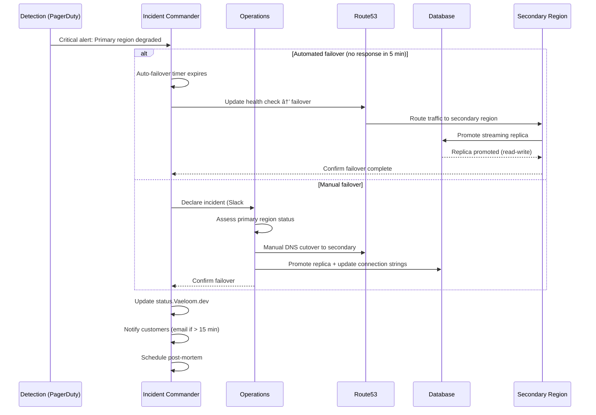

# Business Continuity Plan

> **Purpose:** Define disaster recovery procedures, RTO/RPO targets, recovery strategies, and testing schedule for Vaeloom
> **Status:** 🆕 New
> **Owner:** DevOps Team
> **Last Updated:** 2026-07-13

## Overview

Vaeloom maintains a Business Continuity Plan (BCP) to ensure service availability within **4 hours Recovery Time Objective (RTO)** and data loss limited to **1 hour Recovery Point Objective (RPO)**. The plan covers major failure scenarios including region-level cloud outage, database corruption, AI service degradation, and infrastructure compromise.

This document defines recovery strategies per service, the communication plan, alternate site configuration, and the testing schedule (quarterly tabletop exercises, annual full failover test).

## BCP Architecture

```mermaid
graph TD
    classDef trigger fill:#e3f2fd,stroke:#1565c0,color:#000,stroke-width:2px
    classDef tier fill:#e8f5e9,stroke:#2e7d32,color:#000,stroke-width:1.5px
    classDef action fill:#fff3e0,stroke:#e65100,color:#000,stroke-width:1.5px
    classDef comms fill:#f3e5f5,stroke:#6a1b9a,color:#000,stroke-width:1px

    T1["Incident Detected<br/>PagerDuty Alert"] --> CMD["Command Center<br/>Establish Incident Command"]

    subgraph Tier["Service Recovery Tiers"]
        T0["Tier 0 — Critical<br/>API, Auth, Database<br/>RTO: 1 hour"]
        T1S["Tier 1 — High<br/>AI Service, Document Processing<br/>RTO: 2 hours"]
        T2S["Tier 2 — Medium<br/>Webhooks, Email, Background Jobs<br/>RTO: 4 hours"]
        T3S["Tier 3 — Low<br/>Analytics, Admin Reports<br/>RTO: 24 hours"]
    end

    subgraph Strategies["Recovery Strategies"]
        S1["Active-Passive<br/>Secondary region (us-west-2)"]
        S2["Database Failover<br/>PostgreSQL streaming replica"]
        S3["DNS Cutover<br/>Route53 health checks"]
        S4["Data Restore<br/>Point-in-time recovery"]
    end

    subgraph Comms["Communication Plan"]
        C1["Internal: Slack channel<br/>#incident-response"]
        C2["Status Page: status.Vaeloom.dev<br/>Automated updates"]
        C3["Customer: Email notification<br/>For outages > 15 minutes"]
        C4["Post-mortem: Within 5 business days"]
    end

    T0 & T1S & T2S & T3S --> S1 & S2 & S3 & S4
    CMD --> T0 & T1S & T2S & T3S
    CMD --> Comms

    class T1 trigger
    class T0,T1S,T2S,T3S tier
    class S1,S2,S3,S4 action
    class C1,C2,C3,C4 comms
```



## Recovery Strategies by Service

| Service | Strategy | RTO | RPO | Dependencies |
|---------|----------|-----|-----|--------------|
| **API Gateway** | Active-passive cross-region (us-east-1 → us-west-2) | 15 min | 0 | Route53 health check, ALB |
| **PostgreSQL (Primary)** | Streaming replica promotion to primary | 5 min | <1 min | WAL archiving, pg_rewind |
| **PostgreSQL (Read replicas)** | Auto-failover to replica in secondary region | 2 min | 0 | etcd based cluster mgmt |
| **AI Inference Service** | Fallback model provider (Anthropic → OpenAI) | 10 min | 0 | API key rotation |
| **Redis Cache** | Rebuild from database (graceful degradation) | 30 min | 0 | No persistent data loss |
| **Document Storage (S3)** | Cross-region replication (CRR) | 0 (auto) | 15 min | S3 CRR configuration |
| **Background Workers** | Re-provision in secondary region via ASG | 30 min | 0 | Queue draining (SQS) |
| **Frontend (Vercel)** | Automatic global failover (Vercel Edge) | 0 (auto) | 0 | Vercel-managed |

## Failover Workflow



## Communication Plan

```mermaid
graph LR
    classDef internal fill:#e3f2fd,stroke:#1565c0,color:#000
    classDef external fill:#fff3e0,stroke:#e65100,color:#000

    subgraph Internal["Internal Communications"]
        I1["Slack: #incident-response"]
        I2["Slack: #engineering (read-only updates)"]
        I3["Zoom bridge (on-demand)"]
        I4["Incident Commander rotation"]
    end

    subgraph External["External Communications"]
        E1["status.Vaeloom.dev<br/>Automated updates"]
        E2["Customer email<br/>If outage > 15 min"]
        E3["Support ticket auto-response"]
        E4["Post-mortem published<br/>Within 5 business days"]
    end

    subgraph Templates["Message Templates"]
        T1["Investigating —<br/>'We are investigating reports...'"]
        T2["Identified —<br/>'We have identified the cause...'"]
        T3["Mitigating —<br/>'We are applying a fix...'"]
        T4["Resolved —<br/>'Service has been restored...'"]
    end

    Internal --> I1 & I2 & I3 & I4
    External --> E1 & E2 & E3 & E4
    E1 --> T1 & T2 & T3 & T4

    class I1,I2,I3,I4 internal
    class E1,E2,E3,E4 external
    class T1,T2,T3,T4 external
```



## Alternate Site Strategy

| Environment | Primary | Secondary | Failover Type |
|-------------|---------|-----------|---------------|
| Production | us-east-1 (AWS) | us-west-2 (AWS) | Active-passive |
| Staging | us-east-1 (AWS) | us-west-2 (AWS) | Active-passive |
| AI Service | us-east-1 (Fly.io) | eu-west-1 (Fly.io) | Active-passive |
| Database | us-east-1 (RDS Multi-AZ) | us-west-2 (Read replica) | Manual promote |

**Secondary region prerequisites:**

- Pre-provisioned infrastructure via Terraform (always up-to-date)
- Database read replica with continuous WAL streaming
- Container images pre-pulled or available in cross-region ECR
- Secret replication via AWS Secrets Manager cross-region

## Testing Schedule

| Exercise | Frequency | Scope | Participants |
|----------|-----------|-------|--------------|
| Tabletop Exercise | Quarterly | Walk through scenario (region outage, database corruption, AI failure) | IC rotation, DevOps, Security |
| Database Failover Test | Quarterly | Promote replica, verify writes, rollback | DevOps Team |
| Full Regional Failover | Annually | Complete failover to secondary region for 4 hours | All engineering teams |
| Communication Drill | Quarterly | Test status page, email notifications, Slack automation | DevOps + Support |
| Backup Restore Test | Quarterly | Restore from point-in-time backup to isolated environment | DevOps Team |

## Best Practices

| Practice | Rationale |
|----------|----------|
| Document runbooks for every service | During an incident, cognitive load is high — runbooks reduce decision time and prevent mistakes |
| Test failover outside business hours | Real failover may happen at 3 AM; testing during business hours gives false confidence |
| Automate detection and initial response | Automated failover for Tier 0 services reduces RTO to minutes; manual approval for full failover |
| Include third-party dependencies in BCP | Clerk/Auth0, Stripe, Anthropic — if these go down, what's the fallback? Document each vendor's BCP |

## Common Mistakes

| Mistake | Consequence | Fix |
|---------|-------------|-----|
| Never testing the failover process | When real failover is needed, the process fails due to undocumented steps or stale infrastructure | Test full failover annually; tabletop exercises quarterly; fix issues found in each test |
| Single-region dependencies | Database in secondary region but secrets only in primary; failover incomplete | Replicate secrets, configs, and images to secondary region proactively |
| No communication plan | Engineers focus on fixing while customers are left in the dark | Pre-write status page templates; automate initial "Investigating" notification |
| Ignoring recovery time for dependencies | Database restored in 5 min but DNS TTL is 24 hours | Use Route53 with health checks + low TTL (60 seconds) for critical records |

## Security Considerations

| Concern | Mitigation |
|---------|-----------|
| Secondary region secret exposure | Secrets replicated via AWS Secrets Manager cross-region replication with same encryption and IAM policies |
| Failover credential rotation | Database passwords rotated on failover; new credentials pushed to Secrets Manager and picked up by applications |
| Split-brain scenario | PostgreSQL streaming replication prevents split-brain; manual intervention required if both regions accept writes |
| Status page compromise | status.Vaeloom.dev hosted on isolated infrastructure with separate IAM; write access restricted to incident commander role |
| Post-mortem data sensitivity | Post-mortems anonymized and stored in internal wiki; no customer PII included in public communications |

## Performance Considerations

| Concern | Mitigation |
|---------|-----------|
| DNS failover propagation | Route53 health checks with 10-second interval; TTL of 60 seconds on production records |
| Database replica lag | Streaming replication lag monitored via Prometheus; alert if lag exceeds 30 seconds |
| Cross-region data transfer costs | Secondary region runs minimal baseline infrastructure; full scale-up only triggered during failover |
| Cold start in secondary region | Pre-warmed container images in secondary ECR; ASG minimum 1 instance per service |
| Backup restore time | Point-in-time recovery from WAL archives targets <1 hour for full database restore |

## Workflows

1. **Incident detected** via PagerDuty alert, monitoring dashboard, or user report
2. **Incident Commander established** — first responder declares severity and opens incident channel
3. **Impact assessment** — determine which services/users are affected, data at risk
4. **Failover decision** — automated (no response in 5 min) or manual (IC decision)
5. **Execute failover** — DNS cutover, replica promotion, secondary region activation
6. **Verify recovery** — health checks on secondary region, smoke tests
7. **Communicate** — update status page, notify customers (if > 15 min outage)
8. **Post-mortem** — within 5 business days, identify root cause and action items

---

## Scalability

| Dimension | Current Limit | 10x Strategy | 100x Strategy |
|-----------|--------------|--------------|---------------|
| Regions | 2 (us-east-1, us-west-2) | 3 (add eu-west-1) | 5 (global: US, EU, APAC) |
| Services covered by BCP | 8 services | 20 services: per-service runbooks | 100 services: automated recovery orchestration |
| RTO compliance | 4 hours (all tiers) | 1 hour (Tier 0-1) | 15 minutes (all tiers auto-failover) |
| Testing frequency | Quarterly tabletop | Monthly drills + quarterly full failover | Continuous chaos engineering |

---

## Error Handling

| Scenario | Detection | Mitigation | Recovery |
|----------|-----------|------------|----------|
| Automated failover doesn't trigger | Manual failover timer expires | IC manually executes failover steps | Post-mortem: fix detection logic |
| Secondary region also degraded | Cross-region health check failure | Activate tertiary backup (cold site) | Restore from backup in alternate cloud |
| DNS propagation delayed | Route53 health check slow | Lower TTL to 60s | Pre-warm DNS in secondary region |
| Database split-brain | Both regions accepting writes | Manual reconciliation of last WAL position | Implement fencing mechanism |

---

## Monitoring

| Metric | Alert Threshold | Severity | Dashboard |
|--------|----------------|----------|-----------|
| Cross-region replication lag | > 30 seconds | Critical | Disaster Recovery Dashboard |
| Backup age (last successful) | > 24 hours | Critical | Backup Health |
| Failover test success rate | < 100% (quarterly tests) | Critical | DR Test Results |
| DNS health check status | Any region unhealthy | Critical | Route53 Health |

---

## Deployment

| Environment | Method | Trigger | Verification |
|-------------|--------|---------|--------------|
| Secondary region infra | Terraform apply | Monthly BCP test | Smoke tests in secondary region |
| DNS failover config | Route53 health check update | Incident or drill | DNS resolution to secondary IP |
| Database replica | RDS promote-read-replica | Failover trigger | Read/write test on promoted replica |
| Secrets replication | Secrets Manager cross-region copy | Infrastructure change | Verify secret availability in secondary |

---

## Limitations

| Limitation | Impact | Workaround | Future Resolution |
|------------|--------|------------|-------------------|
| Active-passive DR wastes 50% capacity | Secondary region idle cost | Run staging workloads in secondary | Active-active multi-region deployment |
| Manual failover for Tier 2+ services | Slower recovery for non-critical | Automated runbook steps | Full automated recovery per service |
| No cross-cloud DR (AWS only) | Single-cloud dependency | Document manual migration steps | Multi-cloud DR with Terraform |
| RTO increases with service complexity | Complex services take longer to recover | Prioritize by tier with clear RTO | Service mesh with auto-failover per service |

---

## Goals

- Achieve recovery time objective (RTO) of 4 hours or less for all Vaeloom service tiers, with Tier 0 critical services (API, auth, database) recovering within 1 hour
- Maintain recovery point objective (RPO) of 1 hour or less, limiting data loss to the last hour of changes to user knowledge graphs, documents, and agent memory
- Establish automated failover for Tier 0 services and documented manual failover procedures for Tiers 1–3, covering AI inference, document processing, and background job execution
- Ensure communication plans reach all stakeholders — internal teams, affected users, and public status page — within 15 minutes of disaster declaration
- Validate continuity readiness through quarterly tabletop exercises, database failover tests, and an annual full regional failover drill

---

## Scope

### In Scope

- Recovery strategies for all eight Vaeloom production services: API Gateway, PostgreSQL primary and read replicas, AI Inference Service, Redis cache, S3 document storage, background workers, and frontend hosting
- Active-passive cross-region failover between us-east-1 (primary) and us-west-2 (secondary) including DNS cutover via Route53 health checks
- Communication plan covering internal Slack channels, status.Vaeloom.dev automated updates, customer email notifications, and post-mortem publishing
- Alternate site infrastructure prerequisites: Terraform-provisioned resources, database read replicas with WAL streaming, pre-pulled container images, and cross-region secret replication
- Testing schedule with defined frequency, scope, and participants for tabletop exercises, database failover tests, regional failover drills, communication exercises, and backup restore tests

### Out of Scope

- Day-to-day incident response triage and post-mortem processes (covered in Incident Response Plan)
- Standard operating procedures for routine maintenance, scaling, and deployment (covered in Operations Runbook)
- Individual service-level runbooks for non-disaster scenarios
- Multi-cloud disaster recovery strategy (single-cloud BCP for MVP phase; multi-cloud planned for future)
- Customer-specific business continuity requirements handled through enterprise SLA agreements

---

## Examples

### Failover Command (CLI)

```bash
# Manual DNS failover via Route53
aws route53 change-resource-record-sets \
  --hosted-zone-id ZONE_ID \
  --change-batch '{
    "Changes": [{
      "Action": "UPSERT",
      "ResourceRecordSet": {
        "Name": "api.Vaeloom.dev",
        "Type": "A",
        "AliasTarget": {
          "HostedZoneId": "SECONDARY_ALB_ZONE",
          "DNSName": "secondary-alb.us-west-2.elb.amazonaws.com",
          "EvaluateTargetHealth": true
        }
      }
    }]
  }'
```

### Database Failover (CLI)

```bash
# Promote replica to primary
aws rds promote-read-replica \
  --db-instance-identifier Vaeloom-db-replica \
  --region us-west-2

# Verify promotion
psql -h $NEW_PRIMARY -d Vaeloom -c "SELECT pg_is_in_recovery();"
```

### DR Test Configuration (YAML)

```yaml
dr_test:
  name: "Q3-2026 Regional Failover"
  date: "2026-09-15T03:00:00Z"
  scope: "Full failover to us-west-2"
  services_covered:
    - api-gateway
    - postgresql
    - ai-service
    - redis
  expected_rto_minutes: 30
  expected_rpo_minutes: 1
```

## Future Improvements

| Improvement | Priority | Complexity | Timeline |
|-------------|----------|------------|----------|
| Active-active multi-region deployment | High | High | Q2 2027 |
| Full automated failover for all tiers | High | Medium | Q1 2027 |
| Multi-cloud DR strategy (AWS + GCP) | Medium | High | Q3 2027 |
| Continuous chaos engineering for failover testing | Medium | High | Q2 2027 |
| Automated post-failover verification suite | Low | Medium | Q4 2026 |

## Related Documents

- [Disaster Recovery Runbook.md](./01-operations-runbook.md)
- [Incident Response.md](./02-incident-response.md)
- [SLO.md](./SLO.md)
- [SRE.md](./SRE.md)
- [Database Failover Runbook.md](../Operations/Runbooks/DB-Failover.md)
