# Capacity Planning

> **Purpose:** Define capacity planning procedures for Vaeloom
> **Status:** 🆕 New

## Capacity Planning Architecture

```mermaid
graph TD
    classDef cadence fill:#e3f2fd,stroke:#1565c0,color:#000,stroke-width:2px
    classDef growth fill:#e8f5e9,stroke:#2e7d32,color:#000,stroke-width:1.5px
    classDef resource fill:#fff3e0,stroke:#e65100,color:#000,stroke-width:1.5px
    classDef trigger fill:#f3e5f5,stroke:#6a1b9a,color:#000,stroke-width:1px

    subgraph Cadence["📅 Planning Cadence"]
        C1["Weekly<br/>Infrastructure metrics review<br/>CPU, memory, storage"]
        C2["Monthly<br/>Growth trend analysis<br/>Users, storage"]
        C3["Quarterly<br/>Formal capacity review<br/>All resources + budget"]
    end

    subgraph Growth["📈 Growth Projections (MVP)"]
        G1["Month 1: 100 users · 5K docs · 20K memories"]
        G2["Month 3: 500 users · 50K docs · 200K memories"]
        G3["Month 6: 2K users · 500K docs · 2M memories"]
        G4["Month 12: 10K users · 5M docs · 20M memories"]
    end

    subgraph Resources["🔧 Resource Planning"]
        R1["Web: 2→4 instances<br/>Trigger: CPU > 70% 1wk"]
        R2["API: 2→4 instances<br/>Trigger: Latency p99 > 1s"]
        R3["AI: 1→3-4 instances<br/>Trigger: Queue depth > 500"]
        R4["PG storage: 10GB→100GB<br/>Trigger: > 70% capacity"]
        R5["Redis: 1GB→4GB<br/>Trigger: > 80% used"]
    end

    subgraph Triggers["🚦 Scaling Triggers"]
        T1["Compute: CPU > 70% for 10min → Auto-scale"]
        T2["Database: Connections > 80% → Auto-scale"]
        T3["Storage: > 70% → Manual review"]
        T4["Cache: Memory > 80% or eviction > 1% → Add nodes"]
    end

    Cadence --> Growth --> Resources --> Triggers

    class C1,C2,C3 cadence
    class G1,G2,G3,G4 growth
    class R1,R2,R3,R4,R5 resource
    class T1,T2,T3,T4 trigger
```



> **Diagram:** Capacity planning—**3 cadences** (weekly/monthly/quarterly) → **MVP growth projections** (100→10K users, 5K→5M docs over 12 months) → **resource planning** (instance counts, storage, memory) → **scaling triggers** (auto-scale: CPU/connections; manual review: storage).

---

## Capacity Planning Cadence

| Review | Frequency | Scope |
|--------|-----------|-------|
| Weekly | Infrastructure metrics review | CPU, memory, storage |
| Monthly | Growth trend analysis | User growth, storage growth |
| Quarterly | Formal capacity review | All resources, budget |

## Growth Projections (MVP Phase)

| Metric | Month 1 | Month 3 | Month 6 | Month 12 |
|--------|---------|---------|---------|----------|
| Active users | 100 | 500 | 2000 | 10000 |
| Documents stored | 5K | 50K | 500K | 5M |
| Memory records | 20K | 200K | 2M | 20M |
| Agent actions/day | 500 | 5K | 20K | 100K |
| Storage (documents) | 5 GB | 50 GB | 500 GB | 5 TB |

## Resource Planning

| Resource | Current | 3-Month Projection | Action Needed When |
|----------|---------|-------------------|-------------------|
| Web instances | 2 | 4 | CPU > 70% for 1 week |
| API instances | 2 | 4 | Latency p99 > 1s |
| AI instances | 1 | 3-4 | Queue depth > 500 |
| PostgreSQL storage | 10 GB | 100 GB | > 70% capacity |
| Redis memory | 1 GB | 4 GB | > 80% used |

## Scaling Triggers

| Resource | Auto-scaling Trigger | Manual Review Trigger |
|----------|---------------------|----------------------|
| Compute | CPU > 70% for 10 min | Growth > 50% month-over-month |
| Database | Connections > 80% | Storage > 70% |
| Storage | — | > 70% capacity |
| Cache | Memory > 80% | Eviction rate > 1% |

## Common Mistakes

| Mistake | Consequence |
|---------|-------------|
| Planning capacity based on averages instead of peaks | Average utilization hides spikes — a service at 50% average CPU may hit 95% during peak hours. Plan for p95/p99 utilization, not averages, to avoid surprise capacity shortages |
| One-size-fits-all growth projections that don't account for product changes | Launching a new feature (Gmail connector, resume builder) can double storage growth overnight — update growth projections monthly, not quarterly, and incorporate upcoming feature roadmaps |
| Manual capacity reviews that happen too late | A quarterly capacity review means you could be 3 months into a capacity crisis before anyone notices — implement automated capacity alerts that trigger between review cycles |

## Best Practices

| Practice | Why |
|----------|-----|
| Use percentile-based planning (p95/p99) rather than averages | Averages hide peaks — planning for p95 utilization ensures you have headroom for spikes without over-provisioning for the absolute maximum |
| Update growth projections monthly with feature roadmap inputs | Quarterly reviews miss mid-cycle growth from product launches and user acquisition campaigns — tie capacity projection updates to the product release calendar |
| Automate capacity alerts between review cycles | Set automated thresholds (CPU > 70%, storage > 70%) that trigger a review even if the quarterly review is weeks away — don't wait for the next scheduled meeting |

## Security

| Concern | Mitigation |
|---------|------------|
| Capacity planning data revealing growth strategy | Detailed capacity projections (user counts, storage growth, feature adoption) are business-sensitive — limit access to capacity planning documents and dashboards |
| Auto-scaling policies that can be exploited for resource exhaustion | An attacker who triggers auto-scale (through API abuse or fabricated load) could drive up infrastructure costs — set hard caps on maximum scale and require manual approval above thresholds |
| Capacity testing in staging exposing internal architecture | Load test results published to a shared dashboard reveal instance counts, database sharding, and scaling limits — restrict capacity test results to the engineering team |

## Performance

| Concern | Mitigation |
|---------|------------|
| Over-provisioning to avoid capacity reviews | Without reliable capacity forecasting, teams over-provision "to be safe" — this wastes 20-40% of infrastructure spend. Right-size based on actual metrics, not fear |
| Scaling triggers that are too sensitive causing oscillation | Auto-scaling that reacts to every 5-minute CPU spike creates a "scale up, scale down" cycle that costs more than a stable configuration — add cooldown periods and require sustained thresholds before scaling |
| Database storage planning missing index and WAL growth | Planning only for data size (documents, records) misses the 20-30% overhead from indexes, WAL logs, and temporary query tables — add a buffer of at least 30% over projected data size |

## Security Considerations

| Concern | Mitigation |
|---------|------------|
| Capacity planning data revealing growth strategy | Detailed capacity projections (user counts, storage growth, feature adoption) are business-sensitive — limit access to capacity planning documents and dashboards |
| Auto-scaling policies that can be exploited for resource exhaustion | An attacker who triggers auto-scale (through API abuse or fabricated load) could drive up infrastructure costs — set hard caps on maximum scale and require manual approval above thresholds |
| Capacity testing in staging exposing internal architecture | Load test results published to a shared dashboard reveal instance counts, database sharding, and scaling limits — restrict capacity test results to the engineering team |

## Performance Considerations

| Concern | Approach |
|---------|----------|
| Over-provisioning to avoid capacity reviews | Without reliable capacity forecasting, teams over-provision "to be safe" — this wastes 20-40% of infrastructure spend. Right-size based on actual metrics, not fear |
| Scaling triggers that are too sensitive causing oscillation | Auto-scaling that reacts to every 5-minute CPU spike creates a "scale up, scale down" cycle that costs more than a stable configuration — add cooldown periods and require sustained thresholds before scaling |
| Database storage planning missing index and WAL growth | Planning only for data size (documents, records) misses the 20-30% overhead from indexes, WAL logs, and temporary query tables — add a buffer of at least 30% over projected data size |

## Workflows

1. **Weekly metrics review:** Check CPU, memory, storage usage across all services — compare against triggers
2. **Monthly growth analysis:** Update growth projections with actual user/document/storage data
3. **Quarterly capacity review:** Full formal review of all resources, budget, and growth trends
4. **Auto-scaling event:** Triggered when CPU > 70% (10 min), connections > 80%, or memory > 80%
5. **Manual scaling decision:** When auto-scaling triggers sustained > 50% month-over-month growth
6. **Budget adjustment:** Update infrastructure budget based on projected growth
7. **Capacity alert:** When any resource exceeds 80% capacity — immediate review

---

## Scalability

| Dimension | Current Limit | 10x Strategy | 100x Strategy |
|-----------|--------------|--------------|---------------|
| User base | 10K users | 100K users: read replicas + caching layers | 1M users: sharding + CDN + edge compute |
| Document storage | 5 TB | 50 TB: lifecycle policies + compression | 500 TB: tiered storage (hot/warm/cold) |
| AI inference capacity | 100K actions/day | 1M actions: auto-scaling GPU instances | 10M actions: dedicated inference clusters |
| Database throughput | 5K QPS | 50K QPS: read replicas + connection pooling | 500K QPS: sharding + materialized views |

---

## Error Handling

| Scenario | Detection | Mitigation | Recovery |
|----------|-----------|------------|----------|
| Storage fills faster than projected | Capacity alert at > 80% | Emergency storage expansion | Add storage or archive old data |
| Auto-scaling doesn't trigger | Manual review catches lag | Manually scale resources | Fix auto-scaling configuration |
| Resource limits hit unexpectedly | Instance crash/OOM | Increase limits, restart instance | Add resource monitoring alerts |
| Growth projections significantly off | Monthly review shows > 50% variance | Adjust projections and budget | Add more frequent projection updates |

---

## Monitoring

| Metric | Alert Threshold | Severity | Dashboard |
|--------|----------------|----------|-----------|
| CPU utilization (p95) | > 70% for 10 min | Warning | Infrastructure Capacity |
| Storage utilization | > 70% of capacity | Warning | Storage Dashboard |
| Database connection pool | > 80% for 5 min | Warning | Database Health |
| Redis memory usage | > 80% for 10 min | Warning | Cache Health |
| Month-over-month storage growth | > 50% | Info | Growth Trends |

---

## Deployment

| Environment | Method | Trigger | Verification |
|-------------|--------|---------|--------------|
| Compute scale-up | Auto-scaling group update | CPU > 70% 10 min | Verify instance count increased |
| Storage expansion | Volume resize or migration | Storage > 70% | Verify available space > 30% |
| Database read replica | RDS create-read-replica | Connections > 80% | Verify replica lag < 1s |
| Cache cluster resize | ElastiCache modify-cluster | Memory > 80% | Verify eviction rate drops |

---

## Limitations

| Limitation | Impact | Workaround | Future Resolution |
|------------|--------|------------|-------------------|
| Growth projections based on assumptions | Actual growth may diverge significantly | Monthly adjustment cycle | ML-based growth forecasting |
| Manual capacity reviews are slow | Quarterly cycle misses mid-cycle spikes | Weekly metrics dashboard | Real-time capacity anomaly detection |
| No cost-capacity tradeoff analysis tool | Can't optimize budget vs performance | Manual spreadsheet modeling | Automated cost-capacity optimization |
| Single-region scaling limits | Region resource exhaustion | Secondary region failover | Multi-region active-active |

---

## Overview

Capacity Planning establishes the framework for ensuring Vaeloom's infrastructure can support projected user growth, document volume, and AI inference demand without degradation. It defines planning cadences, growth projections, resource plans, and automated scaling triggers that keep the platform responsive as it scales from 100 to 10,000 active users over the first 12 months.

This document is intended for the DevOps team, engineering leads, and finance stakeholders who need to make data-driven decisions about infrastructure investment. It bridges the gap between product growth forecasts and operational resource allocation.

For a second-brain AI platform like Vaeloom, capacity planning is especially critical because AI inference costs dominate the spend profile (50-60% of total) and the knowledge graph grows superlinearly with user activity. Every document ingested, memory record created, and agent action executed consumes compute, storage, and AI tokens that must be provisioned in advance.

A capacity shortage at the wrong moment — during a user onboarding spike after a product launch, for example — can degrade agent responsiveness, delay document processing, and erode user trust in the platform's core value proposition of always-current context.

## Goals

- Project infrastructure growth across compute, storage, database, and cache dimensions based on Vaeloom's 12-month user and document growth model (100 to 10K users, 5K to 5M documents)
- Define automated and manual scaling triggers with clear thresholds for CPU, connection pool utilization, storage capacity, and memory usage
- Establish a three-tier planning cadence (weekly metrics review, monthly trend analysis, quarterly formal review) that catches growth surprises before they become capacity crises
- Align infrastructure budget with projected growth, ensuring AI inference capacity scales ahead of agent action demand
- Identify the migration path from MVP capacity limits to enterprise-scale strategies (read replicas, sharding, GPU inference clusters) at 10x and 100x growth factors

## Scope

### In Scope

- Growth projections for all Vaeloom resource dimensions: active users, documents stored, memory records, agent actions per day, and total storage over months 1–12
- Resource plans per service: web instances, API instances, AI service instances, PostgreSQL storage, and Redis memory with current, 3-month, and action-trigger thresholds
- Automated scaling triggers for compute (CPU > 70%), database (connections > 80%), and cache (memory > 80%) with sustained duration requirements
- Weekly, monthly, and quarterly capacity review cadences with defined scope and participants
- Scaling strategies for MVP (horizontal instances) and enterprise (auto-scaling, read replicas, partitioning, cluster mode) approaches per service
- Error handling for common capacity failure scenarios: storage fills faster than projected, auto-scaling fails to trigger, resource limits hit unexpectedly

### Out of Scope

- Cost optimization strategies for reducing AI inference and infrastructure spend (covered in Cost Optimization)
- SLA/SLO/SLI compliance monitoring and error budget management (covered in SLA, SLO, SLI, and SRE documents)
- Detailed infrastructure-as-code configuration for auto-scaling groups (covered in DevOps documentation)
- Real-time capacity anomaly detection and ML-based forecasting (future improvements)
- Per-workspace resource quotas and tenant-level capacity management

---

## Examples

### Capacity Check (CLI)

```bash
# Check current resource utilization
curl -s https://api.Vaeloom.dev/v1/admin/capacity/status \
  -H "Authorization: Bearer $ADMIN_TOKEN" | jq '.resources[] | {name, usage_pct, threshold}'
```

### Growth Projection (JSON)

```json
{
  "projections": {
    "month_1":  { "users": 100,  "documents": 5000,  "storage_gb": 5 },
    "month_3":  { "users": 500,  "documents": 50000, "storage_gb": 50 },
    "month_6":  { "users": 2000, "documents": 500000, "storage_gb": 500 },
    "month_12": { "users": 10000, "documents": 5000000, "storage_gb": 5000 }
  }
}
```

### Auto-Scale Configuration (YAML)

```yaml
scaling_policies:
  api_service:
    min_instances: 2
    max_instances: 10
    scale_up:
      trigger: "cpu > 70% for 10 min"
      cooldown: 300
    scale_down:
      trigger: "cpu < 30% for 30 min"
      cooldown: 600
  ai_service:
    min_instances: 1
    max_instances: 6
    scale_up:
      trigger: "queue_depth > 500 for 5 min"
      cooldown: 300
```

## Future Improvements

| Improvement | Priority | Complexity | Timeline |
|-------------|----------|------------|----------|
| ML-based growth forecasting | High | High | Q1 2027 |
| Real-time capacity anomaly detection | High | Medium | Q4 2026 |
| Automated cost-capacity optimization | Medium | High | Q2 2027 |
| Multi-region capacity dashboard | Medium | Medium | Q4 2026 |
| Self-service capacity review portal | Low | High | Q3 2027 |

## Related Documents

- [SRE.md](./SRE.md)
- [Cost Optimization.md](./Cost-Optimization.md)
- [`Architecture/Scalability.md`](../Architecture/Scalability.md)
