# Cost Optimization

> **Purpose:** Define cost optimization strategy for Vaeloom operations
> **Status:** 🆕 New

## Cost Architecture

```mermaid
graph TD
    classDef driver fill:#e3f2fd,stroke:#1565c0,color:#000,stroke-width:2px
    classDef aiOpt fill:#e8f5e9,stroke:#2e7d32,color:#000,stroke-width:1.5px
    classDef infraOpt fill:#fff3e0,stroke:#e65100,color:#000,stroke-width:1.5px
    classDef monitor fill:#f3e5f5,stroke:#6a1b9a,color:#000,stroke-width:1px

    subgraph Drivers["💰 Cost Drivers"]
        D1["AI Model Inference · 50-60%<br/>Token usage per agent"]
        D2["Compute (Hosting) · 20-30%<br/>Service instances"]
        D3["Storage · 10-15%<br/>Documents + database"]
        D4["Networking · 5-10%<br/>Data transfer, CDN"]
    end

    subgraph AIOpt["ðŸ¤- AI Cost Optimization"]
        A1["Tiered model routing: Save 30-50%<br/>Cheap models for classification"]
        A2["Prompt caching: Save 20-30%<br/>Cache repeated invocations"]
        A3["Context window mgmt: Save 10-20%<br/>Prune to relevant memories"]
        A4["Debounced re-processing: Save 10-15%<br/>Batch during low traffic"]
    end

    subgraph InfraOpt["⚙️ Infrastructure Optimization"]
        I1["Right-sizing instances: Save 20-40%"]
        I2["Auto-scaling: Save 10-20%"]
        I3["Reserved instances: Save 20-30%"]
        I4["Spot instances: Save 40-60%<br/>Batch processing jobs"]
    end

    subgraph Monitoring["🔔 Cost Monitoring"]
        M1["Daily spend > 20% day-over-day --> Alert"]
        M2["AI cost/user > $2/month --> Alert"]
        M3["Monthly budget > 80% --> Alert"]
        M4["Storage > 10% week-over-week --> Alert"]
    end

    Drivers --> AIOpt & InfraOpt
    AIOpt & InfraOpt --> Monitoring

    class D1,D2,D3,D4 driver
    class A1,A2,A3,A4 aiOpt
    class I1,I2,I3,I4 infraOpt
    class M1,M2,M3,M4 monitor
```



> **Diagram:** Cost optimization — **4 cost drivers** (AI inference 50-60% → compute → storage → networking), **AI strategies** (tiered routing 30-50%, prompt caching 20-30%, context pruning 10-20%), **infrastructure strategies** (right-sizing 20-40%, spot 40-60%), and **monitoring alerts** (daily spend, per-user AI cost, budget utilization, storage growth).

---

## Cost Drivers

| Category | Primary cost driver | % of total (estimated) |
|----------|-------------------|----------------------|
| AI model inference | Token usage per agent | 50-60% |
| Compute (hosting) | Service instances | 20-30% |
| Storage | Document storage + database | 10-15% |
| Networking | Data transfer, CDN | 5-10% |

## AI Cost Optimization

| Strategy | Savings | Implementation |
|----------|---------|---------------|
| Tiered model routing | 30-50% | Use cheap models for classification, expensive only for reasoning |
| Prompt caching | 20-30% | Cache repeated agent invocations |
| Context window management | 10-20% | Prune to relevant memories only |
| Debounced re-processing | 10-15% | Don't re-embed on every file touch |
| Batch processing | 5-10% | Batch extraction jobs during low-traffic periods |

## Infrastructure Cost Optimization

| Strategy | Savings | Implementation |
|----------|---------|---------------|
| Right-sizing instances | 20-40% | Monitor utilization, resize appropriately |
| Auto-scaling | 10-20% | Scale down during off-peak hours |
| Reserved instances | 20-30% | Commit to 1-year reservations for baseline capacity |
| Spot instances | 40-60% | Use spot for batch processing jobs |

## Cost Monitoring

| Metric | Alert Threshold |
|--------|----------------|
| Daily spend increase | > 20% day-over-day |
| AI model cost per user | > $2/user/month |
| Monthly budget utilization | > 80% of monthly budget |
| Storage growth rate | > 10% week-over-week |

## Common Mistakes

| Mistake | Consequence |
|---------|-------------|
| Optimizing infrastructure costs before AI inference costs | AI model inference is 50-60% of total spend — saving 20% on hosting ($20/month) is dwarfed by saving 20% on AI costs ($200/month). Prioritize AI cost optimization first |
| Cost alerts that trigger too late or too frequently | An alert at 80% of monthly budget is useful, but if it fires on day 2 of a 30-day month, it creates noise. Set budget alerts relative to time elapsed in the billing period |
| Applying spot instances to latency-critical workloads | Spot instances can be terminated with 2-minute notice — using them for real-time agent inference causes user-facing failures. Reserve spot for batch processing and async jobs only |

## Best Practices

| Practice | Why |
|----------|-----|
| Attack AI costs first — they're 50-60% of total spend | Tiered model routing (cheap models for classification, expensive only for reasoning) saves 30-50% on AI costs — this dwarfs any infrastructure optimization |
| Set time-proportional budget alerts | An alert at 80% of monthly budget should fire only when spend exceeds 80% of the time-elapsed proportion — 80% spend on day 5 of 30 (17% elapsed) is alarming; 80% on day 25 is expected |
| Separate cost optimization strategies by workload type | Batch (async, queue-driven) workloads can use spot instances and slower compute. Real-time (user-facing API, agent chat) needs reserved instances. Don't mix strategies |

## Security

| Concern | Mitigation |
|---------|------------|
| Cost data revealing business-sensitive usage patterns | Detailed cost breakdowns by feature (AI model usage per agent, storage per user) reveal product strategy — restrict cost dashboard access and aggregate data at the workspace level |
| Budget alerts leaking infrastructure details | A cost alert that says "Anthropic API spend is 2x expected" shared in a public channel reveals model providers and usage patterns — use private alert channels for cost notifications |
| Cost optimization scripts with privileged access | Automation scripts that shut down instances or modify scaling policies for cost savings must be secured — an attacker who compromises the cost-optimization bot could trigger a denial of service |

## Performance

| Concern | Mitigation |
|---------|------------|
| Aggressive cost optimization degrading user experience | Reducing AI model tier from Claude Sonnet to Haiku for all requests saves money but degrades agent quality — apply tiered routing strategically to maintain user-perceived quality on critical paths |
| Auto-scaling for cost savings conflicting with performance SLOs | Scaling down aggressively during off-peak hours saves money but may not scale up fast enough when traffic spikes — test scale-up latency and set minimum instance counts that cover baseline load |
| Cost monitoring overhead exceeding the savings | Implementing a complex cost optimization system that costs $500/month to operate while saving $300/month is negative ROI — evaluate the cost of optimization tools against projected savings |

## Security Considerations

| Concern | Mitigation |
|---------|------------|
| Cost data revealing business-sensitive usage patterns | Detailed cost breakdowns by feature (AI model usage per agent, storage per user) reveal product strategy — restrict cost dashboard access and aggregate data at the workspace level |
| Budget alerts leaking infrastructure details | A cost alert that says "Anthropic API spend is 2x expected" shared in a public channel reveals model providers and usage patterns — use private alert channels for cost notifications |
| Cost optimization scripts with privileged access | Automation scripts that shut down instances or modify scaling policies for cost savings must be secured — an attacker who compromises the cost-optimization bot could trigger a denial of service |

## Performance Considerations

| Concern | Approach |
|---------|----------|
| Aggressive cost optimization degrading user experience | Reducing AI model tier from Claude Sonnet to Haiku for all requests saves money but degrades agent quality — apply tiered routing strategically to maintain user-perceived quality on critical paths |
| Auto-scaling for cost savings conflicting with performance SLOs | Scaling down aggressively during off-peak hours saves money but may not scale up fast enough when traffic spikes — test scale-up latency and set minimum instance counts that cover baseline load |
| Cost monitoring overhead exceeding the savings | Implementing a complex cost optimization system that costs $500/month to operate while saving $300/month is negative ROI — evaluate the cost of optimization tools against projected savings |

## Workflows

1. **Weekly cost review:** Check daily spend against budget — trigger warnings at > 20% day-over-day increase
2. **AI cost analysis:** Review per-user AI spend — escalate if > $2/user/month
3. **Resource right-sizing:** Review instance utilization — resize underutilized instances
4. **Model routing optimization:** Adjust model tier assignments (cheap models for classification, expensive for reasoning)
5. **Spot instance provisioning:** Migrate batch processing jobs to spot instances
6. **Budget alert response:** At 80% monthly budget → review all services and pause non-critical spend
7. **Monthly cost optimization report:** Publish savings achieved, projected vs actual spend

---

## Scalability

| Dimension | Current Limit | 10x Strategy | 100x Strategy |
|-----------|--------------|--------------|---------------|
| AI inference cost | $2/user/month | $0.50/user: tiered routing + caching | $0.10/user: edge inference + model distillation |
| Infrastructure cost | $500/month | $5K/month: reserved instances + spot mix | $50K/month: committed use discounts |
| Cost monitoring granularity | Daily aggregates | Hourly per-service cost tracking | Real-time per-user cost allocation |
| Savings from optimization | 20-40% | 50-60%: predictive scaling + AI optimization | 70-80%: fully automated cost engine |

---

## Error Handling

| Scenario | Detection | Mitigation | Recovery |
|----------|-----------|------------|----------|
| Budget alert fires too early in month | Alert at time-proportional threshold | Review actual vs projected spend | Adjust budget allocation or pause spend |
| AI model cost spikes unexpectedly | > 20% day-over-day increase | Investigate prompt patterns, update routing | Add prompt length limits, optimize context |
| Reserved instance underutilization | Low utilization alert | Convert to flexible reservations | Sell unused reservations on marketplace |
| Cost optimization breaks service | Performance degradation flag | Roll back optimization changes | A/B test optimization before full rollout |

---

## Monitoring

| Metric | Alert Threshold | Severity | Dashboard |
|--------|----------------|----------|-----------|
| Daily spend increase | > 20% day-over-day | Warning | Cost Dashboard |
| AI cost per user | > $2/user/month | Critical | AI Cost Dashboard |
| Monthly budget utilization | > 80% | Warning | Budget Dashboard |
| Storage growth rate | > 10% week-over-week | Info | Storage Cost |
| Spot instance interruption rate | > 5% | Warning | Spot Instance Health |

---

## Deployment

| Environment | Method | Trigger | Verification |
|-------------|--------|---------|--------------|
| AI model routing config | Feature flag update | Cost threshold breach | Verify cost reduction within 24h |
| Spot instance pool | ASG config change | Batch job queue depth > threshold | Verify instance launch success rate |
| Reserved instance | AWS RI purchase | Baseline utilization stable for 30 days | Verify cost reduction on next bill |
| Cache warming schedule | Cron job config | New model deployment | Verify cache hit rate > 30% |

---

## Limitations

| Limitation | Impact | Workaround | Future Resolution |
|------------|--------|------------|-------------------|
| AI cost optimization may degrade quality | Cheaper models may produce worse results | Tiered routing: cheap for classification, expensive for reasoning | Fine-tuned cheaper models for specific tasks |
| Reserved instances lock in capacity | Over-provisioning wastes spend | Use partial reservations + on-demand mix | Flexible commitments with automatic adjustment |
| Spot instances can be terminated suddenly | Batch job failure | Checkpoint and resume for batch jobs | Preemptible VM support with auto-retry |
| Cost monitoring tools have their own cost | $500/month tooling for $300/month savings | Use lightweight open-source tools | Evaluate ROI of cost optimization tools |

---

## Overview

Cost Optimization defines the strategy for managing Vaeloom's operational spend across its two primary cost drivers: AI model inference (50-60% of total) and infrastructure hosting (20-30%). It provides actionable techniques for reducing per-user AI costs through tiered model routing, prompt caching, and context window management, alongside infrastructure savings through right-sizing, auto-scaling, and reserved instances.

This document is written for engineering leads, DevOps engineers, and finance stakeholders who need to balance Vaeloom's operational budget against feature velocity and user experience. It assumes familiarity with Vaeloom's service architecture and AI agent system.

For a second-brain AI platform, cost optimization is uniquely challenging because AI inference costs scale with user engagement — the more value users derive from the platform, the more agents execute, and the more tokens are consumed. Unlike traditional infrastructure costs that grow linearly with user count, AI costs grow with the depth and frequency of agent interactions.

The strategies in this document are designed to decouple user growth from cost growth. Through intelligent model routing (reserving expensive reasoning models for complex tasks while using cheap models for classification), prompt caching, and context pruning, Vaeloom can deliver rich AI experiences at a fraction of the naive cost.

## Goals

- Reduce AI model inference costs by 30-50% through tiered model routing that maps agent tasks (classification, extraction, generation, reasoning) to the cheapest adequate model
- Deploy prompt caching across all Vaeloom agents to achieve 20-30% savings on repeated invocations for document processing, resume generation, and job search patterns
- Implement infrastructure right-sizing and auto-scaling to reduce hosting costs by 20-40% while maintaining SLO compliance
- Establish cost monitoring alerts with time-proportional budget thresholds that provide early warning without alert fatigue
- Achieve a per-user AI cost target of under $2/month at 1,000 active users through the combination of all optimization strategies

## Scope

### In Scope

- AI cost optimization strategies: tiered model routing per agent task (memory extraction, classification, resume generation, chat), prompt caching, context window pruning, and debounced re-processing
- Infrastructure cost optimization: right-sizing instances, auto-scaling, reserved instance commitments, and spot instance provisioning for batch workloads
- Cost monitoring alerts for daily spend spikes (> 20% day-over-day), per-user AI cost thresholds (> $2/user/month), monthly budget utilization (> 80%), and storage growth rates (> 10% week-over-week)
- Weekly cost review workflows including AI cost analysis, resource right-sizing, and model routing optimization
- Budget alert response procedures for managing spend when approaching or exceeding monthly allocations

### Out of Scope

- Capacity planning projections and scaling triggers (covered in Capacity Planning)
- AI model selection and capability evaluation (covered in AI/LLM Architecture)
- Reserved instance portfolio management and cloud provider discount negotiation (future improvement)
- FinOps team structure and cloud governance frameworks (future improvement)
- Per-workspace billing and cost allocation for multi-tenant enterprise deployments

---

## Examples

### Model Routing Configuration (JSON)

```json
{
  "model_routing": {
    "email_classification":  { "model": "claude-3-haiku",  "max_tokens": 500 },
    "entity_extraction":     { "model": "claude-3-sonnet", "max_tokens": 2000 },
    "resume_generation":     { "model": "claude-3-opus",   "max_tokens": 4000 },
    "chat_conversation":     { "model": "claude-3-sonnet", "max_tokens": 1000 }
  }
}
```

### Cost Check (CLI)

```bash
# Check current daily spend by service
curl -s https://api.Vaeloom.dev/v1/admin/costs/daily \
  -H "Authorization: Bearer $ADMIN_TOKEN" | jq '.by_service[] | {service, cost, budget_pct}'
```

### Budget Alert (YAML)

```yaml
budget_alerts:
  daily_spike:
    threshold: "> 20% day-over-day"
    severity: "warning"
    channel: "#cost-alerts"
  ai_cost_per_user:
    threshold: "> $2.00/user/month"
    severity: "critical"
    channel: "#engineering-leads"
  monthly_budget:
    threshold: "> 80% of monthly"
    severity: "warning"
    channel: "#finance"
```

## Future Improvements

| Improvement | Priority | Complexity | Timeline |
|-------------|----------|------------|----------|
| Predictive auto-scaling based on traffic patterns | High | High | Q1 2027 |
| Fully automated AI model routing optimization | High | Medium | Q4 2026 |
| Real-time per-user cost allocation dashboard | Medium | Medium | Q4 2026 |
| Automated reserved instance portfolio management | Medium | High | Q2 2027 |
| FinOps self-service portal for teams | Low | High | Q3 2027 |

## Related Documents

- [Capacity Planning.md](./Capacity-Planning.md)
- [`Operations/Runbooks.md`](./01-operations-runbook.md)
- [AI/LLM-Architecture.md](../AI/LLM-Architecture.md)
