# Maintenance

> **Purpose:** Define maintenance procedures for Vaeloom
> **Status:** 🆕 New

## Maintenance Architecture

```mermaid
graph TD
    classDef type fill:#e3f2fd,stroke:#1565c0,color:#000,stroke-width:2px
    classDef weekly fill:#e8f5e9,stroke:#2e7d32,color:#000,stroke-width:1.5px
    classDef monthly fill:#fff3e0,stroke:#e65100,color:#000,stroke-width:1.5px
    classDef quarterly fill:#f3e5f5,stroke:#6a1b9a,color:#000,stroke-width:1px

    subgraph Types["📋 Maintenance Types"]
        T1["Routine Updates · Weekly · < 5 min<br/>None impact (rolling deploy)"]
        T2["Database Maintenance · Monthly · < 30 min<br/>Slightly slower queries"]
        T3["Major Upgrades · Quarterly · < 1 hour<br/>Brief downtime (announced)"]
        T4["Emergency · As needed · Variable"]
    end

    subgraph Windows["📅 Scheduled Windows"]
        W1["Staging: Any time"]
        W2["Production: Sunday 3-5 AM local<br/>48h notice for > 5 min downtime"]
    end

    subgraph Weekly["📆 Weekly Tasks"]
        WK1["Review error budgets"]
        WK2["Check dependency updates"]
        WK3["Verify backup integrity"]
    end

    subgraph Monthly["📆 Monthly Tasks"]
        MO1["Run VACUUM ANALYZE"]
        MO2["Review slow query log"]
        MO3["Check storage usage trends"]
        MO4["Rotate API keys"]
    end

    subgraph Quarterly["📆 Quarterly Tasks"]
        Q1["Full capacity planning review"]
        Q2["Disaster recovery drill"]
        Q3["Dependency update audit"]
        Q4["Performance benchmark"]
    end

    Types --> Windows
    Types --> Weekly & Monthly & Quarterly

    class T1,T2,T3,T4 type
    class W1,W2 windows
    class WK1,WK2,WK3 weekly
    class MO1,MO2,MO3,MO4 monthly
    class Q1,Q2,Q3,Q4 quarterly
```



> **Diagram:** Maintenance architecture — **4 types** (weekly routine → monthly DB → quarterly upgrades → emergency) → **scheduled windows** → **task breakdown** by cadence (3 weekly, 4 monthly, 4 quarterly items).

---

## Maintenance Types

| Type | Frequency | Duration | User Impact |
|------|-----------|----------|-------------|
| Routine updates | Weekly | < 5 min | None (rolling deploy) |
| Database maintenance | Monthly | < 30 min | Slightly slower queries |
| Major upgrades | Quarterly | < 1 hour | Brief downtime (announced) |
| Emergency | As needed | Variable | Depends on issue |

## Scheduled Maintenance Windows

| Environment | Window | Notification |
|-------------|--------|--------------|
| Staging | Any time | — |
| Production | Sunday 3-5 AM local time | 48 hours notice for > 5 min downtime |

## Routine Maintenance Tasks

### Weekly

- [ ] Review error budgets
- [ ] Check for dependency updates
- [ ] Verify backup integrity

### Monthly

- [ ] Run database VACUUM ANALYZE
- [ ] Review slow query log
- [ ] Check storage usage trends
- [ ] Rotate API keys (per schedule)

### Quarterly

- [ ] Full capacity planning review
- [ ] Disaster recovery drill
- [ ] Dependency update audit
- [ ] Performance benchmark

## Maintenance Log

```markdown
# Maintenance Log

## 2026-07-12: Database VACUUM
- **Duration:** 12 minutes
- **Impact:** Slightly elevated query latency
- **Result:** Recovered 2GB of disk space
- **Verified:** Query performance returned to baseline
```

## Common Mistakes

| Mistake | Consequence |
|---------|-------------|
| Skipping routine maintenance because "nothing is broken" | Maintenance neglect accumulates technical debt — a monthly VACUUM that's skipped for 3 months leads to bloat that slows queries by 50%. A skipped backup test means you don't know if backups work |
| Maintenance windows that aren't communicated | Running a database upgrade during business hours without notice causes production incidents — schedule maintenance windows in advance and communicate at least 48 hours before any expected downtime |
| Maintenance procedures that aren't documented | The engineer who "knows how to rotate the database password" may be on vacation during the next rotation — document every recurring procedure and store it in the runbook |

## Best Practices

| Practice | Why |
|----------|-----|
| Automate routine maintenance with scheduled jobs | Weekly, monthly, and quarterly tasks that are manual will be skipped under pressure — automate database VACUUM, backup verification, and dependency checks as scheduled cron jobs |
| Document every maintenance procedure with verification steps | A documented procedure that says "run this command; expect this output" is executable by anyone on the team — undocumented tribal knowledge is a single point of failure |
| Communicate maintenance windows with clear user impact | A notification that says "Scheduled maintenance Sunday 3-5 AM — brief downtime expected" sets clear expectations — vague messages like "system may be slow" erode trust |

## Security

| Concern | Mitigation |
|---------|------------|
| Maintenance access granting excessive permissions | A maintenance script that requires database admin access for VACUUM could be exploited if the script is compromised — use role-based credentials that grant the minimum permissions needed for each task |
| Emergency maintenance bypassing normal security review | A hotfix applied during emergency maintenance (SSL certificate replacement, password rotation) may skip security review — enforce a post-hoc review requirement for all emergency changes |
| Maintenance logs exposing system internals | Maintenance output that shows database schemas, IP addresses, or configuration values in shared logs can leak information — sanitize maintenance logs before storing in the aggregation system |

## Performance

| Concern | Mitigation |
|---------|------------|
| Database maintenance (VACUUM, indexing) blocking production queries | Running `VACUUM FULL` or `REINDEX` on a production database holds table locks that block reads and writes — use `VACUUM` (non-blocking) instead of `VACUUM FULL` during business hours |
| Maintenance windows that are too short for the task | Scheduling a 30-minute maintenance window for a 45-minute database migration causes an incomplete migration and inconsistent state — measure actual task duration in staging and add 50% buffer |
| Skipped maintenance creating performance debt | A VACUUM that's skipped for 6 months creates table bloat that doubles query time — catch up on skipped maintenance incrementally rather than trying to do 6 months of work in one window |

## Security Considerations

| Concern | Mitigation |
|---------|------------|
| Maintenance access granting excessive permissions | A maintenance script that requires database admin access for VACUUM could be exploited if the script is compromised — use role-based credentials that grant the minimum permissions needed for each task |
| Emergency maintenance bypassing normal security review | A hotfix applied during emergency maintenance (SSL certificate replacement, password rotation) may skip security review — enforce a post-hoc review requirement for all emergency changes |
| Maintenance logs exposing system internals | Maintenance output that shows database schemas, IP addresses, or configuration values in shared logs can leak information — sanitize maintenance logs before storing in the aggregation system |

## Performance Considerations

| Concern | Approach |
|---------|----------|
| Database maintenance (VACUUM, indexing) blocking production queries | Running `VACUUM FULL` or `REINDEX` on a production database holds table locks that block reads and writes — use `VACUUM` (non-blocking) instead of `VACUUM FULL` during business hours |
| Maintenance windows that are too short for the task | Scheduling a 30-minute maintenance window for a 45-minute database migration causes an incomplete migration and inconsistent state — measure actual task duration in staging and add 50% buffer |
| Skipped maintenance creating performance debt | A VACUUM that's skipped for 6 months creates table bloat that doubles query time — catch up on skipped maintenance incrementally rather than trying to do 6 months of work in one window |

## Workflows

1. **Weekly routine check:** Review error budgets → check dependency updates → verify backup integrity
2. **Monthly database maintenance:** Run `VACUUM ANALYZE` → review slow query log → check storage trends → rotate API keys
3. **Quarterly major update:** Full capacity review → disaster recovery drill → dependency audit → performance benchmark
4. **Emergency maintenance:** Document issue → apply hotfix → verify fix → post-hoc review
5. **Maintenance window scheduling:** 48h notice for > 5 min downtime → schedule Sunday 3-5 AM → send notification to users
6. **Post-maintenance verification:** Run smoke tests → check error rates → verify backups → update maintenance log

---

## Scalability

| Dimension | Current Limit | 10x Strategy | 100x Strategy |
|-----------|--------------|--------------|---------------|
| Services maintained | 5 services | 15 services: per-service maintenance windows | 50 services: automated maintenance orchestration |
| Maintenance frequency | Weekly/monthly/quarterly | Daily automated: rolling updates | Continuous: zero-downtime maintenance |
| Database bloat management | Manual VACUUM schedule | Auto-VACUUM with monitoring | Shard-level VACUUM scheduling |
| Backup verification | Quarterly restore test | Monthly automated restore test | Continuous backup validation |

---

## Error Handling

| Scenario | Detection | Mitigation | Recovery |
|----------|-----------|------------|----------|
| Maintenance window overrun | Timer exceeds allocated window | Extend window with approval | Abort and reschedule if > 2x over |
| Database VACUUM blocks queries | Lock monitoring alert | Kill VACUUM, use autovacuum instead | Reschedule during lower traffic |
| Dependency update breaks build | CI failure | Revert dependency version | Pin working version, investigate breaking change |
| Backup verification fails | Restore test failure | Investigate corruption, restore from alternate backup | Fix backup pipeline, re-run verification |

---

## Monitoring

| Metric | Alert Threshold | Severity | Dashboard |
|--------|----------------|----------|-----------|
| Last VACUUM ANALYZE age | > 7 days | Warning | Database Health |
| Backup age (last successful) | > 24 hours | Critical | Backup Dashboard |
| Maintenance window compliance | < 95% on-time | Warning | Maintenance Schedule |
| Dependency update lag | > 30 days behind latest | Warning | Dependency Health |

---

## Deployment

| Environment | Method | Trigger | Verification |
|-------------|--------|---------|--------------|
| Staging maintenance | CI/CD pipeline | Scheduled window | Smoke tests pass |
| Production routine update | Rolling deploy | Weekly schedule | Health check endpoints return OK |
| Database migration | Manual run during window | Monthly schedule | Query performance returns to baseline |
| Emergency hotfix | Direct deploy | Incident trigger | Error rate returns to baseline |

---

## Limitations

| Limitation | Impact | Workaround | Future Resolution |
|------------|--------|------------|-------------------|
| Maintenance windows disrupt development | No deploys during window | Stagger windows per service | Zero-downtime maintenance for all services |
| Manual maintenance steps are error-prone | Engineer may skip or misstep | Runbook checklists for every procedure | Full automation of recurring maintenance |
| Emergency maintenance bypasses security review | Hotfix may introduce vulnerabilities | Mandatory post-hoc review | Pre-approved emergency change process |
| Maintenance not tested in staging first | Production issues from untested procedures | Always test in staging first | Automated staging → production promotion |

---

## Overview

Maintenance defines the scheduled and emergency procedures required to keep the Vaeloom platform healthy, performant, and secure over time. It categorizes maintenance activities by frequency (weekly, monthly, quarterly) and impact (routine updates with no downtime, database maintenance with slight degradation, major upgrades with brief announced downtime), and establishes scheduled windows for production changes.

This document is intended for the DevOps team, on-call engineers, and service owners who perform or coordinate maintenance activities. It ensures that every recurring task — from database VACUUM to dependency updates — has a documented owner, verification step, and rollback plan.

For a second-brain AI platform, maintenance directly impacts the reliability of agent memory, document processing pipelines, and connector data synchronization. A skipped database VACUUM can slow query performance across the entire platform; an untested backup can mean permanent data loss. Vaeloom's maintenance procedures are designed to be routine, automated where possible, and tested regularly.

The maintenance log at the end of this document provides an auditable record of every maintenance action taken, including duration, impact observed, and verification results — building a historical baseline for trend analysis and capacity planning.

## Goals

- Categorize all Vaeloom maintenance activities into four types (routine, database, major, emergency) with defined frequency, duration, and user impact expectations
- Establish a scheduled maintenance window (Sunday 3-5 AM local) with 48-hour notification for any procedure exceeding 5 minutes of downtime
- Automate recurring tasks — database VACUUM, backup verification, dependency checks — as cron jobs to eliminate manual skip risk
- Document every maintenance procedure with explicit verification steps: run this command, expect this output, confirm this metric
- Maintain an auditable maintenance log that tracks duration, impact, results, and verification for every procedure executed

## Scope

### In Scope

- Four maintenance types with frequency, duration, and user impact definitions for Vaeloom services: routine updates (weekly, <5 min, no impact), database maintenance (monthly, <30 min, slower queries), major upgrades (quarterly, <1 hour, brief downtime), and emergency (as needed, variable)
- Scheduled maintenance windows for staging (any time) and production (Sunday 3-5 AM) with notification requirements
- Weekly task checklist: error budget review, dependency update check, backup integrity verification
- Monthly task checklist: database VACUUM ANALYZE, slow query review, storage trend check, API key rotation
- Quarterly task checklist: full capacity review, disaster recovery drill, dependency audit, performance benchmark
- Maintenance log format for recording and auditing all maintenance actions

### Out of Scope

- Incident response procedures for unplanned outages (covered in Incident Response Plan)
- Capacity planning growth projections and scaling triggers (covered in Capacity Planning)
- Database schema migrations and application deployment procedures (covered in Operations Runbook)
- Security patch management and vulnerability remediation timelines (covered in Security documentation)
- Individual service-level maintenance schedules for enterprise multi-region deployments

---

## Examples

### Scheduled Maintenance (CLI)

```bash
# Announce a maintenance window
curl -X POST https://api.Vaeloom.dev/v1/admin/maintenance/schedule \
  -H "Authorization: Bearer $ADMIN_TOKEN" \
  -d '{
    "type": "database",
    "start": "2026-08-15T03:00:00Z",
    "duration_minutes": 30,
    "impact": "Slightly slower queries"
  }'
```

### Maintenance Task Execution (CLI)

```bash
# Run VACUUM ANALYZE on production
kubectl exec -n Vaeloom deploy/apps-api -- \
  psql -d Vaeloom -c "VACUUM ANALYZE memory_records;"

# Check bloat after maintenance
psql -h $DB_HOST -d Vaeloom -c "
  SELECT schemaname, tablename, n_dead_tup, n_live_tup
  FROM pg_stat_user_tables
  WHERE n_dead_tup > 10000
  ORDER BY n_dead_tup DESC;"
```

### Maintenance Log Entry (Markdown)

```markdown
## 2026-07-12: Database VACUUM
- **Duration:** 12 minutes
- **Impact:** Slightly elevated query latency
- **Result:** Recovered 2GB of disk space
- **Verified:** Query performance returned to baseline
```

## Future Improvements

| Improvement | Priority | Complexity | Timeline |
|-------------|----------|------------|----------|
| Fully automated database maintenance suite | High | Medium | Q4 2026 |
| Zero-downtime maintenance for all services | High | High | Q1 2027 |
| Automated dependency update with CI validation | Medium | Medium | Q4 2026 |
| Maintenance log auto-generation from CI/CD | Medium | Low | Q3 2026 |
| Predictive maintenance scheduling (ML-based) | Low | High | Q2 2027 |

## Related Documents

- [SRE.md](./SRE.md)
- [Capacity Planning.md](./Capacity-Planning.md)
- [`DevOps/Deployment.md`](../DevOps/Deployment.md)
