# Observability

> **Purpose:** Define the observability strategy for Vaeloom
> **Status:** 🆕 New

## Observability Architecture

```mermaid
graph TD
    classDef pillar fill:#e3f2fd,stroke:#1565c0,color:#000,stroke-width:2px
    classDef sys fill:#e8f5e9,stroke:#2e7d32,color:#000,stroke-width:1.5px
    classDef app fill:#fff3e0,stroke:#e65100,color:#000,stroke-width:1.5px
    classDef biz fill:#f3e5f5,stroke:#6a1b9a,color:#000,stroke-width:1px

    subgraph Pillars["📡 Three Pillars of Observability"]
        P1["Metrics<br/>OpenTelemetry → APM<br/>Retention: 90d raw / 2yr aggregated"]
        P2["Logs<br/>Structured JSON → Log store<br/>Retention: 30d MVP / 1yr enterprise"]
        P3["Traces<br/>OpenTelemetry<br/>Retention: 30 days"]
    end

    subgraph System["⚙️ System Metrics"]
        S1["cpu_usage · memory_usage · disk_usage<br/>Source: Host/container | Agg: Average by service"]
    end

    subgraph AppMetrics["📊 Application Metrics"]
        A1["http_request_duration (p50/p95/p99)"]
        A2["http_request_total (by status code)"]
        A3["agent_execution_duration (p50/p95/p99)"]
        A4["agent_error_total (by agent)"]
        A5["queue_depth (by queue)"]
        A6["memory_write_rate (per min)"]
    end

    subgraph Business["📈 Business Metrics"]
        B1["active_users_daily → DAU"]
        B2["documents_uploaded → Per day"]
        B3["applications_submitted → Per day"]
        B4["proposal_approval_rate → Per agent"]
    end

    subgraph Dashboards["🖥️ Dashboards"]
        D1["System Health · Real-time · Engineering"]
        D2["AI Agent Performance · Real-time · AI Team"]
        D3["Business Metrics · Daily · Product"]
        D4["Cost · Daily · Engineering Lead"]
        D5["SLO Compliance · Hourly · All"]
    end

    Pillars --> System & AppMetrics & Business
    System & AppMetrics & Business --> Dashboards

    class P1,P2,P3 pillar
    class S1 sys
    class A1,A2,A3,A4,A5,A6 app
    class B1,B2,B3,B4 biz
    class D1,D2,D3,D4,D5 dash
```



> **Diagram:** Observability architecture—**3 pillars** (metrics, logs, traces with retention) → **3 metric categories** (system: CPU/memory/disk; application: latency/errors/queue; business: DAU/docs/apps/approval) → **5 dashboards** (System, AI, Business, Cost, SLO) at different refresh cadences for different audiences.

---

## Three Pillars of Observability

| Pillar | Tool | Data | Retention |
|--------|------|------|-----------|
| Metrics | OpenTelemetry → APM | CPU, latency, error rates | 90 days (raw), 2 years (aggregated) |
| Logs | Structured JSON → Log store | Agent actions, API requests | 30 days (MVP), 1 year (enterprise) |
| Traces | OpenTelemetry | Request paths across services | 30 days |

## Metrics to Collect

### System Metrics

| Metric | Source | Aggregation |
|--------|--------|-------------|
| `cpu_usage` | Host/container | Average by service |
| `memory_usage` | Host/container | Average by service |
| `disk_usage` | Host/container | By volume |

### Application Metrics

| Metric | Source | Aggregation |
|--------|--------|-------------|
| `http_request_duration` | API middleware | p50, p95, p99 |
| `http_request_total` | API middleware | Count by status code |
| `agent_execution_duration` | Agent runtime | p50, p95, p99 |
| `agent_error_total` | Agent runtime | Count by agent |
| `queue_depth` | BullMQ | Current by queue |
| `memory_write_rate` | Memory Agent | Per minute |

### Business Metrics

| Metric | Source | Aggregation |
|--------|--------|-------------|
| `active_users_daily` | Auth | DAU |
| `documents_uploaded` | Document service | Per day |
| `applications_submitted` | Application service | Per day |
| `proposal_approval_rate` | Agent audit | Per agent |

## Dashboards

| Dashboard | Audience | Refresh |
|-----------|----------|---------|
| System Health | Engineering | Real-time |
| AI Agent Performance | AI Team | Real-time |
| Business Metrics | Product | Daily |
| Cost Dashboard | Engineering Lead | Daily |
| SLO Compliance | All | Hourly |

## Common Mistakes

| Mistake | Consequence |
|---------|-------------|
| Collecting all metrics but never acting on them | A dashboard with 50 graphs that nobody looks at is just noise — every metric you collect should have a corresponding alert threshold or a documented reason for manual review. If you're not using it, stop collecting it |
| Logging at the wrong level | Debug-level logs in production create noise and cost; error-level logs that miss stack traces lose debugging context — define log level standards (debug=dev, info=production events, warn=unexpected but handled, error=failures needing attention) |
| Metrics without dimensional context | A metric named `http_request_duration` without labels for service, endpoint, or status code is nearly useless — you know latency is high but not where. Always include at least service and endpoint dimensions |

## Best Practices

| Practice | Why |
|----------|-----|
| Define alert rules alongside each metric | Every metric should have a documented alert threshold and a runbook reference — if a metric goes red, the on-call engineer should know what to do without guessing |
| Use structured logging with consistent field names | `{service, level, timestamp, message, trace_id}` fields across all services let you correlate logs from different services — inconsistent field names make cross-service debugging impossible |
| Keep dashboards focused and actionable | A dashboard should answer a specific question ("is the system healthy?") with the fewest possible graphs — one per service: request rate, error rate, latency, saturation. More graphs = less clarity |

## Security

| Concern | Mitigation |
|---------|------------|
| Logs containing PII or sensitive data | Agent actions, document processing, and connector syncs may log user content or tokens — implement log scrubbing that redacts emails, tokens, and personal data before writing to the log store |
| Observability tooling becoming an attack vector | A compromised Grafana or Kibana instance with access to all logs and metrics is a goldmine for attackers — secure observability tools with authentication, restrict access by role, and audit access logs |
| Metrics revealing system architecture to unauthorized users | Public dashboards or shared monitoring links may expose service names, instance counts, and scaling patterns — use authenticated dashboards and restrict sharing to authorized team members |

## Performance

| Concern | Mitigation |
|---------|------------|
| Metric collection overhead impacting application performance | High-cardinality metrics (per-user, per-document) or sub-second collection intervals can consume 5-10% of CPU — limit metric cardinality to service-level granularity and use 10-15 second collection intervals for production |
| Log volume growing faster than storage capacity | At 1000 requests/second, each with 2KB of structured logs, you generate 170GB of logs per day — implement log sampling for high-volume debug logs and increase retention only for error/warn levels in production |
| Distributed tracing overhead at high request rates | Tracing every request through every service adds 5-15% latency overhead — use head-based sampling (trace 10% of requests in production, 100% in staging) to maintain fidelity without the performance cost |

## Security Considerations

| Concern | Mitigation |
|---------|------------|
| Logs containing PII or sensitive data | Agent actions, document processing, and connector syncs may log user content or tokens — implement log scrubbing that redacts emails, tokens, and personal data before writing to the log store |
| Observability tooling becoming an attack vector | A compromised Grafana or Kibana instance with access to all logs and metrics is a goldmine for attackers — secure observability tools with authentication, restrict access by role, and audit access logs |
| Metrics revealing system architecture to unauthorized users | Public dashboards or shared monitoring links may expose service names, instance counts, and scaling patterns — use authenticated dashboards and restrict sharing to authorized team members |

## Performance Considerations

| Concern | Approach |
|---------|----------|
| Metric collection overhead impacting application performance | High-cardinality metrics (per-user, per-document) or sub-second collection intervals can consume 5-10% of CPU — limit metric cardinality to service-level granularity and use 10-15 second collection intervals for production |
| Log volume growing faster than storage capacity | At 1000 requests/second, each with 2KB of structured logs, you generate 170GB of logs per day — implement log sampling for high-volume debug logs and increase retention only for error/warn levels |
| Distributed tracing overhead at high request rates | Tracing every request through every service adds 5-15% latency overhead — use head-based sampling (trace 10% of requests in production, 100% in staging) to maintain fidelity without the performance cost |

## Workflows

1. **Instrument a new service:** Add OpenTelemetry SDK → configure metrics/logs/traces exports → define service-level SLIs
2. **Add a new metric:** Define metric name and dimensions → instrument code → add to dashboard → set alert threshold
3. **Investigate an incident:** Check SLO dashboard → open trace view → filter logs by trace_id → identify root cause
4. **Dashboard creation:** Define the question the dashboard answers → select metrics → add threshold lines → share with team
5. **Log analysis:** Query structured logs by `service`, `level`, `trace_id` → correlate with metrics → create runbook entry
6. **Weekly observability review:** Check metric cardinality → review log volume → adjust sampling rates → audit access controls

---

## Scalability

| Dimension | Current Limit | 10x Strategy | 100x Strategy |
|-----------|--------------|--------------|---------------|
| Metrics cardinality | 100 time series | 1000 series: dimensional aggregation | 10000 series: automated metric rollup |
| Log volume | 10 GB/day | 100 GB/day: sampled logging | 1 TB/day: adaptive sampling + archive |
| Trace volume | 10% sampled | 5% sampled: tail-based error capture | 1% sampled: AI-driven smart sampling |
| Dashboard count | 5 dashboards | 20 dashboards: per-service dashboards | 100 dashboards: auto-generated per team |

---

## Error Handling

| Scenario | Detection | Mitigation | Recovery |
|----------|-----------|------------|----------|
| Metric collection stops | Dashboard shows no data | Restart OpenTelemetry collector | Check collector config and connectivity |
| Log ingestion exceeds budget | Cost alert from log provider | Reduce sampling rate or retention | Move older logs to cold storage |
| Trace context not propagated | Broken trace waterfall | Fix header propagation in service call | Add middleware test for trace propagation |
| Monitoring tool itself goes down | External uptime check fails | Failover to secondary monitoring | Restore primary from backup |

---

## Monitoring

| Metric | Alert Threshold | Severity | Dashboard |
|--------|----------------|----------|-----------|
| Metric collection gap | > 5 minutes no data | Critical | System Health |
| Log ingestion rate change | > 50% spike | Warning | Log Volume Dashboard |
| Trace sampling rate deviation | > 2% from target | Info | Trace Health |
| Dashboard load time | > 10 seconds | Warning | Dashboard Performance |

---

## Deployment

| Environment | Method | Trigger | Verification |
|-------------|--------|---------|--------------|
| OpenTelemetry config update | Helm chart / config file | New service added | Verify telemetry flowing in 5 min |
| Dashboard creation | Grafana import | New metric or service | Dashboard renders correct data |
| Log retention policy change | Terraform apply | Quarterly review | Verify old logs archived correctly |
| Alert rule update | Terraform / PagerDuty API | SLO target change | Test alert fires correctly |

---

## Limitations

| Limitation | Impact | Workaround | Future Resolution |
|------------|--------|------------|-------------------|
| OpenTelemetry adds 5-15% latency overhead | Performance impact on hot paths | Sample at 10% in production | Edge-span batching with zero-overhead sampling |
| Metric cardinality explosion costs | High storage costs for high-cardinality | Keep at service-level dimensions | Automated cardinality limits and rollups |
| Log aggregation cost at scale | $0.50/GB ingested adds up | Filter debug logs in production | Adaptive log level per service and traffic |
| Trace data hard to query without tooling | Need specific trace IDs to investigate | Index traces by user_id and endpoint | AI-powered trace search by natural language |

---

## Overview

Observability defines Vaeloom's strategy for collecting, storing, and acting on telemetry data across all services. Built on the three pillars of observability — metrics, logs, and traces — it specifies what to collect at each layer (system, application, business), how long to retain it, and which dashboards serve which audiences.

This document is written for all engineers building and operating Vaeloom services, as well as the SRE and DevOps teams responsible for the observability infrastructure. It provides standards for instrumentation, alert rule definition, dashboard design, and telemetry data lifecycle management.

For a second-brain AI platform, observability is uniquely challenging because the system spans multiple services (web, API, AI service, database, Redis) and includes asynchronous agent workflows that execute across service boundaries. A single user action — like uploading a document — triggers ingestion, memory extraction, entity merging, knowledge graph updates, and potentially resume or job-search agent activity. Without distributed tracing across these boundaries, debugging failures becomes guesswork.

The dashboards defined in this document ensure that every team — engineering, AI, product, and operations — has the telemetry they need to make data-driven decisions about reliability, performance, and feature adoption.

## Goals

- Implement the three pillars of observability (metrics, logs, traces) across all Vaeloom services with defined retention policies: 90 days raw metrics, 30 days structured logs, 30 days distributed traces
- Collect and visualize system metrics (CPU, memory, disk), application metrics (HTTP latency/error rates, agent execution duration, queue depths), and business metrics (DAU, documents uploaded, proposal approval rates)
- Build five targeted dashboards — System Health, AI Agent Performance, Business Metrics, Cost, and SLO Compliance — each serving a distinct audience with appropriate refresh cadence
- Define alert rules alongside every metric to ensure on-call engineers have clear runbook references when thresholds are breached
- Establish best practices for metric cardinality management, log level standards, and trace sampling to balance observability fidelity with infrastructure cost

## Scope

### In Scope
- Three pillars implementation: OpenTelemetry-based metrics collection, structured JSON logging, and distributed tracing across all Vaeloom services
- System metrics: CPU usage, memory usage, disk usage aggregated by service
- Application metrics: HTTP request duration (p50/p95/p99), request counts by status code, agent execution duration, agent error rates by agent type, queue depths per queue, memory write rates
- Business metrics: daily active users, documents uploaded per day, applications submitted per day, proposal approval rates per agent
- Dashboard definitions for five audiences: System Health (engineering, real-time), AI Agent Performance (AI team, real-time), Business Metrics (product, daily), Cost Dashboard (engineering lead, daily), SLO Compliance (all, hourly)
- Log retention and sampling strategies: 30 days for MVP, 1 year for enterprise, debug-level sampling in production
- Trace sampling strategy: 10% head-based sampling in production, 100% in staging

### Out of Scope
- Infrastructure-level monitoring tool configuration (covered in DevOps documentation)
- SLO/SLI definition and error budget calculation (covered in SRE, SLO, and SLI documents)
- Alert routing and PagerDuty configuration (covered in Incident Response Plan)
- Business intelligence analytics and product event tracking (covered in Analytics documentation)
- Synthetic monitoring and end-user experience measurement (future improvement)

---

## Examples

### Metric Query (CLI)

```bash
# Query API latency percentiles
curl -s "https://api.Vaeloom.dev/v1/admin/metrics/query?metric=http_request_duration&agg=p99&window=1h" \
  -H "Authorization: Bearer $ADMIN_TOKEN" | jq '.value'
```

### Structured Log Entry (JSON)

```json
{
  "level": "info",
  "timestamp": "2026-07-14T10:30:00Z",
  "service": "ai-service",
  "agent": "memory-agent",
  "action": "extract_entities",
  "document_id": "doc_abc123",
  "duration_ms": 342,
  "entities_found": 12,
  "trace_id": "tr_xyz789"
}
```

### Trace Sampling Configuration (YAML)

```yaml
tracing:
  sampling:
    production: 0.10   # 10% head-based sampling
    staging: 1.0       # 100% in staging
  exporters:
    - type: "otlp"
      endpoint: "https://otel.Vaeloom.dev:4318"
  retention_days: 30
```

## Future Improvements

| Improvement | Priority | Complexity | Timeline |
|-------------|----------|------------|----------|
| Tail-based sampling (100% error trace capture) | High | Medium | Q4 2026 |
| AI-powered anomaly detection on metrics | High | High | Q1 2027 |
| Automated dashboard generation per service | Medium | Medium | Q4 2026 |
| Adaptive log level by traffic patterns | Medium | High | Q2 2027 |
| Natural language trace search | Low | High | Q3 2027 |

## Related Documents

- [Monitoring.md](../DevOps/Monitoring.md)
- [Logging.md](../DevOps/Logging.md)
- [Tracing.md](../DevOps/Tracing.md)
