# Operations

> **Purpose:** Runbooks, incident response, monitoring, and operational procedures
> **Status:** Active
> **Owner:** Operations Team
> **Last Updated:** 2026-07-13

## Overview

The Operations directory contains runbooks, incident response procedures, and operational guidance for running the Vaeloom platform in production. These documents fill the gap between pre-build architecture specifications and post-deployment operational needs.

Documents include the operations runbook with standard procedures for health checks, backup and restore, deployment, scaling, secrets management, database operations, agent system operations, and cost management. The incident response plan covers severity levels, roles, response workflows, communication templates, common incident scenarios, and the post-mortem process.

All operations docs follow best practices for version control, regular testing, and cross-referencing with monitoring dashboards and alert rules.

## What's here

| Document | Location | Status |
|----------|----------|--------|
| Operations Runbook | [`01-operations-runbook.md`](./01-operations-runbook.md) | 🆕 Created |
| Incident Response | [`02-incident-response.md`](./02-incident-response.md) | 🆕 Created |

```mermaid
graph LR
    subgraph Monitor["📊 Monitor"]
        M1["Observability"]
        M2["Tracing"]
        M3["Alerting"]
    end
    subgraph Respond["🚨 Respond"]
        R1["Incident Detection"]
        R2["Runbook Execution"]
        R3["Postmortem"]
    end
    subgraph Improve["🔄 Improve"]
        I1["SLA/SLO Tracking"]
        I2["Capacity Planning"]
        I3["Cost Optimization"]
    end

    Monitor --> Respond --> Improve
    Improve -.->|Feedback Loop| Monitor

    classDef monitor fill:#e3f2fd,stroke:#1565c0
    classDef respond fill:#ffebee,stroke:#c62828
    classDef improve fill:#e8f5e9,stroke:#2e7d32

    class M1,M2,M3 monitor
    class R1,R2,R3 respond
    class I1,I2,I3 improve
```



## Why these were missing

The MVP specifications and architecture documents focused heavily on product features, AI system design, and implementation plans — which is appropriate for the pre-build phase. What was absent was operational guidance for what happens *after* deployment: how to monitor the system, what to do when things break, and how to respond to incidents. These documents fill that gap.

## Common Mistakes

| Mistake | Consequence |
|---------|-------------|
| Creating runbooks but never testing them | A runbook that hasn't been tested since creation is likely wrong — services change, endpoints move, credentials expire. Schedule quarterly runbook drills to catch drift before an incident |
| Writing incident response plans without practicing them | A documented SEV-1 process that the team has never rehearsed will fall apart under pressure — run quarterly tabletop exercises for the most likely incident scenarios |
| Operations docs that focus on procedures without explaining why | A procedure that says "restart the service" without explaining why is brittle — when the infrastructure changes, the procedure should be updated, but without context, teams won't know when or how |

## Best Practices

| Practice | Why |
|----------|-----|
| Keep operations docs in version control alongside infrastructure code | Runbooks, incident response plans, and maintenance procedures drift when stored outside the codebase — PR them alongside infrastructure changes to ensure they stay current |
| Test runbooks and incident response plans regularly | A runbook that works in production under pressure is more valuable than a perfectly formatted one that wasn't tested — schedule quarterly drills with measurable success criteria |
| Cross-reference operations docs with monitoring dashboards and alert rules | Every alert should link to a runbook, and every runbook should reference the relevant dashboard — closing the loop between monitoring and procedures reduces MTT* during incidents |

## Security

| Concern | Mitigation |
|---------|------------|
| Operations docs containing credentials or secrets | A runbook with `export DATABASE_URL=postgres://...` in a code snippet exposes credentials to everyone with repo access — use placeholders that reference the secrets manager name |
| Incident response docs revealing too much infrastructure detail | A playbook shared with customer support or posted on a status page may expose internal service architecture — maintain a customer-safe version and a full version for the operations team |
| Operations docs that don't cover security incident procedures | If the only runbook for a security incident says "contact security team," responders lose critical time — document initial containment steps (revoke tokens, block IPs) that can be taken immediately |

## Performance

| Concern | Mitigation |
|---------|------------|
| Operations procedures that don't consider performance impact | A runbook step like "run a full database VACUUM" during business hours locks tables and degrades query performance — every procedure should include a performance impact assessment and recommended timing |
| Monitoring dashboards that don't include performance baselines | A dashboard without baseline markers ("this line should be below this threshold") is hard to interpret under pressure — add static threshold lines for SLOs and alert thresholds on all metric graphs |
| Post-incident recovery steps that don't verify performance recovery | After restoring a service from an incident, teams often check "is it up?" but not "is it fast?" — add latency and throughput verification steps to the recovery checklist |

## Security Considerations

| Concern | Mitigation |
|---------|------------|
| Operations docs containing credentials or secrets | A runbook with `export DATABASE_URL=postgres://...` in a code snippet exposes credentials to everyone with repo access — use placeholders that reference the secrets manager name |
| Incident response docs revealing too much infrastructure detail | A playbook shared with customer support or posted on a status page may expose internal service architecture — maintain a customer-safe version and a full version for the operations team |
| Operations docs that don't cover security incident procedures | If the only runbook for a security incident says "contact security team," responders lose critical time — document initial containment steps (revoke tokens, block IPs) that can be taken immediately |

## Performance Considerations

| Concern | Approach |
|---------|----------|
| Operations procedures that don't consider performance impact | A runbook step like "run a full database VACUUM" during business hours locks tables and degrades query performance — every procedure should include a performance impact assessment and recommended timing |
| Monitoring dashboards that don't include performance baselines | A dashboard without baseline markers ("this line should be below this threshold") is hard to interpret under pressure — add static threshold lines for SLOs and alert thresholds on all metric graphs |
| Post-incident recovery steps that don't verify performance recovery | After restoring a service from an incident, teams often check "is it up?" but not "is it fast?" — add latency and throughput verification steps to the recovery checklist |

## Workflows

1. **Monitor:** Check observability dashboards → review metrics/logs/traces → identify anomalies
2. **Respond:** Detect incident → acknowledge → triage → mitigate → recover → post-mortem
3. **Improve:** Post-mortem action items → update runbooks → adjust monitoring → capacity review
4. **Maintain:** Weekly/database/quarterly maintenance per schedule → verify backups → update docs
5. **Plan:** Review capacity → optimize costs → update growth projections → adjust scaling
6. **Audit**: Review SLA/SLO compliance → check vendor risk assessments → run DR drills

---

## Scalability

| Dimension | Current Limit | 10x Strategy | 100x Strategy |
|-----------|--------------|--------------|---------------|
| Docs maintained | 16 operation documents | 40: per-service operations docs | 100: auto-generated operations docs |
| Environments | 2 (staging + prod) | 5 (dev/staging/prod/DR/demo) | 10+ per-team environments |
| Incidents managed | Manual | Semi-automated triage | Full AI-assisted incident management |
| Runbook coverage | 3 runbooks | 15 runbooks per service | 50 runbooks with auto-execution |

---

## Error Handling

| Scenario | Detection | Mitigation | Recovery |
|----------|-----------|------------|----------|
| Operations doc is stale | Quarterly audit finds drift | Update doc to match current state | Add automation to detect drift |
| Runbook procedure fails | Incident response fails | Escalate, fix procedure after | Test runbook quarterly |
| Missing documentation for new service | Engineer asks for procedure | Create doc from template | Add doc creation to service onboarding |
| Cross-reference broken | Doc link returns 404 | Fix link or find new source | Automated link checker in CI |

---

## Monitoring

| Metric | Alert Threshold | Severity | Dashboard |
|--------|----------------|----------|-----------|
| Docs last updated age | > 6 months | Warning | Documentation Health |
| Runbook test success rate | < 100% | Critical | Runbook Health |
| Cross-reference link validity | Any broken link | Warning | Documentation Quality |
| Operations doc coverage | < 80% of services | Info | Documentation Coverage |

---

## Deployment

| Environment | Method | Trigger | Verification |
|-------------|--------|---------|--------------|
| Operations doc update | PR merge | After incident, process change, or quarterly review | Verified in next drill or incident |
| Runbook test environment | Staging provision | Quarterly runbook drill | All runbook steps produce expected output |
| Alert rule update | Terraform / config change | New service or metric | Alert fires correctly |
| On-call schedule update | PagerDuty config | Rotation change | Schedule visible in PagerDuty |

---

## Limitations

| Limitation | Impact | Workaround | Future Resolution |
|------------|--------|------------|-------------------|
| Operations docs not auto-generated from infra | Manual documentation effort required | PR template requires doc updates | Auto-generate from Terraform and service config |
| No single operations portal | Engineers must know which doc to read | README index per directory | Unified operations portal with search |
| Runbooks not executable | Must read and follow manually | Clear step-by-step formatting | Auto-executable runbooks with approval gates |
| Operations docs can become stale | 6 months without update = likely wrong | Quarterly doc review mandate | Automated drift detection from live system |

---

## Goals

- Provide a single entry point for all Vaeloom operational documentation, making it easy for engineers to find runbooks, incident response procedures, maintenance schedules, and SRE policies
- Ensure every operations document follows consistent standards: version control alongside code, quarterly testing mandates, and cross-references to monitoring dashboards and alert rules
- Close the gap between pre-deployment architecture specifications and post-deployment operational needs for Vaeloom's second-brain AI platform
- Establish a feedback loop where incidents, post-mortems, and capacity reviews continuously improve the operational documentation corpus
- Track operations doc health through metrics: last-updated age, runbook test success rate, cross-reference link validity, and service coverage percentage

## Scope

### In Scope

- Index of all operations documents with direct links, status indicators, and brief descriptions for every file in the Operations directory
- Best practices for operations documentation management: version control, quarterly testing, cross-referencing with monitoring
- Workflow definitions for the monitor-respond-improve-maintain-plan-audit lifecycle that ties together all operations documents
- Operations doc health monitoring with metrics for freshness, test success, link validity, and coverage
- Cross-links to related documentation categories: DevOps, Testing, and Security

### Out of Scope

- Detailed operational procedures for individual services (covered in individual documents linked from this index)
- Incident response workflows and communication templates (covered in Incident Response Plan)
- SLO/SLI targets and error budget policies (covered in SLO, SLI, and SRE documents)
- Infrastructure-as-code configuration and CI/CD pipeline details (covered in DevOps documentation)
- Product-level feature documentation and user guides

---

## Future Improvements

| Improvement | Priority | Complexity | Timeline |
|-------------|----------|------------|----------|
| Auto-generated ops docs from infrastructure | High | High | Q2 2027 |
| Auto-executable runbooks with approval gates | High | High | Q3 2027 |
| Unified operations portal with search | Medium | Medium | Q1 2027 |
| Automated drift detection for ops docs | Medium | Medium | Q4 2026 |
| Operations doc health dashboard | Low | Low | Q4 2026 |

## Related categories

- [`DevOps/`](../DevOps/) — Deployment and infrastructure
- [`Testing/`](../Testing/) — Testing that prevents incidents
- [`Security/`](../Security/) — Security incidents

## Examples

### Health check command

```bash
# Service health
curl -s -o /dev/null -w '%{http_code}' https://api.Vaeloom.dev/v1/health
curl -s -o /dev/null -w '%{http_code}' https://ai.Vaeloom.dev/health

# Database health
docker compose exec postgres pg_isready -U Vaeloom -d Vaeloom_db
docker compose exec redis redis-cli ping
```

### Backup and restore

```bash
# Backup database
pg_dump -h localhost -U Vaeloom Vaeloom_db > backup_$(date +%Y%m%d).sql

# Restore database
psql -h localhost -U Vaeloom Vaeloom_db < backup_20260713.sql

# Verify backup integrity
head -5 backup_20260713.sql
```

### Monitoring queries

```sql
-- Active connections
SELECT count(*) FROM pg_stat_activity;

-- Slow queries
SELECT query, mean_time FROM pg_stat_statements ORDER BY mean_time DESC LIMIT 5;

-- Queue depth
redis-cli LLEN bull:Vaeloom:queue
```

### Cost analysis

```bash
# Check compute costs
aws ce get-cost-and-usage --time-period Start=2026-07-01,End=2026-07-13 --granularity DAILY --metrics "BlendedCost"

# List unused EBS volumes
aws ec2 describe-volumes --filters Name=status,Values=available --query "Volumes[*].{ID:VolumeId,Size:Size}"
```

---

## Related Documents

- [Operations Runbook](01-operations-runbook.md) — Standard operating procedures
- [Incident Response](02-incident-response.md) — Incident response plan
- [DevOps Overview](../DevOps/README.md) — Deployment and infrastructure
