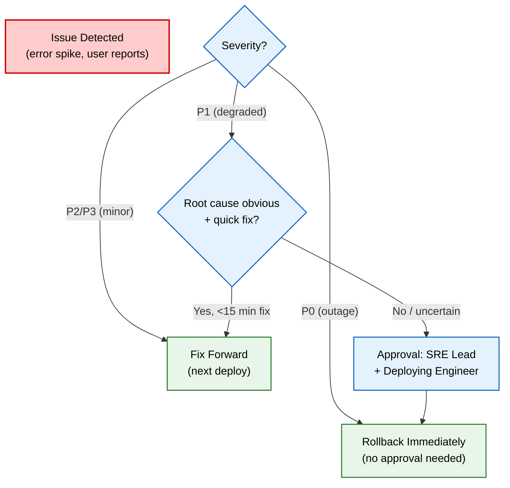

# Rollback Strategy

> **Purpose:** Define Vaeloom's comprehensive rollback strategy for all deployment types — applications, database migrations, AI artifacts, and configuration — with decision matrix and testing cadence
> **Status:** 🆕 New
> **Owner:** SRE Team
> **Version:** 1.0
> **Last Updated:** 2026-07-16
> **Dependencies**: [`../Engineering/Release-Process.md`](../Engineering/Release-Process.md), [`../DevOps/CI-CD.md`](../DevOps/CI-CD.md), [`../AI/AI-Versioning.md`](../AI/AI-Versioning.md), [`../Database/Migrations.md`](../Database/Migrations.md), [`../Enterprise/Feature-Flags.md`](../Enterprise/Feature-Flags.md)
> **Implementation Status:** 📋 Spec Only

## Overview

Every deployment must be reversible. This document defines rollback procedures for every type of change Vaeloom ships: application code (blue-green rollback), database schema (migration reversal), AI artifacts (prompt/model version rollback), and configuration (feature flag/env var/Terraform rollback). Rollback is not a fallback plan we hope to never use — it is a practiced, tested procedure with defined decision criteria, approval levels, and communication protocols.

## Goals

- Define rollback procedures for every deployment type
- Establish a decision matrix (when to roll back vs. fix forward)
- Define approval levels and time SLAs
- Establish rollback testing cadence (monthly drills)

## Scope

### In Scope

- Application rollback (blue-green, canary)
- Database rollback (migration reversal, data restoration)
- AI artifact rollback (prompt, model, agent config)
- Configuration rollback (feature flags, env vars, Terraform)
- Decision matrix and approval flow

### Out of Scope

- Deployment process (see [`../Engineering/Release-Process.md`](../Engineering/Release-Process.md))
- CI/CD pipeline (see [`../DevOps/CI-CD.md`](../DevOps/CI-CD.md))

## Rollback Decision Matrix



> **Diagram:** Rollback decision flow. P0 = immediate rollback (no approval). P1 = assess; if not a quick fix, get approval then roll back. P2/P3 = fix forward.

## Application Rollback (Blue-Green)

```text
Blue-green rollback procedure:
  1. Verify previous (blue) environment is healthy and unchanged.
  2. Switch load balancer to point to blue (previous) environment.
  3. Verify traffic switched (health checks pass on blue).
  4. Monitor for 15 minutes; confirm error rate returns to baseline.
  5. If stable: rollback complete. Investigate green (failed) environment.
  6. If not stable: escalate to incident response.

Time SLA: <5 minutes from decision to traffic switch.
```

## Canary Rollback

```text
Canary rollback procedure:
  1. Canary deployment serves X% of traffic.
  2. Automated canary analysis detects error-rate anomaly.
  3. Canary auto-aborts; traffic returns to stable (100%).
  4. If auto-abort fails: manual rollback via load balancer config.

Time SLA: <2 minutes (automated).
```

## Database Rollback

| Scenario | Procedure | Data Impact |
|----------|-----------|-------------|
| **Reversible migration** (drop column not yet used) | Run `down` migration | None (column was unused) |
| **Irreversible migration** (data transformation) | Restore from pre-deployment backup | RPO <1 hour (data since backup lost) |
| **Migration added column** | Run `down` migration (drops column) | Column data lost (acceptable if unused) |
| **Migration removed column** | Cannot reverse; restore from backup | RPO <1 hour |

```sql
-- Example reversible migration (with down)
-- Up: add column
ALTER TABLE documents ADD COLUMN processing_time_ms INTEGER;

-- Down: remove column (safe if unused)
ALTER TABLE documents DROP COLUMN processing_time_ms;
```

**Rule:** Every migration MUST have a `down` migration unless data transformation makes it impossible. Irreversible migrations require SRE Lead approval and a verified backup.

## AI Artifact Rollback

| Artifact | Rollback Procedure | Time SLA |
|----------|-------------------|----------|
| **Prompt version** | Revert deployment manifest to previous prompt version; redeploy | <10 min |
| **Model version** | Revert model router config to pinned previous model; no redeploy needed | <2 min |
| **Agent config** | Revert agent registry to previous version; redeploy AI service | <10 min |
| **Eval dataset** | N/A (datasets are additive; old versions retained) | N/A |

See [`../AI/AI-Versioning.md`](../AI/AI-Versioning.md) for deployment manifest and version pinning.

## Configuration Rollback

| Config Type | Rollback Procedure | Time SLA |
|-------------|-------------------|----------|
| **Feature flag** | Flip flag to previous value via admin API; instant propagation | <1 min |
| **Environment variable** | Revert in config management; rolling restart of affected pods | <5 min |
| **Terraform state** | `terraform apply` with previous config version | <15 min |
| **Kubernetes manifest** | `kubectl rollout undo deployment/<name>` | <3 min |

## Approval Levels

| Severity | Approval Required | Communication |
|----------|-------------------|---------------|
| P0 (outage) | None (SRE on-call decides) | Notify incident channel immediately |
| P1 (degraded) | SRE Lead + deploying engineer | Notify engineering channel |
| P2/P3 (minor) | Fix forward; no rollback | Standard PR process |

## Rollback Testing

| Drill | Cadence | Procedure |
|-------|---------|-----------|
| **Application rollback drill** | Monthly | Deploy to staging; trigger rollback; verify <5 min |
| **Database rollback drill** | Quarterly | Run migration + down migration in staging; verify data integrity |
| **AI artifact rollback** | Monthly | Deploy new prompt version; rollback; verify eval scores restored |
| **Full rollback simulation** | Quarterly | Simulate P0; practice end-to-end rollback + communication |

## Monitoring (Post-Rollback)

| Metric | Check | Action |
|--------|-------|--------|
| Error rate | Returns to baseline within 15 min | If not: escalate to incident |
| Latency | Returns to baseline within 15 min | If not: investigate |
| User reports | Stop incoming | If continue: rollback may have failed; escalate |

## Best Practices

| # | Practice | Rationale |
|---|----------|-----------|
| 1 | Every deploy must be reversible | If you can't roll back, you can't safely deploy |
| 2 | Practice rollbacks monthly | Untested rollback procedures fail when you need them |
| 3 | Prefer rollback over fix-forward for P0/P1 | Fixing forward under pressure introduces new bugs |
| 4 | Document every rollback in a post-mortem | Rollbacks reveal deployment process gaps |

## Risks

| Risk | Likelihood | Impact | Mitigation |
|------|-----------|--------|------------|
| Database rollback loses data | Low (RPO <1h) | Medium | Pre-deployment backup; irreversible migration approval |
| Rollback itself fails | Low | High | Monthly drills; tested procedures |
| Configuration drift prevents rollback | Medium | Medium | Terraform state management; config versioning |

## Future Improvements

| Improvement | Priority | Complexity | Timeline |
|-------------|----------|------------|----------|
| Automated rollback on canary failure (no human) | High | Medium | Q4 2026 |
| One-click rollback from admin dashboard | Medium | Low | Q1 2027 |
| Rollback simulation in CI (every deploy) | Medium | Medium | Q1 2027 |

## Related Documents

- [`../Engineering/Release-Process.md`](../Engineering/Release-Process.md) — release process (includes rollback section)
- [`../DevOps/CI-CD.md`](../DevOps/CI-CD.md) — CI/CD pipeline
- [`../AI/AI-Versioning.md`](../AI/AI-Versioning.md) — AI artifact versioning
- [`../Database/Migrations.md`](../Database/Migrations.md) — database migrations
- [`../Enterprise/Feature-Flags.md`](../Enterprise/Feature-Flags.md) — feature flag rollback
- [`./02-incident-response.md`](./02-incident-response.md) — incident response (P0 rollback)
