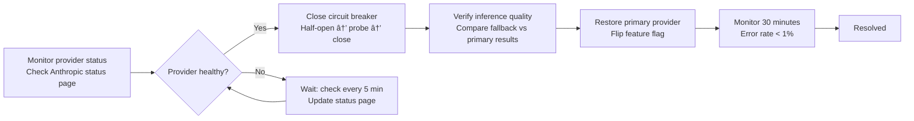

# AI Service Outage Runbook

> **Purpose:** Step-by-step runbook for detecting, mitigating, and recovering from AI service outages in Vaeloom
> **Status:** 🆕 New
> **Owner:** AI Team
> **Last Updated:** 2026-07-13

## Overview

The AI service is a critical Vaeloom component responsible for agent inference, document processing, and embedding generation. Outages can stem from the upstream AI provider (Anthropic, OpenAI), the inference infrastructure (Fly.io GPU instances), or the AI service itself. This runbook covers detection, fallback activation, circuit breaker operation, and graceful degradation.

**Detection threshold:** 5% error rate over 1 minute window
**Primary provider:** Anthropic Claude API
**Fallback provider:** OpenAI GPT-4o
**RTO:** 10 minutes (fallback activation), 2 hours (full recovery)

## Architecture

```mermaid
graph TD
    classDef upstream fill:#ffebee,stroke:#c62828,color:#000,stroke-width:2px
    classDef service fill:#e3f2fd,stroke:#1565c0,color:#000,stroke-width:2px
    classDef fallback fill:#e8f5e9,stroke:#2e7d32,color:#000,stroke-width:1.5px
    classDef circuit fill:#fff3e0,stroke:#e65100,color:#000,stroke-width:1.5px

    subgraph Upstream["Upstream Providers"]
        ANTHROPIC["Anthropic Claude API<br/>Primary provider"]
        OPENAI["OpenAI GPT-4o<br/>Fallback provider"]
    end

    subgraph AI["AI Service — Fly.io"]
        ROUTER["Model Router<br/>Smart request distribution"]
        CB1["Circuit Breaker: Anthropic<br/>5% error → half-open → open"]
        CB2["Circuit Breaker: OpenAI<br/>5% error → half-open → open"]
        AGENTS["Agent Executors<br/>Resume, Cover Letter, ATS..."]
        EMBED["Embedding Service<br/>Text → vector embeddings"]
        CACHE["Inference Cache<br/>Semantic cache (Redis)"]
    end

    subgraph Fallback["Fallback Flow"]
        F1["Model Router detects failure"]
        F2["Circuit breaker opens"]
        F3["Fallback provider activated"]
        F4["Degraded mode: cached results"]
    end

    ANTHROPIC --> ROUTER
    OPENAI --> ROUTER
    ROUTER --> CB1 & CB2
    CB1 --> ANTHROPIC
    CB2 --> OPENAI
    ROUTER --> AGENTS & EMBED
    AGENTS --> CACHE
    EMBED --> CACHE

    CB1 -.->|Open → fallback| F3
    CB2 -.->|Open → fallback| F3
    CACHE --> F4

    class ANTHROPIC,OPENAI upstream
    class ROUTER,CB1,CB2,AGENTS,EMBED,CACHE service
    class F1,F2,F3,F4 fallback
```



## Detection

### Alert Thresholds

| Metric | Threshold | Window | Severity | Action |
|--------|-----------|--------|----------|--------|
| Anthropic Error Rate | > 5% | 1 minute | Critical | Open circuit breaker → fallback to OpenAI |
| OpenAI Error Rate | > 5% | 1 minute | Critical | Open circuit breaker → degraded mode |
| Inference Latency p99 | > 10s | 5 minutes | Warning | Route to alternative provider |
| AI Service Health | Not 200 | Immediate | Critical | PagerDuty incident |
| Embedding Queue Depth | > 1000 | 5 minutes | Warning | Scale up workers |

### Detection Commands

```bash
# Check AI service health
curl -f https://ai.Vaeloom.dev/v1/health

# Check provider error rates
curl -s https://api.Vaeloom.dev/v1/admin/metrics \
  | jq '.metrics | .["ai.provider.anthropic.error_rate"], .["ai.provider.openai.error_rate"]'

# Check circuit breaker states
curl -s https://api.Vaeloom.dev/v1/admin/circuit-breakers \
  | jq '.circuit_breakers[] | {name, state}'

# Check inference queue depth
curl -s https://api.Vaeloom.dev/v1/admin/queues/inference \
  | jq '.depth'
```

## Mitigation Steps

### Step 1: Activate Fallback Model

```bash
# 1. Feature flag: switch primary provider to OpenAI
# Via admin dashboard or API:
curl -X POST https://api.Vaeloom.dev/v1/admin/feature-flags \
  -H "Authorization: Bearer $ADMIN_TOKEN" \
  -d '{"flag": "ai.provider.preferred", "value": "openai"}'

# 2. Verify fallback is active
curl -s https://api.Vaeloom.dev/v1/admin/circuit-breakers \
  | jq '.circuit_breakers[] | select(.name=="anthropic") | .state'
# Expected: "open"
```

### Step 2: Enable Graceful Degradation

```yaml
# Configuration: degraded mode settings
degrated_mode:
  enabled: true
  cache_only: false    # Use cache + fallback, not only cache
  max_retries: 2       # Reduce retries to limit fallback load
  timeout_ms: 15000    # Increase timeout for slower fallback
  rate_limit_multiplier: 0.5  # Reduce request rate to protect fallback
```

```typescript
// Circuit breaker configuration (in code)
const circuitBreakerConfig = {
  anthropic: {
    failureThreshold: 0.05,    // 5% error rate
    recoveryTimeoutMs: 30_000, // 30s before half-open
    halfOpenMaxRequests: 3,    // 3 probes before closing
    fallbackProvider: 'openai',
  },
  openai: {
    failureThreshold: 0.05,
    recoveryTimeoutMs: 60_000, // 60s before half-open
    halfOpenMaxRequests: 2,
    fallbackProvider: null,    // No further fallback → degraded
  },
};
```

### Step 3: Notify Stakeholders

```markdown
# Slack: #ai-service
:warning: AI Service Degraded
- Provider: Anthropic → OpenAI (fallback activated)
- Circuit breaker: OPEN (5% error rate threshold exceeded)
- Expected impact: Slightly higher latency, same capabilities
- ETA: Investigating root cause (incident AI-2026-0713-01)

# Status page update (if outage > 5 minutes)
Title: AI Service Degraded Performance
Status: Investigating → Identified → Monitoring → Resolved
Components: AI Agent Processing
```

## Recovery Steps



### Recovery Commands

```bash
# 1. Close circuit breaker (after provider confirmed healthy)
curl -X POST https://api.Vaeloom.dev/v1/admin/circuit-breakers/anthropic/reset

# 2. Switch back to primary provider
curl -X POST https://api.Vaeloom.dev/v1/admin/feature-flags \
  -H "Authorization: Bearer $ADMIN_TOKEN" \
  -d '{"flag": "ai.provider.preferred", "value": "anthropic"}'

# 3. Verify
curl -s https://ai.Vaeloom.dev/v1/health
```

## Best Practices

| Practice | Rationale |
|----------|----------|
| Always have a fallback provider configured | Single-provider dependency means any upstream outage is a full Vaeloom outage; two providers reduces blast radius |
| Use semantic caching for common queries | Resume optimization and cover letter generation often produce similar results — cache saves cost and reduces fallback load during partial outages |
| Test fallback activation monthly | Fallback that has never been tested will fail when needed — run monthly chaos experiments that simulate provider outages |
| Implement gradual fallback activation | Switching all traffic instantly may overwhelm fallback provider; ramp up over 2-3 minutes |

## Common Mistakes

| Mistake | Consequence | Fix |
|---------|-------------|-----|
| No fallback provider configured | Any upstream outage = complete AI service outage | Always maintain a warm fallback provider; test failover monthly |
| Circuit breaker reset too quickly | Provider still degraded → immediate re-failure → oscillation | Use half-open state with minimum recovery timeout (30s) and probe requests before closing |
| Fallback provider rate limit exceeded | All traffic shifted to fallback exceeds its rate limit → secondary failure | Reduce request rate via rate_limit_multiplier during fallback; pre-negotiate higher limits with fallback provider |
| Not distinguishing provider vs. infrastructure outage | Model router flaps between providers when both are healthy but Fly.io has a networking issue | Add infrastructure health checks separate from provider health checks |

## Security Considerations

| Concern | Mitigation |
|---------|-----------|
| Fallback provider data handling | Fallback provider (OpenAI) configured with zero data retention (same as primary); verified via contractual DPA |
| Circuit breaker manipulation | Circuit breaker reset endpoints require admin MFA token; audited in CloudTrail |
| Fallback poisoning | Fallback provider responses validated against schema (JSON structure, content safety checks) |
| Inference cache poisoning | Cache keys include user context; cache scoped per user/per workspace; eviction on any security event |
| Prompt injection during degraded mode | Input validation unchanged regardless of provider; all prompts pass through the same sanitization pipeline |

## Performance Considerations

| Concern | Mitigation |
|---------|-----------|
| Fallback provider latency | OpenAI fallback typically 200-500ms slower than Anthropic; timeout increased to 15s in degraded mode |
| Circuit breaker overhead | State checks add <1ms per request; state stored in Redis with 1s TTL |
| Semantic cache hit rate | Target 30% cache hit rate for agent results; cache warmed by prefixing common prompt patterns |
| Fallback provider concurrency | Fallback provider may have lower rate limits — concurrency throttled to 50% of normal during fallback |
| Cache rebuild on provider restore | Inference cache invalidated when switching providers (different response characteristics); cache warms naturally within 10 minutes |

## Workflows

1. **Detect outage:** Monitoring alert (5% error rate over 1 min) or user report → acknowledge within SLA
2. **Verify scope:** Check circuit breaker states → check provider status pages → determine if provider or infra issue
3. **Activate fallback:** Feature flag to switch provider → verify circuit breaker opens → confirm fallback responding
4. **Enable degraded mode:** Reduce request rate → increase timeouts → enable cache-only for non-critical paths
5. **Notify stakeholders:** Update Slack #ai-service → update status page → notify support team
6. **Monitor recovery:** Check provider status → observe error rate declining → prepare to close circuit breaker
7. **Restore primary:** Close circuit breaker → switch back to primary → verify quality → monitor 30 minutes
8. **Post-mortem:** Document timeline, root cause mitigation gaps → update runbook

---

## Scalability

| Dimension | Current Limit | 10x Strategy | 100x Strategy |
|-----------|--------------|--------------|---------------|
| AI model providers | 2 (Anthropic, OpenAI) | 3 (add Google Gemini) | 5+ providers with intelligent routing |
| Circuit breakers | 2 (per provider) | 6 (per model + per region) | 20+ (per model variant + region) |
| Inference cache | Redis (1 GB) | Redis Cluster (10 GB) | Distributed cache (100 GB, CDN edge) |
| Fallback ramp time | 2-3 min gradual | 30s instant with pre-warmed fallback | 5s: hot standby with live traffic mirroring |

---

## Error Handling

| Scenario | Detection | Mitigation | Recovery |
|----------|-----------|------------|----------|
| Both providers fail simultaneously | Circuit breakers both open | Full degraded mode: cache-only, no inference | Wait for provider recovery, use semantic cache |
| Fallback rate limited | 429 responses from fallback | Reduce request rate, increase queue depth | Pre-negotiate higher limits with providers |
| Circuit breaker oscillation | Repeated open/close cycles | Increase recovery timeout to 60s | Investigate root cause of intermittent failures |
| Cache poisoning during degraded mode | Incorrect cached responses | Flush inference cache on provider switch | Add cache invalidation on provider change |

---

## Monitoring

| Metric | Alert Threshold | Severity | Dashboard |
|--------|----------------|----------|-----------|
| Provider error rate | > 5% for 1 min | Critical | AI Service Health |
| Circuit breaker state | Open for > 5 min | Critical | Circuit Breaker Dashboard |
| Fallback latency p99 | > 15s | Warning | AI Provider Performance |
| Cache hit rate (degraded) | < 20% | Warning | Inference Cache |
| Fallback provider concurrency | > 80% of limit | Warning | Provider Utilization |

---

## Deployment

| Environment | Method | Trigger | Verification |
|-------------|--------|---------|--------------|
| Circuit breaker thresholds | Feature flag / config | Performance baseline change | Test with chaos engineering |
| New model provider | Config + DNS update | Multi-provider requirement | End-to-end inference test |
| Cache warm-up script | Cron job | After provider switch | Cache hit rate > 30% within 10 min |
| Degraded mode config | Feature flag toggle | Any provider circuit open | Verify graceful fallback response |

---

## Limitations

| Limitation | Impact | Workaround | Future Resolution |
|------------|--------|------------|-------------------|
| Both providers use similar transformer architecture | Same vulnerability may affect both | Semantic cache for common queries | Diversify to fundamentally different model architectures |
| Inference cache limited to Redis memory | Cache eviction under high load | Prioritize cache keys by frequency | Tiered cache (Redis + SSB + edge) |
| Fallback provider has different capabilities | Feature parity not guaranteed | Feature detection on provider switch | Cross-provider capability matrix with auto-routing |
| Circuit breaker reset requires manual verification | Slower recovery after provider restoration | Automated health probes before reset | Full auto-recovery with gradual traffic ramp |

---

## Goals

- Restore AI service functionality within 10 minutes of detection by activating the fallback provider (OpenAI GPT-4o) when the primary provider (Anthropic Claude) becomes unavailable
- Achieve full recovery within 2 hours by diagnosing the root cause and restoring primary provider operations
- Maintain graceful degradation during outages by leveraging semantic inference caching for common queries (resume optimization, cover letter generation) and reducing request rate to protect the fallback provider
- Ensure circuit breaker patterns prevent cascading failures — opening the provider circuit at 5% error rate over 1 minute with automatic half-open probing for recovery
- Test fallback activation monthly through chaos experiments that simulate provider outages, ensuring the failover path works when needed

## Scope

### In Scope

- Detection procedures for AI service outages: provider error rate thresholds (>5% over 1 minute), latency warnings (>10s p99 over 5 minutes), circuit breaker state monitoring, and embedding queue depth tracking
- Fallback activation steps: feature flag to switch primary provider, circuit breaker verification, degraded mode configuration, and stakeholder notification
- Recovery procedures: provider status monitoring, circuit breaker reset, primary provider restoration, and 30-minute verification period
- Circuit breaker configuration for both Anthropic (fallback to OpenAI) and OpenAI (fallback to degraded cache-only mode) with failure thresholds, recovery timeouts, and half-open probe settings
- Graceful degradation architecture: inference cache for common queries, reduced request rate multiplier (0.5x), increased timeouts, and per-provider rate limit management

### Out of Scope

- General incident response workflows and post-mortem processes (covered in Incident Response Plan)
- Infrastructure-level outages affecting Fly.io GPU instance availability (covered in Operations Runbook)
- Database or cache failures that may accompany or compound AI service degradation (covered in Cache Failure runbook)
- Vendor risk assessment and DPA review for AI model providers (covered in Vendor Risk Assessment)
- Multi-provider routing beyond the Anthropic → OpenAI → degraded fallback chain (third provider is a future improvement)

---

## Examples

### Fallback Activation (CLI)

```bash
# Switch primary provider to OpenAI
curl -X POST https://api.Vaeloom.dev/v1/admin/feature-flags \
  -H "Authorization: Bearer $ADMIN_TOKEN" \
  -d '{"flag": "ai.provider.preferred", "value": "openai"}'

# Verify circuit breaker state
curl -s https://api.Vaeloom.dev/v1/admin/circuit-breakers \
  | jq '.circuit_breakers[] | {name, state}'

# Check provider error rate
curl -s https://api.Vaeloom.dev/v1/admin/metrics \
  | jq '.metrics | .["ai.provider.anthropic.error_rate"]'
```

### Circuit Breaker Config (YAML)

```yaml
circuit_breakers:
  anthropic:
    failure_threshold: 0.05    # 5% error rate
    recovery_timeout_ms: 30000  # 30s half-open delay
    half_open_max_requests: 3
    fallback_provider: "openai"
  openai:
    failure_threshold: 0.05
    recovery_timeout_ms: 60000
    half_open_max_requests: 2
    fallback_provider: null  # degraded mode
```

## Future Improvements

| Improvement | Priority | Complexity | Timeline |
|-------------|----------|------------|----------|
| Third AI model provider integration | High | Medium | Q4 2026 |
| Hot standby with live traffic mirroring | High | High | Q2 2027 |
| Automated circuit breaker with canary recovery | Medium | Medium | Q1 2027 |
| Cross-provider feature parity capability matrix | Medium | Low | Q4 2026 |
| Edge-cached inference for common queries | Low | High | Q2 2027 |

## Related Documents

- [Vendor Risk Assessment.md](../Vendor-Risk-Assessment.md)
- [Monitoring & Alerting.md](../SRE.md)
- [Incident Response.md](../02-incident-response.md)
- [Business Continuity Plan.md](../Business-Continuity-Plan.md)
- [Architecture: AI Service.md](../../Architecture/System-Design.md)
