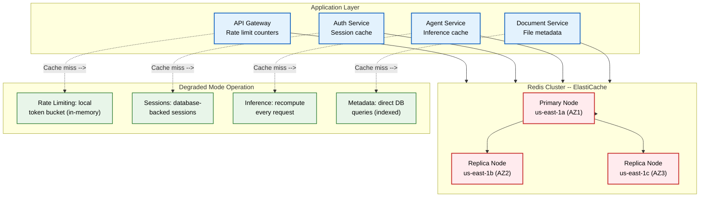
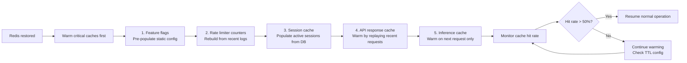

# Cache Failure Runbook

> **Purpose:** Step-by-step runbook for detecting Redis cluster failures and operating Vaeloom in degraded cache-miss mode
> **Status:** 🆕 New
> **Owner:** DevOps Team
> **Last Updated:** 2026-07-13

## Overview

Vaeloom uses Redis as a caching layer for API responses, session data, rate limiting counters, and AI inference results. A Redis cluster failure does NOT cause a service outage — all services are designed to operate in degraded mode without cache, falling back to database reads and direct computation.

This runbook covers failure detection, degraded mode operations, cache rebuild procedures, and warm-up strategies. The Redis cluster runs as an ElastiCache for Redis (AWS) with cluster mode enabled and replica nodes for high availability.

## Cache Architecture



## Redis Cache Usage

| Cache | Key Pattern | TTL | Cache Miss Impact | Data Size |
|-------|------------|-----|-------------------|-----------|
| Rate Limiter | `ratelimit:{user_id}:{resource}` | 1 min (sliding window) | Local token bucket fallback | ~500KB/sec |
| Session Data | `session:{session_id}` | 15 min | Database-backed sessions (slower) | ~2MB/sec |
| API Response | `api:{path}:{params_hash}` | 30 sec | DB query (still performant) | ~10MB/sec |
| Inference Cache | `inference:{prompt_hash}:{variant}` | 1 hour | Recompute inference (~2-10s) | ~50MB/sec |
| Document Metadata | `doc:{doc_id}` | 5 min | Direct DB query (indexed, <5ms) | ~5MB/sec |
| Feature Flags | `feature:{flag_name}` | 30 sec | Static config fallback | ~10KB/sec |

## Detection

### Alert Thresholds

| Check | Threshold | Severity | Action |
|-------|-----------|----------|--------|
| Redis cluster health | Primary node unreachable | Critical | Degraded mode activation |
| Cache miss rate | > 80% (baseline: 40%) | Warning | Investigate cache eviction or TTL issues |
| Redis memory usage | > 80% of `maxmemory` | Warning | Scale cluster or adjust eviction policy |
| Redis CPU usage | > 70% | Warning | Scale to larger instance type |
| Replica lag | > 5 seconds | Warning | Investigate network or replica health |

### Detection Commands

```bash
# Check Redis cluster health
redis-cli -h $REDIS_ENDPOINT -p 6379 CLUSTER INFO

# Check node roles and status
redis-cli -h $REDIS_ENDPOINT -p 6379 CLUSTER NODES

# Check memory usage
redis-cli -h $REDIS_ENDPOINT -p 6379 INFO memory \
  | grep -E "used_memory_human|maxmemory_human|maxmemory_policy"

# Check hit rate
redis-cli -h $REDIS_ENDPOINT -p 6379 INFO stats \
  | grep -E "keyspace_hits|keyspace_misses|keyspace_hit_ratio"
```

## Mitigation Steps

### Step 1: Verify Failure Scope

```bash
# 1. Check if Redis responds at all
redis-cli -h $REDIS_ENDPOINT -p 6379 PING
# Expected: "PONG" (if healthy) or connection error (if down)

# 2. Check cluster configuration
redis-cli -h $REDIS_ENDPOINT -p 6379 CONFIG GET cluster-enabled

# 3. Try replica endpoint (if configured)
redis-cli -h $REDIS_REPLICA_ENDPOINT -p 6379 PING

# 4. Check AWS ElastiCache status
aws elasticache describe-cache-clusters \
  --cache-cluster-id Vaeloom-redis \
  --region us-east-1 \
  --show-cache-node-info
```

### Step 2: Activate Degraded Mode

```typescript
// Automatic — all service clients implement a circuit breaker
const redisClient = new RedisClient({
  clusterNodes: REDIS_NODES,
  fallback: {
    rateLimiter: new LocalTokenBucket({ capacity: 100, refillRate: 10 }),
    sessionStore: new DatabaseSessionStore(),
    inferenceCache: new NullCache(), // Recompute every request
    metadataCache: new DatabaseQueryCache(),
  },
  healthCheck: {
    intervalMs: 5_000,
    failureThreshold: 3,
    recoveryThreshold: 2,
  },
});

// On 3 consecutive failures:
// 1. Redis client opens circuit breaker
// 2. All reads fall through to fallback providers
// 3. Health check starts pinging Redis every 5 seconds
// 4. On 2 successful pings → close circuit breaker
```

### Step 3: Continue Service (Degraded)

| Service | Behavior in Degraded Mode | Performance Impact |
|---------|--------------------------|-------------------|
| API Gateway | Rate limiting uses local token bucket per instance | Acceptable — slightly less accurate but still effective |
| Auth Service | Sessions stored in database with 15-min TTL | ~50ms additional latency per request |
| Agent Service | No inference caching — every request recomputed | Significant for identical prompts (2-10s vs <50ms) |
| Document Service | Metadata queried directly from PostgreSQL | Minimal (<5ms per query — indexed) |
| Feature Flags | Fall back to static config in environment variables | None |

## Cache Rebuild Procedure



### Warm-Up Commands

```bash
# 1. Verify Redis is accepting connections
redis-cli -h $REDIS_ENDPOINT -p 6379 PING

# 2. Pre-populate feature flags
redis-cli -h $REDIS_ENDPOINT -p 6379 MSET \
  feature:ai-provider anthropic \
  feature:new-dashboard false \
  feature:batch-processing true

# 3. Set TTL for feature flags
redis-cli -h $REDIS_ENDPOINT -p 6379 EXPIRE feature:ai-provider 3600

# 4. Verify memory and hit rate
redis-cli -h $REDIS_ENDPOINT -p 6379 INFO stats | grep -E "keyspace_hits|keyspace_misses"
redis-cli -h $REDIS_ENDPOINT -p 6379 INFO memory | grep "used_memory_human"
```

### Automatic Warm-Up

```typescript
// Warm-up script — run after Redis cluster recovery
async function warmCriticalCaches(redis: RedisClient): Promise<void> {
  // 1. Feature flags
  const flags = await configService.getAllFlags();
  await redis.mset(
    Object.entries(flags).map(([k, v]) => [`feature:${k}`, v])
  );

  // 2. Active sessions (last 5 minutes)
  const activeSessions = await db.query(
    `SELECT session_data FROM sessions WHERE updated_at > now() - interval '5 minutes'`
  );
  for (const session of activeSessions) {
    await redis.setex(`session:${session.id}`, 900, session.data);
  }

  // 3. No automatic warm for inference cache
  // Inference cache warms naturally on next request
  // (prevents overwhelming AI providers with bulk warm-up requests)
}
```

## Best Practices

| Practice | Rationale |
|----------|----------|
| Every cache consumer must have a fallback | Redis failure should never cause a service outage; each cache read should handle misses gracefully |
| Use local rate limiting as fallback | Rate limiting continues to work during Redis outage with slightly reduced accuracy (per-instance counters vs global) |
| Warm caches in priority order | Feature flags → sessions → API responses → inference cache ensures most critical paths recover first |
| Set appropriate TTLs on all cache keys | No expiration = stale data served indefinitely after Redis restores; inference cache TTL of 1 hour balances freshness vs cost |

## Common Mistakes

| Mistake | Consequence | Fix |
|---------|-------------|-----|
| Assuming Redis is always available | Cache miss throws exception → 500 errors instead of graceful degradation | All cache consumers must implement try/catch with database fallback |
| Bulk warming inference cache | Thousands of inference requests hit AI providers simultaneously → rate limit exceeded | Let inference cache warm naturally on user requests; priority by last-used timestamp |
| No eviction policy configured | Redis fills up and starts evicting keys aggressively → high miss rate | Configure `maxmemory-policy allkeys-lru` for most caches; `volatile-lru` for TTL-based caches |
| Same TTL for all cache types | Long TTL on rate limiter counters causes stale rate limit state; short TTL on inference cache defeats its purpose | Tailor TTL per cache type: 30s for API responses, 1 hour for inference results |

## Security Considerations

| Concern | Mitigation |
|---------|-----------|
| Cache data exposure | Redis cluster deployed in VPC with no public access; encryption in transit (TLS) and at rest (AES-256) |
| Cache poisoning | Cache keys include user/workspace context; cached data scoped to specific user; no shared across tenants |
| Session data in degraded mode | Sessions stored in PostgreSQL with same encryption-at-rest as Redis; access audited |
| Rate limit bypass during fallback | Local token bucket may be slightly less accurate but still enforces limits; enterprise tenants audited separately |
| Stale cache serving stale data | TTL enforcement on all keys; critical data (sessions, feature flags) has aggressive TTL to prevent staleness |

## Performance Considerations

| Concern | Mitigation |
|---------|-----------|
| Database load during cache outage | Each cache miss results in a database query — expect ~3x increase in DB read load; auto-scale read replicas if sustained |
| Local rate limiter accuracy | Per-instance counters drift from global state; acceptable for short outages (<15 min); accuracy restored when Redis reconnects |
| Inference recomputation cost | Uncached inference increases AI provider costs (2-5x per identical prompt); accept cost during outage; warm cache on restore |
| Cache warm-up load | Sequential warm-up with staggered TTLs prevents thundering herd on database and AI providers |
| Cold start after cluster rebuild | First 5 minutes post-rebuild have 0% hit rate; hit rate recovers to 50% within 10 minutes for high-traffic keys |

## Workflows

1. **Detect failure:** Alert: Redis unreachable, cache miss rate > 80%, or memory > 80%
2. **Verify scope:** Ping Redis cluster → check ElastiCache status → check replica endpoint → determine primary vs cluster failure
3. **Activate degraded mode:** Circuit breaker opens → all services fall through to database/fallback providers
4. **Continue service:** Rate limiting via local token bucket → sessions via database → inference via recompute
5. **Restore Redis:** Fix root cause (scale, restart, failover) → verify Redis accepts connections
6. **Warm caches:** Feature flags first → sessions → API responses → inference cache (natural warm-up)
7. **Monitor recovery:** Check cache hit rate > 50% → close circuit breaker → resume normal operation
8. **Post-mortem:** Update runbook, adjust monitoring thresholds, plan capacity

---

## Scalability

| Dimension | Current Limit | 10x Strategy | 100x Strategy |
|-----------|--------------|--------------|---------------|
| Redis cluster size | 1 primary + 2 replicas | 3 shards × 3 replicas (ElastiCache) | 10 shards × 3 replicas (cluster mode) |
| Cache types | 6 | 12: per-service cache namespaces | 30: auto-registered cache namespaces |
| Degraded mode capacity | 100% query load on DB | 50%: cached queries still served | 20%: local caches + CDN offload |
| Cache warm-up time | 10 minutes to 50% hit rate | 5 min: pre-warmed key lists | 1 min: real-time cache shadowing |

---

## Error Handling

| Scenario | Detection | Mitigation | Recovery |
|----------|-----------|------------|----------|
| Cache miss rate too high (> 80%) | Hit rate monitoring | Investigate eviction or TTL issues | Adjust maxmemory policy or scale cluster |
| Redis memory fragmentation | Memory usage > actual data | Run `MEMORY PURGE` | Upgrade to larger instance type |
| Cluster failover partial (some shards down) | Partial data availability | Route affected keys to database | Repair failed shard, rebalance cluster |
| Warm-up thundering herd | Cache rebuild spikes DB load | Sequential warm-up with staggered TTL | Pre-warm from backup, not live DB |

---

## Monitoring

| Metric | Alert Threshold | Severity | Dashboard |
|--------|----------------|----------|-----------|
| Redis cluster health | Primary node unreachable | Critical | Cache Health |
| Cache miss rate | > 80% (baseline 40%) | Warning | Cache Performance |
| Redis memory usage | > 80% of maxmemory | Warning | Cache Capacity |
| Replica lag | > 5 seconds | Warning | Replication Health |
| Eviction rate | > 1% of keys per hour | Warning | Cache Efficiency |

---

## Deployment

| Environment | Method | Trigger | Verification |
|-------------|--------|---------|--------------|
| Redis cluster resize | ElastiCache modify | Memory > 80% sustained | New cluster online, keys redistributed |
| Cache TTL adjustment | Config deploy | Eviction rate > 1% | Hit rate improves within 24h |
| Eviction policy change | ElastiCache modify | Memory pressure | Verify correct keys evicted |
| Warm-up priority list | Config file | After cluster rebuild | Warm-up runs in correct order |

---

## Limitations

| Limitation | Impact | Workaround | Future Resolution |
|------------|--------|------------|-------------------|
| Redis is single-region in MVP | No cache during region failover | Rebuild from database on failover | Cross-region Redis replication |
| Degraded mode increases DB load 3x | Database may become bottleneck | Pre-scale read replicas | Auto-scale replicas on cache failure |
| Inference cache miss = 2-10s recompute | Significant latency for identical prompts | Semantic cache for common queries | Multi-tier cache (L1 memory + L2 Redis) |
| No persistent cache for critical data | All cache lost on restart | Pre-warm critical keys | AOF persistence for critical namespaces |

---

## Goals

- Ensure zero service downtime during Redis cluster failures by routing all cache reads through graceful degraded-mode fallbacks — local rate limiters, database-backed sessions, recomputed inference, and direct database queries
- Restore full cache operation within 10 minutes of cluster recovery by warming critical caches in priority order: feature flags first, then sessions, API responses, and finally inference cache via natural warm-up
- Maintain acceptable performance during degraded mode: rate limiting via local token buckets, authentication via database sessions (with ~50ms additional latency), and document metadata via indexed PostgreSQL queries (<5ms)
- Protect against cache poisoning by scoping all cache keys to user/workspace context and enforcing TTLs on every cache type — 30 seconds for API responses, 15 minutes for sessions, 1 hour for inference results
- Prevent thundering herd on database and AI providers during cache rebuild by warming sequentially with staggered TTLs and avoiding bulk inference cache warm-up

## Scope

### In Scope

- Cache architecture for all six Redis cache types in Vaeloom: rate limiter counters, session data, API responses, inference cache, document metadata, and feature flags — with key patterns, TTLs, cache miss impacts, and data sizes
- Detection procedures: Redis cluster health checking, cache miss rate monitoring (>80% triggers warning), memory usage tracking (>80% triggers scale action), replica lag monitoring
- Degraded mode fallback implementations for every cache consumer: local token bucket for rate limiting, database-backed sessions, null cache for inference (recompute), and direct database queries for metadata
- Cache rebuild procedure with priority-ordered warm-up: feature flags → sessions → API responses → inference cache (natural warm-up only)
- Redis cluster management: health check commands, cluster info, node role verification, memory usage inspection, and hit rate monitoring
- Error handling: high cache miss rate, memory fragmentation, partial cluster failover, and warm-up thundering herd prevention

### Out of Scope

- Database failover procedures during combined cache + database outages (covered in DB Failover runbook)
- AI service fallback activation when cache failure coincides with provider outage (covered in AI Service Outage runbook)
- Infrastructure-level Redis cluster provisioning and scaling (covered in Capacity Planning and DevOps documentation)
- Multi-region Redis replication strategy (cross-region replication is a future improvement)
- L1 in-memory cache design for ultra-low-latency use cases (multi-tier cache is a future improvement)

---

## Examples

### Redis Health Check (CLI)

```bash
# Check Redis cluster status
redis-cli -h $REDIS_ENDPOINT PING
# Expected: PONG

# Check memory and hit rate
redis-cli -h $REDIS_ENDPOINT INFO stats | grep -E "keyspace_hits|keyspace_misses"
redis-cli -h $REDIS_ENDPOINT INFO memory | grep "used_memory_human"

# Check cluster nodes
redis-cli -h $REDIS_ENDPOINT CLUSTER NODES | grep -E "master|slave"
```

### Degraded Mode Configuration (YAML)

```yaml
degraded_mode:
  redis_unavailable:
    rate_limiter: "local_token_bucket (per instance)"
    sessions: "database_backed (15 min TTL)"
    inference_cache: "recompute every request"
    feature_flags: "static config fallback"
    health_check:
      interval_ms: 5000
      failure_threshold: 3
      recovery_threshold: 2
```

### Cache Warm-Up (CLI)

```bash
# After Redis restores, warm critical caches
redis-cli -h $REDIS_ENDPOINT MSET \
  feature:ai-provider anthropic \
  feature:new-dashboard false

redis-cli -h $REDIS_ENDPOINT EXPIRE feature:ai-provider 3600

# Verify warm-up
redis-cli -h $REDIS_ENDPOINT MGET feature:ai-provider feature:new-dashboard
```

## Future Improvements

| Improvement | Priority | Complexity | Timeline |
|-------------|----------|------------|----------|
| Multi-tier cache (L1 memory + L2 Redis) | High | Medium | Q1 2027 |
| Cross-region Redis replication | High | High | Q2 2027 |
| Automatic read replica scaling on cache miss spike | Medium | Medium | Q4 2026 |
| Real-time cache shadowing for instant warm-up | Low | High | Q3 2027 |

## Related Documents

- [DB Failover Runbook.md](./DB-Failover.md)
- [Business Continuity Plan.md](../Business-Continuity-Plan.md)
- [Monitoring & Alerting.md](../SRE.md)
- [Capacity Planning.md](../Capacity-Planning.md)
- [SRE Practices.md](../SRE.md)
