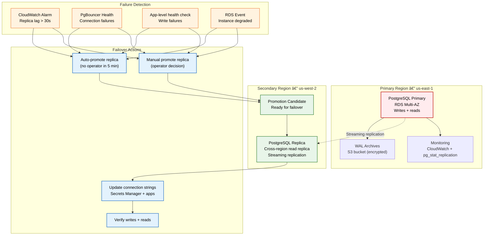

# DB Failover Runbook

> **Purpose:** Step-by-step runbook for detecting and executing PostgreSQL database failover in Vaeloom
> **Status:** 🆕 New
> **Owner:** DevOps Team
> **Last Updated:** 2026-07-13

## Overview

Vaeloom uses PostgreSQL with streaming replication for high availability. The primary database runs as a Multi-AZ RDS instance (AWS) with a read replica in the secondary region (us-west-2). This runbook covers automated failover detection, manual failover steps, and rollback procedures.

**RTO:** 5 minutes (automated), 15 minutes (manual)
**RPO:** <1 minute (streaming replication)
**Architecture:** PostgreSQL 16, Streaming Replication, WAL archiving to S3

## Failover Architecture



## Detection

### Automated Detection (CloudWatch + PgBouncer)

| Check | Metric | Threshold | Escalation |
|-------|--------|-----------|------------|
| Replica Lag | `ReplicaLag` | > 30 seconds | PagerDuty critical (5 min) |
| Connection Health | PgBouncer `CLIENT_CONNECTIONS` | < 50% of expected | PagerDuty warning |
| Write Failures | Application logs | > 5% error rate in 1 min | PagerDuty critical |
| RDS Event | `RDS-EVENT-0021` | Instance degraded | PagerDuty critical |

### Detection Commands

```bash
# Check replication status
psql -h $PRIMARY_HOST -d Vaeloom -c "SELECT * FROM pg_stat_replication;"

# Check replica lag (seconds)
psql -h $REPLICA_HOST -d Vaeloom -c "
  SELECT now() - pg_last_xact_replay_timestamp() AS replica_lag;
"

# Check WAL position
psql -h $PRIMARY_HOST -d Vaeloom -c "
  SELECT pg_current_wal_lsn(), pg_walfile_name(pg_current_wal_lsn());
"
psql -h $REPLICA_HOST -d Vaeloom -c "
  SELECT pg_last_wal_receive_lsn(), pg_last_wal_replay_lsn();
"

# Check PgBouncer pools
psql -h $PGBOUNCER_HOST -p 6432 pgbouncer -c "SHOW POOLS;"
```

## Manual Failover Procedure

### Step 1: Verify Primary Failure

```bash
# 1. Confirm primary is unreachable
pg_isready -h $PRIMARY_HOST -p 5432
# Expected: "no response" or connection refused

# 2. Check WAL streaming position on replica
WAL_LSN=$(psql -h $REPLICA_HOST -d Vaeloom -Atc \
  "SELECT pg_last_wal_replay_lsn();")
echo "Last replayed LSN: $WAL_LSN"

# 3. Verify no active connections to primary
psql -h $PRIMARY_HOST -d Vaeloom -c "SELECT count(*) FROM pg_stat_activity;" \
  || echo "Primary confirmed down"
```

### Step 2: Promote Replica to Primary

```bash
# 1. Promote the replica
# For RDS: Use AWS CLI to promote read replica
aws rds promote-read-replica \
  --db-instance-identifier Vaeloom-db-replica \
  --region us-west-2

# For self-managed: Run on replica server
# sudo -u postgres pg_ctl promote -D /var/lib/postgresql/data

# 2. Verify promotion
psql -h $REPLICA_HOST -d Vaeloom -c "SELECT pg_is_in_recovery();"
# Expected: "f" (false = not in recovery = primary)

# 3. Enable WAL archiving on new primary
psql -h $REPLICA_HOST -d Vaeloom -c "SELECT pg_walfile_name(pg_current_wal_lsn());"
```

### Step 3: Update Connection Configuration

```bash
# 1. Update Secrets Manager with new primary endpoint
aws secretsmanager put-secret-value \
  --secret-id Vaeloom/database/primary \
  --secret-string "{\"host\":\"$REPLICA_HOST\",\"port\":5432}" \
  --region us-east-1

# 2. Update application connection pools (zero-downtime)
# PgBouncer configuration reload
psql -h $PGBOUNCER_HOST -p 6432 pgbouncer -c "RELOAD;"

# 3. Verify applications are connecting to new primary
tail -n 100 /var/log/application/app.log | grep "db_connected"
```

### Step 4: Verify Reads and Writes

```bash
# 1. Write test
psql -h $REPLICA_HOST -d Vaeloom -c "
  INSERT INTO _system.health_check (checked_at) VALUES (now());
"

# 2. Read test
psql -h $REPLICA_HOST -d Vaeloom -c \
  "SELECT * FROM _system.health_check ORDER BY checked_at DESC LIMIT 1;"

# 3. Application health endpoint
curl -f https://api.Vaeloom.dev/v1/health

# 4. Verify replication to any remaining replicas
psql -h $REPLICA_HOST -d Vaeloom -c "SELECT * FROM pg_stat_replication;"
```

## Automated Failover

```bash
# Automated failover is triggered by PagerDuty + Lambda
# The lambda function:
# 1. Confirms primary is down (3 consecutive health check failures)
# 2. Checks replica lag (<30s required for auto-failover)
# 3. Promotes replica to primary via RDS API
# 4. Updates Route53 health check alias
# 5. Pushes new connection string to Secrets Manager
# 6. Sends completion notification to #incident-response

# Manual override: Set SSM parameter to block auto-failover
aws ssm put-parameter \
  --name /Vaeloom/database/auto-failover-blocked \
  --value "true" \
  --type String \
  --overwrite
```

## Rollback Procedure (Failback)

If the original primary recovers and needs to be reinstated:

```bash
# 1. Set up old primary as replica of new primary
# For RDS: Create new read replica from new primary
aws rds create-db-instance-read-replica \
  --db-instance-identifier Vaeloom-db-replica-v2 \
  --source-db-instance-identifier Vaeloom-db-primary-promoted \
  --region us-west-2

# 2. Wait for replication to catch up
# Check lag in CloudWatch

# 3. When ready, fail back during maintenance window:
#   a. Stop application writes
#   b. Promote replica-v2 to primary
#   c. Update connection strings
#   d. Verify reads/writes
#   e. Resume traffic
```

## Best Practices

| Practice | Rationale |
|----------|----------|
| Test failover quarterly | Failover procedures that are never tested will fail when needed; schedule quarterly drills |
| Monitor replica lag with alert threshold at 30s | Lag beyond 30s increases RPO risk; early alert gives time to investigate before failover is needed |
| Keep connection strings in Secrets Manager | Hardcoded connection strings require redeployment to change; Secrets Manager updates propagate in seconds |
| Document the rollback procedure | Failover may need to be reversed (e.g., primary was not actually down, only network partition) |

## Common Mistakes

| Mistake | Consequence | Fix |
|---------|-------------|-----|
| Promoting replica without checking lag | Data loss if replica is behind primary; RPO violated | Always check `pg_last_wal_replay_lsn()` before promotion; abort if lag > threshold |
| Forgetting to update read replica connections | After failover, read replicas still point to old primary | Update all connection strings in Secrets Manager; use a single endpoint alias for reads |
| Not testing the rollback procedure | Once failed over, the team cannot return to the original region without rediscovering the process | Practice rollback in staging quarterly; document every step |
| Application connection pools not draining | Old connections to failed primary cause application errors until timeout | Use PgBouncer with short `server_idle_timeout` (60s); implement connection health checks |

## Security Considerations

| Concern | Mitigation |
|---------|-----------|
| Unauthorized failover | Failover requires MFA-authenticated access to AWS console or signed CLI commands; automated failover requires 3 consecutive health check failures |
| Connection string leakage | Secrets Manager access audited via CloudTrail; read access restricted to application service accounts |
| Data integrity during replication | WAL archiving to S3 with SSE-S3 encryption; replication uses TLS with client certificates |
| Split-brain scenario | PostgreSQL streaming replication uses single-writer architecture; manual intervention required if both instances accept writes |
| Failover audit trail | Every manual and automated failover logged to RDS event stream + CloudTrail + Slack notification |

## Performance Considerations

| Concern | Mitigation |
|---------|-----------|
| Replica promotion time | RDS replica promotion takes 1-5 minutes depending on database size; WAL replay completes during promotion |
| WAL archive retrieval | Point-in-time recovery from S3 WAL archives targets <1 hour for full restore |
| Connection pool rebuild | PgBouncer connections drained and re-established in <30s; applications experience brief connection blips |
| Read replica re-creation | New read replica in original region takes 1-8 hours to provision and sync; schedule during low traffic |
| DNS propagation for new endpoint | Use Route53 alias with 60s TTL; update endpoint in Secrets Manager, not DNS (applications resolve at connection time) |

## Workflows

1. **Detect failure:** CloudWatch alarm (replica lag > 30s, connection failures, write failures, RDS instance degraded)
2. **Verify primary status:** Confirm primary unreachable via `pg_isready` → check last WAL position on replica
3. **Decide failover:** Automated (3 consecutive health check failures, no response in 5 min) or manual (IC decision)
4. **Promote replica:** `aws rds promote-read-replica` → verify `pg_is_in_recovery` returns false
5. **Update connection strings:** Secrets Manager → PgBouncer reload → verify apps connecting to new primary
6. **Verify reads + writes:** Insert health check row → read it back → check app health endpoint
7. **Create new replica:** Provision new read replica in secondary region for future failover
8. **Post-mortem:** Document timeline, data loss (if any), action items to prevent recurrence

---

## Scalability

| Dimension | Current Limit | 10x Strategy | 100x Strategy |
|-----------|--------------|--------------|---------------|
| Database size | 10 GB | 100 GB: read replicas + partitioning | 1 TB: sharding + Citus distributed PG |
| Read replicas | 1 cross-region | 3 replicas (2 read-only + 1 DR) | 10 replicas: per-service read replicas |
| Failover RTO | 5 min automated | 2 min: automated with connection draining | 30s: active-active with conflict resolution |
| WAL archive retention | 30 days | 90 days: longer PITR window | 1 year: compliance requirements |

---

## Error Handling

| Scenario | Detection | Mitigation | Recovery |
|----------|-----------|------------|----------|
| Replica lag > 30s at failover time | Lag check before promotion | Abort auto-failover, wait for catch-up | Manual failover with documented RPO risk |
| Promote command fails | AWS CLI error | Retry with different replica or manual pg_ctl | Escalate to AWS support if persistent |
| Connection pool doesn't drain | Old connections still pointing to failed primary | Force close connections, restart services | Reduce `server_idle_timeout` in PgBouncer |
| Split-brain (both primary and replica accept writes) | Duplicate data detected | Manual reconciliation of last common WAL | Implement fencing (STONITH) mechanism |

---

## Monitoring

| Metric | Alert Threshold | Severity | Dashboard |
|--------|----------------|----------|-----------|
| Replica lag | > 30 seconds | Critical | Database Replication |
| Connection failures | > 5% error rate | Critical | Database Health |
| WAL archive age | > 1 hour since last archive | Warning | Backup Health |
| Read replica lag (secondary) | > 5 seconds | Warning | Replication Performance |
| Connection pool utilization | > 80% | Warning | Database Connections |

---

## Deployment

| Environment | Method | Trigger | Verification |
|-------------|--------|---------|--------------|
| Cross-region replica | RDS create-read-replica | New primary promoted | Replication lag < 1s |
| Connection string update | Secrets Manager update | After failover | Apps reconnect within 30s |
| WAL archiving config | RDS parameter group | New database provisioned | WAL files appearing in S3 |
| Failover test | Quarterly drill | Scheduled exercise | Complete failover < 5 min |

---

## Limitations

| Limitation | Impact | Workaround | Future Resolution |
|------------|--------|------------|-------------------|
| Single-region failover only | Can't survive full region outage | Cross-region replica for DR | Multi-region active-active PostgreSQL |
| Manual rollback procedure | Failback requires engineer intervention | Documented failback steps | Automated failback with verification |
| RPO increases with replica lag | Up to 1 min data loss possible | Monitor lag aggressively | Synchronous replication for zero RPO |
| No automated RDS failover testing | May fail when needed | Quarterly manual failover drill | Automated failover testing with Chaos Mesh |

---

## Goals

- Achieve automated database failover within 5 minutes (RTO) when the primary PostgreSQL instance becomes unavailable, with less than 1 minute of data loss (RPO) through streaming replication
- Provide clear manual failover procedures with verification steps at each stage — primary failure confirmation, replica promotion, connection string update, and read/write verification — for scenarios where automated failover does not trigger
- Maintain cross-region disaster recovery capability by keeping a warm read replica in us-west-2 with continuous WAL streaming from the primary in us-east-1
- Ensure rollback procedures are documented and tested quarterly so the team can safely reinstate the original primary if the failover was triggered by a network partition rather than an actual primary failure
- Prevent split-brain scenarios by enforcing single-writer PostgreSQL architecture and monitoring replication lag at 30-second alert thresholds

## Scope

### In Scope
- Automated detection of primary database failure through CloudWatch alarms (replica lag > 30s), PgBouncer connection health checks, application-level write failure monitoring, and RDS instance degradation events
- Automated failover procedure triggered by three consecutive health check failures: Lambda promotes read replica, updates Route53 health check alias, pushes new connection string to Secrets Manager
- Manual failover procedure with step-by-step commands: verify primary failure via pg_isready, check WAL position on replica, promote via AWS CLI, update connection strings, verify reads and writes
- Rollback (failback) procedure for reinstating the original primary as a replica of the new primary after failover
- Replication monitoring commands for checking lag, WAL position, PgBouncer pool status, and connection health
- Error handling: replica lag exceeding 30s at failover time, promote command failure, connection pool drain issues, and split-brain detection

### Out of Scope
- Application-level connection pooling configuration beyond PgBouncer reload procedures (covered in Operations Runbook)
- General incident response workflows and post-mortem processes (covered in Incident Response Plan)
- Business continuity planning for multi-region and multi-cloud database strategies (covered in Business Continuity Plan)
- Database schema migration procedures and version management (covered in Operations Runbook)
- Active-active multi-region PostgreSQL configuration (future improvement)

---
## Examples

### Replication Status Check (CLI)

```bash
# Check replication status on primary
psql -h $PRIMARY_HOST -d Vaeloom -c "SELECT * FROM pg_stat_replication;"

# Check replica lag
psql -h $REPLICA_HOST -d Vaeloom -c \
  "SELECT now() - pg_last_xact_replay_timestamp() AS replica_lag;"

# Check WAL position
psql -h $PRIMARY_HOST -d Vaeloom -c \
  "SELECT pg_current_wal_lsn(), pg_walfile_name(pg_current_wal_lsn());"
```

### Manual Promotion (CLI)

```bash
# Promote cross-region read replica to primary
aws rds promote-read-replica \
  --db-instance-identifier Vaeloom-db-replica \
  --region us-west-2

# Verify promotion succeeded
psql -h $REPLICA_HOST -d Vaeloom -c "SELECT pg_is_in_recovery();"
# Expected: "f" (false = not in recovery = primary)

# Update connection string in Secrets Manager
aws secretsmanager put-secret-value \
  --secret-id Vaeloom/database/primary \
  --secret-string "{\"host\":\"$NEW_PRIMARY_HOST\",\"port\":5432}" \
  --region us-east-1
```

### Failover Config (YAML)

```yaml
failover:
  primary_region: "us-east-1"
  secondary_region: "us-west-2"
  architecture: "active-passive with streaming replica"
  auto_failover:
    enabled: true
    health_check_consecutive_failures: 3
    no_response_timeout_seconds: 300
    max_replica_lag_seconds: 30
  rto_target_minutes: 5
  rpo_target_minutes: 1
```

## Future Improvements

| Improvement | Priority | Complexity | Timeline |
|-------------|----------|------------|----------|
| Multi-region active-active PostgreSQL | High | High | Q3 2027 |
| Automated failback with verification | High | Medium | Q2 2027 |
| Zero-RPO synchronous replication | Medium | High | Q2 2027 |
| Automated failover testing (Chaos Mesh) | Medium | Medium | Q1 2027 |
| Point-in-time recovery from WAL archives in < 1 hour | Low | Medium | Q4 2026 |

## Related Documents

- [Business Continuity Plan.md](../Business-Continuity-Plan.md)
- [Backup and Restore Policy.md](../Maintenance.md)
- [SRE Practices.md](../SRE.md)
- [Monitoring & Alerting.md](../SRE.md)
- [Infrastructure Terraform.md](../../DevOps/Terraform.md)
