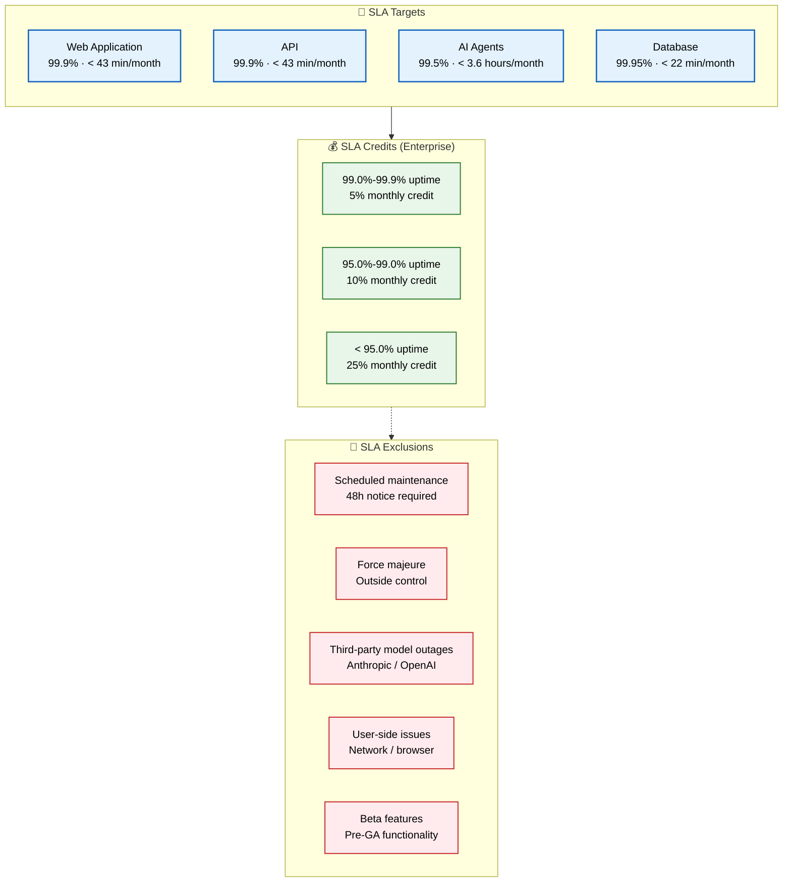

# Service Level Agreement (SLA)

> **Purpose:** Define the Service Level Agreement for Meridian
> **Status:** 🆕 New

## SLA Architecture



> **Diagram:** SLA architecture—**4 service targets** (web 99.9%, API 99.9%, AI agents 99.5%, database 99.95%) → **3 credit tiers** (5%/10%/25% monthly credit for missed targets) → **5 exclusions** (maintenance, force majeure, model outages, user issues, beta features).

---

## SLA Targets

| Service | Availability | Uptime/Month | Exclusions |
|---------|-------------|--------------|------------|
| Web application | 99.9% | < 43 min downtime | Scheduled maintenance |
| API | 99.9% | < 43 min downtime | Scheduled maintenance |
| AI agents | 99.5% | < 3.6 hours downtime | Model provider outages |
| Database | 99.95% | < 22 min downtime | Cloud provider outage |

## SLA Credits (Enterprise)

| Uptime | Credit |
|--------|--------|
| 99.0% - 99.9% | 5% monthly credit |
| 95.0% - 99.0% | 10% monthly credit |
| < 95.0% | 25% monthly credit |

## SLA Exclusions

| Exclusion | Rationale |
|-----------|-----------|
| Scheduled maintenance | Notified 48 hours in advance |
| Force majeure | Outside reasonable control |
| Third-party model outages | Anthropic, OpenAI API issues |
| User-side issues | Network, browser, misconfiguration |
| Beta features | Pre-GA functionality |

## Common Mistakes

| Mistake | Consequence |
|---------|-------------|
| Setting SLA targets without the data to measure them | Promising 99.9% API availability without health check monitoring means you can't prove you met it — define SLIs first, agree on SLOs second, and only then set SLAs |
| Over-crediting for service degradations that are minor | A 0.1% availability dip for 2 minutes that doesn't affect most users shouldn't trigger a 25% credit — define minimum measurement windows (e.g., 5 consecutive minutes below target) before credits apply |
| SLAs that don't align with actual customer expectations | Promising 99.9% AI agent availability when the underlying model provider has 99.5% SLA means you're on the hook for failures you can't control — pass through third-party SLAs transparently |

## Best Practices

| Practice | Why |
|----------|-----|
| Define SLIs first, then SLOs, then SLAs | You can't set an SLA target without knowing what you can measure — define technical indicators (latency, availability), set internal objectives against them, and only then commit to customer-facing agreements |
| Exclude third-party dependencies from the SLA with clear language | AI model provider outages, auth provider downtime, and cloud provider failures are outside your control — explicitly exclude them with a link to the provider's own SLA |
| Use a minimum measurement window for credit calculations | A 30-second blip shouldn't trigger a full month's credit — require a minimum consecutive downtime (e.g., 5 minutes) before availability is considered "down" for SLA calculation purposes |

## Security

| Concern | Mitigation |
|---------|------------|
| SLA credit claims creating security audit burden | Processing a 25% credit claim for 50 enterprise customers requires verifying uptime data — ensure SLA monitoring data is immutable and auditable to handle disputes without manual effort |
| SLA exclusions being used to hide security incidents | An attacker who gains access but doesn't cause downtime may not trigger SLA monitoring — security breaches should be reported and credited independently of uptime-based SLAs |
| SLA data revealing which customers are most profitable | Detailed SLA compliance data per customer reveals usage patterns and revenue — aggregate SLA reporting at the tier level (Pro, Enterprise) rather than per-customer |

## Performance

| Concern | Mitigation |
|---------|------------|
| SLA monitoring itself creating performance overhead | Every health check and latency probe adds load — external monitoring probes from different regions generate 10-50 req/min per probe. Keep probes lightweight (head requests, simple health endpoints) and limit frequency |
| SLA compliance calculations that are too complex to compute | An SLA with multiple service tiers, exclusions, measurement windows, and credit formulas becomes too complex to calculate automatically — simplify to a single metric per service with clear exclusion rules |
| SLA reporting latency delaying credit processing | If SLA data is aggregated weekly, a month-ending outage may not be reflected in time for credit processing — use real-time SLO dashboards that feed into automated SLA compliance reports |

## Security Considerations

| Concern | Mitigation |
|---------|------------|
| SLA credit claims creating security audit burden | Processing a 25% credit claim for 50 enterprise customers requires verifying uptime data — ensure SLA monitoring data is immutable and auditable to handle disputes without manual effort |
| SLA exclusions being used to hide security incidents | An attacker who gains access but doesn't cause downtime may not trigger SLA monitoring — security breaches should be reported and credited independently of uptime-based SLAs |
| SLA data revealing which customers are most profitable | Detailed SLA compliance data per customer reveals usage patterns and revenue — aggregate SLA reporting at the tier level (Pro, Enterprise) rather than per-customer |

## Performance Considerations

| Concern | Approach |
|---------|----------|
| SLA monitoring itself creating performance overhead | Every health check and latency probe adds load — external monitoring probes from different regions generate 10-50 req/min per probe. Keep probes lightweight (head requests, simple health endpoints) and limit frequency |
| SLA compliance calculations that are too complex to compute | An SLA with multiple service tiers, exclusions, measurement windows, and credit formulas becomes too complex to calculate automatically — simplify to a single metric per service with clear exclusion rules |
| SLA reporting latency delaying credit processing | If SLA data is aggregated weekly, a month-ending outage may not be reflected in time for credit processing — use real-time SLO dashboards that feed into automated SLA compliance reports |

## Workflows

1. **Define SLA target:** Set availability percentage per service based on business requirements and technical feasibility
2. **Measure against SLIs:** Collect SLI data (availability, latency, accuracy) and compare against SLA targets
3. **Monthly SLA compliance review:** Calculate uptime percentage → check against SLA tiers → process credits if applicable
4. **SLA exception handling:** Document exclusion (maintenance, provider outage, force majeure) → communicate to customer
5. **SLA breach response:** Notify affected customers → calculate credit → post-mortem → action items to prevent recurrence
6. **Annual SLA review:** Re-evaluate targets → adjust based on system maturity → update contracts

---

## Scalability

| Dimension | Current Limit | 10x Strategy | 100x Strategy |
|-----------|--------------|--------------|---------------|
| Customer tiers | 2 (Pro, Enterprise) | 5 tiers: per-customer SLA | Custom SLA per enterprise contract |
| Services covered | 4 | 10 services: per-service SLAs | 30 services: composite SLA calculation |
| SLA monitoring | Manual monthly | Automated daily SLA dashboard | Real-time SLA compliance streaming |
| Credit processing | Manual | Automated per breach | Integrated billing adjustment |

---

## Error Handling

| Scenario | Detection | Mitigation | Recovery |
|----------|-----------|------------|----------|
| SLA target missed but within exclusion | Exclusions list match | Document exclusion in compliance report | Communicate exclusion to customer |
| SLA monitoring tool unavailable | No data for compliance calc | Use secondary monitoring data | Fix primary monitoring, backfill data |
| Customer dispute on SLA credit | Manual verification needed | Audit raw monitoring data | Automate SLA verification with immutability |
| SLA credit calculation error | Manual audit catches discrepancy | Re-calculate and issue corrected credit | Automate credit calculation |

---

## Monitoring

| Metric | Alert Threshold | Severity | Dashboard |
|--------|----------------|----------|-----------|
| Current month SLA compliance | Below target by > 0.1% | Warning | SLO/SLA Dashboard |
| SLA credit exposure | > 5% of monthly revenue | Critical | Business Risk |
| SLA exclusion usage rate | > 10% of incidents | Info | SLA Exclusions |
| Customer SLA inquiry rate | > 5 per month | Warning | Customer Support |

---

## Deployment

| Environment | Method | Trigger | Verification |
|-------------|--------|---------|--------------|
| SLA target update | Legal/Product change | Annual review | Compliance dashboard updated |
| SLA monitoring config | Terraform / config | New service added | New SLI appears in dashboard |
| Credit automation script | CI/CD deploy | After SLA breach workflow | Test credit calculation with mock data |
| Exclusion rule update | Config file change | New exclusion type identified | Verify exclusion applied correctly |

---

## Limitations

| Limitation | Impact | Workaround | Future Resolution |
|------------|--------|------------|-------------------|
| SLA relies on third-party provider uptime | Cannot guarantee what we don't control | Pass-through SLAs with provider terms | Multi-provider redundancy |
| 99.9% SLA allows 43 min downtime/month | One major outage exhausts budget | Error budget policy separates SLA from internal SLOs | Higher SLA targets as system matures |
| SLA credits are retrospective | Customer already impacted | Proactive outage communication | Real-time SLA status per customer |
| SLA does not cover response time for AI features | User experience impacted by slow agents | Internal SLO of < 10s p99 SLA | Add latency SLA for enterprise tier |

---

## Overview

The Service Level Agreement (SLA) defines the contractual uptime commitments Meridian makes to its customers across four service categories: web application, API, AI agents, and database. It establishes availability targets, credit schedules for missed targets, and clear exclusions that protect Meridian from liability for factors outside its control.

This document is intended for the product team, legal counsel, and enterprise sales engineers who negotiate customer contracts, as well as the operations team that monitors compliance. It ensures that every SLA commitment is measurable, achievable, and backed by the monitoring infrastructure defined in the SLO and SLI documents.

For a second-brain AI platform, SLA design requires careful consideration of the AI agent tier. While web and API services can realistically target 99.9% availability, the AI agent tier depends on third-party model providers (Anthropic, OpenAI) whose own SLAs (typically 99.5%) set a ceiling on what Meridian can independently guarantee. Transparently communicating this dependency in the SLA protects Meridian while setting appropriate customer expectations.

The SLA is the outermost layer of Meridian's reliability framework — it sits above internal SLOs (stretch targets the team works toward) and SLIs (the raw measurements). An SLA should never be tighter than the corresponding SLO, which in turn should never be tighter than what the SLI data shows is achievable.

## Goals

- Define measurable availability targets for four Meridian service tiers: web application (99.9%), API (99.9%), AI agents (99.5%), and database (99.95%) with corresponding monthly downtime budgets
- Establish a graduated SLA credit structure for enterprise customers: 5% credit between 99.0-99.9%, 10% between 95.0-99.0%, and 25% below 95.0% uptime
- Document clear SLA exclusions — scheduled maintenance, force majeure, third-party model outages, user-side issues, and beta features — to protect Meridian from liability for uncontrollable factors
- Provide workflows for SLA monitoring, compliance review, exception handling, breach response, and annual target review
- Ensure SLA targets are backed by measurable SLIs and achievable SLOs, preventing commitments that the operations team cannot verify or meet

## Scope

### In Scope
- SLA targets for all four Meridian service categories with availability percentages, monthly downtime budgets, and applicable exclusions per service
- SLA credit schedule for enterprise customers with three tiers of compensation based on measured uptime ranges
- SLA exclusion definitions: scheduled maintenance (48-hour notice), force majeure, third-party model provider outages, user-side issues, and beta features
- Workflows for monthly SLA compliance review, exception documentation, breach response, credit processing, and annual target renegotiation
- SLA monitoring metrics and alert thresholds for current month compliance, credit exposure, exclusion usage rate, and customer inquiry rate

### Out of Scope
- Internal service level objectives and error budget policies (covered in SLO and SRE documents)
- Service level indicators and measurement methodology (covered in SLI document)
- Customer contract terms beyond SLA credits (covered in legal agreements)
- Incident response procedures for SLA breach events (covered in Incident Response Plan)
- Per-customer SLA customization for enterprise contracts (handled individually through contract negotiation)

---

## Examples

### SLA Compliance Check (CLI)

```bash
# Check current month SLA compliance
curl -s https://api.meridian.dev/v1/admin/sla/compliance \
  -H "Authorization: Bearer $ADMIN_TOKEN" | jq '.services[] | {service, availability, target, compliant}'
```

### SLA Uptime Calculation (JSON)

```json
{
  "sla_summary": {
    "period": "2026-07",
    "services": {
      "api":         { "target": 99.9, "actual": 99.95, "downtime_min": 22, "budget_min": 43 },
      "ai_agents":   { "target": 99.5, "actual": 99.72, "downtime_min": 121, "budget_min": 216 },
      "database":    { "target": 99.95, "actual": 99.98, "downtime_min": 9, "budget_min": 22 }
    },
    "credits_due": []
  }
}
```

### SLA Monitoring Configuration (YAML)

```yaml
sla_monitoring:
  api_gateway:
    probe_interval_seconds: 30
    probe_endpoint: "GET /health"
    measurement_window_days: 30
    minimum_downtime_minutes: 5
  ai_agents:
    probe_interval_seconds: 60
    probe_endpoint: "GET /v1/health"
    measurement_window_days: 30
    minimum_downtime_minutes: 5
```

## Future Improvements

| Improvement | Priority | Complexity | Timeline |
|-------------|----------|------------|----------|
| Real-time SLA compliance per customer portal | High | Medium | Q1 2027 |
| Automated credit processing on SLA breach | High | Low | Q4 2026 |
| Per-feature SLA tracking (AI, ingestion, API) | Medium | Medium | Q4 2026 |
| SLA negotiation automation for enterprise deals | Medium | High | Q2 2027 |
| AI agent availability SLA with model provider redundancy | Low | Medium | Q1 2027 |

## Related Documents

- [SLO.md](./SLO.md)
- [SLI.md](./SLI.md)
- [`DevOps/Monitoring.md`](../DevOps/Monitoring.md)
