# Service Level Indicators (SLI)

> **Purpose:** Define Service Level Indicators for Vaeloom
> **Status:** 🆕 New

## SLI Architecture

```mermaid
graph TD
    classDef indic fill:#e3f2fd,stroke:#1565c0,color:#000,stroke-width:2px
    classDef measure fill:#e8f5e9,stroke:#2e7d32,color:#000,stroke-width:1.5px
    classDef report fill:#fff3e0,stroke:#e65100,color:#000,stroke-width:1.5px

    subgraph Indicators["📊 SLI Indicators"]
        direction TB
        I1["API Availability<br/>Good: HTTP 200 / Total checks"]
        I2["API Latency<br/>Good: < 500ms / Total requests"]
        I3["AI Latency<br/>Good: < 10s / Total executions"]
        I4["Agent Accuracy<br/>Good: Approved / Total proposals"]
        I5["Ingestion Speed<br/>Good: < 30s p95 / Total docs"]
        I6["DB Availability<br/>Good: Success / Total attempts"]
    end

    subgraph Measurement["📏 Measurement"]
        M1["api_latency_good counter<br/>api_latency_total counter<hr/>if (duration < 500) increment good<br/>increment total always"]
    end

    subgraph Reporting["📋 SLI Reporting"]
        R1["API Availability: Real-time · Dashboard + Grafana"]
        R2["API Latency: Real-time · Dashboard + Grafana"]
        R3["AI Latency: Real-time · Dashboard + Grafana"]
        R4["Agent Accuracy: Weekly · Report"]
    end

    Indicators --> Measurement --> Reporting

    class I1,I2,I3,I4,I5,I6 indic
    class M1 measure
    class R1,R2,R3,R4 report
```



> **Diagram:** SLI architecture — **6 indicators** (API availability/latency, AI latency/accuracy, ingestion speed, DB availability) with good/total event definitions → **measurement** via OpenTelemetry counters → **reporting** (real-time for latency/availability, weekly for accuracy).

---

## SLI Definitions

| Indicator | Definition | Good Event | Total Events |
|-----------|------------|------------|--------------|
| API availability | Successful health checks | HTTP 200 | Total checks |
| API latency | Request duration < 500ms | Requests < 500ms | Total requests |
| AI latency | Agent execution < 10s | Executions < 10s | Total executions |
| Agent accuracy | User-approved proposals | Approved proposals | Total proposals |
| Ingestion speed | Documents processed < 30s (p95) | Documents < 30s (p95) | Total documents |
| Database availability | Successful connections | Connection success | Total attempts |

## SLI Measurement

```typescript
// apps/api/src/monitoring/sli.ts
class SLIMetrics {
  async recordRequest(method: string, path: string, status: number, duration: number) {
    // Record latency SLI
    if (duration < 500) {
      await this.incrementCounter('api_latency_good');
    }
    await this.incrementCounter('api_latency_total');
    
    // Record availability SLI
    if (status === 200) {
      await this.incrementCounter('api_availability_good');
    }
    await this.incrementCounter('api_availability_total');
  }
}
```

## SLI Reporting

| Indicator | Report | Update Frequency |
|-----------|--------|-----------------|
| API availability | Dashboard + Grafana | Real-time |
| API latency | Dashboard + Grafana | Real-time |
| AI latency | Dashboard + Grafana | Real-time |
| Agent accuracy | Weekly report | Per week |

## Common Mistakes

| Mistake | Consequence |
|---------|-------------|
| Defining SLIs that are easy to measure but don't matter | Measuring API health check success rate (always 100%) is easy, but it doesn't tell you if users are having a good experience — define SLIs that directly reflect user-facing quality (latency, error rate, accuracy) |
| SLIs without good/total counters for the same time window | If the "good" counter and "total" counter are collected at different intervals, the ratio is meaningless — ensure both counters are incremented atomically in the same request handler |
| Too many SLIs creating measurement overhead | Tracking 20 SLIs across 5 services generates 100 data points per minute — focus on the 3-5 SLIs per service that directly impact user experience and drop the rest |

## Best Practices

| Practice | Why |
|----------|-----|
| Define SLIs that directly reflect user-facing quality | Health check pass rate is not useful — measure latency at the 95th and 99th percentile, error rate, and accuracy metrics that users actually experience |
| Increment good and total counters atomically in the same handler | If good and total counters are incremented in different code paths, they can diverge — increment both in the same synchronous block after the request completes |
| Keep to 3-5 SLIs per service — focus on user-impacting metrics | More SLIs create more noise and measurement overhead — latency (p95/p99), error rate, and throughput are usually sufficient for most services |

## Security

| Concern | Mitigation |
|---------|------------|
| SLI data that can be manipulated to hide problems | If error counters can be reset or modified without audit, a team could hide recurring failures — make SLI counters append-only and immutable after creation |
| SLIs revealing application internals in public dashboards | A dashboard showing "agent_error_total by agent_name" reveals which agents exist and their error rates — aggregate SLI labels to service-level granularity for external sharing |
| SLI measurement code introducing vulnerabilities | The code that measures and reports SLIs runs in the application process — a vulnerability in the SLI reporting library could be exploited. Keep SLI instrumentation minimal and audit third-party libraries |

## Performance

| Concern | Mitigation |
|---------|------------|
| SLI counter increment overhead at high request rates | Incrementing two counters (good + total) on every request adds overhead — batch counter increments and flush them periodically rather than writing each increment synchronously |
| SLI data storage growing faster than useful | Storing every SLI data point at 1-second granularity for all services creates terabytes of data — aggregate to 1-minute resolution after 7 days and 1-hour resolution after 30 days |
| SLI query latency slowing down dashboards | A dashboard querying 30 days of SLI data at per-minute granularity can take 10+ seconds — pre-aggregate SLI data for common time windows (1h, 24h, 7d, 30d) to enable fast dashboard loading |

## Security Considerations

| Concern | Mitigation |
|---------|------------|
| SLI data that can be manipulated to hide problems | If error counters can be reset or modified without audit, a team could hide recurring failures — make SLI counters append-only and immutable after creation |
| SLIs revealing application internals in public dashboards | A dashboard showing "agent_error_total by agent_name" reveals which agents exist and their error rates — aggregate SLI labels to service-level granularity for external sharing |
| SLI measurement code introducing vulnerabilities | The code that measures and reports SLIs runs in the application process — a vulnerability in the SLI reporting library could be exploited. Keep SLI instrumentation minimal and audit third-party libraries |

## Performance Considerations

| Concern | Approach |
|---------|----------|
| SLI counter increment overhead at high request rates | Incrementing two counters (good + total) on every request adds overhead — batch counter increments and flush them periodically rather than writing each increment synchronously |
| SLI data storage growing faster than useful | Storing every SLI data point at 1-second granularity for all services creates terabytes of data — aggregate to 1-minute resolution after 7 days and 1-hour resolution after 30 days |
| SLI query latency slowing down dashboards | A dashboard querying 30 days of SLI data at per-minute granularity can take 10+ seconds — pre-aggregate SLI data for common time windows (1h, 24h, 7d, 30d) to enable fast dashboard loading |

## Workflows

1. **Define a new SLI:** Identify user-facing metric → define good event vs total events → instrument counter → add to dashboard
2. **Collect SLI data:** Increment good/total counters atomically in request handler → export via OpenTelemetry → store in time-series DB
3. **Calculate SLI ratio:** `good_count / total_count` over time window → compare against SLO target
4. **Report SLI compliance:** Dashboard update (real-time for latency/availability) → weekly report for accuracy metrics
5. **Review SLI effectiveness:** Monthly review → are we measuring the right thing? → adjust definitions as needed
6. **Deprecate SLI:** When metric no longer matters → remove instrumentation → archive historical data

---

## Scalability

| Dimension | Current Limit | 10x Strategy | 100x Strategy |
|-----------|--------------|--------------|---------------|
| SLIs tracked | 6 | 15: per-service SLIs | 50: automated SLI discovery |
| Counter increment rate | 100/sec per service | 1000/sec: batched increments | 10000/sec: async counter writes |
| SLI storage | 90 days raw | 30 days raw + 2 years aggregated | 7 days raw + auto-rollup tiers |
| SLI query speed | Real-time dashboard | Pre-aggregated windows | Tiered aggregation (1m/1h/1d) |

---

## Error Handling

| Scenario | Detection | Mitigation | Recovery |
|----------|-----------|------------|----------|
| Counter data loss (good/total mismatch) | SLI ratio > 1.0 or missing data | Backfill from application logs | Fix counter instrumentation |
| SLI not incrementing | Flatline on dashboard | Check instrumentation code | Re-deploy with fixed counters |
| Counter overflow at high volume | Integer overflow on counter | Use 64-bit counters | Switch to distributed counters (exponential histograms) |
| SLI definition changes mid-period | Inconsistent ratio calculation | Document change, reset measurement window | Use versioned SLI definitions |

---

## Monitoring

| Metric | Alert Threshold | Severity | Dashboard |
|--------|----------------|----------|-----------|
| SLI data freshness | No data for > 5 min | Critical | SLI Health |
| SLI counter divergence | Good + Total mismatch | Warning | SLI Quality |
| SLI query latency | > 5 seconds | Warning | Dashboard Performance |
| SLI coverage (services covered) | < 80% | Info | SLI Coverage |

---

## Deployment

| Environment | Method | Trigger | Verification |
|-------------|--------|---------|--------------|
| New SLI instrumentation | Code change + deploy | New service or metric | SLI appears in dashboard within 5 min |
| SLI threshold update | Config change | SLO target adjustment | Verify alert fires at new threshold |
| SLI deprecation | Code + dashboard cleanup | Metric no longer relevant | Remove from dashboards, archive data |
| SLI aggregation pipeline | Terraform / config | Storage or performance need | Query speed improvement verified |

---

## Limitations

| Limitation | Impact | Workaround | Future Resolution |
|------------|--------|------------|-------------------|
| SLIs measure technical metrics, not user satisfaction | 99.9% API uptime doesn't guarantee happy users | Correlate SLIs with CSAT scores | Add user-experience SLIs (task success rate) |
| Counter-based SLIs lose temporal information | Don't know when errors occurred | Chart good/total over time | Use histogram-based SLIs |
| SLI maintenance overhead | Each SLI requires code instrumentation | Reuse common SLI patterns | Auto-instrumentation via OpenTelemetry |
| SLIs can be gamed by measuring easy things | Health check pass rate is always 100% | Audit SLI definitions quarterly | Mandate user-facing SLI definitions |

---

## Overview

Service Level Indicators (SLIs) are the raw measurements that quantify Vaeloom's reliability and performance from the user's perspective. Each SLI defines a "good event" versus "total events" ratio — for example, API requests completing in under 500 milliseconds versus all API requests — that feeds directly into SLO compliance calculations and SLA reporting.

This document is intended for all engineers who instrument Vaeloom services, as well as the SRE team responsible for defining and maintaining SLI quality. It provides the canonical definitions, measurement code patterns, and reporting standards for every SLI in the system.

For a second-brain AI platform, SLIs must extend beyond traditional API availability and latency to capture AI-specific dimensions: agent accuracy (what fraction of memory merge proposals does the user approve?), ingestion speed (how long does it take to process a document from upload to knowledge graph?), and AI inference latency (how quickly do agents respond to user requests?). These AI-specific SLIs directly reflect the quality of the second-brain experience.

The principle of "measure what matters" drives SLI selection. Every SLI in this document corresponds to a user-facing quality attribute — if the metric degrades, users notice. SLIs that are easy to measure but don't reflect user experience (like health check pass rate) are explicitly excluded.

## Goals

- Define six core SLIs that directly measure Vaeloom's user-facing quality: API availability, API latency (p99 < 500ms), AI latency (p99 < 10s), agent accuracy (> 90% approval rate), document ingestion speed (p95 < 30s), and database availability (99.95%)
- Provide reference measurement code (TypeScript) showing how to increment good and total counters atomically in request handlers for consistent SLI ratios
- Establish reporting cadences for each SLI: real-time dashboards for latency and availability metrics, weekly reports for accuracy metrics
- Define best practices for SLI instrumentation including counter atomicity, cardinality management, and dimensional labeling
- Document error handling for SLI data quality issues: counter divergence, missing data, overflow, and definition changes

## Scope

### In Scope
- SLI definitions for all six indicators with good event vs total event criteria, measurement methods, and reporting cadences
- Reference TypeScript implementation of SLI counters using OpenTelemetry with atomic good/total increment pattern
- SLI reporting specifications: real-time dashboard integration for latency and availability SLIs, weekly aggregated reports for agent accuracy
- Measurement best practices: atomic counter increments, 3-5 SLIs per service maximum, user-facing quality focus
- Error handling for SLI data quality: counter divergence detection, missing data flatline alerts, 64-bit counter overflow prevention, versioned SLI definitions

### Out of Scope
- Service level objective targets and error budget policies (covered in SLO and SRE documents)
- SLA contractual commitments and credit calculations (covered in SLA document)
- Business-level analytics and product event tracking (covered in Analytics documentation)
- Infrastructure-level monitoring metrics like CPU and disk usage (covered in Observability document)
- Automated SLI discovery and ML-based anomaly detection (future improvements)

---

## Examples

### SLI Counter Instrumentation (TypeScript)

```typescript
// Record latency SLI in request handler
async function recordSLI(duration: number, status: number) {
  if (duration < 500) await incrementCounter('api_latency_good');
  await incrementCounter('api_latency_total');
  if (status === 200) await incrementCounter('api_availability_good');
  await incrementCounter('api_availability_total');
}
```

### SLI Query (CLI)

```bash
# Check SLI ratio for API latency
curl -s "https://api.Vaeloom.dev/v1/admin/sli/api_latency?window=24h" \
  -H "Authorization: Bearer $ADMIN_TOKEN" | jq '{good, total, ratio}'
```

### SLI Definition (YAML)

```yaml
slis:
  - name: "api_latency"
    good_event: "duration < 500ms"
    total_event: "all requests"
    measurement: "counter"
    reporting: "real-time dashboard"
  - name: "agent_accuracy"
    good_event: "proposal approved"
    total_event: "all proposals"
    measurement: "counter"
    reporting: "weekly report"
```

## Future Improvements

| Improvement | Priority | Complexity | Timeline |
|-------------|----------|------------|----------|
| Auto-instrumented SLIs via OpenTelemetry | High | Medium | Q4 2026 |
| Histogram-based SLI for latency distributions | High | Medium | Q1 2027 |
| User-experience SLI tracking (task completion rate) | Medium | High | Q2 2027 |
| SLI automated discovery from traffic patterns | Low | High | Q3 2027 |

## Related Documents

- [SLA.md](./SLA.md)
- [SLO.md](./SLO.md)
- [SRE.md](./SRE.md)
