# Service Level Objectives (SLO)

> **Purpose:** Define Service Level Objectives for Vaeloom
> **Status:** 🆕 New

## SLO Architecture

```mermaid
graph TD
    classDef target fill:#e3f2fd,stroke:#1565c0,color:#000,stroke-width:2px
    classDef budget fill:#e8f5e9,stroke:#2e7d32,color:#000,stroke-width:1.5px
    classDef response fill:#fff3e0,stroke:#e65100,color:#000,stroke-width:1.5px

    subgraph Targets["🎯 SLO Targets"]
        direction TB
        T1["API Availability<br/>99.9% · 30d rolling · Health probes"]
        T2["API Latency p99<br/>< 500ms · 7d rolling · Tracing"]
        T3["AI Agent Latency p99<br/>< 10s · 7d rolling · Tracing"]
        T4["Agent Accuracy<br/>> 90% · 30d rolling · Approval rate"]
        T5["Document Ingestion<br/>< 30s p95 · 7d rolling · Queue timing"]
        T6["DB Availability<br/>99.95% · 30d rolling · Connection rate"]
    end

    subgraph Budgets["📊 Error Budgets (30 days)"]
        B1["99.9% SLO --> 43 min budget"]
        B2["99.5% SLO --> 3.6 hours"]
        B3["99.0% SLO --> 7.2 hours"]
        B4["99.95% DB --> 21.6 min"]
    end

    subgraph Response["🔔 SLO Violation Response"]
        R1["< 50% consumed: Normal ops"]
        R2["50-75% consumed: Reduce deploys"]
        R3["75-100% consumed: Freeze features"]
        R4["> 100% consumed: Emergency + SLO redesign"]
    end

    Targets --> Budgets --> Response

    class T1,T2,T3,T4,T5,T6 target
    class B1,B2,B3,B4 budget
    class R1,R2,R3,R4 response
```



> **Diagram:** SLO architecture — **6 objectives** (API availability/latency, AI latency/accuracy, ingestion speed, DB availability) with measurement windows → **error budgets** (43min to 7.2 hours) → **violation response** (4 tiers from normal ops to emergency).

---

## SLO Targets

| Objective | Target | Measurement Window | Measurement Method |
|-----------|--------|-------------------|-------------------|
| API availability | 99.9% | Rolling 30 days | Health check probes |
| API latency (p99) | < 500ms | Rolling 7 days | Request tracing |
| AI agent latency (p99) | < 10s | Rolling 7 days | Agent execution tracing |
| Agent accuracy | > 90% | Rolling 30 days | User approval rate |
| Document ingestion | < 30s (p95) | Rolling 7 days | Queue timing (p95 standard for async ops) |
| Database availability | 99.95% | Rolling 30 days | Connection success rate |

## Error Budgets

| SLO | Error Budget (30 days) |
|-----|----------------------|
| 99.9% | 43 minutes |
| 99.5% | 3.6 hours |
| 99.0% | 7.2 hours |
| 99.95% (Database) | 21.6 minutes |

## SLO Violation Response

| Budget Consumption | Action |
|-------------------|--------|
| < 50% | Normal operations |
| 50-75% | Review, reduce deployment frequency |
| 75-100% | Freeze features, focus on reliability |
| > 100% | Emergency response, SLO redesign |

## Common Mistakes

| Mistake | Consequence |
|---------|-------------|
| Setting SLO targets that are too aggressive for the current system maturity | A 99.99% SLO for a new MVP service that hasn't been load-tested will exhaust its error budget in the first week — start at 99.5-99.9% and tighten SLOs as the system matures |
| SLOs that don't distinguish between internal and external objectives | Using a 99.9% SLO for both the load-balanced API (achievable) and AI agent execution (depends on model provider) sets the team up for failure — set different SLOs per service based on what's controllable |
| Error budget policies that are defined but never enforced | A policy that says "freeze features at 75% budget" is meaningless if deploy pipelines don't enforce it — automate gating: CI should reject feature deploys when budget consumption is above the threshold |

## Best Practices

| Practice | Why |
|----------|-----|
| Start with looser SLOs and tighten as the system matures | A 99.9% SLO is appropriate for a mature system; 99.5% is better for a new service — adjusting SLOs down later is hard, but starting conservative and proving you can tighten them builds trust |
| Set separate SLOs per service based on what's controllable | API availability (controllable) and AI agent availability (depends on model provider) should have different SLOs — align each SLO with the team's ability to influence the outcome |
| Automate error budget enforcement in the deployment pipeline | Manual policy enforcement fails under schedule pressure — CI should block feature deploys when budget is above the freeze threshold and allow only reliability improvements |

## Security

| Concern | Mitigation |
|---------|------------|
| SLO data being manipulated to avoid feature freezes | A team that resets error budget counters or adjusts measurement windows to avoid a freeze is undermining the SLO system — make SLO data immutable and auditable with access restricted to SRE |
| Error budget consumed by DDoS attacks triggering feature freezes | A DDoS attack can exhaust the API error budget in minutes, wrongly triggering a feature freeze — separate security incidents (DDoS, breach) from the error budget and handle them under incident response |
| SLO dashboards exposed to unauthorized users | SLO compliance data reveals service reliability, which is business-sensitive — ensure SLO dashboards require authentication and are not shared publicly without aggregation |

## Performance

| Concern | Mitigation |
|---------|------------|
| SLO calculation at high granularity creating performance overhead | Calculating SLO compliance at per-minute granularity across all services every minute is expensive — calculate compliance on a sliding window at query time using pre-aggregated SLI data rather than real-time computation |
| Error budget alerts that fire too frequently causing alert fatigue | A burn-rate alert that fires every 5 minutes when budget is being consumed quickly creates noise — implement multi-window burn-rate alerts (e.g., 1-hour and 6-hour windows) that reduce false positives |
| SLO compliance queries slowing down the monitoring database | A dashboard query that computes 30-day SLO compliance across 6 services at per-minute granularity scans millions of data points — pre-compute SLO compliance daily and cache the results for dashboard queries |

## Security Considerations

| Concern | Mitigation |
|---------|------------|
| SLO data being manipulated to avoid feature freezes | A team that resets error budget counters or adjusts measurement windows to avoid a freeze is undermining the SLO system — make SLO data immutable and auditable with access restricted to SRE |
| Error budget consumed by DDoS attacks triggering feature freezes | A DDoS attack can exhaust the API error budget in minutes, wrongly triggering a feature freeze — separate security incidents (DDoS, breach) from the error budget and handle them under incident response |
| SLO dashboards exposed to unauthorized users | SLO compliance data reveals service reliability, which is business-sensitive — ensure SLO dashboards require authentication and are not shared publicly without aggregation |

## Performance Considerations

| Concern | Approach |
|---------|----------|
| SLO calculation at high granularity creating performance overhead | Calculating SLO compliance at per-minute granularity across all services every minute is expensive — calculate compliance on a sliding window at query time using pre-aggregated SLI data rather than real-time computation |
| Error budget alerts that fire too frequently causing alert fatigue | A burn-rate alert that fires every 5 minutes when budget is being consumed quickly creates noise — implement multi-window burn-rate alerts (e.g., 1-hour and 6-hour windows) that reduce false positives |
| SLO compliance queries slowing down the monitoring database | A dashboard query that computes 30-day SLO compliance across 6 services at per-minute granularity scans millions of data points — pre-compute SLO compliance daily and cache the results for dashboard queries |

## Workflows

1. **Define SLO:** Select SLI → set target percentage → define measurement window → set error budget
2. **Monitor SLO compliance:** Collect SLI data → calculate rolling window compliance → compare to target
3. **Track error budget:** Compute `(1 - SLO) × period` → deduct consumed budget from failures → check consumption level
4. **Respond to budget consumption:** < 50% (normal) → 50-75% (reduce deploys) → 75-100% (freeze features) → > 100% (emergency)
5. **SLO review cycle:** Monthly budget review → quarterly target adjustment → annual SLO renegotiation
6. **SLO violation post-mortem:** Identify contributing events → analyze burn rate → adjust SLO or error budget policy

---

## Scalability

| Dimension | Current Limit | 10x Strategy | 100x Strategy |
|-----------|--------------|--------------|---------------|
| SLO targets | 6 | 20: per-service SLOs with tiers | 100: auto-generated SLOs from traffic patterns |
| Measurement window | 30-day rolling | Multi-window (1h, 7d, 30d) | Continuous compliance with burn-rate alerts |
| Error budget enforcement | Manual policy | CI gate for feature freeze | Automated deploy gate per budget consumption |
| SLO reporting | Dashboard + weekly | Real-time per-team dashboard | Automated compliance reports per customer |

---

## Error Handling

| Scenario | Detection | Mitigation | Recovery |
|----------|-----------|------------|----------|
| Error budget consumed in first week | Burn-rate alert (fast consumption) | Immediate reliability sprint | Adjust SLO or investigate root cause |
| SLO target too tight for system maturity | Budget exhausted every month | Loosen SLO target temporarily | Tighten as system matures |
| Multi-service SLO calculation error | Composite SLO shows incorrect value | Verify per-service SLIs independently | Fix composite SLO calculation formula |
| SLO data gap (no SLIs collected) | Missing compliance data | Extend previous window forward | Fix SLI collection → backfill |

---

## Monitoring

| Metric | Alert Threshold | Severity | Dashboard |
|--------|----------------|----------|-----------|
| SLO compliance (current window) | Below target | Critical | SLO Dashboard |
| Error budget consumption rate | > 50% of budget/month | Warning | Error Budget |
| Burn rate (1-hour window) | > 10x budget consumption | Critical | Burn Rate Alert |
| SLO target miss rate | > 2 misses/quarter | Warning | SLO Health |

---

## Deployment

| Environment | Method | Trigger | Verification |
|-------------|--------|---------|--------------|
| SLO target update | Config change | Quarterly review | Dashboard reflects new target |
| Error budget policy change | Document + CI config | Reliability process update | CI gates enforce new policy |
| SLO dashboard creation | Grafana import | New service added | Correct SLO metrics displayed |
| Burn-rate alert rule | PagerDuty config | New SLO defined | Test alert with simulated burn |

---

## Limitations

| Limitation | Impact | Workaround | Future Resolution |
|------------|--------|------------|-------------------|
| 30-day rolling window hides short outages | Brief but severe outage hidden in long window | Add burn-rate alerts (1h, 6h windows) | Multi-window SLO with tiered alerts |
| Error budget doesn't distinguish failure severity | Minor blip = same budget consumption as major outage | Weighted error budgets by severity | Cost-weighted error budget model |
| SLO freeze policy is manual | Hard to enforce under schedule pressure | Automate CI gate at 75% consumption | Policy-as-code with enforced gates |
| One SLO per service oversimplifies | Single metric doesn't capture all user experiences | Per-endpoint SLOs for critical paths | Composite SLO with weighted metrics |

---

## Overview

Service Level Objectives (SLOs) are the internal reliability targets that Vaeloom's engineering team commits to achieving. Each SLO translates a raw SLI measurement into a target percentage over a rolling time window — for example, "99.9% of API health checks succeed over a rolling 30-day period." SLOs are tighter than SLA commitments, providing a buffer that ensures Vaeloom consistently exceeds customer expectations.

This document is intended for the SRE team, engineering managers, and all developers who deploy changes to Vaeloom's production environment. It defines the SLO targets, error budgets, and violation response policies that balance feature velocity against reliability.

For a second-brain AI platform, SLOs must account for the asymmetric impact of different failure modes. A brief API latency spike affects a single user request, but a memory agent failure that incorrectly merges entities corrupts the knowledge graph for all future interactions. The SLOs in this document are designed to catch high-impact failures before they exhaust the error budget, using multi-window burn-rate alerts that distinguish slow degradation from fast-breaking incidents.

The error budget is the mechanism that makes SLOs actionable. By converting reliability targets into a measurable budget that is consumed by failures, Vaeloom's engineering team can make data-driven decisions about when to ship features versus when to focus on reliability.

## Goals

- Define six SLO targets with rolling measurement windows: API availability (99.9% over 30 days), API latency p99 (< 500ms over 7 days), AI agent latency p99 (< 10s over 7 days), agent accuracy (> 90% over 30 days), document ingestion p95 (< 30s over 7 days), and database availability (99.95% over 30 days)
- Calculate error budgets for each SLO target (e.g., 43 minutes of downtime allowed per month at 99.9%) with clear consumption tracking
- Establish a four-tier SLO violation response policy: <50% budget consumed (normal operations), 50-75% (reduce deploys), 75-100% (freeze features), >100% (emergency reliability sprint)
- Automate error budget enforcement through CI/CD pipeline gates that block feature deploys when budget consumption exceeds thresholds
- Provide workflows for SLO definition, compliance monitoring, budget tracking, violation response, and quarterly target review

## Scope

### In Scope

- SLO targets for all six indicators with target percentages, rolling measurement windows, and measurement methods
- Error budget calculations for each SLO tier: 99.9% (43 min/month), 99.5% (3.6 hours/month), 99.0% (7.2 hours/month), 99.95% (21.6 min/month)
- SLO violation response policy with four consumption tiers and corresponding actions: normal operations, reduced deploys, feature freeze, and emergency sprint
- Workflows for SLO definition, compliance monitoring, error budget tracking, violation response, and quarterly/annual review cycles
- Error handling for SLO management: budget exhausted early, target too tight for system maturity, multi-service calculation errors, and data gaps

### Out of Scope

- SLI definitions and measurement methodology (covered in SLI document)
- SLA contractual commitments and customer credit calculations (covered in SLA document)
- SRE principles, toil reduction targets, and incident response metrics (covered in SRE document)
- Observability tooling configuration and dashboard setup (covered in Observability document)
- Predictive SLO violation detection and ML-based reliability forecasting (future improvements)

---

## Examples

### SLO Compliance Query (CLI)

```bash
# Check current SLO compliance
curl -s https://api.Vaeloom.dev/v1/admin/slo/compliance \
  -H "Authorization: Bearer $ADMIN_TOKEN" | jq '.objectives[] | {name, compliance_pct, target_pct, budget_remaining}'
```

### Error Budget Check (CLI)

```bash
# Check error budget consumption
curl -s https://api.Vaeloom.dev/v1/admin/slo/error-budget \
  -H "Authorization: Bearer $ADMIN_TOKEN" | jq '.services[] | {service, budget_min, consumed_min, consumption_pct}'
```

### SLO Target Definition (YAML)

```yaml
slo_targets:
  api_availability:
    target: 99.9
    window_days: 30
    sli: "health_check_success_rate"
    error_budget_minutes: 43
  ai_agent_latency:
    target_p99_ms: 10000
    window_days: 7
    sli: "agent_execution_duration"
    error_budget: "N/A (latency, not availability)"
  agent_accuracy:
    target: 90
    unit: "percent"
    window_days: 30
    sli: "proposal_approval_rate"
```

## Future Improvements

| Improvement | Priority | Complexity | Timeline |
|-------------|----------|------------|----------|
| Multi-window burn-rate alerts | High | Medium | Q3 2026 |
| Automated CI gate for error budget enforcement | High | Low | Q4 2026 |
| Per-endpoint SLO for critical user journeys | Medium | Medium | Q1 2027 |
| Weighted error budgets by failure severity | Medium | High | Q2 2027 |
| AI-predicted SLO violations based on trends | Low | High | Q3 2027 |

## Related Documents

- [SLA.md](./SLA.md)
- [SLI.md](./SLI.md)
- [SRE.md](./SRE.md)
