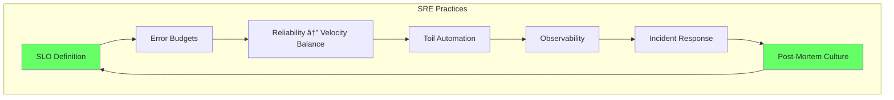
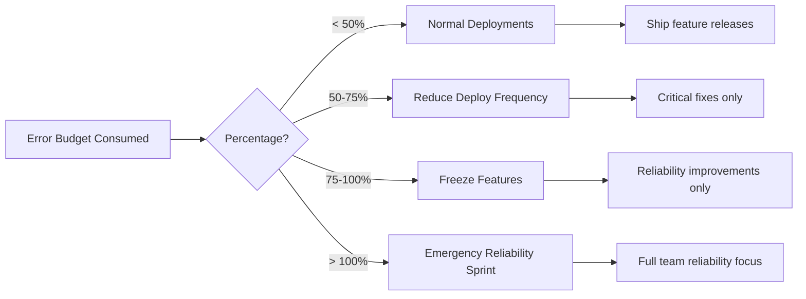

# Site Reliability Engineering (SRE)

> **Purpose:** Define SRE practices, SLOs, error budgets, and operational excellence for Vaeloom
> **Status:** ✅ Upgraded to enterprise quality
> **Owner:** DevOps Team
> **Last Updated:** 2026-07-12

---

## Overview

Vaeloom follows Google's SRE model: treat operations as a software engineering problem. This means automating operational tasks, measuring everything, using error budgets to balance reliability and velocity, and designing for self-healing where possible.

This document defines the SRE principles, SLO targets, error budget policy, and operational practices that keep Vaeloom reliable at scale.

## SRE Principles



| Principle | Application to Vaeloom |
|-----------|------------------------|
| **Service Level Objectives** | Define and monitor SLOs for API, AI agents, and database |
| **Error budgets** | 99.9% availability = 8.76 hours downtime per year. Use budget to decide when to freeze features |
| **Toil automation** | Automate deployments, scaling, backups, and incident triage |
| **Observability** | Metrics, logs, and traces across all services |
| **Blameless post-mortems** | Focus on system improvements, not individual mistakes |

## Service Level Objectives (SLO)

| Service | SLO | Measurement | Budget (30 days) |
|---------|-----|-------------|-----------------|
| API availability | 99.9% | Health check success rate | 43 minutes |
| API latency (p99) | < 500ms | Request duration percentile | — |
| AI agent availability | 99.5% | Agent execution success rate | 3.6 hours |
| Agent latency (p99) | < 10s | Agent execution duration percentile | — |
| Document ingestion | < 30s (p95) | Queue → completed duration | — |
| Database availability | 99.95% | Connection success rate | 21.6 minutes |

### Error Budget Calculation

```typescript
// apps/api/src/sre/error-budget.ts
interface ErrorBudget {
  slo: number;          // e.g., 0.999 for 99.9%
  periodSeconds: number; // e.g., 30 * 24 * 3600 = 2,592,000
  budgetSeconds: number; // computed
  consumedSeconds: number; // tracking
}

function calculateErrorBudget(slo: number, periodDays: number): ErrorBudget {
  const periodSeconds = periodDays * 24 * 3600;
  // Error budget = (1 - SLO) × total time
  const budgetSeconds = (1 - slo) * periodSeconds;
  
  return {
    slo,
    periodSeconds,
    budgetSeconds,
    consumedSeconds: 0,
  };
}

// Example: 30-day error budget at 99.9% SLO
// (1 - 0.999) × 2,592,000 = 2,592 seconds = 43.2 minutes
const apiBudget = calculateErrorBudget(0.999, 30);
console.log(`API error budget: ${apiBudget.budgetSeconds / 60} minutes`);
// Output: API error budget: 43.2 minutes
```

## Error Budget Policy



| Budget Consumption | Action | Duration |
|-------------------|--------|----------|
| < 50% | Normal operations, ship features | Ongoing |
| 50-75% | Reduce deployment frequency, increase monitoring | Until next month |
| 75-100% | Freeze feature deploys, focus on reliability | Until budget resets |
| > 100% | Emergency response, SLO redesign needed | Immediate |

## Toil Reduction Targets

| Toil Source | Current Time/Wk | Automation Target | Target Time/Wk |
|-------------|-----------------|-------------------|----------------|
| Manual deployments | 4 hours | CI/CD pipeline | < 15 min |
| Incident response | 6 hours | Runbooks + auto-mitigation | < 2 hours |
| Database maintenance | 2 hours | Scheduled automation | < 30 min |
| Capacity planning | 3 hours | Auto-scaling + monitoring | < 1 hour |
| On-call handoffs | 1 hour | Automated runbooks | < 15 min |

## Incident Response Metrics

| Metric | Target | Measurement |
|--------|--------|-------------|
| Mean Time to Detect (MTTD) | < 5 min | Alert → acknowledgment |
| Mean Time to Respond (MTTR) | < 15 min (P1), < 30 min (P2) | Alert → mitigation |
| Mean Time to Resolve (MTTR) | < 1 hour (P1), < 4 hours (P2) | Alert → resolution |
| Change Failure Rate | < 10% | Deployments causing incidents |

## Best Practices

| Practice | Rationale |
|----------|-----------|
| Measure everything in production | You can't improve what you don't measure |
| Error budgets over 100% availability | 100% is impossible; budget trades reliability for velocity |
| Automate the boring stuff | Toil doesn't scale — invest in automation |
| Runbooks for every known failure | Reduces MTT* metrics by 50%+ |
| Post-mortems within 48 hours | Memory fades fast — document while fresh |
| Chaos engineering in staging | Test failure modes before they happen in prod |

## Common Mistakes

| Mistake | Consequence | Fix |
|---------|-------------|-----|
| Setting SLO too tight (99.99%) | Frequent budget exhaustion, feature freezes | Start at 99.9%, tighten as system matures |
| No error budget policy | Can't make data-driven reliability decisions | Define policy before you need it |
| Untested runbooks | Runbook doesn't work when needed | Test runbooks quarterly in staging |
| Skipping post-mortems | Same incident recurs | Post-mortem for every P1/P2 within 48h |
| Monitoring everything | Alert fatigue, missed real issues | Define alert rules alongside SLOs |

## Security Considerations

| Concern | Mitigation |
|---------|------------|
| Error budget consumed by DDoS | Separate DDoS detection from SLO monitoring |
| Monitoring tool itself fails | Redundant monitoring stack, external uptime checks |
| SLO report manipulation | Append-only audit on SLO data |

## Performance

| Concern | Mitigation |
|---------|------------|
| Error budget consumed by noisy but low-impact failures | Not all downtime is equal — a brief blip on a health check consumes the same error budget as a multi-minute outage. Use burn-rate alerts that distinguish slow vs. fast budget consumption |
| Toil reduction targets not translating to actual time savings | Automating a task that takes 1 hour/week sounds good, but if the automation takes 20 hours to build and maintain, the ROI is negative. Track actual toil time reduction after automation is deployed |
| SLO monitoring overhead affecting system performance | The instrumentation needed to track SLOs (counters, traces, health checks) adds overhead — keep metric collection overhead under 1% of CPU and sample traces at 10% for high-volume endpoints |

## Performance Considerations

| Concern | Approach |
|---------|----------|
| Error budget consumed by noisy but low-impact failures | Not all downtime is equal — a brief blip on a health check consumes the same error budget as a multi-minute outage. Use burn-rate alerts that distinguish slow vs. fast budget consumption |
| Toil reduction targets not translating to actual time savings | Automating a task that takes 1 hour/week sounds good, but if the automation takes 20 hours to build and maintain, the ROI is negative. Track actual toil time reduction after automation is deployed |
| SLO monitoring overhead affecting system performance | The instrumentation needed to track SLOs (counters, traces, health checks) adds overhead — keep metric collection overhead under 1% of CPU and sample traces at 10% for high-volume endpoints |

## Workflows

1. **Weekly SLO review:** Check error budget consumption → review incident response metrics → update runbooks
2. **Error budget decision:** If < 50% consumed → normal ops. If 50-75% → reduce deploys. If 75-100% → freeze features. If > 100% → emergency
3. **Toil reduction:** Identify manual task → measure time spent → automate → measure time saved
4. **Incident response:** Alert → acknowledge → mitigate → recover → post-mortem (within 48h)
5. **Chaos engineering:** Design experiment → test in staging → review results → improve system
6. **Capacity review:** Monthly trend analysis → quarterly formal capacity review → adjust auto-scaling

---

## Scalability

| Dimension | Current Limit | 10x Strategy | 100x Strategy |
|-----------|--------------|--------------|---------------|
| Services managed | 5 | 15: service per SRE team | 50: SRE platform team with service ownership |
| Incident response | 1 on-call engineer | 3-tier on-call (primary/escalation/manager) | Follow-the-sun global on-call |
| Toil automation | 50% automated | 80% automated: runbooks + auto-mitigation | 95%+ automated: self-healing systems |
| SLO adherence | Manual tracking | Automated gates + dashboards | Policy-as-code with auto-enforcement |

---

## Error Handling

| Scenario | Detection | Mitigation | Recovery |
|----------|-----------|------------|----------|
| Error budget exhausted in 1 week | Fast burn-rate alert | Feature freeze, all-hands reliability sprint | Renegotiate SLO if systematic |
| Runbook procedure fails during incident | Procedure doesn't produce expected result | Escalate to SME, update runbook after | Test runbooks quarterly in staging |
| Automation creates new failure mode | Automated action causes unexpected behavior | Kill switch for automation feature | Gradual rollout + canary for automation |
| Monitoring tool itself fails | External uptime check fails | Secondary monitoring stack | Restore primary from backup |

---

## Monitoring

| Metric | Alert Threshold | Severity | Dashboard |
|--------|----------------|----------|-----------|
| MTTD (Mean Time to Detect) | > 5 min | Warning | Incident Response |
| MTTR (Mean Time to Resolve) P1 | > 1 hour | Critical | Incident Response |
| Change failure rate | > 10% | Warning | Deploy Health |
| Toil as % of engineering time | > 30% | Critical | Toil Dashboard |
| Runbook freshness (last tested) | > 6 months | Warning | Runbook Health |

---

## Deployment

| Environment | Method | Trigger | Verification |
|-------------|--------|---------|--------------|
| SLO target change | Config update | Quarterly review | New SLO tracked in dashboard |
| Error budget policy | CI config change | Reliability process update | CI gates enforce new policy |
| Runbook update | PR merge | After incident or quarterly drill | Procedure verified in next drill |
| Toil automation script | CI/CD deploy | After toil identification | Time saved measured after 30 days |

---

## Limitations

| Limitation | Impact | Workaround | Future Resolution |
|------------|--------|------------|-------------------|
| Error budget doesn't prevent all incidents | Only reduces deploy frequency | Combine with change management process | Predictive incident prevention |
| SRE team size limits coverage | 1-2 SREs can't cover 24/7 | Rotating on-call with clear escalation | Follow-the-sun global SRE coverage |
| Toil reduction ROI takes time | Automation costs upfront | Start with highest-toil items first | Dedicated SRE tooling budget |
| Runbooks become stale quickly | 6 months without testing = likely wrong | Quarterly runbook drills | Automated runbook testing in staging |

---

## Overview

Site Reliability Engineering (SRE) is the discipline of treating operations as a software engineering problem. This document defines the SRE principles, service level objectives, error budget policy, toil reduction targets, and incident response metrics that govern how Vaeloom's engineering team balances reliability with feature velocity.

This document is written for the SRE team, DevOps engineers, and all developers who deploy to production or participate in on-call rotations. It assumes familiarity with Google's SRE model and applies those principles specifically to Vaeloom's multi-service architecture.

For a second-brain AI platform, SRE practice extends beyond traditional infrastructure reliability to encompass AI-specific concerns: model provider availability, agent execution accuracy, knowledge graph consistency, and connector data synchronization. The error budget mechanism that works well for API latency must be adapted for AI quality dimensions where failures are not binary up/down but degrade along a spectrum of accuracy and usefulness.

The toil reduction targets in this document are particularly important for Vaeloom because the platform's agent ecosystem generates operational complexity that scales with user count. Every new connector, agent type, or integration creates maintenance surface area. Without deliberate automation investment, toil will consume an increasing share of engineering time.

## Goals

- Apply Google's five SRE principles to Vaeloom: SLO definition, error budgets, toil automation, observability, and blameless post-mortems
- Define SLOs and error budgets for six Vaeloom service dimensions: API availability (99.9%), API latency p99 (< 500ms), AI agent availability (99.5%), agent latency p99 (< 10s), document ingestion p95 (< 30s), and database availability (99.95%)
- Establish an error budget policy with four consumption tiers (< 50%, 50-75%, 75-100%, > 100%) and corresponding actions (normal ops, reduced deploys, feature freeze, emergency sprint)
- Reduce toil from 16 hours/week to under 4 hours/week through automation of deployments, incident response, database maintenance, capacity planning, and on-call handoffs
- Meet incident response metric targets: MTTD < 5 min, MTTR (P1) < 15 min, MTTR (P1 resolution) < 1 hour, change failure rate < 10%

## Scope

### In Scope

- SRE principles applied to Vaeloom: SLO-driven reliability, error budget governance, toil automation strategy, observability requirements, and blameless post-mortem culture
- SLO targets with error budget calculations and consumption tracking across all six service dimensions
- Error budget policy with four-tier response actions and recommended enforcement through CI/CD gates
- Toil reduction targets for five operational areas: deployments, incident response, database maintenance, capacity planning, and on-call handoffs
- Incident response metric targets for MTTD, MTTA, MTTR by severity, and change failure rate
- Error handling for SRE processes: budget exhaustion scenarios, runbook failures, automation failures, and monitoring tool failures

### Out of Scope

- SLI definitions and measurement methodology (covered in SLI document)
- SLA contractual commitments and customer credit structures (covered in SLA document)
- Detailed incident response workflows and communication templates (covered in Incident Response Plan)
- Observability tooling, dashboard configuration, and telemetry pipeline (covered in Observability document)
- Chaos engineering experiment design and execution methodology (future improvement)
- Follow-the-sun global on-call rotation scheduling (future improvement)

---

## Examples

### Error Budget Calculation (TypeScript)

```typescript
function calculateErrorBudget(slo: number, periodDays: number): number {
  const periodSeconds = periodDays * 24 * 3600;
  return (1 - slo) * periodSeconds / 60; // minutes
}
//  99.9% → 43.2 min/month
//  99.5% → 216 min/month
//  99.95% → 21.6 min/month
```

### SRE Health Check (CLI)

```bash
# Check SRE metrics
curl -s https://api.Vaeloom.dev/v1/admin/sre/status \
  -H "Authorization: Bearer $ADMIN_TOKEN" | jq '.metrics[] | {name, current, target}'
```

### Toil Tracking (JSON)

```json
{
  "toil_sources": [
    { "task": "Manual deployments", "current_hours_per_week": 4, "target_hours": 0.25, "automation": "CI/CD pipeline" },
    { "task": "Incident response", "current_hours_per_week": 6, "target_hours": 2, "automation": "Runbooks + auto-mitigation" },
    { "task": "Database maintenance", "current_hours_per_week": 2, "target_hours": 0.5, "automation": "Scheduled automation" }
  ]
}
```

## Future Improvements

| Improvement | Priority | Complexity | Timeline |
|-------------|----------|------------|----------|
| Automated runbook execution (Runbooks as Code) | High | Medium | Q4 2026 |
| Predictive incident prevention with ML | High | High | Q2 2027 |
| Self-healing infrastructure for common failures | Medium | High | Q1 2027 |
| Global follow-the-sun on-call rotation | Medium | Medium | Q1 2027 |
| Policy-as-code for full error budget enforcement | Low | Medium | Q4 2026 |

## Related Documents

- [SLA.md](./SLA.md)
- [SLO.md](./SLO.md)
- [SLI.md](./SLI.md)
- [Capacity Planning.md](./Capacity-Planning.md)
- [`Incident Response.md`](./02-incident-response.md)
