# Support

> **Purpose:** Define support processes for Vaeloom
> **Status:** 🆕 New

## Support Architecture

```mermaid
graph TD
    classDef tier fill:#e3f2fd,stroke:#1565c0,color:#000,stroke-width:2px
    classDef workflow fill:#e8f5e9,stroke:#2e7d32,color:#000,stroke-width:1.5px
    classDef metric fill:#fff3e0,stroke:#e65100,color:#000,stroke-width:1.5px

    subgraph Tiers["📋 Support Tiers"]
        T1["Self-service · All users<br/>Docs/FAQ/In-app help · Instant"]
        T2["Community · Free users<br/>Discord/GitHub · < 24h"]
        T3["Standard · Pro users<br/>Email/Chat · < 8h"]
        T4["Priority · Enterprise<br/>Dedicated Slack/Phone · < 1h"]
    end

    subgraph Workflow["🔄 Escalation Workflow"]
        W1["User submits ticket"]
        W2["Auto-categorization + Priority"]
        W3["Tier 1: Self-service resolution"]
        W4["Tier 2: Support team (standard issues)"]
        W5["Tier 3: Engineering (bugs/escalations)"]
        W6["Resolution confirmation"]
    end

    subgraph Escalation["📊 Escalation Matrix"]
        E1["Bug reports: Triage→Investigate→Fix"]
        E2["Feature requests: Log→Prioritize→Implement"]
        E3["Data issues: Scope→Recover→Root cause"]
        E4["Security: Immediate escalate→Fix→Post-mortem"]
    end

    subgraph Metrics["📈 Support Metrics"]
        M1["First response: < 1h priority / < 24h standard"]
        M2["Resolution: < 4h priority / < 48h standard"]
        M3["CSAT: > 4.5 out of 5.0"]
        M4["Escalation rate: < 20%"]
    end

    Tiers --> Workflow --> Escalation
    Workflow -.-> Metrics

    class T1,T2,T3,T4 tier
    class W1,W2,W3,W4,W5,W6 workflow
    class E1,E2,E3,E4 escalation
    class M1,M2,M3,M4 metric
```



> **Diagram:** Support architecture — **4 tiers** (self-service instant → community 24h → standard 8h → priority 1h) → **6-step workflow** (ticket → categorize → escalate: T1/T2/T3 → resolve) → **escalation matrix** (bugs, features, data, security) → **metrics** (response time, resolution, CSAT, escalation rate).

---

## Support Tiers

| Tier | Audience | Channel | Response Time |
|------|----------|---------|---------------|
| Self-service | All users | Documentation, FAQ, in-app help | Instant |
| Community | Free users | Discord, GitHub Discussions | < 24 hours |
| Standard | Pro users | Email, in-app chat | < 8 hours |
| Priority | Enterprise | Dedicated Slack, Phone | < 1 hour |

## Support Workflow

```text
User submits ticket → Auto-categorization → Priority assignment
    → Tier 1: Self-service resolution
    → Tier 2: Support team (standard issues)
    → Tier 3: Engineering team (bugs, escalations)
    → Resolution confirmation
```

## Common Support Categories

| Category | Typical Issues | Resolution |
|----------|---------------|------------|
| Account | Login issues, password reset | Tier 1 |
| Connectors | OAuth failures, sync issues | Tier 1-2 |
| Agent behavior | Wrong proposals, missing features | Tier 2-3 |
| Data | Export, delete, merge requests | Tier 2 |
| Billing | Plan changes, invoices | Tier 1 |
| Technical | API integration, webhooks | Tier 2 |

## Escalation Matrix

| Issue Type | Tier 1 | Tier 2 | Tier 3 |
|-----------|--------|--------|--------|
| Bug reports | Triage + verify | Investigate | Fix + deploy |
| Feature requests | Log + categorize | Prioritize | Implement |
| Data issues | Identify scope | Recover data | Root cause fix |
| Security concerns | Immediate escalation | Investigate | Fix + post-mortem |

## Support Metrics

| Metric | Target |
|--------|--------|
| First response time | < 1 hour (priority), < 24 hours (standard) |
| Resolution time | < 4 hours (priority), < 48 hours (standard) |
| Customer satisfaction | > 4.5 / 5.0 |
| Escalation rate | < 20% |

## Common Mistakes

| Mistake | Consequence |
|---------|-------------|
| First-line support without escalation criteria documented | A support agent who can't determine if an issue is a bug, feature request, or security concern escalates to the wrong team — document clear categorization criteria for each issue type |
| Support metrics that measure speed over quality | A 30-second first response time is meaningless if the response is "we'll look into it" — measure resolution quality (CSAT) alongside speed, and prioritize accuracy over quick replies |
| Self-service documentation that isn't kept current | FAQ and help docs that reference outdated features or UI layouts confuse users and generate more support tickets — audit and update self-service docs on a monthly cycle |

## Best Practices

| Practice | Why |
|----------|-----|
| Implement a clear escalation matrix with SLAs per tier | Users should know what to expect at each tier — self-service (instant), community (24h), standard (8h), priority (1h). Document these SLAs and track compliance |
| Track support metrics that balance speed and quality | Response time, resolution time, CSAT, and escalation rate together give a complete picture — optimizing one metric alone (e.g., response time) can hurt the others |
| Maintain a living FAQ that reflects actual support tickets | FAQ sections should be based on real user questions, not what the team assumes users will ask — review the top 10 support tickets each month and update the FAQ accordingly |

## Security

| Concern | Mitigation |
|---------|------------|
| Support agents with excessive data access | A support agent investigating a user issue shouldn't have access to other users' data — implement role-based access for support tools that scopes access to the requesting user's workspace only |
| Sensitive data shared through support channels | Users may share passwords, API keys, or personal data in support tickets — implement automated redaction of sensitive patterns (email, tokens, keys) in the ticketing system |
| Social engineering attacks on support | An attacker posing as a user could request password resets or data exports — verify identity through at least two factors before fulfilling any account-changing requests |

## Performance

| Concern | Mitigation |
|---------|------------|
| Support ticket volume spiking after incidents | After any service disruption, ticket volume typically spikes 10-50x — have an incident communication template ready that proactively answers the most common questions to preempt ticket creation |
| SLA tracking overhead consuming support time | Manually tracking response and resolution SLAs for every ticket adds overhead — automate SLA tracking in the ticketing system with dashboard alerts for approaching violations |
| Self-service resolution rates dropping due to stale content | If the FAQ and help docs don't cover new features, resolution rates drop and tier-1 tickets increase — measure self-service resolution rate monthly and investigate drops as a content freshness issue |

## Security Considerations

| Concern | Mitigation |
|---------|------------|
| Support agents with excessive data access | A support agent investigating a user issue shouldn't have access to other users' data — implement role-based access for support tools that scopes access to the requesting user's workspace only |
| Sensitive data shared through support channels | Users may share passwords, API keys, or personal data in support tickets — implement automated redaction of sensitive patterns (email, tokens, keys) in the ticketing system |
| Social engineering attacks on support | An attacker posing as a user could request password resets or data exports — verify identity through at least two factors before fulfilling any account-changing requests |

## Performance Considerations

| Concern | Approach |
|---------|----------|
| Support ticket volume spiking after incidents | After any service disruption, ticket volume typically spikes 10-50x — have an incident communication template ready that proactively answers the most common questions to preempt ticket creation |
| SLA tracking overhead consuming support time | Manually tracking response and resolution SLAs for every ticket adds overhead — automate SLA tracking in the ticketing system with dashboard alerts for approaching violations |
| Self-service resolution rates dropping due to stale content | If the FAQ and help docs don't cover new features, resolution rates drop and tier-1 tickets increase — measure self-service resolution rate monthly and investigate drops as a content freshness issue |

## Workflows

1. **User submits ticket** via in-app chat, email, or community forum
2. **Auto-categorization:** System classifies by category (account, connector, agent, data, billing, technical)
3. **Tier assignment:** Self-service (FAQ match) → Tier 1 (support team) → Tier 2 (engineering for bugs)
4. **Initial response:** Within SLA (1h priority, 24h standard) — acknowledge and set expectations
5. **Investigation:** Check logs, user account, workspace data — identify root cause
6. **Resolution:** Tier 1 fixes common issues → Tier 2 fixes bugs → Tier 3 (engineering for escalations)
7. **Confirmation:** Verify resolution with user → close ticket → log in knowledge base
8. **Post-resolution:** Update FAQ if common issue → CSAT survey → trend analysis

---

## Scalability

| Dimension | Current Limit | 10x Strategy | 100x Strategy |
|-----------|--------------|--------------|---------------|
| Ticket volume | 50/week | 500/week: self-service resolves 60%+ | 5000/week: AI auto-resolution for Tier 1 |
| Support team size | 1 part-time | 5 agents (Tier 1) + 2 engineers (Tier 2) | 20 agents + 5 engineers + AI bot |
| Response SLA | 1h priority | 15 min priority: auto-responder + smart routing | 5 min: AI triage + suggested responses |
| Self-service rate | 30% | 50%: improved FAQ + in-app help | 70%: AI-powered help center |

---

## Error Handling

| Scenario | Detection | Mitigation | Recovery |
|----------|-----------|------------|----------|
| Ticket mis-categorized | Manual review catches | Re-categorize and assign correctly | Improve auto-categorization model |
| SLA breach on response time | SLA monitoring alert | Escalate to next available agent | Analyze breach pattern, adjust staffing |
| User reports ongoing issue after resolution | Follow-up ticket | Re-open investigation, escalate if needed | Update resolution, verify fully |
| Support agent cannot resolve | Escalation matrix | Route to appropriate Tier 2/3 engineer | Document resolution for future reference |

---

## Monitoring

| Metric | Alert Threshold | Severity | Dashboard |
|--------|----------------|----------|-----------|
| First response time (priority) | > 1 hour | Critical | Support SLA |
| Resolution time (priority) | > 4 hours | Warning | Support SLA |
| CSAT score | < 4.5 / 5.0 | Critical | Customer Satisfaction |
| Self-service resolution rate | < 30% | Info | Support Efficiency |
| Escalation rate | > 20% | Warning | Support Quality |

---

## Deployment

| Environment | Method | Trigger | Verification |
|-------------|--------|---------|--------------|
| FAQ update | Doc PR merge | New common issue identified | FAQ resolves related tickets |
| Auto-categorization model | ML model deploy | Monthly model refresh | Category accuracy > 85% |
| Support bot response update | Config change | New product feature | Bot correctly handles new inquiries |
| SLA threshold change | Config update | Business requirement change | Alerts fire at new thresholds |

---

## Limitations

| Limitation | Impact | Workaround | Future Resolution |
|------------|--------|------------|-------------------|
| Support limited to business hours | Weekend issues wait until Monday | Self-service FAQ for common issues | 24/7 AI support bot |
| No multi-language support | English-only support | Google Translate for basic communication | Multi-language support team + translation |
| Tier 1 support lacks deep product knowledge | Escalation rate high for complex issues | Better knowledge base + training | AI-assisted support with product context |
| No in-app chat for free tier | Free users limited to email support | Community forums for peer support | In-app chat for all tiers |

---

## Overview

Support defines the multi-tier customer support framework for the Vaeloom platform, spanning self-service documentation to dedicated enterprise support. It establishes escalation paths, response SLAs per tier, common support categories, and the metrics that measure support quality — first response time, resolution time, customer satisfaction, and escalation rate.

This document is written for support engineers, product managers, and the operations team who design and staff Vaeloom's support operation. It provides the structure needed to scale support from a single part-time resource to a multi-tier organization serving thousands of users.

For a second-brain AI platform, support is uniquely nuanced because issues often involve agent behavior, knowledge graph state, and connector data synchronization — problems that are hard to reproduce and require deep product understanding. The escalation matrix in this document ensures that connector failures, agent misbehavior, and data quality issues are routed to the right engineering team without unnecessary back-and-forth.

A well-designed support operation is Vaeloom's first line of defense against churn. Users who experience a support interaction that is fast, empathetic, and effective are significantly more likely to remain engaged with the platform. Conversely, slow or unhelpful support erodes trust in the platform's reliability and value proposition.

## Goals

- Deliver tiered support across four levels: self-service (instant, all users), community (< 24h, free users), standard (< 8h, pro users), and priority (< 1h, enterprise)
- Maintain first response time SLAs of < 1 hour for priority tickets and < 24 hours for standard tickets
- Achieve customer satisfaction scores above 4.5 out of 5.0 through fast resolution and empathetic communication
- Keep escalation rate below 20% by equipping Tier 1 support with comprehensive knowledge base resources and clear categorization criteria
- Automate self-service resolution targeting 50%+ of all support tickets resolved through FAQ, documentation, and in-app help before reaching a human agent

## Scope

### In Scope
- Four-tier support structure with audience definitions, channels, and response time SLAs: self-service, community, standard, and priority
- Support workflow from ticket submission through auto-categorization, tier assignment, investigation, resolution, and post-resolution follow-up
- Common support categories: account, connectors, agent behavior, data, billing, and technical — with typical issues and resolution tiers
- Escalation matrix for bug reports, feature requests, data issues, and security concerns across three support tiers
- Support metrics with targets: first response time, resolution time, CSAT, escalation rate, and self-service resolution rate
- Error handling for mis-categorized tickets, SLA breaches, unresolved issues, and agent escalation failures

### Out of Scope
- Product documentation and user-facing FAQ content (covered in Product documentation)
- Incident response procedures for platform outages (covered in Incident Response Plan)
- Account management and billing system implementation details (covered in Admin documentation)
- AI-powered support bot development and ML model training (future improvement)
- Multi-language support team structure and translation workflows (future improvement)

---

## Examples

### Ticket Submission (CLI)

```bash
# Submit a support ticket via API
curl -X POST https://api.Vaeloom.dev/v1/support/tickets \
  -H "Authorization: Bearer $API_TOKEN" \
  -d '{
    "category": "connector",
    "subject": "Gmail sync failing",
    "description": "OAuth token expired, re-auth not working",
    "priority": "standard"
  }' | jq '.ticket_id'
```

### Escalation Configuration (YAML)

```yaml
support_tiers:
  self_service:
    audience: "all users"
    channel: "docs/FAQ"
    response_time: "instant"
    resolution_rate_target: 50
  community:
    audience: "free users"
    channel: "discord"
    response_time: "< 24h"
  standard:
    audience: "pro users"
    channel: "email/chat"
    response_time: "< 8h"
  priority:
    audience: "enterprise"
    channel: "dedicated slack"
    response_time: "< 1h"
```

### Ticket Status Check (CLI)

```bash
# Check ticket status
curl -s "https://api.Vaeloom.dev/v1/support/tickets/TKT-12345" \
  -H "Authorization: Bearer $API_TOKEN" | jq '{status, assigned_to, sla_remaining}'
```

## Future Improvements

| Improvement | Priority | Complexity | Timeline |
|-------------|----------|------------|----------|
| AI-powered support bot for 24/7 Tier 1 | High | Medium | Q4 2026 |
| In-app chat for all user tiers | High | Low | Q3 2026 |
| Multi-language support (top 5 languages) | Medium | High | Q2 2027 |
| Automated CSAT survey and trend analysis | Medium | Low | Q4 2026 |
| Proactive support (notify before user reports) | Low | High | Q2 2027 |

## Related Documents

- [FAQ.md](../Product/FAQ.md)
- [Maintenance.md](./Maintenance.md)
- [`Operations/README.md`](./README.md)
