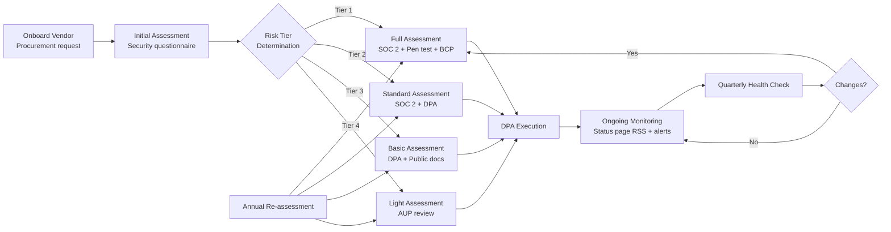

# Vendor Risk Assessment

> **Purpose:** Define the vendor risk management program, assessment methodology, and data processing requirements for all Vaeloom third-party vendors
> **Status:** 🆕 New
> **Owner:** Security Team
> **Last Updated:** 2026-07-13

## Overview

Vaeloom relies on several external vendors for critical infrastructure, AI model access, authentication, and communication services. Each vendor is assessed for security posture, data handling practices, compliance certifications, and business continuity capabilities. Vendors are classified into risk tiers that determine assessment frequency and monitoring requirements.

This document covers all active vendors, their risk tier, data processing agreements (DPAs), assessment schedule, and termination procedures.

## Vendor Risk Architecture

```mermaid
graph TD
    classDef critical fill:#ffebee,stroke:#c62828,color:#000,stroke-width:2px
    classDef high fill:#fff3e0,stroke:#e65100,color:#000,stroke-width:1.5px
    classDef medium fill:#fff8e1,stroke:#f57f17,color:#000,stroke-width:1.5px
    classDef low fill:#e8f5e9,stroke:#2e7d32,color:#000,stroke-width:1.5px
    classDef action fill:#e3f2fd,stroke:#1565c0,color:#000,stroke-width:1px

    subgraph Vendors["Vendor Inventory"]
        V1["Anthropic<br/>AI Model Provider"]
        V2["OpenAI<br/>Fallback AI Provider"]
        V3["Clerk / Auth0<br/>Authentication"]
        V4["Vercel<br/>Frontend Hosting"]
        V5["Fly.io<br/>AI Service Hosting"]
        V6["AWS<br/>Cloud Infrastructure"]
        V7["Resend / SES<br/>Email Delivery"]
        V8["GitHub<br/>Source Control + CI"]
    end

    subgraph Tiers["Risk Tiers"]
        T1["Tier 1 — Critical<br/>Customer data processed<br/>No viable alternative"]
        T2["Tier 2 — High<br/>Customer data processed<br/>Alternative exists"]
        T3["Tier 3 — Medium<br/>Business operations<br/>No customer data"]
        T4["Tier 4 — Low<br/>Ancillary service<br/>Easily replaceable"]
    end

    subgraph Assessment["Assessment Process"]
        A1["Initial Assessment<br/>Security questionnaire"]
        A2["DPA Review<br/>Data processing agreement"]
        A3["SOC 2 / ISO 27001<br/>Certification check"]
        A4["BCP Review<br/>Business continuity"]
        A5["Ongoing Monitoring<br/>Status page, alerts"]
    end

    subgraph Actions["Risk Actions"]
        ACT1["Annual re-assessment"]
        ACT2["Quarterly status check"]
        ACT3["Incident notification SLA"]
        ACT4["Exit strategy documented"]
    end

    V1 & V2 & V3 & V6 --> T1
    V4 & V5 --> T2
    V7 --> T3
    V8 --> T4

    T1 & T2 & T3 & T4 --> A1 & A2 & A3 & A4
    A1 & A2 & A3 & A4 & A5 --> ACT1 & ACT2 & ACT3 & ACT4

    class V1,V2,V3,V6 critical
    class V4,V5 high
    class V7 medium
    class V8 low
    class T1,T2,T3,T4 action
    class A1,A2,A3,A4,A5 action
    class ACT1,ACT2,ACT3,ACT4 action
```



## Vendor Registry

| Vendor | Service | Risk Tier | Data Classification | Assessment Frequency | DPA Signed | Certifications |
|--------|---------|-----------|-------------------|---------------------|------------|----------------|
| **Anthropic** | AI model inference (Claude API) | Tier 1 — Critical | User documents, agent inputs/outputs | Annual | ✅ Signed | SOC 2 Type II |
| **OpenAI** | AI model inference (fallback) | Tier 1 — Critical | User documents, agent inputs/outputs | Annual | ✅ Signed | SOC 2 Type II |
| **Clerk / Auth0** | Authentication, SSO, MFA | Tier 1 — Critical | User identities, email, hashed passwords | Annual | ✅ Signed | SOC 2 Type II, ISO 27001 |
| **AWS** | Compute (ECS), Storage (S3), Database (RDS) | Tier 1 — Critical | All customer data at rest | Annual | ✅ Signed (DDA) | SOC 2 Type II, ISO 27001, FedRAMP |
| **Vercel** | Frontend hosting, Edge Functions | Tier 2 — High | Session tokens, page views | Annual | ✅ Signed | SOC 2 Type II |
| **Fly.io** | AI service hosting, GPU instances | Tier 2 — High | Agent inference inputs/outputs (transient) | Annual | ✅ Signed | SOC 2 Type II |
| **Resend / AWS SES** | Transactional email delivery | Tier 3 — Medium | Email addresses, notification content | Annual | ✅ Signed | SOC 2 Type II (SES) |
| **GitHub** | Source control, CI/CD | Tier 4 — Low | Source code, CI config, deployment keys | Annual | ✅ Signed | SOC 2 Type II |

## Assessment Process



## Data Processing Requirements

All vendors processing customer data must meet the following minimum requirements:

1. **Data Processing Agreement (DPA):** Signed DPA compliant with GDPR Art. 28
2. **Data Classification:** Must acknowledge and handle data per Vaeloom's data classification policy
3. **Sub-processor Notification:** Must notify Vaeloom of any sub-processor changes
4. **Data Deletion:** Must delete customer data within 30 days of contract termination
5. **Breach Notification:** Must notify Vaeloom within 24 hours of confirmed breach affecting Vaeloom data
6. **Audit Rights:** Vaeloom reserves the right to audit vendor controls annually
7. **Data Residency:** Must store and process data within agreed geographic boundaries

## Best Practices

| Practice | Rationale |
|----------|----------|
| Classify vendors by data sensitivity and criticality | Not all vendors pose the same risk — tiered assessment focuses resources on highest-risk relationships |
| Require SOC 2 Type II or equivalent for Tier 1 vendors | Independent audit reduces Vaeloom's audit burden; provides objective evidence of controls |
| Document exit strategy before onboarding | Switching AI providers mid-crisis is harder than planning the switch in advance |
| Monitor vendor status pages proactively | Vendors announce incidents before they escalate to Vaeloom's customers; early warning enables proactive communication |
| Review sub-processor lists quarterly | Vendors change sub-processors (e.g., Anthropic adding new cloud provider); must be assessed for any new sub-processor |

## Common Mistakes

| Mistake | Consequence | Fix |
|---------|-------------|-----|
| Not updating assessments after vendor acquisition | Acquired vendor may adopt new data practices or reduce security posture | Re-assess any vendor that undergoes acquisition, merger, or major funding round |
| Assuming vendor certifications cover all operations | SOC 2 scope may exclude specific services used by Vaeloom | Request SOC 2 with scope details; verify each service used is within scope |
| No vendor exit strategy | Locked into vendor with deteriorating service or price hikes | Document exit strategy before signing; maintain data portability and skills to migrate |
| Ignoring vendor sub-processors | Vendor uses sub-processor that doesn't meet Vaeloom's security requirements | Review sub-processor list in DPA; require notification of changes; approve in advance |

## Security Considerations

| Concern | Mitigation |
|---------|-----------|
| Vendor data breach (Tier 1) | Customer data encrypted at rest and in transit; encryption keys controlled by Vaeloom (KMS); breach scope limited to data in use |
| Vendor service termination | Exit strategy documented per vendor; data portability tested annually; migration runbook maintained |
| Vendor insider threat | All Tier 1 vendors sign DPAs with employee background check and access logging commitments |
| Cross-border data transfer | Data residency enforced in vendor contracts (US-only for now); Standard Contractual Clauses (SCCs) for EU data |
| Vendor AI model data retention | Anthropic and OpenAI configured with zero data retention for API calls; prompt data not used for training |

## Performance Considerations

| Concern | Mitigation |
|---------|-----------|
| Vendor API rate limits | Circuit breaker pattern: vendor rate limit leads to automatic fallback to secondary vendor; queue requests during backoff |
| Vendor latency spikes | Multi-vendor routing: primary vendor <500ms p99; fallback vendor activated if primary exceeds threshold |
| Vendor metadata synchronization | User and workspace metadata cached locally; vendor outage does not block core CRUD operations |
| Vendor status page polling | Status page changes polled every 5 minutes; integrated with PagerDuty for automatic incident creation |
| Vendor migration time | AI model migration (Anthropic ↔ OpenAI) estimated <30 minutes (hot swap via feature flag) |

## Workflows

1. **Vendor onboarding:** Procurement request → security questionnaire → risk tier determination → DPA execution → ongoing monitoring
2. **Initial assessment:** Send security questionnaire → review SOC 2/ISO certs → assess BCP → determine data classification
3. **Risk tier assignment:** Tier 1 (critical, no alternative) → Tier 2 (high, alternative exists) → Tier 3 (medium, ops only) → Tier 4 (low)
4. **DPA execution:** Review data processing terms → confirm sub-processors → sign DPA → store in compliance repository
5. **Annual re-assessment:** Re-evaluate vendor security posture → check for changes in certifications, acquisitions, or data handling
6. **Vendor offboarding:** Confirm data deletion → revoke access → archive DPA → document exit summary
7. **Incident notification:** Vendor breach notification (within 24h) → assess impact → notify stakeholders → update risk assessment

---

## Scalability

| Dimension | Current Limit | 10x Strategy | 100x Strategy |
|-----------|--------------|--------------|---------------|
| Vendors managed | 8 | 30: tiered vendor management portal | 100: automated vendor risk platform |
| Assessment frequency | Annual | Quarterly for Tier 1, annual for others | Continuous monitoring for Tier 1 |
| DPAs managed | 8 | 30 DPA templates per vendor type | 100: automated DPA generation |
| Vendor risk tier changes | Quarterly review | Real-time vendor risk monitoring | Automated risk score adjustments |

---

## Error Handling

| Scenario | Detection | Mitigation | Recovery |
|----------|-----------|------------|----------|
| Vendor SOC 2 certification expires | Expiration alert | Request updated report immediately | Block new data processing until renewed |
| Vendor acquires another company | News monitoring alert | Trigger re-assessment of combined entity | Update risk tier if needed |
| Vendor data breach notification | Incident alert | Assess impact on Vaeloom data | Execute incident response per severity |
| Vendor changes sub-processors | DPA notification | Review new sub-processor security posture | Approve or block within 30 days |

---

## Monitoring

| Metric | Alert Threshold | Severity | Dashboard |
|--------|----------------|----------|-----------|
| Vendor certification expiry | < 30 days before expiry | Critical | Vendor Compliance |
| Vendor incident notifications | Any occurrence | Critical | Vendor Incidents |
| DPA signing status (new vendors) | Unsigned > 30 days | Warning | Vendor Onboarding |
| Risk tier review overdue | > 12 months since last review | Warning | Vendor Risk |

---

## Deployment

| Environment | Method | Trigger | Verification |
|-------------|--------|---------|--------------|
| New vendor addition | Vendor registry update | Procurement request | Initial assessment completed |
| DPA template update | Legal review + doc update | Regulatory change | Legal approval before use |
| Risk tier change | VRA document update | Annual review or incident | Stakeholder notified |
| Vendor offboarding | Access revocation + data deletion | Contract termination | Data deletion confirmed (30 days) |

---

## Limitations

| Limitation | Impact | Workaround | Future Resolution |
|------------|--------|------------|-------------------|
| No automated vendor risk scoring | Manual assessment for each vendor | Tier-based assessment frequency | Automated risk scoring from vendor data feeds |
| DPA negotiation is slow | Vendor onboarding delayed | Use standard DPA templates | Pre-negotiated DPA terms per vendor category |
| Vendor monitoring limited to annual checks | May miss mid-year security changes | Subscribe to vendor status pages | Continuous vendor security monitoring platform |
| No vendor diversity for AI models | Single-provider dependency | OpenAI as documented fallback | Multi-model routing with 3+ providers |

---

## Goals

- Classify all Vaeloom third-party vendors into four risk tiers (Critical, High, Medium, Low) based on data sensitivity, customer data processing, and availability of alternatives
- Ensure all Tier 1 vendors (Anthropic, OpenAI, Clerk/Auth0, AWS) have signed DPAs, current SOC 2 Type II certifications, and documented business continuity plans
- Establish a vendor assessment process that includes initial security questionnaire, DPA review, certification verification, BCP review, and ongoing monitoring through status page subscriptions
- Maintain current exit strategies for all vendors to ensure Vaeloom can migrate within 30 days if a vendor's security posture, pricing, or service quality deteriorates
- Monitor vendor sub-processor changes quarterly and trigger re-assessment when vendors undergo acquisition, merger, or major funding rounds

---
## Scope

### In Scope
- Complete vendor registry for all eight Vaeloom third-party vendors with risk tier, data classification, assessment frequency, DPA status, and certifications for each
- Four-tier vendor risk classification: Tier 1 (Critical — customer data processed, no viable alternative), Tier 2 (High — customer data processed, alternative exists), Tier 3 (Medium — business operations, no customer data), Tier 4 (Low — ancillary service, easily replaceable)
- Assessment process with tier-dependent depth: Tier 1 requires full assessment (SOC 2 + pen test + BCP), Tier 2 requires standard assessment (SOC 2 + DPA), Tier 3 requires basic assessment (DPA + public docs), Tier 4 requires light assessment (AUP review)
- Data processing requirements for all vendors: DPA compliance, data classification acknowledgment, sub-processor notification, data deletion within 30 days, breach notification within 24 hours, audit rights, and data residency
- Error handling for vendor risk events: SOC 2 certification expiry, vendor acquisition, data breach notification, and sub-processor changes

### Out of Scope
- Vaeloom's own security architecture and compliance certifications (covered in Security documentation)
- Individual vendor contract negotiation and pricing terms (handled by procurement)
- Detailed penetration test results and security audit findings for each vendor
- Customer-specific vendor risk assessments for enterprise deals
- Automated vendor risk scoring platform (future improvement)

---
## Examples

### Vendor Registry Entry (JSON)

```json
{
  "vendors": [
    {
      "name": "Anthropic",
      "service": "AI model inference",
      "risk_tier": "Tier 1 — Critical",
      "data_classification": "User documents, agent inputs/outputs",
      "dpa_signed": true,
      "certifications": ["SOC 2 Type II"],
      "assessment_frequency": "annual"
    },
    {
      "name": "GitHub",
      "service": "Source control + CI/CD",
      "risk_tier": "Tier 4 — Low",
      "data_classification": "Source code, CI config",
      "dpa_signed": true,
      "certifications": ["SOC 2 Type II"]
    }
  ]
}
```

### Vendor Check (CLI)

```bash
# Check vendor certification status
curl -s https://api.Vaeloom.dev/v1/admin/vendors/status \
  -H "Authorization: Bearer $ADMIN_TOKEN" | jq '.vendors[] | {name, cert_expiry, risk_tier}'
```

### Exit Strategy (YAML)

```yaml
exit_strategies:
  anthropic:
    fallback_provider: "openai"
    migration_time_minutes: 30
    data_retention_policy: "zero retention configured"
    tested: "monthly chaos experiment"
  clerk_auth0:
    fallback_provider: "none (critical path)"
    migration_time_hours: 48
    data_portability: "user export API available"
    alternative: "AWS Cognito (requires re-architecture)"
```

## Future Improvements

| Improvement | Priority | Complexity | Timeline |
|-------------|----------|------------|----------|
| Automated vendor risk scoring platform | High | High | Q2 2027 |
| Real-time vendor security posture monitoring | High | Medium | Q1 2027 |
| DPA auto-generation from vendor type templates | Medium | Low | Q4 2026 |
| Third AI model provider (Google/Anthropic diversification) | Medium | Medium | Q4 2026 |
| Vendor exit runbook automation | Low | Medium | Q1 2027 |

## Related Documents

- [Security Architecture.md](../Security/Security-Architecture.md)
- [Business Continuity Plan.md](./Business-Continuity-Plan.md)
- [GDPR Compliance.md](../Security/GDPR.md)
- [Compliance.md](../Security/Compliance.md)
- [Incident Response.md](./02-incident-response.md)
