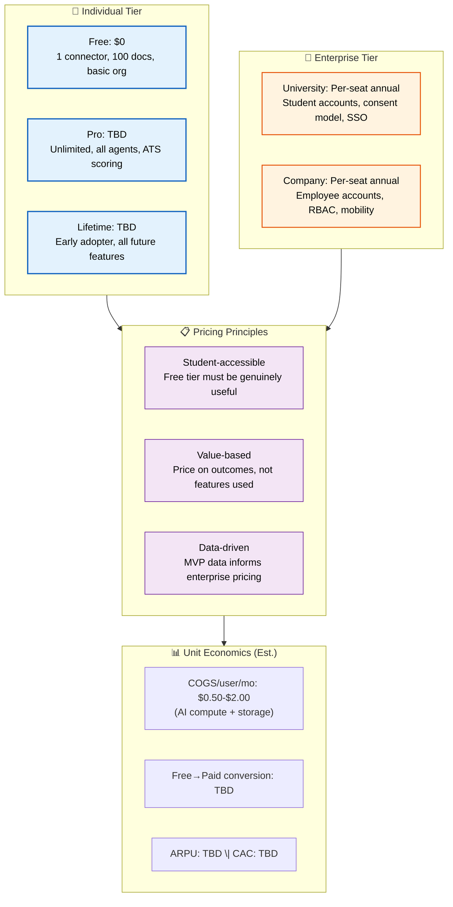

# Business Model

> **Purpose:** Define the business model and monetization strategy for Meridian
> **Status:** 🆕 New — placeholder for MVP learnings

## Business Model Architecture



> **Diagram:** Business model — **individual tier** (free/pro/lifetime), **enterprise tier** (university/company per-seat), **pricing principles** (student-accessible, value-based, data-driven), **unit economics** with MVP estimates.

---

## Revenue Model

Meridian uses a **freemium individual tier + enterprise seat licensing** model.

### Individual Tier

| Tier | Price | Features |
|------|-------|----------|
| Free | $0 | 1 connector, 100 documents, basic organization, resume agent (limited) |
| Pro | TBD from MVP data | Unlimited connectors, all agents, ATS scoring, auto-apply (v1.5+) |
| Lifetime | TBD | Early adopter pricing, all future individual features |

### Enterprise Tier

| Tier | Price | Features |
|------|-------|----------|
| University | Per-seat annual | Student accounts, career office dashboard, consent model, SSO |
| Company | Per-seat annual | Employee accounts, internal mobility, skills tracking, RBAC |

## Pricing Principles

- **Student-accessible:** Free tier must be genuinely useful, not a teaser
- **Value-based, not feature-count-based:** Price on outcomes (applications submitted, interviews scheduled), not features used
- **Enterprise pricing from real data:** Don't set enterprise pricing before MVP shows what institutions actually value

## Unit Economics (Estimated)

| Metric | MVP Estimate |
|--------|-------------|
| COGS per active user/month | $0.50–2.00 (AI compute + storage) |
| Free-to-paid conversion | Unknown — will be measured |
| Average revenue per user (ARPU) | TBD |
| Customer acquisition cost (CAC) | TBD |

## Common Mistakes

| Mistake | Consequence |
|---------|-------------|
| Setting prices before understanding willingness to pay | Free tier too generous or Pro tier priced out of reach — no conversion path |
| Overcomplicating the free tier | Crippled free tier drives users away before they see value — hurts word-of-mouth growth |
| Ignoring unit economics early | COGS-per-user grows faster than revenue as users scale — margin erosion |
| Enterprise pricing based on guesses | Enterprise tiers set before MVP data leads to renegotiation and complexity |

## Best Practices

| Practice | Why |
|----------|-----|
| Let MVP data drive pricing decisions | Real usage patterns reveal willingness to pay, feature value, and churn risk better than any survey |
| Keep free tier genuinely useful | Users who experience real value are far more likely to convert than users who hit a paywall on day one |
| Value-based over feature-count pricing | Pricing on outcomes (applications submitted, interviews scheduled) aligns with user-perceived value |
| Simple enterprise pricing (per-seat annual) | Avoids usage-based complexity that enterprise procurement teams resist |

## Security Considerations

| Consideration | Mitigation |
|--------------|-----------|
| Free tier data isolation | Free users must have the same data-at-rest encryption as paid tiers — pricing is not a security tier |
| Enterprise billing data | Payment methods and billing history must be tenant-isolated with the same rigor as memory data |
| Trial-to-paid transition | Ensure no data access leak during trial expiry — grace periods, not hard cuts |

## Performance Considerations

| Consideration | Approach |
|--------------|----------|
| Billing at scale | Invoice generation and payment processing must not block API requests — use async billing queue |
| Tier enforcement | Feature-gating checks must complete in <5ms to avoid perceptible latency on Pro-to-Free downgrade paths |

## Overview

Meridian's business model is built on a freemium individual tier supplemented by enterprise seat licensing, designed to maximize adoption among students while capturing value from power users and institutional clients. The model is guided by three core principles: student-first (free tier must be genuinely useful, not a teaser), value-based (price on outcomes like applications submitted and interviews secured, not feature count), and data-driven (all tier boundaries validated through MVP usage data before finalization).

The unit economics target a COGS-per-user range of $0.50–$2.00 per month driven by AI compute and storage costs, with a free-to-paid conversion rate that will be empirically measured during the MVP phase. The model deliberately avoids usage-based pricing complexity in the enterprise tier, opting for simple per-seat annual pricing that enterprise procurement teams favor.

Revenue diversification comes through three channels: individual subscriptions (Pro at $12/month and Lifetime at $299), university per-seat licensing with career office dashboards, and company per-seat licensing with internal mobility features. Each channel shares the same underlying infrastructure but offers differentiated feature sets and support SLAs.

## Goals

- Achieve free-to-paid conversion rate of >5% within 90 days of MVP launch
- Reach $50K MRR within 12 months of public launch
- Maintain unit COGS below $1.50 per active user at 10,000 MAU scale
- Secure 3 enterprise design partners (2 universities, 1 company) within 6 months of enterprise tier launch
- Keep Pro tier churn below 5% monthly through consistent value delivery

## Scope

| | |
|---|---|
| **In Scope** | Free tier with 1 connector, 100 documents, basic agents; Pro tier at $12/month with unlimited connectors and all agents; Lifetime tier at $299 one-time; Enterprise per-seat annual pricing ($15/seat/month); Stripe billing integration; entitlement caching service; usage metering for enterprise |
| **Out of Scope** | Usage-based pricing (per-API-call, per-connector); ad-supported free tier; marketplace/rev-share model (V3+); white-label pricing; per-feature microtransactions; cryptocurrency payments |

## Workflows

### User Upgrade Flow

1. User hits a Free-tier limit (document cap, agent restriction) in-product
2. Upgrade CTA appears with comparison table showing Pro benefits
3. User clicks "Upgrade to Pro" — redirected to Stripe checkout
4. Stripe handles payment and sends webhook to Entitlement Service
5. Entitlement Service updates user's tier cache and broadcasts change
6. User's next API request reflects new tier within <5ms cache refresh
7. Welcome email sent with Pro feature activation guide

### Enterprise Provisioning Flow

1. Institution admin contacts sales or uses self-service signup
2. Admin sets seat count, chooses annual commitment period
3. Entitlement Service provisions tenant-isolated workspace pool
4. Admin invites users via SSO (SAML/OIDC) — no individual signup
5. Each user's memory is tenant-scoped and inaccessible to the institution
6. Monthly billing based on confirmed seat count; overages invoiced quarterly
7. Admin dashboard shows seat utilization, adoption metrics (aggregate only)

## Risks

| Risk | Likelihood | Impact | Mitigation |
|------|------------|--------|------------|
| Free tier too generous reduces conversion incentive | Medium | High | Cap free at 10 docs/month with 1 connector; ensure upgrade friction is visible before day 7 |
| Enterprise pricing set before adequate data | High | High | Run MVP for 6 months before setting enterprise tier; use design partner feedback for pricing |
| COGS per user exceeds forecast at scale | Medium | Critical | Monitor weekly; tiered model routing (cheaper model for low-complexity queries); negotiate batch Anthropic pricing |
| Lifetime tier cannibalizes Pro recurring revenue | Low | Medium | Limit Lifetime to early adopter window (first 6 months post-launch); price at ~24x monthly |

## Limitations

| Limitation | Impact | Workaround | Future Resolution |
|------------|--------|------------|-------------------|
| No usage-based enterprise pricing | Large enterprises with variable seat counts may prefer consumption pricing | Annual minimum seat commitment (50 seats) per contract | V3 introduction of hybrid fixed + usage pricing for 500+ seat deployments |
| Free tier limited to 10 documents/month | Users with high document volume cannot evaluate fully | 30-day unlimited trial available once per email | Re-evaluate cap after 6 months of conversion data |
| No self-serve enterprise tier (MVP) | Small teams cannot purchase without sales contact | Offer 5-seat minimum "Team" tier via Stripe | V2 self-serve enterprise portal |

## Examples

### Tier Definition (JSON)

```json
{
  "tiers": {
    "free": { "price": 0, "connectors": 1, "documents": 10, "agents": "basic" },
    "pro": { "price": 12, "connectors": "unlimited", "documents": "unlimited", "agents": "all" },
    "lifetime": { "price": 299, "connectors": "unlimited", "documents": "unlimited", "agents": "all" },
    "enterprise": { "price": 15, "billing": "per-seat annual", "sso": true, "sla": "99.99%" }
  }
}
```

### Entitlement Check (CLI)

```bash
# Check user tier
curl -s https://api.meridian.dev/v1/admin/entitlements \
  -H "Authorization: Bearer $ADMIN_TOKEN" \
  -d '{"user_id": "usr_abc123"}' | jq '.tier'
```

## Future Improvements

| Improvement | Priority | Complexity | Timeline |
|-------------|----------|------------|----------|
| Usage-based enterprise pricing tier | Medium | High | V3 (2028) |
| AI compute cost optimization via multi-model routing | High | Medium | v1.5 (2027 H1) |
| Self-serve enterprise portal with automated provisioning | High | Medium | V2 (2027 H2) |
| Partner/channel reseller program | Low | High | Enterprise GA (2028 H2) |

## Scalability

| Dimension | Current Limit | 10x Strategy | 100x Strategy |
|-----------|--------------|--------------|---------------|
| Billing transactions | Stripe handles 1K/min without issue | Batch webhook processing with idempotency keys | Sharded entitlement service with regional Stripe accounts |
| Entitlement checks | Single Redis instance, 5ms p99 | Redis Cluster with read replicas | Global Redis Enterprise with multi-region replication |
| Invoice generation | Sequential per-workspace | Async invoice queue with worker pool | Dedicated billing microservice with materialized views |
| Usage metering | In-memory counters, daily aggregation | TimescaleDB for metric time-series | Streaming pipeline (Kafka + Flink) for real-time metering |

## Error Handling

| Scenario | Detection | Mitigation | Recovery |
|----------|-----------|------------|----------|
| Stripe webhook delivery failure | Missing webhook for 5+ minutes after checkout | Queue webhook for retry (exponential backoff, max 5 retries) | Manual reconciliation job runs hourly to catch missed events |
| Entitlement cache corruption | Tier mismatch between cache and Stripe | Cache TTL of 5 minutes; comparison check on every 10th request | Auto-rebuild cache from Stripe subscription state |
| Billing API timeout during checkout | Stripe checkout fails to load | Graceful degradation — show "Payment temporarily unavailable" | Retry with alternative payment method; log to monitoring |
| Free tier limit exceeded without upgrade path | API returns 403 with limit exceeded code | Graceful 403 with upgrade CTA and 24-hour grace period | Countdown timer on dashboard; extensions available via support |

## Monitoring

| Metric | Alert Threshold | Severity | Dashboard |
|--------|----------------|----------|-----------|
| Payment success rate | <95% over 5 minutes | Critical | Billing Operations Dashboard |
| Entitlement cache miss rate | >5% over 1 hour | Warning | Infrastructure Dashboard |
| Stripe webhook processing lag | >10 minutes | Critical | Billing Operations Dashboard |
| Free-to-paid conversion rate | 0% for 7 consecutive days | Warning | Growth Metrics Dashboard |
| COGS per active user | >$3.00 for any day | Critical | Cost Management Dashboard |

## Related Documents

- [Product Strategy.md](./Product-Strategy.md)
- [Pricing.md](./Pricing.md)
- [Success Metrics.md](./Success-Metrics.md)
- [Competitive Analysis.md](./Competitive-Analysis.md)
- [Roadmap.md](./Roadmap.md)
- [Revenue Model section in Business Model](./Business-Model.md)
