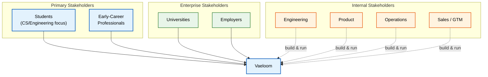

# Business Requirements

> **Purpose:** Define the business objectives, stakeholder requirements, business rules, and success criteria that govern the Vaeloom product
> **Status:** 🆕 New
> **Owner:** Product Team
> **Version:** 1.0
> **Last Updated:** 2026-07-16
> **Dependencies:** [`PRD.md`](./PRD.md), [`Business-Model.md`](./Business-Model.md), [`Vision.md`](./Vision.md), [`Success-Metrics.md`](./Success-Metrics.md), [`KPIs.md`](./KPIs.md)
> **Implementation Status:** 📋 Spec Only

## Overview

Business requirements translate the product vision into measurable objectives and constraints. This document defines what the business needs Vaeloom to achieve (revenue, growth, retention), the stakeholders it serves, the non-negotiable business rules that shape every product decision, and the success criteria that tell us whether we're winning.

## Goals

- Define business objectives across growth, revenue, and retention
- Map stakeholders and their requirements
- Codify the business rules that govern product decisions
- Tie success criteria to measurable metrics

## Scope

### In Scope

- Business objectives and targets
- Stakeholder requirements
- Business rules (product principles)
- Success criteria

### Out of Scope

- Functional product requirements (see [`Functional-Requirements.md`](./Functional-Requirements.md))
- Revenue model details (see [`Business-Model.md`](./Business-Model.md))

## Stakeholder Map

> **Diagram:** Stakeholder map. Primary users (students, early-career professionals) are the core audience. Enterprise stakeholders (universities, employers) are the expansion market. Internal teams build and operate the platform.

## Business Objectives

| ID | Objective | Target | Timeline | Owner |
|----|-----------|--------|----------|-------|
| BO-001 | Achieve product-market fit with students/early-career | NPS > 40 | 2026 Q4 | Product |
| BO-002 | Reach 10K MAU on individual plans | 10,000 MAU | 2027 Q1 | Growth |
| BO-003 | Convert 8% of free users to paid | 8% free→paid | 2027 Q1 | Growth |
| BO-004 | Sign first enterprise design partner | 1 contract | 2027 Q2 | Sales |
| BO-005 | Maintain >75% gross margin (post-AI cost) | >75% | Ongoing | Finance |
| BO-006 | Achieve D30 retention > 40% | 40% | 2027 Q1 | Product |

## Stakeholder Requirements

### Primary Users (Students / Early-Career Professionals)

| ID | Requirement | Priority |
|----|-------------|----------|
| SR-001 | Automatically organize scattered documents (resumes, coursework, projects) | P0 |
| SR-002 | Maintain a living resume that updates as achievements happen | P0 |
| SR-003 | Surface relevant job opportunities based on skills and preferences | P0 |
| SR-004 | Never miss a deadline (applications, interviews, submissions) | P0 |
| SR-005 | Trust that their data is private and never misused | P0 |
| SR-006 | Affordable pricing for students (free tier or student discount) | P1 |

### Enterprise Stakeholders (Universities / Employers)

| ID | Requirement | Priority |
|----|-------------|----------|
| ER-001 | Give every student/employee their own private second brain | P0 |
| ER-002 | Admin controls for provisioning, roles, and compliance | P0 |
| ER-003 | SSO integration with institutional identity providers | P0 |
| ER-004 | Audit trail for compliance (SOC 2, GDPR, FERPA) | P0 |
| ER-005 | Analytics on aggregate adoption (no individual data exposure) | P1 |

### Internal Stakeholders

| ID | Requirement | Priority |
|----|-------------|----------|
| IR-001 | Observable system (metrics, logs, traces) for operations | P0 |
| IR-002 | Automated deployment pipeline with rollback capability | P0 |
| IR-003 | Comprehensive documentation for onboarding and maintenance | P0 |
| IR-004 | Cost monitoring to maintain target gross margin | P1 |

## Business Rules

These rules are non-negotiable product principles that shape every decision:

| Rule | Description | Rationale |
|------|-------------|-----------|
| **Suggest-mode by default** | No consequential action (sending email, submitting application, deleting data) without explicit user approval | Trust is the product's core differentiator; autonomy must be earned |
| **Memory before features** | Every feature reads from and writes to the unified memory system; no standalone features | Memory compounds; isolated features don't |
| **Never destructive** | Archive, don't delete; preserve reversibility | Data loss destroys trust; archive preserves recovery |
| **MCP-shaped connectors** | All integrations follow the Model Context Protocol | Standardized, swappable, auditable integrations |
| **Privacy as architecture** | Privacy is enforced at the system level, not promised in a policy | Compliance through design, not through policy |

## Success Criteria

| Criterion | Metric | Target | Measurement |
|-----------|--------|--------|-------------|
| Users find value | NPS | >40 | Quarterly survey |
| Users return | D30 retention | >40% | Analytics |
| Users pay | Free→paid conversion | >8% | Billing data |
| Users trust the system | Autonomy grant rate | >80% grant at least one autonomous action | Agent run logs |
| Business is sustainable | Gross margin | >75% | Finance reporting |
| Enterprise-ready | First design partner signed | 1 contract | Sales pipeline |

## Risks

| Risk | Likelihood | Impact | Mitigation |
|------|-----------|--------|------------|
| AI cost exceeds revenue per user | Medium | Critical | Cost monitoring; model routing; hard caps |
| Users don't trust autonomous actions | Medium | High | Suggest-mode default; transparency; gradual autonomy earning |
| Enterprise sales cycle too long | High | Medium | Start with individual PMF; enterprise as expansion |

## Related Documents

- [`PRD.md`](./PRD.md) — product requirements document
- [`Business-Model.md`](./Business-Model.md) — revenue model
- [`Vision.md`](./Vision.md) — product vision
- [`Success-Metrics.md`](./Success-Metrics.md) — detailed metrics
- [`KPIs.md`](./KPIs.md) — KPI definitions
- [`Functional-Requirements.md`](./Functional-Requirements.md) — functional requirements
