# Competitive Analysis

> **Purpose:** Analyze the competitive landscape for Vaeloom
> **Status:** 🆕 New

## Competitive Landscape

| Category | Competitors | Vaeloom Advantage |
|----------|-------------|-------------------|
| Resume builders | Rezi, Novoresume, Kickresume | Vaeloom builds resumes from real activity, not manual input |
| Job boards | LinkedIn, Indeed, Naukri, Internshala | Vaeloom ranks by personal fit, not generic algorithms |
| Note/knowledge tools | Notion, Obsidian, Roam | Vaeloom links automatically via agents, not manual effort |
| AI assistants | ChatGPT, Claude, Copilot | Vaeloom has persistent memory of THIS person |
| File storage | Google Drive, Dropbox, OneDrive | Vaeloom organizes by meaning, not folder hierarchy |
| Career services | Handshake, Symplicity, VMock | Vaeloom provides continuous daily support, not periodic sessions |

## Head-to-Head Comparison

### Vaeloom vs. Traditional Resume Builders

| Aspect | Resume Builders | Vaeloom |
|--------|----------------|----------|
| Data source | Manual input | Real activity (docs, emails, code) |
| Updates | User-initiated | Continuous, automatic |
| Personalization | Template-based | Skill-graph-driven |
| ATS optimization | Manual | Automatic per job description |

### Vaeloom vs. ChatGPT/Claude

| Aspect | AI Chatbots | Vaeloom |
|--------|-------------|----------|
| Memory | Session-only (or limited) | Persistent knowledge graph |
| Data sources | User types everything | Automatic from connectors |
| Proactivity | Reactive (user asks) | Proactive (suggestions, deadlines) |
| Agent system | Single chat interface | 28 specialist agents |

## Market Position

```mermaid
quadrantChart
    title Competitive Landscape — Price vs. Capability
    x-axis "Low Price" --> "High Price"
    y-axis "Low Capability" --> "High Capability"
    quadrant-1 "💎 Premium"
    quadrant-2 "🌟 Sweet Spot"
    quadrant-3 "🛠️ Basic Tools"
    quadrant-4 "💸 Overpriced"

    "Vaeloom": [0.52, 0.78]
    "Notion": [0.25, 0.50]
    "Obsidian": [0.05, 0.42]
    "Roam": [0.35, 0.48]
    "ChatGPT": [0.30, 0.65]
    "Claude": [0.30, 0.68]
    "Copilot": [0.40, 0.60]
    "LinkedIn": [0.05, 0.35]
    "Indeed": [0.05, 0.25]
    "Google Drive": [0.15, 0.20]
    "Dropbox": [0.30, 0.22]
    "Handshake": [0.05, 0.30]
    "Rezi": [0.20, 0.30]
    "Novoresume": [0.25, 0.28]
    "Kickresume": [0.15, 0.18]
```



> **Chart:** Vaeloom occupies the **Sweet Spot** quadrant — high capability at mid-range price. AI assistants (ChatGPT, Claude) cluster nearby but lack persistent memory. Note tools (Notion, Obsidian, Roam) offer moderate capability at low-to-mid price. Job boards (LinkedIn, Indeed) and resume builders (Rezi, Novoresume) sit in the **Basic Tools** quadrant — useful but limited. No competitor combines automated organization, persistent memory, and proactive agents at this price point.

Vaeloom occupies the **automated organization + persistent memory** quadrant that no existing product fills.

## Common Mistakes

| Mistake | Consequence |
|---------|-------------|
| Comparing against the wrong competitive set | Positioning against resume builders when the real alternative is "doing nothing" or "using nothing" |
| Over-indexing on feature comparison tables | Users don't choose products by feature count — they choose by which product understands their problem |
| Ignoring indirect competitors | ChatGPT and Claude are not direct competitors today, but they train user expectations about AI |
| Cherry-picking advantages | A competitive analysis that only shows strengths is a marketing document, not strategy input |

## Best Practices

| Practice | Why |
|----------|-----|
| Segment competitors by user need, not category | Resume builders, job boards, and note apps compete for different moments in the user journey |
| Update competitive analysis quarterly | The AI assistant landscape changes rapidly — stale analysis drives bad decisions |
| Include indirect and adjacent competitors | Products that users reach for instead of yours (even if different category) are competitors |
| Map to user personas | Each persona faces a different competitive set — student vs. professional vs. enterprise |

## Security Considerations

| Consideration | Mitigation |
|--------------|-----------|
| Competitive data aggregation | When analyzing competitor products, do not store user credentials or scraped user data — only public information |
| Benchmark data sensitivity | Any user-permissioned benchmark comparisons must be anonymized and aggregated |

## Overview

Vaeloom operates in a competitive landscape that spans resume builders, job boards, note/knowledge tools, AI assistants, file storage platforms, and career services. No existing product combines automated organization, persistent structured memory, and proactive specialist agents into a single platform for career and academic lifecycle management. This competitive analysis examines direct and indirect competitors across six categories, maps the market position using a price-capability quadrant, and identifies the strategic implications for Vaeloom's go-to-market and product decisions.

The analysis is organized by the user need each competitor type addresses rather than by product category, reflecting the reality that users don't choose among "resume builders" — they choose among "ways to solve my career documentation problem." Vaeloom's core competitive advantage is compounding memory: the longer a user stays, the more every feature improves, creating a switching cost that no single-category competitor can replicate.

This document should be updated quarterly as the AI assistant and career technology landscape evolves rapidly. Competitors highlighted here include Rezi, Novoresume, Kickresume, LinkedIn, Indeed, Naukri, Internshala, Notion, Obsidian, Roam, ChatGPT, Claude, Microsoft Copilot, Google Drive, Dropbox, OneDrive, Handshake, Symplicity, and VMock.

## Goals

- Maintain clear differentiation from at least 4 of the 6 competitor categories at all times
- Ensure no single competitor category can replicate Vaeloom's full value proposition within 12 months
- Track competitor feature releases monthly to identify convergence risks early
- Achieve top-3 mindshare in the "AI career platform" category within 18 months of launch
- Publish refreshed competitive analysis quarterly with actionable strategic recommendations

## Scope

| | |
|---|---|
| **In Scope** | Direct competitors (resume builders, career services); indirect competitors (AI assistants, note apps, file storage); adjacent competitors (job boards, professional networks); feature-by-feature comparison; market position mapping; strategic implications for product roadmap |
| **Out of Scope** | Financial analysis of competitors (funding, revenue); internal HR/payroll platforms (Workday, BambooHR); learning management systems (Canvas, Blackboard); applicant tracking systems (Greenhouse, Lever) — these are integration targets, not competitors |

## Workflows

### Competitive Intelligence Gathering

1. Engineering team configures competitive monitoring feeds (product blogs, changelog RSS, social media)
2. Weekly automated scan captures competitor feature releases, pricing changes, and positioning shifts
3. Product manager reviews scan results and categorizes by impact level (critical/watch/informational)
4. Monthly competitive review meeting: product, engineering, and marketing discuss implications
5. Strategic recommendations documented and linked to roadmap items
6. Quarterly full refresh of this document with updated quadrant chart and head-to-head comparisons

## Limitations

| Limitation | Impact | Workaround | Future Resolution |
|------------|--------|------------|-------------------|
| Competitive analysis relies on public information only | May miss private roadmap details or unannounced features | Supplement with design partner feedback and user interviews | Establish analyst relationships for institutional intelligence (V2) |
| Rapid AI landscape changes make analysis stale quickly | Quarterly updates may miss critical competitor moves | Feed tracking has monthly granularity; critical alerts trigger immediate review | Implement automated competitor changelog monitoring (v1.5) |
| Indirect competitors (ChatGPT, Claude) evolve fastest | Risk of feature convergence from unexpected direction | Map capability vectors quarterly, not just product launches | Maintain clear "memory-first" vs "chat-first" positioning to future-proof |

## Examples

### Competitor Data Format (JSON)

```json
{
  "competitors": [
    {
      "name": "ChatGPT",
      "category": "AI assistant",
      "price": 20,
      "capability": 0.65,
      "Vaeloom_advantage": "Persistent memory vs session-only"
    },
    {
      "name": "Rezi",
      "category": "resume builder",
      "price": 15,
      "capability": 0.30,
      "Vaeloom_advantage": "Built from real activity, not manual input"
    }
  ]
}
```

### Competitive Intelligence (CLI)

```bash
# Fetch competitive monitoring data
curl -s https://api.Vaeloom.dev/v1/admin/competitive-intel \
  -H "Authorization: Bearer $ADMIN_TOKEN" | jq '.recent_changes'
```

## Future Improvements

| Improvement | Priority | Complexity | Timeline |
|-------------|----------|------------|----------|
| Automated competitor changelog monitoring and alerts | High | Medium | v1.5 (2027 H1) |
| Competitive battle cards for sales team | Medium | Low | Enterprise phase (2028) |
| User perception survey to validate positioning assumptions | High | Low | MVP phase (2026 Q4) |
| Competitor UX benchmark studies | Low | High | V2 (2027 H2) |

## Risks

| Risk | Likelihood | Impact | Mitigation |
|------|------------|--------|------------|
| ChatGPT/Claude add persistent memory feature | Medium | Critical | Differentiate on structured knowledge graph (not just conversation history); patent key memory architecture |
| LinkedIn builds automated career organization | Medium | High | Focus on multi-source data (LinkedIn alone is insufficient); partner with universities for exclusive distribution |
| Resume builder adds AI auto-generation from activity data | Low | Medium | Maintain moat on cross-source entity extraction (documents + email + code) that single-source tools cannot match |
| Competitor copycats emerge with similar positioning | High | Medium | Compounding memory creates switching cost advantage; brand on trust and data portability |

## Related Documents

| Consideration | Approach |
|--------------|----------|
| Market monitoring | Automated competitive monitoring should use rate-limited, cache-friendly queries to avoid IP bans |

## Related Documents

- [Product Strategy.md](./Product-Strategy.md)
- [User Personas.md](./User-Personas.md)
- [Business Model.md](./Business-Model.md)
- [Vision.md](./Vision.md)
- [Problem.md](./Problem.md)
- [`/Docs/06-Vaeloom-Enterprise-Paper.md#19-why-current-solutions-fail`](../../Docs/06-Vaeloom-Enterprise-Paper.md#19-why-current-solutions-fail)
