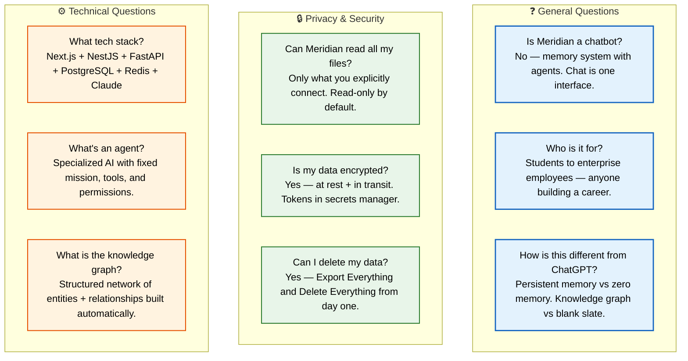

# FAQ

> **Purpose:** Frequently asked questions about Meridian
> **Status:** 🆕 New

## FAQ Categories



> **Diagram:** FAQ organized into 3 categories — **General** (chatbot misconception, audience, ChatGPT difference), **Privacy & Security** (file access, encryption, data deletion), and **Technical** (stack, agent definition, knowledge graph).

---

## General

**Q: Is Meridian a chatbot?**
A: No. Meridian is a memory system with agents attached to it. Chat is one of several interfaces into that memory.

**Q: Who is Meridian for?**
A: Students, job seekers, early-career professionals, researchers, developers, freelancers — anyone building a career.

**Q: How is this different from ChatGPT/Claude?**
A: Those tools have no persistent memory of you. Meridian builds a structured knowledge graph from your actual documents, emails, and code.

## Privacy & Security

**Q: Can Meridian read all my files?**
A: Only what you explicitly connect. Every connector starts read-only. Write access is a separate, explicit grant.

**Q: Is my data encrypted?**
A: Yes. Encryption at rest and in transit. OAuth tokens stored in a secrets manager, never in plaintext.

**Q: Can I delete my data?**
A: Yes. "Export everything" and "delete everything" controls are present from day one.

## Technical

**Q: What tech stack does Meridian use?**
A: Next.js (frontend), NestJS (API), FastAPI (AI service), PostgreSQL (database), Redis (cache/queue), Claude API (agent reasoning).

**Q: What's an agent in Meridian?**
A: A specialized AI with a fixed mission, declared tool list, and explicit permissions. Each agent handles one domain (organization, resume, job search, etc.).

**Q: What is the knowledge graph?**
A: A structured network of entities (skills, projects, organizations) and relationships between them, built automatically as the system processes your documents.

## Common Misconceptions

| Misconception | Reality |
|---------------|---------|
| "Meridian is an AI chatbot" | Meridian is a memory system with agents — chat is just one interface into that memory |
| "It reads all my files" | Only explicitly connected sources, read-only by default — write access is a separate grant |
| "I need to learn a new workflow" | Meridian works alongside existing tools — you keep using Gmail, GitHub, Drive, etc. |
| "It's only for students" | The wedge is students, but the platform serves everyone from freelancers to enterprise employees |

## Best Practices for New Users

| Practice | Why |
|----------|-----|
| Connect 1–2 sources first | Starting with Gmail + GitHub gives the memory system rich signal without overwhelming permissions |
| Review the first 10 proposals | Early approvals train the system to match your preferences — invest the time upfront |
| Use chat to ask specific questions | "What deadlines do I have this week?" works better than "tell me about my stuff" |
| Check the Knowledge Graph weekly | Seeing what the system "knows" builds trust and lets you correct errors early |

## Security & Privacy FAQ

| Question | Answer |
|----------|--------|
| Are my files stored on Meridian's servers? | Connectors index metadata and content for search — original files stay in their source location |
| Can I delete specific memories? | Yes — individual entities, relationships, or entire categories can be removed independently |
| What happens if I disconnect a source? | All associated memory is preserved but no longer updated — full deletion is a separate action |

## Common Mistakes

| Mistake | Consequence |
|---------|-------------|
| Answering what users didn't ask | Long FAQ entries lose the reader — answer the specific question concisely |
| Letting the FAQ replace proper documentation | FAQs are for quick answers, not comprehensive guides — deep topics belong in dedicated docs |
| Not updating FAQs as features evolve | Stale FAQ answers erode trust — review and update every release cycle |

## Performance Considerations

| Concern | Mitigation |
|---------|------------|
| Static FAQ pages are fast but hard to search | Add client-side search for large FAQ collections |
| Mermaid diagrams in FAQ add page weight | Use simple diagrams only for complex concepts, not every question |
| Frequently accessed FAQ content should be cached | Cache FAQ responses at the CDN level for fast global access |

## Best Practices

| Practice | Why |
|----------|-----|
| Keep FAQs updated with each product release | Stale FAQ entries mislead users and generate support tickets — review and update as part of every release |
| Organize questions by user journey stage | Grouping by onboarding, daily use, and troubleshooting helps users find answers faster than random ordering |
| Link to canonical docs rather than duplicating answers | FAQ answers that duplicate longer docs become stale — link to the source doc and summarize the key point |

## Overview

The Meridian FAQ addresses the most common questions users and stakeholders have about the platform, organized into General, Privacy & Security, and Technical categories. This document serves as both a user-facing reference and an internal source of truth for support teams, ensuring consistent answers across all touchpoints. Each question is grounded in Meridian's actual architecture and capabilities — answers never speculate about future features or overstate current capabilities.

The FAQ is designed for quick scanning: questions are grouped by journey phase (onboarding, daily use, troubleshooting) and by concern type. Answers are concise and link to canonical documentation for depth. This document is reviewed and updated every release cycle to ensure accuracy as features evolve.

## Goals

- Reduce Tier-1 support tickets by 40% by addressing top 10 questions proactively
- Achieve average time-to-answer under 30 seconds for any FAQ lookup
- Maintain 100% accuracy across all answers — every claim verifiable against current product behavior
- Provide answers in plain language accessible to non-technical users
- Support team uses FAQ as primary training material for new hires

## Scope

| | |
|---|---|
| **In Scope** | Questions about Meridian's purpose and definition; privacy and data handling; technical architecture and capabilities; pricing and tiers; setup and onboarding; common misconceptions; troubleshooting common issues |
| **Out of Scope** | Detailed development setup questions (see Setup Guide); API reference questions (see API Examples); enterprise deployment questions (see Enterprise Architecture); feature-specific usage guides (see individual Feature Specs) |

## Workflows

### FAQ Maintenance Workflow

1. Support team identifies top-10 most-asked questions each month via ticket analysis
2. Product manager validates each question is still relevant and answer is accurate
3. Technical writer drafts or updates FAQ entry with link to canonical source
4. Engineering review ensures technical accuracy of any claims
5. Legal review for any security, privacy, or compliance claims
6. Published in FAQ document; support team notified of changes
7. Outdated entries archived with redirect to new content

## Limitations

| Limitation | Impact | Workaround | Future Resolution |
|------------|--------|------------|-------------------|
| FAQ cannot cover every edge case | Users with specific scenarios may need support | Provide search across all documentation and "contact support" CTA | AI-powered FAQ search that retrieves relevant doc sections (V2) |
| Answers may become stale between release cycles | Users may see outdated information | Add "Last reviewed" date to every answer | Automated verification bot that flags potentially outdated answers |
| Plain-language answers lose technical precision | Technical users may want more depth | Every answer links to canonical documentation | Tiered answers: brief → detailed → technical with expandable sections |

## Examples

### FAQ Entry Format (JSON)

```json
{
  "faqs": [
    {
      "category": "General",
      "question": "Is Meridian a chatbot?",
      "answer": "No. Meridian is a memory system with agents attached to it."
    },
    {
      "category": "Privacy",
      "question": "Can Meridian read all my files?",
      "answer": "Only what you explicitly connect. Read-only by default."
    }
  ]
}
```

### FAQ Search (CLI)

```bash
# Search FAQ with natural language
curl -s "https://api.meridian.dev/v1/faq/search?q=how+is+data+encrypted" \
  -H "Authorization: Bearer $API_TOKEN" | jq '.results[0].answer'
```

## Future Improvements

| Improvement | Priority | Complexity | Timeline |
|-------------|----------|------------|----------|
| AI-powered FAQ search with natural language | High | Medium | V2 (2027 H2) |
| Automated stale-answer detection and flagging | Medium | Low | v1.5 (2027 H1) |
| Multi-language FAQ support | Low | High | Enterprise phase (2028) |
| User-voted "Was this helpful?" feedback on every answer | High | Low | MVP phase (2026 Q4) |

## Risks

| Risk | Likelihood | Impact | Mitigation |
|------|------------|--------|------------|
| FAQ answers become legally binding promises | Low | High | Include disclaimers on every answer linking to ToS; avoid absolute language about future capabilities |
| Outdated security claims create compliance issues | Medium | High | Quarterly legal review specifically for security and privacy answers |
| FAQ becomes too large to be useful | Medium | Medium | Archive old answers; use search as primary navigation; limit to 50 active questions |

## Security Considerations

| Concern | Mitigation |
|---------|------------|
| FAQ content revealing internal product details | Avoid including roadmap dates, pricing strategies, or competitive analysis in FAQ answers that customers read |
| Support agents using FAQs as scripts | FAQs are reference material, not call scripts — train support agents to personalize responses based on user context |
| Outdated security claims in FAQ entries | Review security-related FAQ entries every quarter to ensure claims about encryption, data handling, and compliance are still accurate |

## Related Documents

- [Product Strategy.md](./Product-Strategy.md)
- [Vision.md](./Vision.md)
- [Mission.md](./Mission.md)
- [Problem.md](./Problem.md)
- [Features.md](./Features.md)
- [`/Docs/01-Meridian-MVP-Spec.md`](../../Docs/01-Meridian-MVP-Spec.md)
