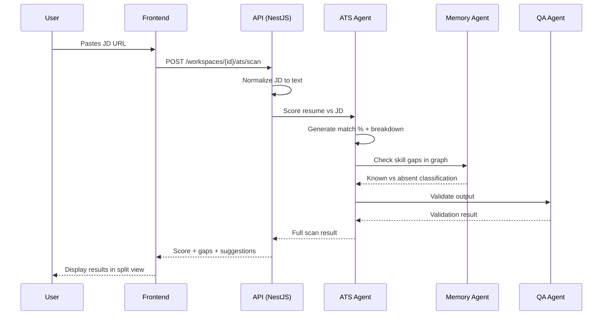

## Header
>
> **Purpose:** Detailed specification for ATS Scoring
> **Status:** 🆕 New
> **Owner:** Product Team
> **Last Updated:** 2026-07-13

## Overview

ATS Scoring gives users visibility into how their resume performs against a specific job description through the lens of Applicant Tracking Systems. The ATS Agent takes a target job description and the user's master resume (or a variant), and produces a scored analysis: an overall match percentage, a per-section breakdown (skills, experience, education, keywords), a list of missing or weak areas, and specific actionable suggestions. Unlike generic resume scanners that produce a single opaque score, Vaeloom's ATS Agent surfaces exactly what it found and why it matters for that specific role.

The scoring is grounded in the user's own memory graph, not just keyword overlap. When the ATS Agent identifies a skill gap, it checks whether the user actually has that skill in their memory graph but hasn't surfaced it in the resume. If the skill exists in memory but is missing from the resume, the suggestion is "add this skill — it's in your profile but not on your resume." If the skill is genuinely absent, the suggestion becomes a learning recommendation that feeds into the Learning Roadmap (V2). This distinction — known-but-missing vs. genuinely-absent — is what makes Vaeloom's ATS feedback qualitatively different from a keyword matcher.

The ATS screen is accessed from the Resume screen (split-view) or the Jobs screen (per-role). Users can paste a job description URL, upload a JD PDF, or type/paste text directly. The score updates in real-time as the user edits their resume, showing which changes move the needle and which don't. Every score is accompanied by a confidence indicator — low-confidence scores (incomplete JD, unusual format) are marked with a warning rather than presented as authoritative.

## Goals

- Produce per-role ATS score within 15 seconds of JD input
- Distinguish between "known but missing from resume" and "genuinely absent" skills
- Provide at least 3 specific, actionable suggestions per scan
- Support JD input via URL, file upload, or direct text paste
- Maintain <5% false-positive rate on skill-gap detection

## User Story

"As a job seeker who spends hours tailoring resumes, I want to know exactly how my resume matches a job description and what's missing so that I stop guessing which keywords matter and start fixing the gaps that actually hurt my chances."

## Acceptance Criteria

| ID | Criterion | Priority |
|----|-----------|----------|
| ATS-1 | JD input via URL, file upload (PDF/DOCX), or text paste | P0 |
| ATS-2 | Overall match percentage displayed within 15 seconds | P0 |
| ATS-3 | Per-section breakdown (skills, experience, education, keywords) | P0 |
| ATS-4 | Skills in memory but missing from resume are marked distinctly | P1 |
| ATS-5 | Skills genuinely absent are marked as learning recommendations | P1 |
| ATS-6 | Suggestions update in real-time as user edits resume | P1 |
| ATS-7 | Score comparison across multiple JDs (save scan history) | P2 |
| ATS-8 | Export scan report as PDF | P2 |
| ATS-9 | Confidence indicator on every score (low/medium/high) | P1 |
| ATS-10 | Resume edit moves score — specific changes highlighted in green/red | P2 |

## Data Model

| Entity | Fields | Usage |
|--------|--------|-------|
| `memory_records` | `id`, `type`, `content (jsonb)`, `confidence` | Skills, experience entities for gap analysis |
| `entities` (Skill) | `id`, `canonical_name`, `type` | Known skills in user's graph |
| `entities` (Relationship) | `from_entity_id`, `to_entity_id`, `relation_type` | `requires_skill` edges from JD entities |
| `applications` | `id`, `workspace_id`, `ats_score`, `ats_report_snapshot` | Cached scan per application |
| `resumes` | `id`, `content (jsonb)`, `variant_type` | Resume content being scored |

No new tables needed — ATS data is written into `memory_records` as scan results and optionally cached on `applications`.

## API Endpoints

| Method | Path | Purpose | Auth Scope |
|--------|------|---------|------------|
| `POST` | `/workspaces/{id}/ats/scan` | Submit JD for scoring | `ats:read` |
| `GET` | `/workspaces/{id}/ats/scan/{scan_id}` | Get scan results | `ats:read` |
| `GET` | `/workspaces/{id}/ats/history` | List past scans | `ats:read` |
| `POST` | `/workspaces/{id}/ats/rescan` | Re-scan with updated resume | `ats:read` |
| `GET` | `/workspaces/{id}/ats/export/{scan_id}` | Export scan report | `ats:read` |
| `DELETE` | `/workspaces/{id}/ats/scan/{scan_id}` | Delete a scan record | `ats:write` |

## Agent Interactions

| Agent | Action | When |
|-------|--------|------|
| ATS Agent | Score resume against JD, generate gap report | JD submitted |
| Resume Agent | Apply ATS suggestions to resume | User triggers "fix gaps" |
| Memory Agent | Check skill existence in graph | During gap analysis |
| Learning Agent (V2) | Receive genuine-skill-gaps for roadmap | Scan completion |
| QA Agent | Validate scan output for hallucinated gaps | Before delivery |

## Memory Impact

| Memory Type | Read | Write | Notes |
|-------------|------|-------|-------|
| Profile | Yes | No | Skills, education read for comparison |
| Document | Yes | No | Resume content read |
| Career | No | Yes | Scan results cached on application records |
| Episodic | Yes | Yes | Scan events logged with outcome |
| Preference | No | No | — |
| Working | Yes | No | Current scan session state |

## Permission Model

| Scope | Required For | Default |
|-------|-------------|---------|
| `ats:read` | Submit JD, view scores and history | Granted |
| `ats:write` | Delete scan history | Granted |
| `resume:read` | Read current resume for scoring | Granted (implicit) |
| `profile:read` | Check known skills in memory | Granted (implicit) |

Autonomy level: **Read-only** — the ATS Agent scores and reports but never modifies the resume or JD without user action.

## Error Scenarios

| Scenario | Error | User Impact | Recovery |
|----------|-------|-------------|----------|
| JD URL is behind a login wall | Cannot scrape JD | Prompt user to paste text or upload file | Fallback to text input |
| JD is an image with no extractable text | OCR fails | "Could not read this JD — try pasting the text" | OCR retry with different model; if still fails, text input |
| Resume has very few matching entities | Low confidence score | Score shown with "low confidence" badge | Suggestion to add more detail to resume first |
| Scan takes >15s due to LLM latency | Slow response | User sees progress bar with estimated time | Background processing; notify when complete |
| JD contains ambiguous or contradictory requirements | Partial parsing | Flagged sections shown with warning | User can clarify which interpretation to use |

## Performance Budgets

| Operation | Target | Measurement |
|-----------|--------|------------|
| Full scan (JD + resume) | <15s (p95) | From submit to full report |
| Skill-lookup in memory graph | <2s (p95) | Per skill check |
| Re-scan after resume edit | <5s (p95) | Incremental, reusing cached JD analysis |
| Scan history load (50 scans) | <1s (p95) | API response time |
| PDF export of scan report | <3s (p95) | From request to download |

## Security Considerations

| Concern | Mitigation |
|---------|------------|
| JD content sent to LLM for analysis | JD text is ephemeral — not stored longer than scan retention period; user can delete scan immediately |
| Resume content exposed in scan | Scan access requires same auth scope as resume read; scans are workspace-scoped |
| ATS suggestions expose salary or bias signals | ATS Agent prompt explicitly excludes consideration of demographics, salary, or protected characteristics; QA Agent validates output for biased language |
| Scan data shared across users | All ATS data is strictly workspace-scoped; no cross-user comparison without explicit opt-in |

## UI States

- **Loading:** Split layout with left (resume) and right (results) panels; right panel shows pulsing score circle and "Analyzing..."
- **Empty:** "No scans yet. Paste a job description or enter a URL to get started." Input field with URL/paste/upload options
- **Error:** Partial results shown if possible (e.g., skills scored but experience section failed); error badge on failed section with retry button
- **Edge cases:** Very short JD (<50 words) produces "low confidence" warning; extremely long JD (>5000 words) is truncated with a note; resume with no overlapping keywords shows "No direct match — consider tailoring your resume for this role"; identical scan submitted twice returns cached result with a "returning result from earlier scan" indicator

## Risks

| Risk | Likelihood | Impact | Mitigation |
|------|------------|--------|------------|
| ATS score creates false confidence in a weak resume | Medium | High | Score always shown with confidence indicator; prominent "scores are directional, not definitive" disclaimer |
| LLM invents skill gaps that don't exist | Medium | Medium | Every suggestion links to evidence in JD; user can mark "I have this skill" to correct |
| Users obsess over score rather than content quality | High | Low | Score is presented as one signal among many; emphasis on actionable suggestions over the number |
| JD parsing misses critical requirements | Low | Medium | User can manually add missed requirements; misses logged for ATS Agent improvement |
| Scan cost at scale (LLM calls per JD) | High | Medium | Cache identical JDs; debounce rapid re-scans; consider tiered model routing for frequent users |

## Scope

| | |
|---|---|
| **In Scope** | JD input via URL, file upload (PDF/DOCX), or text paste; per-section breakdown (skills, experience, education, keywords); gap analysis distinguishing "known but missing" vs. "genuinely absent" skills; real-time score updates as resume is edited; score history and comparison across multiple JDs; PDF export of scan reports; low-confidence warnings for incomplete or unusual JDs |
| **Out of Scope** | Automated resume editing (the ATS Agent suggests but never modifies); cross-user score comparison (each user's scores are private); ATS-specific formatting advice (e.g., "use this template"); integration with specific ATS platforms (Greenhouse, Lever) — scoring is against job description, not ATS behavior |

## Architecture

```mermaid
graph TD
    classDef input fill:#e3f2fd,stroke:#1565c0,color:#000,stroke-width:2px
    classDef process fill:#e8f5e9,stroke:#2e7d32,color:#000,stroke-width:1.5px
    classDef output fill:#fff3e0,stroke:#e65100,color:#000,stroke-width:1.5px

    subgraph Input["📥 Input Channels"]
        I1["URL Scraper<br/>Parse JD from URL"]
        I2["File Parser<br/>PDF/DOCX JD upload"]
        I3["Text Input<br/>Paste JD directly"]
    end

    subgraph Process["⚙️ Scoring Engine"]
        P1["ATS Agent<br/>Score resume vs JD"]
        P2["Memory Agent<br/>Check skill existence"]
        P3["QA Agent<br/>Validate for hallucination"]
    end

    subgraph Output["📊 Output"]
        O1["Match % Score"]
        O2["Per-Section Breakdown"]
        O3["Gap Report<br/>(known-missing vs absent)"]
        O4["Export PDF"]
    end

    Input --> Process --> Output
    P2 --> P3 --> O1 & O2 & O3
```



> **Diagram:** ATS Scoring architecture with 3 input channels, 3 processing agents, and 4 output types.

## Components

| Component | Responsibility | Technology | Dependencies |
|-----------|---------------|------------|--------------|
| JD Input Handler | Accept URL, file upload, or text paste; normalize to plain text | NestJS controller + Multer | File storage (S3), URL validator |
| ATS Scoring Engine | Compare resume against JD; generate per-section scores and gap analysis | FastAPI + Claude API | Memory Agent (skill lookup), QA Agent |
| Score Caching Service | Cache identical JD scans; manage scan history per workspace | Redis (TTL 24h) + PostgreSQL | Scan storage |
| Gap Analysis Module | Distinguish known-missing vs. genuinely-absent skills | FastAPI + Memory Agent | Entity graph, skill taxonomy |
| Export Service | Generate PDF scan reports | PDFKit / Puppeteer | — |
| QA Validation Module | Check for hallucinated gaps, biased language, salary signals | FastAPI + LLM eval | — |

## Workflows

### JD Submission to Score Workflow

1. User submits JD via URL, file upload, or text paste
2. Input handler normalizes JD to plain text (URL scraping or file parsing)
3. JD text sent to ATS Scoring Engine with user's current master resume
4. ATS Agent generates match percentage, per-section breakdown, and gap list
5. Memory Agent checks each identified gap against user's knowledge graph
6. Skill gaps classified: "known but missing" (exists in graph, not on resume) or "genuinely absent"
7. QA Agent validates output: checks for hallucinated gaps, biased language, score calibration
8. Results cached to scan history and returned to user within 15 seconds
9. User can click "fix gaps" to jump to Resume Agent for specific suggestions

## Sequence Diagrams



## Data Flow

1. **JD Ingestion:** URL → HTML → extracted text → plain text JD (stored ephemerally)
2. **Resume Retrieval:** User's master resume fetched from `resumes` table → JSON structure
3. **Scoring:** JD text + resume JSON → LLM prompt → structured score object (match %, per-section breakdown, gap list)
4. **Gap Classification:** Each gap sent to Memory Agent → entity lookup in `entities` table → "exists" or "absent" flag
5. **Caching:** Scan result written to `memory_records` (Episodic type) and optionally linked to `applications` record
6. **Export:** Scan result → PDF template → generated file → user download

## Non-Functional Requirements

| Requirement | Target | Measurement |
|-------------|--------|-------------|
| Scan completion time | <15s (p95) | From submit to full report |
| False positive rate on skill gaps | <5% | Validated against manual review sample |
| Score consistency (same JD + same resume) | >98% identical score | Re-scan test suite |
| Availability | 99.5% uptime | Uptime monitoring |
| Concurrent scans per user | 5 simultaneous scans | API rate limiter |

## Scalability

| Dimension | Current Limit | 10x Strategy | 100x Strategy |
|-----------|--------------|--------------|---------------|
| Concurrent scans | 50/min (single LLM key) | Model routing (Sonnet for complex, Haiku for simple) | Dedicated scan worker pool with autoscaling |
| JD cache | 10K entries (Redis) | Sharded Redis cluster | Distributed cache with regional replication |
| Scan history storage | 500 scans/user (PostgreSQL) | Archive to cold storage after 90 days | Tiered storage with automated lifecycle |
| Export generation | 10/min (single worker) | Worker pool (5-20 workers) | Dedicated export microservice |

## Monitoring

| Metric | Alert Threshold | Severity | Dashboard |
|--------|----------------|----------|-----------|
| Scan completion time (p95) | >20s for 5 minutes | Warning | ATS Performance Dashboard |
| Scan error rate | >5% over 15 minutes | Critical | ATS Operations Dashboard |
| QA Agent rejection rate | >10% of scans flagged | Warning | ATS Quality Dashboard |
| JD cache hit rate | <50% over 1 hour | Info | ATS Infrastructure Dashboard |
| Concurrent scan queue depth | >100 | Critical | ATS Performance Dashboard |

## Deployment

| Environment | Method | Trigger | Verification |
|-------------|--------|---------|--------------|
| Development | Docker Compose | `docker compose up` | Local health endpoint |
| Staging | Helm chart (K8s) | CI/CD merge to staging branch | Smoketest suite passes |
| Production | ArgoCD | Git tag `v*.*.*` | Canary (10% → 50% → 100%) |

## Configuration

| Variable | Purpose | Default | Required |
|----------|---------|---------|----------|
| `ATS_MODEL` | LLM model for scoring | `claude-sonnet-4-20250514` | Yes |
| `ATS_CONFIDENCE_THRESHOLD` | Minimum confidence for unverified skills | `0.7` | No |
| `ATS_CACHE_TTL` | JD scan cache duration (seconds) | `86400` | No |
| `ATS_MAX_CONCURRENT_SCANS` | Per-user scan concurrency limit | `5` | No |
| `ATS_EXPORT_MAX_PAGES` | Max PDF export page count | `5` | No |

## Examples

```bash
# Submit JD for scoring
curl -X POST https://api.Vaeloom.dev/v1/workspaces/{id}/ats/scan \
  -H "Authorization: Bearer $TOKEN" \
  -H "Content-Type: application/json" \
  -d '{
    "job_description_url": "https://example.com/jobs/sde-intern",
    "resume_variant_id": "res_abc123"
  }'

# Response
{
  "scan_id": "scan_xyz",
  "overall_score": 72,
  "sections": {
    "skills": { "score": 65, "missing": ["Kubernetes", "Docker"], "known_but_missing": ["React", "Python"] },
    "experience": { "score": 80, "missing": [] },
    "education": { "score": 100, "missing": [] },
    "keywords": { "score": 60, "missing": ["CI/CD", "microservices"] }
  },
  "confidence": "high",
  "suggestions": [
    "Add React to your resume — it's in your profile but missing from the document",
    "Consider a Kubernetes course (Learning Roadmap can help)",
    "Your education section fully matches this JD"
  ]
}

# Export scan as PDF
curl -X GET https://api.Vaeloom.dev/v1/workspaces/{id}/ats/export/scan_xyz \
  -H "Authorization: Bearer $TOKEN" \
  -o scan_report.pdf
```

## Best Practices

| Practice | Rationale |
|----------|-----------|
| Always review low-confidence scores manually | Scores below 70% confidence should not be used for application decisions without manual verification of the JD and resume alignment |
| Use ATS scoring as a guide, not a gate | A low score doesn't mean don't apply — it means the resume needs tailoring for that specific role |
| Run scans after every resume update | Every new project, skill, or experience added to the resume should trigger a re-scan against saved JDs to track improvement |
| Combine ATS scoring with Learning Roadmap | Skills identified as "genuinely absent" should feed directly into the Learning Roadmap for structured skill development |

## Limitations

| Limitation | Impact | Workaround | Future Resolution |
|------------|--------|------------|-------------------|
| Scoring cannot simulate all ATS platforms | Different ATS platforms (Greenhouse, Lever, Workday) parse resumes differently | Score based on universal ATS best practices rather than platform-specific behavior | Platform-specific ATS simulation profiles (V3) |
| JD must be in English for accurate scoring | Non-English JDs produce lower confidence scores | User can translate JD to English before submission | Multi-language ATS scoring (Enterprise) |
| Score is relative to user's resume completeness | Users with sparse resumes get lower scores regardless of fit | Minimum resume completeness check before scoring | Guided resume completion before ATS scoring |

## Future Improvements

| Improvement | Priority | Complexity | Timeline |
|-------------|----------|------------|----------|
| Platform-specific ATS simulation profiles | Medium | High | V3 (2028) |
| Multi-language ATS scoring | Low | High | Enterprise (2028 H2) |
| Score trend tracking over time (improvement graph) | High | Low | v1.5 (2027 H1) |
| Team/enterprise ATS benchmarking (anonymized) | Low | Medium | Enterprise (2028) |

## Related Documents

- [Features.md](../Features.md)
- [Master-Resume.md](./Master-Resume.md)
- [Tailored-Applications.md](./Tailored-Applications.md)
- [Job-Search.md](./Job-Search.md)
- [Learning-Roadmap.md](./Learning-Roadmap.md)
- `/Docs/Vaeloom-Complete-Documentation.md#7-features`
