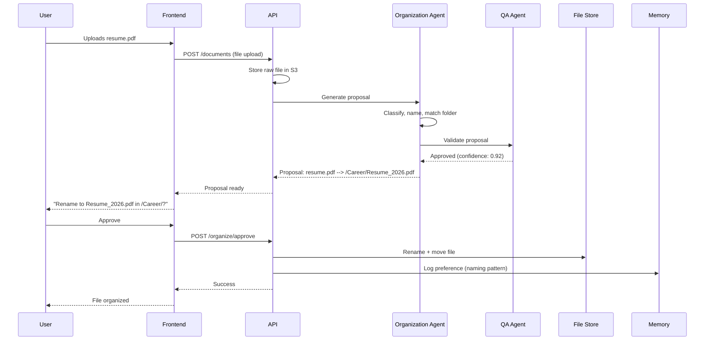

## Header
>
> **Purpose:** Detailed specification for Auto-Organization
> **Status:** 🆕 New
> **Owner:** Product Team
> **Last Updated:** 2026-07-13

## Overview

Auto-Organization solves the core problem that manual filing never happens consistently. When a user uploads files or their connected sources (Gmail, Drive, GitHub, local folder) sync new content, the Organization Agent proposes intelligent file names, folder placements, and tags based on the file's content and the user's existing memory graph. The user reviews and approves these proposals — or rejects them, which teaches the system. Over time, as approval rates climb past a configurable threshold, the agent earns autonomy to apply certain proposal types without asking.

The feature operates on every file that enters the system, whether through direct upload, connector sync, or the local folder watcher. It uses the Ingestion pipeline (parsing, OCR, code understanding) to extract structure from the raw file, then the Organization Agent classifies it against the user's existing folder taxonomy and entity graph. Proposals are presented as non-blocking cards in the Workspace screen, grouped by confidence level. The user can approve individually, in bulk, or dismiss with a corrective reason that feeds back into the agent's classification prompt.

This is the user's first sustained interaction with Vaeloom's agent system. Getting this interaction right — low friction, high trust, clear traceability for every proposal — sets the tone for every subsequent feature. A wrong rename or mis-filed document erodes trust faster than any other failure mode, which is why the system starts in suggest-only mode and earns autonomy slowly based on demonstrated accuracy within the user's specific workspace.

## Goals

- Achieve >90% proposal approval rate within 2 weeks per active user
- Reduce time-to-organized for a batch of 50 files to under 30 seconds of user attention
- Support all file types the Ingestion pipeline handles (PDF, DOCX, images, code, plain text, Markdown)
- Learn user naming and folder conventions from approvals and corrections
- Never move, rename, or archive a file without explicit user consent until autonomy is earned

## User Story

"As a student who accumulates resumes, certificates, offer letters, and project files across multiple sources, I want new files to be named consistently and placed in the right folder automatically so that I never spend 20 minutes organizing a Downloads folder before I can find what I need."

## Acceptance Criteria

| ID | Criterion | Priority |
|----|-----------|----------|
| AO-1 | Uploaded file receives a proposed name within 5 seconds | P0 |
| AO-2 | Proposed folder path is based on content analysis, not just file extension | P0 |
| AO-3 | User can approve, reject, or edit any proposal inline | P0 |
| AO-4 | User can set a preferred folder structure template during onboarding | P1 |
| AO-5 | File type icons and preview thumbnails appear in proposal cards | P1 |
| AO-6 | Batch approve/dismiss multiple proposals at once | P1 |
| AO-7 | Agent tracks per-folder-type approval rate and adjusts suggestion confidence | P2 |
| AO-8 | Autonomy upgrade offered when >95% of proposals accepted for 7 consecutive days | P2 |
| AO-9 | Corrections are logged and used to tune future proposals for that user | P2 |
| AO-10 | Archived files can be restored to original or new location within 30 days | P1 |

## Data Model

| Entity | Fields | Usage |
|--------|--------|-------|
| `documents` | `id`, `workspace_id`, `path`, `type`, `raw_storage_key`, `summary`, `source_connector_id` | Ingested file metadata |
| `document_versions` | `id`, `document_id`, `version_number`, `storage_key`, `superseded_by` | Version chain for organization proposals |
| `agent_actions` | `id`, `workspace_id`, `agent_name`, `action_type`, `input_ref`, `output_ref`, `status` | Audit log for every proposal and response |
| `permissions` | `id`, `workspace_id`, `agent_name`, `action_type`, `scope`, `granted_at` | Autonomy grant for organization actions |
| `memory_records` | `id`, `workspace_id`, `type`, `content (jsonb)`, `confidence`, `source_document_id` | User's folder taxonomy and naming preferences |

## API Endpoints

| Method | Path | Purpose | Auth Scope |
|--------|------|---------|------------|
| `GET` | `/workspaces/{id}/files` | List all files with organization state | `workspace:read` |
| `GET` | `/workspaces/{id}/files/organization/proposals` | Get pending proposals | `workspace:read` |
| `POST` | `/workspaces/{id}/files/organization/approve` | Approve one or many proposals | `workspace:write` |
| `POST` | `/workspaces/{id}/files/organization/reject` | Reject with optional correction | `workspace:write` |
| `POST` | `/workspaces/{id}/files/organization/propose` | Trigger proposal for a specific file | `workspace:write` |
| `PATCH` | `/permissions/organization-agent/autonomy` | Grant/revoke organization autonomy | `settings:write` |

## Agent Interactions

| Agent | Action | When |
|-------|--------|------|
| Organization Agent | Propose filename, folder, tags | File ingested or synced |
| Memory Agent | Extract entity from file, write to graph | Proposal approved |
| QA Agent | Validate proposal before surfacing | Before any rename/move executes |
| Orchestrator | Route file event to Organization Agent | On file.ingested event |
| Reflection Agent | Review approval rate trends | Weekly periodic pass |

## Memory Impact

| Memory Type | Read | Write | Notes |
|-------------|------|-------|-------|
| Document | Yes | Yes | Summaries, entities, embeddings written on approval |
| Profile | No | No | — |
| Career | No | No | — |
| Episodic | Yes | Yes | File organization events logged |
| Preference | Yes | Yes | Naming conventions, folder preferences learned |
| Working | Yes | No | Session context for batch approvals |

## Permission Model

| Scope | Required For | Default |
|-------|-------------|---------|
| `workspace:read` | Viewing file proposals | Granted |
| `workspace:write` | Approving/rejecting proposals | Granted |
| `organization:auto-rename` | Autonomous rename without approval | Suggest-only |
| `organization:auto-move` | Autonomous file move without approval | Suggest-only |
| `organization:archive` | Archiving files | Suggest-only |

Autonomy level: **Suggest** (default) — must propose, never execute. Earns **Full** for specific action types only when approval rate clears the threshold.

## Error Scenarios

| Scenario | Error | User Impact | Recovery |
|----------|-------|-------------|----------|
| File unparseable after 3 retries | Ingestion failure | No proposal generated for that file | Flag file for manual handling, surface in Dashboard as "requires attention" |
| Proposal generation timeout (>10s) | Agent timeout | Delayed proposal, user sees spinner | Retry on background queue, show result when ready via toast |
| Approval race condition (file moved by user before proposal) | Conflict error | Proposal references stale path | Auto-dismiss proposal, refresh file listing |
| LLM produces nonsensical filename | QA Agent flags it | Proposal shown with low-confidence badge | Surface with warning, require manual edit before approve |
| Autonomy threshold reached but revoked by user | Permission revoked | Agent returns to suggest mode silently | Log revocation, no notification needed |

## Performance Budgets

| Operation | Target | Measurement |
|-----------|--------|------------|
| Proposal generation per file | <5s (p95) | End-to-end from file.ingested event to proposal in DB |
| Batch proposal list load | <500ms (p95) | API response time for 50 proposals |
| Approval/rejection write | <200ms (p95) | API response time |
| File rename on approval | <1s (p95) | Storage rename operation |
| Full ingestion + proposal pipeline | <30s for 50 files | Background queue throughput |

## Security Considerations

| Concern | Mitigation |
|---------|------------|
| Proposal exposes file content to LLM | Only metadata and summary sent to the Organization Agent prompt; raw file content is never included in the proposal context |
| User file moved to wrong location | Every move is reversible via Archive for 30 days; user receives notification of automated moves |
| Autonomy grant exploited | Autonomy is per-action-type, not blanket; all autonomous actions still pass through the QA Agent |
| File type misclassification leads to wrong template | User can set a fallback folder for "unsure" classifications; QA Agent flags low-confidence proposals |

## UI States

- **Loading:** Skeleton cards for pending proposals; progress bar during batch approval
- **Empty:** "No files to organize. Upload files or connect a source to get started." Empty-state illustration of file folders
- **Error:** Toast on approval failure with retry button; specific proposals show error badge with reason
- **Edge cases:** Duplicate filename proposals show a "merge versions?" option; very low confidence proposals have a prominent warning badge requiring manual filename entry; proposals for files the user already manually organized are auto-dismissed after 24h

## Risks

| Risk | Likelihood | Impact | Mitigation |
|------|------------|--------|------------|
| Wrong file rename erodes user trust | Medium | High | Suggest-only mode, 30-day undo window, prominent change log |
| User ignores proposals entirely | Medium | Medium | Reduce proposal frequency after 7 days of no engagement; batch unactioned proposals into weekly digest |
| LLM hallucination of file taxonomy | Low | High | QA Agent validates every proposal against existing folder structure; confidence thresholds prevent bad suggestions |
| Autonomy granted prematurely | Low | High | Threshold is conservative (>95% for 7 days per action type) and user must explicitly confirm the upgrade |
| Large-file ingestion blocks proposal generation | Medium | Low | Background queue isolates ingestion from proposal; proposal generation uses summary, not raw bytes |

## Scope

| | |
|---|---|
| **In Scope** | File proposal generation for all ingestible types (PDF, DOCX, images, code, Markdown, plain text); user approval/rejection inline; batch approval/dismiss; per-user folder taxonomy learning; earned autonomy for specific action types (rename, move, archive); 30-day undo for all autonomous actions; QA Agent validation before execution |
| **Out of Scope** | Cross-user organization learning; automatic folder structure creation (user sets template); organization of non-ingested files (external links, unsupported formats); automatic deletion of files; organization of calendar events or emails |

## Architecture

```mermaid
graph TD
    classDef ingest fill:#e3f2fd,stroke:#1565c0,color:#000,stroke-width:2px
    classDef org fill:#e8f5e9,stroke:#2e7d32,color:#000,stroke-width:1.5px
    classDef store fill:#fff3e0,stroke:#e65100,color:#000,stroke-width:1.5px

    subgraph Ingest["📥 Ingestion Pipeline"]
        I1["Upload Handler"]
        I2["Connector Sync"]
        I3["Local Watcher"]
    end

    subgraph Org["⚙️ Organization Agent"]
        O1["File Classifier<br/>Content --> type/category"]
        O2["Naming Engine<br/>Generate proposed name"]
        O3["Folder Matcher<br/>Match to taxonomy"]
        O4["Confidence Scorer"]
    end

    subgraph Store["💾 Storage & Memory"]
        S1["Proposals Queue"]
        S2["User Preferences<br/>(naming conventions)"]
        S3["Action Audit Log"]
        S4["File Store (S3)"]
    end

    Ingest --> Org --> Store
    O4 --> QA[QA Agent] --> S1
```



> **Diagram:** Auto-Organization architecture showing ingestion → classification → naming → matching pipeline with QA validation gate.

## Components

| Component | Responsibility | Technology | Dependencies |
|-----------|---------------|------------|--------------|
| Ingestion Handler | Accept files from upload, connector sync, or watcher | NestJS + Bull queue | File storage, parsing pipeline |
| Organization Agent | Classify file, propose name + folder + tags | FastAPI + Claude API | Memory Agent, Taxonomy Store |
| QA Agent | Validate proposals for hallucination and consistency | FastAPI + LLM eval | — |
| Proposal Queue | Store pending proposals per user | Redis + PostgreSQL | — |
| Autonomy Manager | Track approval rates, grant/revoke autonomy | NestJS + PostgreSQL | Proposal Queue |
| Audit Logger | Record every proposal, approval, rejection, and autonomous action | NestJS + PostgreSQL | — |

## Workflows

### File Organization Workflow

1. File enters system via upload, connector sync, or local watcher
2. Ingestion pipeline parses file and extracts summary, entities, and type
3. Organization Agent evaluates file content against user's existing folder taxonomy
4. Agent generates proposed filename, folder path, and tags with confidence score
5. QA Agent validates proposal — low confidence proposals flagged as "requires review"
6. Proposal added to user's proposals queue and surfaced in Workspace screen
7. User approves, rejects (with optional correction), or edits proposal inline
8. Approved proposals execute immediately: file renamed, moved, tagged
9. Corrections logged to preference memory for future proposal improvement
10. Autonomy threshold (95% approval for 7 days) triggers upgrade offer

## Sequence Diagrams



## Data Flow

1. **File Arrival:** Upload → Multer → S3 raw storage (key: `workspace_id/raw/{doc_id}`)
2. **Parsing:** S3 → parsing pipeline → extracted text + entities + summary → `documents` table
3. **Proposal Generation:** Document summary → Organization Agent → proposal JSON → `agent_actions` table + proposals queue
4. **Approval:** User action → proposal pulled from queue → file rename/move in S3 → `documents` path updated
5. **Learning:** User corrections → `memory_records` (Preference type) → next proposal incorporates learned patterns
6. **Autonomy:** Approval rate counter → threshold check → `permissions` table update → agent now executes certain types autonomously

## Non-Functional Requirements

| Requirement | Target | Measurement |
|-------------|--------|-------------|
| Proposal generation time | <5s (p95) per file | End-to-end from ingested event |
| Batch proposal list load | <500ms (p95) for 50 proposals | API response time |
| Approval write | <200ms (p95) | API response time |
| Proposal accuracy | >90% approval rate | User approval rate |
| Autonomy threshold accuracy | <1% false upgrade offers | Verified against actual approval rate |

## Scalability

| Dimension | Current Limit | 10x Strategy | 100x Strategy |
|-----------|--------------|--------------|---------------|
| Files ingested per day | 10K (single queue) | Partitioned queues by file type | Regional ingestion clusters |
| Proposals per user | 500/day | Proposal TTL (7 days unactioned = auto-dismiss) | AI-driven proposal priority (ignore low-confidence) |
| Autonomy tracking | Per-user counters | Aggregated counter service | Distributed counter with Redis |
| File storage | 10TB (single S3 bucket) | Lifecycle policies + S3 intelligent tiering | Multi-region S3 with replication |

## Monitoring

| Metric | Alert Threshold | Severity | Dashboard |
|--------|----------------|----------|-----------|
| Proposal generation latency | >10s (p95) for 5 min | Warning | Organization Performance |
| Proposal approval rate | <70% for 3 days | Critical | Organization Quality |
| Autonomy upgrade rate | >50% of users in week 1 | Info | Organization Adoption |
| QA rejection rate | >15% | Warning | Organization Quality |
| File ingestion queue depth | >10K | Critical | Infrastructure |

## Deployment

| Environment | Method | Trigger | Verification |
|-------------|--------|---------|--------------|
| Development | Docker Compose | `docker compose up` | Health endpoint |
| Staging | Helm chart | CI merge to staging | Proposal E2E tests |
| Production | ArgoCD | Git tag | Canary deploy |

## Configuration

| Variable | Purpose | Default | Required |
|----------|---------|---------|----------|
| `ORG_MODEL` | LLM for organization proposals | `claude-sonnet-4-20250514` | Yes |
| `ORG_CONFIDENCE_THRESHOLD` | Min confidence for auto-suggest | `0.6` | No |
| `ORG_AUTONOMY_THRESHOLD` | Approval rate for autonomy grant | `95` | No |
| `ORG_AUTONOMY_DAYS` | Consecutive days for autonomy | `7` | No |
| `ORG_PROPOSAL_TTL` | Unactioned proposal expiry (hours) | `168` (7 days) | No |

## Examples

```bash
# Get pending proposals
curl -X GET https://api.Vaeloom.dev/v1/workspaces/{id}/files/organization/proposals \
  -H "Authorization: Bearer $TOKEN"

# Response
{
  "proposals": [
    {
      "id": "prop_1",
      "file_name": "resume (3).pdf",
      "proposed_name": "Resume_2026.pdf",
      "proposed_folder": "/Career/Resume",
      "confidence": 0.92,
      "status": "pending"
    }
  ]
}

# Approve proposal
curl -X POST https://api.Vaeloom.dev/v1/workspaces/{id}/files/organization/approve \
  -H "Authorization: Bearer $TOKEN" \
  -d '{"proposal_ids": ["prop_1"]}'
```

## Best Practices

| Practice | Rationale |
|----------|-----------|
| Review proposals early and correct mistakes | Early corrections train the system faster — invest 5 minutes on first 10 proposals to save hours later |
| Set a folder template during onboarding | A preferred folder structure gives the Organization Agent a strong baseline; templates can be changed later |
| Batch approve similar files together | Files of the same type (e.g., all PDF certificates) can be batch-approved to build the approval rate quickly |
| Use rejection reasons to teach preferences | "Wrong folder" + correct folder is more valuable for learning than a generic rejection — always include corrective feedback |

## Limitations

| Limitation | Impact | Workaround | Future Resolution |
|------------|--------|------------|-------------------|
| Organization is English-only for naming | Non-English filenames may not follow user conventions | User can always edit proposals manually | Multi-language naming support (V2) |
| Cannot propose folder structure creation | Agent can only match to existing folders, not create new ones | User creates folder structure during onboarding template setup | Agent-proposed new folders with user approval (v1.5) |
| No cross-user learning | Each user's naming preferences are learned independently | — | Anonymized pattern learning (with opt-in) in Enterprise |

## Future Improvements

| Improvement | Priority | Complexity | Timeline |
|-------------|----------|------------|----------|
| Agent-proposed new folder creation | High | Medium | v1.5 (2027 H1) |
| Multi-language filename support | Medium | Medium | V2 (2027 H2) |
| Batch organization rules ("always put PDFs from X source in folder Y") | Medium | Low | v1.5 (2027 H1) |
| Organization by document type (certificates, resumes, transcripts, code projects) | High | Low | MVP (2026 Q4) |

## Related Documents

- [Features.md](../Features.md)
- [Master-Resume.md](./Master-Resume.md)
- [Dashboard.md](./Dashboard.md)
- `/Docs/Vaeloom-Complete-Documentation.md#7-features`
- `/Docs/AI/AI-Agents.md#agent-roster`
