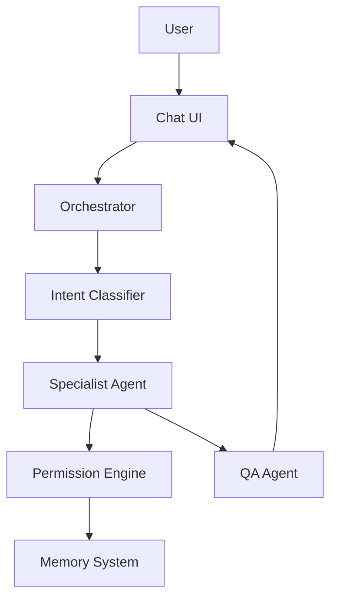
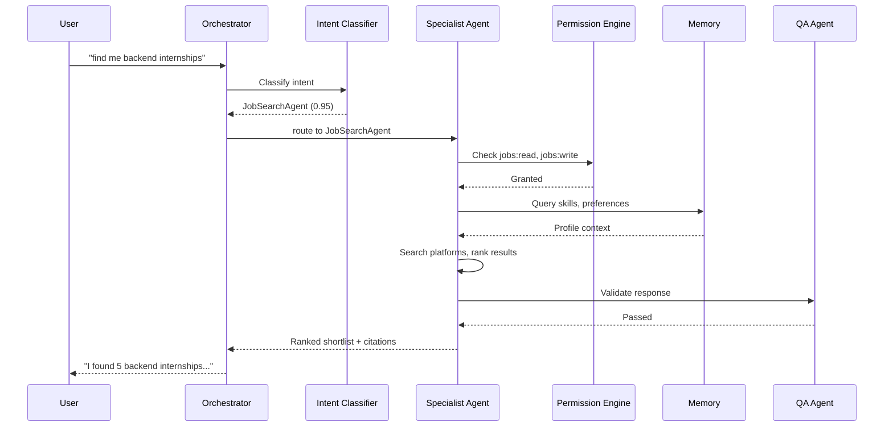

## Header
> **Purpose:** Detailed specification for Chat with Agents
> **Status:** 🆕 New
> **Owner:** Product Team
> **Last Updated:** 2026-07-13

## Overview

Chat with Agents is the conversational interface to Vaeloom's entire agent system. Rather than navigating through screens and forms, the user can type or speak a request in natural language — "find me backend internships", "update my resume with the hackathon project", "what's my schedule look like this week?" — and the Orchestrator routes it to the appropriate specialist agent, which retrieves context from memory, reasons, and responds. Every response includes source citations linking back to the specific memories or documents that informed it, making the conversation auditable and grounded.

The chat supports two modes: a default mode where the Orchestrator decides which agent to route to (based on intent classification), and an explicit mode where the user addresses a specific agent ("@JobSearch find me internships at fintech companies"). In explicit mode, the user can chain requests across agents in a single conversation — ask the Job Search Agent for matches, see results, then tell the Application Agent to start tailoring one without leaving the chat. The conversation history persists as Working memory during the session and can be saved to Episodic memory for future reference.

This feature is not a generic chatbot with RAG. Every response is generated by the specialist agent best suited to the request, using the same tool calls and memory access it uses in non-chat mode. The chat is a view into the agent system, not a separate AI capability. Source citations are mandatory and visually prominent — every factual claim in a response links to the memory record or document that supports it. If an agent cannot answer with high confidence, it asks a clarifying question rather than guessing.

## Goals

- Route user requests to the correct specialist agent with >95% accuracy
- Respond to any request within 10 seconds (p95) including agent reasoning
- Every response includes source citations for all factual claims
- Support explicit agent addressing (@AgentName) for power users
- Never hallucinate — ask clarifying questions when confidence <80%

## User Story

"As a power user who wants to move fast, I want to type what I need in natural language and have the right agent handle it so that I don't waste time navigating menus for tasks the agents can do directly."

## Acceptance Criteria

| ID | Criterion | Priority |
|----|-----------|----------|
| CH-1 | Natural language request routed to correct agent (Orchestrator) | P0 |
| CH-2 | Response time <10s (p95) for any agent | P0 |
| CH-3 | Source citations visible inline with every factual claim | P0 |
| CH-4 | Explicit agent addressing (@AgentName syntax) | P0 |
| CH-5 | Clarifying question when confidence <80% | P0 |
| CH-6 | Multi-turn conversation with context maintained | P1 |
| CH-7 | Agent chaining within conversation (e.g., search then apply) | P1 |
| CH-8 | Conversation history persists for session; savable to Episodic | P1 |
| CH-9 | Agent activity visible (typing indicator shows which agent is responding) | P1 |
| CH-10 | User can switch agents mid-conversation | P2 |

## Data Model

| Entity | Fields | Usage |
|--------|--------|-------|
| `memory_records` (Working) | `id`, `workspace_id`, `type`, `content (jsonb)` | Session conversation turns |
| `memory_records` (Episodic) | `id`, `workspace_id`, `type`, `content (jsonb)` | Saved conversation snapshots |
| `agent_actions` | `id`, `workspace_id`, `agent_name`, `action_type`, `input_ref`, `output_ref` | Audit log of chat-triggered actions |

Conversation turn schema (Working memory):
```json
{
  "conversation_id": "conv_123",
  "turns": [
    {
      "role": "user",
      "content": "find me backend internships",
      "timestamp": "...",
      "addressed_agent": "Job Search Agent"
    },
    {
      "role": "agent",
      "agent_name": "Job Search Agent",
      "content": "I found 5 backend internships matching your profile...",
      "citations": [
        {"type": "entity", "id": "skill_42", "label": "Python (skill)"},
        {"type": "application", "id": "app_7", "label": "Previous application"}
      ],
      "actions_taken": [
        {"type": "search", "platforms": ["linkedin", "indeed"], "results_count": 5}
      ],
      "timestamp": "..."
    }
  ]
}
```

## API Endpoints

| Method | Path | Purpose | Auth Scope |
|--------|------|---------|------------|
| `POST` | `/workspaces/{id}/chat/message` | Send message to Orchestrator | `chat:write` |
| `GET` | `/workspaces/{id}/chat/conversations` | List recent conversations | `chat:read` |
| `GET` | `/workspaces/{id}/chat/conversations/{conv_id}` | Get conversation history | `chat:read` |
| `DELETE` | `/workspaces/{id}/chat/conversations/{conv_id}` | Clear conversation | `chat:write` |
| `POST` | `/workspaces/{id}/chat/conversations/{conv_id}/save` | Save to Episodic memory | `chat:write` |

## Agent Interactions

| Agent | Action | When |
|-------|--------|------|
| Orchestrator | Classify intent, route to specialist agent, return response | Every message |
| Any specialist agent | Execute request, retrieve context, generate response | Routed by Orchestrator |
| QA Agent | Validate response for hallucination and policy compliance | Before delivery |
| Memory Agent | Write conversation to Working (and optionally Episodic) memory | Per turn, or on save |
| Reflection Agent | Review saved conversations for pattern detection | Periodic pass |

## Memory Impact

| Memory Type | Read | Write | Notes |
|-------------|------|-------|-------|
| Working | Yes | Yes | Active conversation turns (session-scoped) |
| Episodic | No | Yes | Saved conversations (user-initiated) |
| All other types | Yes (per agent) | No | Read by specialists as needed for context |
| Preference | Yes | Yes | Chat mode preferences, agent addressing patterns |

## Permission Model

| Scope | Required For | Default |
|-------|-------------|---------|
| `chat:write` | Send messages | Granted |
| `chat:read` | View conversation history | Granted |
| `{agent}:read` | Agent-specific read access | Per-agent grant (inherits from feature) |
| `{agent}:write` | Agent-specific write actions | Per-action consent (independent of chat) |

The chat does not grant any agent new permissions — it only provides a conversational interface to the same scoped permissions each feature already has. A chat request that triggers a write action (e.g., generate a resume variant) still requires the same permission as doing it from the Resume screen.

## Error Scenarios

| Scenario | Error | User Impact | Recovery |
|----------|-------|-------------|----------|
| Orchestrator cannot classify intent | Low confidence routing | "I'm not sure which agent can help with that. Could you rephrase?" | User rephrases or uses explicit @mention |
| Specialist agent call times out (>10s) | Timeout | "This is taking longer than expected — I'll notify you when I have an answer" | Background processing; notification on completion |
| Agent returns low-confidence response | QA Agent flags | "I found some information but I'm not fully confident. Here's what I know..." with confidence badge | User can ask for sources or request re-check |
| Tool call fails (e.g., platform API down) | Tool error | "I couldn't complete that action because [reason]. Here's what I found before the error..." | Partial results shown; user can retry |
| User asks for action they lack permission for | Permission denied | "You haven't granted me permission to do that. Would you like to grant it in Settings?" | Deep-link to Settings screen for that permission |

## Performance Budgets

| Operation | Target | Measurement |
|-----------|--------|------------|
| Message → response (simple query) | <5s (p95) | User sends → response displayed |
| Message → response (complex action) | <10s (p95) | User sends → response displayed |
| Orchestrator intent classification | <1s (p95) | Message received → agent identified |
| Agent reasoning + retrieval | <8s (p95) | Agent activated → response ready |
| QA Agent validation | <1s (p95) | Response received → validated |

## Security Considerations

| Concern | Mitigation |
|---------|------------|
| User tricks agent into exceeding permission scope via prompt injection | Every tool call is checked by Permission Engine at runtime, not just during prompt construction |
| Chat history contains sensitive intentions or decisions | Session history is Working memory (auto-expires); user-initiated save to Episodic is opt-in |
| LLM generates response with hallucinated sources | QA Agent validates every citation against actual memory records; uncited claims are flagged |
| Explicit agent addressing bypasses Orchestrator safety checks | Orchestrator still routes the request (including intent classification as additional check) even with @mentions; QA gate still applies |
| Cross-conversation context leak | Each conversation session has a unique ID; Working memory is scoped to the active session only |

## UI States

- **Loading:** Typing indicator showing which agent is responding ("Job Search Agent is thinking...") with agent icon; source citations appear incrementally as they're validated
- **Empty:** "How can I help you?" with suggested starting prompts: "Find me internships", "Update my resume", "What's on my schedule?", "Summarize my latest emails". Agent selector dropdown visible for explicit addressing
- **Error:** Inline error on failed message with "Retry" button; conversation continues after error; failed tool calls shown as system message with error details
- **Edge cases:** Very long response (>1000 words) collapseable with "Show more" link; conversation exceeds context window shows "This conversation is getting long — starting a new thread preserves context for recent messages" with option to archive; user sends empty message — ignored with no error; user addresses non-existent agent via @mention — "I don't have an agent named that. Available agents: @JobSearch, @Resume, @Schedule, @Document, @MemoryGraph"; rapid-fire messages (user sends 5 messages in 10 seconds) — queues sequentially with "processing previous message" indicator

## Risks

| Risk | Likelihood | Impact | Mitigation |
|------|------------|--------|------------|
| Users expect ChatGPT-like omniscience rather than scoped agent responses | High | Medium | Agent identity and scope shown in every response; "I can only access the tools I've been given" fallback |
| Orchestrator misroutes request, causing confusing response | Medium | High | Explicit @mention as reliable bypass; "Wrong agent?" feedback button on every response |
| Long-running agent actions block subsequent messages | Medium | Medium | Action runs in background; user gets notification when complete; other messages process in parallel |
| Users rely on chat for everything, bypassing structured screens | Low | Medium | Chat responses link back to structured screens; some complex operations (resume editing) suggest opening full screen |
| LLM provider latency causes slow responses at peak | Medium | High | Tiered model routing (fast model for simple queries, powerful model for complex); timeout with graceful degradation |

## Scope

| | |
|---|---|
| **In Scope** | Natural language routing to any specialist agent; explicit agent addressing (@AgentName); source citations on every response; clarifying questions for low-confidence queries; multi-turn conversation context; agent chaining within conversations; conversation persistence to Episodic memory (opt-in); per-agent typing indicators |
| **Out of Scope** | Voice/video chat (text-only in MVP); image generation; autonomous action without user intent — all actions require user message; conversation export outside Vaeloom; multi-user chat; agent-to-agent conversation without human context |

## Architecture



> **Diagram:** Chat architecture — user message → Orchestrator → Intent Classifier → Specialist Agent → Permission Engine → Memory → QA validation → response.

## Components

| Component | Responsibility | Technology | Dependencies |
|-----------|---------------|------------|--------------|
| Chat UI | Message input, rendering, citations, agent indicators | Next.js + React | — |
| Orchestrator | Intent classification, agent routing, response assembly | FastAPI | All specialist agents |
| Intent Classifier | Map user input to agent + action | Claude API + prompt classifier | — |
| Permission Engine | Validate every agent tool call against user's scopes | NestJS (API) | Scopes database |
| QA Agent | Validate response: citations, hallucination, policy compliance | FastAPI + LLM | Citation index |
| Conversation Store | Working memory (session) and Episodic (opt-in save) | Redis (working) + PostgreSQL (episodic) | — |

## Workflows

### Chat Message Processing Workflow

1. User sends message to chat UI
2. Orchestrator receives message and runs intent classification
3. If confidence >80%: route to identified specialist agent
4. If confidence <80%: ask clarifying question or show agent selector
5. Specialist agent processes request with tool calls (all gated by Permission Engine)
6. Agent response assembled with source citations to specific memory records
7. QA Agent validates every citation and factual claim
8. Response streamed back to chat UI with incremental citation rendering
9. Conversation turn saved to Working memory (session-scoped)

## Sequence Diagrams



## Data Flow

1. **Input:** User message → WebSocket → Orchestrator → intent classification result
2. **Context:** Working memory (current conversation turns) appended to agent prompt
3. **Execution:** Agent tool calls → Permission Engine check → Memory read → External API call
4. **Output:** Agent response + citations → QA validation → streamed to UI
5. **Storage:** Each turn written to Working memory (Redis, auto-expire 24h); opt-in save to Episodic (PostgreSQL)

## Non-Functional Requirements

| Requirement | Target | Measurement |
|-------------|--------|-------------|
| Response time (simple query) | <5s (p95) | Message to response displayed |
| Response time (complex action) | <10s (p95) | Message to response displayed |
| Intent classification accuracy | >95% | Validated against test set |
| Citation accuracy | 100% — no unverified claims | QA gate rejects uncited claims |
| Chat service availability | 99.9% | Uptime monitoring |

## Scalability

| Dimension | Current Limit | 10x Strategy | 100x Strategy |
|-----------|--------------|--------------|---------------|
| Concurrent conversations | 100/instance | Auto-scaling agent workers | Dedicated per-user conversation pods |
| Message throughput | 500/min per instance | Horizontal scaling with session affinity | Global rate limiting with regional routing |
| Working memory | 10K active sessions (Redis) | Redis Cluster | Redis Enterprise with replication |
| Intent classification | 50/min per model | Multi-model routing (cached intents) | Dedicated intent classification service |

## Monitoring

| Metric | Alert Threshold | Severity | Dashboard |
|--------|----------------|----------|-----------|
| Response time (p95) | >10s for 5 min | Critical | Chat Performance |
| Intent classification failure | >5% in 15 min | Warning | Chat Quality |
| QA rejection rate | >10% | Warning | Chat Quality |
| Active conversations | >80% of pod capacity | Warning | Chat Infrastructure |

## Deployment

| Environment | Method | Trigger | Verification |
|-------------|--------|---------|--------------|
| Development | Docker Compose | `docker compose up` | Health endpoint |
| Staging | Helm chart | CI merge | E2E test suite |
| Production | ArgoCD | Git tag | Canary (10% → 50% → 100%) |

## Configuration

| Variable | Purpose | Default | Required |
|----------|---------|---------|----------|
| `CHAT_MODEL` | LLM for agent responses | `claude-sonnet-4-20250514` | Yes |
| `CHAT_CLASSIFIER_MODEL` | Intent classification model | `claude-haiku-4-20250514` | Yes |
| `CHAT_TIMEOUT_SIMPLE` | Simple query timeout (s) | `5` | No |
| `CHAT_TIMEOUT_COMPLEX` | Complex action timeout (s) | `10` | No |
| `CHAT_WORKING_MEMORY_TTL` | Session memory expiry (hours) | `24` | No |

## Examples

```bash
# Send message to chat
curl -X POST https://api.Vaeloom.dev/v1/workspaces/{id}/chat/messages \
  -H "Authorization: Bearer $TOKEN" \
  -H "Content-Type: application/json" \
  -d '{"message": "Find me backend internships in fintech", "agent": null}'
# Response streams back with citations

# Explicit agent addressing
curl -X POST https://api.Vaeloom.dev/v1/workspaces/{id}/chat/messages \
  -H "Authorization: Bearer $TOKEN" \
  -H "Content-Type: application/json" \
  -d '{"message": "@JobSearch find me backend fintech roles"}'
```

## Best Practices

| Practice | Rationale |
|----------|-----------|
| Use @AgentName for power-user efficiency | Explicit agent addressing bypasses intent classification latency and ensures correct routing for known tasks |
| Verify citations before acting on information | Every factual claim has a source citation — click through to verify before making decisions based on agent output |
| Save important conversations to Episodic memory | Conversations about career decisions, application strategies, or goal-setting should be saved for future reference |
| Rephrase low-confidence responses rather than accepting | If the agent expresses low confidence, providing more specific context improves accuracy more than accepting a vague answer |

## Limitations

| Limitation | Impact | Workaround | Future Resolution |
|------------|--------|------------|-------------------|
| Text-only input (no voice or images) | Users cannot upload images for analysis or speak queries | File upload still works through Document Viewer | Multi-modal chat (image input, voice) in V3 |
| No agent-to-agent conversation | Complex workflows requiring multiple agents need user to chain manually | User can string requests together in one conversation | Agent chaining with user-as-context-bridge in v1.5 |
| Session memory limited to 24h | Long-running context (weeks) cannot persist | Save important context to Episodic memory | Long-term conversation memory (V2) |

## Future Improvements

| Improvement | Priority | Complexity | Timeline |
|-------------|----------|------------|----------|
| Agent chaining within single message | High | Medium | v1.5 (2027 H1) |
| Image understanding in chat | Medium | High | V3 (2028) |
| Long-term conversation memory | Medium | Medium | V2 (2027 H2) |
| Voice input support | Low | High | V3 (2028) |

## Related Documents

- [Features.md](../Features.md)
- [Dashboard.md](./Dashboard.md)
- [Document-Viewer.md](./Document-Viewer.md)
- `/Docs/AI/AI-Agents.md#orchestrator`
- `/Docs/Vaeloom-Complete-Documentation.md#5-ai-agents`
