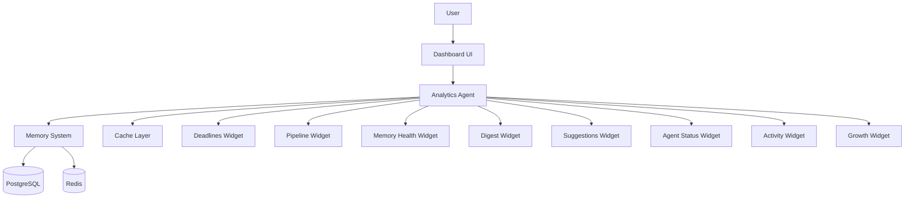
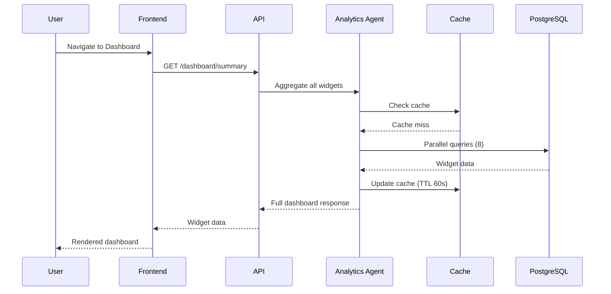

## Header
>
> **Purpose:** Detailed specification for Dashboard
> **Status:** 🆕 New
> **Owner:** Product Team
> **Last Updated:** 2026-07-13

## Overview

The Dashboard is Vaeloom's home screen — a single at-a-glance view composed entirely from other modules. It holds no unique logic of its own; every widget is a read against another feature's data, aggregated by the Analytics Agent. The Dashboard answers the user's most frequent question — "What should I pay attention to right now?" — without requiring them to open any other screen. It is the default landing page after login and the hub from which all other screens are reached.

Widgets are arranged in a responsive grid that adapts to the user's screen size and usage patterns. The top strip shows the most time-sensitive information: active conflicts count, approaching deadlines, unread digest items. Below that, a row of metric cards shows memory health (entities added this week), knowledge growth (documents processed, new skills detected), and application pipeline status (shortlisted, submitted, interview, offer counts). A suggestion panel surfaces the most important AI-generated recommendations. A per-agent status grid shows each agent's last action and current confidence level. Every widget is clickable and deep-links into its full-screen source.

The Dashboard is read-only by design. The only interactive element is the suggestion approval/dismiss flow: users can approve, dismiss, or snooze any AI-generated suggestion directly from the Dashboard without navigating elsewhere. This makes the Dashboard the primary surface for agent interaction — suggestions appear here, and the user's response feeds back into every agent's learning loop. The Dashboard also hosts the daily Gmail Digest summary, upcoming deadlines strip, and a recent activity feed showing the last 10 meaningful events across all modules.

## Goals

- Load full Dashboard with all widgets within 3 seconds (p95)
- Surface new AI suggestions within 60 seconds of generation
- Display at least 8 distinct widgets without visual clutter
- Achieve >80% of user sessions starting from Dashboard (measured)
- Provide single-click deep-links to every other screen

## User Story

"As a busy student, I want to open Vaeloom and immediately see what needs my attention — deadlines, new matches, unread digest items — so that I never have to hunt through five different screens to figure out what's important today."

## Acceptance Criteria

| ID | Criterion | Priority |
|----|-----------|----------|
| DB-1 | Dashboard loads with all widgets within 3 seconds | P0 |
| DB-2 | Deadlines strip shows next 5 upcoming events with conflict badges | P0 |
| DB-3 | Application pipeline counts (shortlisted/submitted/interviewing/offers) | P0 |
| DB-4 | Memory health card (entities added, skills tracked, documents processed) | P0 |
| DB-5 | Gmail Digest summary (unread, actionable, deadlines found) | P1 |
| DB-6 | AI suggestions panel with approve/dismiss/snooze per suggestion | P1 |
| DB-7 | Per-agent status grid (last action, confidence, autonomy level) | P1 |
| DB-8 | Recent activity feed (last 10 events across all modules) | P1 |
| DB-9 | Knowledge growth sparkline (entities and documents over time) | P1 |
| DB-10 | Widget customization (reorder, show/hide, resize) | P2 |

## Data Model

| Entity | Fields | Usage |
|--------|--------|-------|
| No new tables | — | Dashboard is an aggregate read across existing tables |

Data sources per widget:

- **Deadlines strip:** `schedule_events` filtered to next 7 days, ordered by date, with `conflict_flag = true` highlighted
- **Application pipeline:** `applications` grouped by `status`
- **Memory health:** aggregate count of `entities` created this week + `documents` added + `memory_records` by type
- **Gmail Digest:** `memory_records` where `type = 'episodic'` AND `content->source = 'gmail'` for today
- **AI suggestions:** `memory_records` where `type = 'preference'` AND `content->type = 'suggestion'` AND `content->status = 'pending'`
- **Agent status:** `agent_actions` grouped by `agent_name`, most recent per agent
- **Activity feed:** `agent_actions` last 10, across all agents, ordered by `created_at` desc
- **Knowledge growth:** `entities` created_at binned by week for last 12 weeks

## API Endpoints

| Method | Path | Purpose | Auth Scope |
|--------|------|---------|------------|
| `GET` | `/workspaces/{id}/dashboard/summary` | Full dashboard aggregation | `dashboard:read` |
| `GET` | `/workspaces/{id}/dashboard/deadlines` | Upcoming deadlines strip | `dashboard:read` |
| `GET` | `/workspaces/{id}/dashboard/pipeline` | Application pipeline counts | `dashboard:read` |
| `GET` | `/workspaces/{id}/dashboard/activity` | Recent activity feed | `dashboard:read` |
| `POST` | `/workspaces/{id}/suggestions/{suggestion_id}/respond` | Approve/dismiss/snooze suggestion | `suggestions:write` |
| `PATCH` | `/workspaces/{id}/dashboard/layout` | Save widget layout preferences | `dashboard:write` |
| `GET` | `/workspaces/{id}/dashboard/growth` | Knowledge growth time series | `dashboard:read` |

## Agent Interactions

| Agent | Action | When |
|-------|--------|------|
| Analytics Agent | Aggregate data across all memory types for Dashboard | On page load (cached with 60s TTL) |
| Recommendation Agent | Generate suggestions surfaced in Dashboard panel | Periodic pass after memory changes |
| Reflection Agent | Identify patterns that become suggestions | Weekly periodic pass |
| QA Agent | Validate suggestions before surfacing | Before suggestion appears |
| Orchestrator | Route Dashboard aggregation to Analytics Agent | Page load |

All Dashboard data is **read-only** from the agent perspective. No agents write data during Dashboard renders.

## Memory Impact

| Memory Type | Read | Write | Notes |
|-------------|------|-------|-------|
| All types | Yes (aggregate) | No | Read-only statistical aggregates |
| Preference | Yes | Yes | Widget layout preferences saved |

Dashboard is a pure read surface — it never writes to any memory type except user preference (widget layout).

## Permission Model

| Scope | Required For | Default |
|-------|-------------|---------|
| `dashboard:read` | View Dashboard | Granted |
| `dashboard:write` | Save widget layout | Granted |
| `suggestions:write` | Respond to suggestions | Granted |

Dashboard respects existing per-module read permissions — it cannot show data from a module the user hasn't granted read access to. If Gmail is not connected, the Gmail Digest widget shows "Connect Gmail to see your daily digest."

## Error Scenarios

| Scenario | Error | User Impact | Recovery |
|----------|-------|-------------|----------|
| Dashboard aggregation query times out (>3s) | Partial load | Loaded widgets shown; failed widgets show "Could not load" with retry button | Retry individually; full refresh |
| One data source unavailable (e.g., Gmail connector down) | Partial data | Specific widget shows "Unavailable — [reason]" | Connector health check runs independently |
| No data for any widget yet | Empty Dashboard | "Welcome to Vaeloom! Upload your first file or connect a source to get started." Onboarding checklist widget replaces dashboard content for first week | Auto-recover on next data sync |
| Suggestion generation returns nothing | Empty suggestions panel | "No suggestions right now — you're all caught up!" | Panel hides after 7 days of no suggestions |
| Cache miss on Dashboard aggregation | Cold load | Full aggregation query runs (slower but accurate) | Cache populated for next request |

## Performance Budgets

| Operation | Target | Measurement |
|-----------|--------|------------|
| Full Dashboard load (all widgets) | <3s (p95) | From page request to fully rendered |
| Dashboard aggregation API | <1.5s (p95) | From request to complete response |
| Suggestion response (approve/dismiss) | <500ms (p95) | API response time |
| Activity feed load | <500ms (p95) | API response time |
| Widget data refresh (auto-poll) | 60s interval | Background refresh without user action |

## Security Considerations

| Concern | Mitigation |
|---------|------------|
| Dashboard shows sensitive information on the default screen | Each widget only shows summary/aggregate data, never full content; clicking through requires appropriate scope |
| Suggestion action could trigger unintended agent behavior | Suggestion approve/dismiss writes only to preference memory; concrete agent actions require dedicated screen flow |
| Dashboard exposes data from disconnected modules | Widgets for disconnected modules show "Connect [module] to enable" state; no data leak |
| Real-time dashboard polling could leak timing information | Poll interval is randomized ±10s; dashboard data is read-only aggregate |

## UI States

- **Loading:** Dashboard skeleton with widget-outline placeholders; each widget loads independently and appears as ready; top strip loads first (most time-critical)
- **Empty:** Onboarding checklist replaces content for new users: "Upload a file → Connect Gmail → Explore your graph" with progress indicators; all widgets show their empty states with CTAs
- **Error:** Per-widget error states with retry buttons; widget shows last known good data with "(stale)" indicator if available; full Dashboard failure shows refresh button
- **Edge cases:** Very-high-activity user (50+ events/day) shows condensed activity feed with "and X more" expansion; user with no active applications shows "Start your job search" empty state on pipeline widget; Dashboard nighttime mode (10 PM-6 AM) shows tomorrow's deadlines instead of today's; first visit after long absence shows "Welcome back — here's what changed" summary widget highlighting new items since last visit

## Risks

| Risk | Likelihood | Impact | Mitigation |
|------|------------|--------|------------|
| Dashboard becomes cluttered as more modules are added | High (V2+) | Medium | Widget customization (show/hide/reorder) in Phase 2; context-aware defaults based on usage patterns |
| Dashboard aggregation query becomes slow as data grows | Medium | High | Aggregated cache with 60s TTL; materialized summary views in PostgreSQL; fallback to stale cache while refreshing |
| Users ignore suggestions panel | Medium | Medium | Suggestions decay in prominence if consistently ignored; only 2-3 suggestions visible at a time |
| Real-time data feels stale if cache TTL is too long | Medium | Low | 60s cache TTL is a reasonable balance; user can manually refresh |
| New users overwhelmed by empty Dashboard | High | Medium | Onboarding checklist replaces Dashboard content for first week; progressive widget reveal as user activates features |

## Scope

| | |
|---|---|
| **In Scope** | 8+ widget types (deadlines, pipeline, memory health, Gmail digest, AI suggestions, agent status, activity feed, knowledge growth); responsive grid layout; suggestion approve/dismiss/snooze; deep-links to all source screens; widget customization (reorder, show/hide); first-week onboarding checklist replacement |
| **Out of Scope** | Dashboard-level data editing (all actions redirect to source screens); push notifications from Dashboard; cross-user Dashboard views; real-time collaborative Dashboard; third-party widget plugins |

## Architecture



> **Diagram:** Dashboard architecture — single Analytics Agent aggregates across all memory types to serve 8 widgets with caching.

## Components

| Component | Responsibility | Technology |
|-----------|---------------|------------|
| Analytics Agent | Aggregate data across memory types for all widgets | FastAPI |
| Cache Layer | Store aggregated widget data with 60s TTL | Redis |
| Widget Grid | Responsive layout container | React + CSS Grid |
| Suggestion Panel | Render AI suggestions with approve/dismiss/snooze | React |
| Onboarding Checklist | Replace Dashboard for first-week users | React |

## Workflows

### Dashboard Load Workflow

1. User navigates to Dashboard (default landing page)
2. Analytics Agent receives aggregation request
3. Cache check: if cached data exists and is <60s old, return immediately
4. If cache miss: run parallel queries across all memory types
5. Deadlines: `schedule_events` next 30 days, ordered by date
6. Pipeline: `applications` grouped by status (shortlisted → offer)
7. Memory health: `entities` count this week + `documents` added
8. Suggestions: `memory_records` where type=preference AND status=pending
9. All widget data returned in single response, rendered independently

## Sequence Diagrams



## Data Flow

1. **Request:** User hits Dashboard → API → Analytics Agent
2. **Cache:** Redis key `dashboard:{workspace_id}` — hit returns cached, miss triggers aggregation
3. **Aggregation:** 8 parallel PostgreSQL queries across `schedule_events`, `applications`, `entities`, `agent_actions`, `memory_records`
4. **Response:** Combined widget object returned → Frontend renders each widget independently
5. **Refresh:** Each widget auto-refreshes on 60s interval; manual refresh button available

## Non-Functional Requirements

| Requirement | Target | Measurement |
|-------------|--------|-------------|
| Full Dashboard load | <3s (p95) | Page request to fully rendered |
| Aggregation API | <1.5s (p95) | Request to complete response |
| Data freshness | <60s staleness | Auto-poll interval |
| Suggestion response | <500ms (p95) | Approve/dismiss API |
| Cache hit rate | >80% | Cache stats monitoring |

## Scalability

| Dimension | Current Limit | 10x Strategy | 100x Strategy |
|-----------|--------------|--------------|---------------|
| Aggregation queries | 8 parallel queries/user | Materialized views for common queries | Pre-computed daily aggregates |
| Cache storage | 10K active dashboards | Redis Cluster with eviction | Regional Redis with replication |
| Widget count | 8 widgets | Virtual scrolling for 15+ widgets | Configurable widget plugins |

## Monitoring

| Metric | Alert Threshold | Severity | Dashboard |
|--------|----------------|----------|-----------|
| Dashboard load time | >5s (p95) for 5 min | Critical | Frontend Performance |
| Cache hit rate | <60% | Warning | Dashboard Infrastructure |
| Suggestion response | >1s (p95) | Warning | Dashboard Performance |
| Widget load failure | >5% of requests | Critical | Dashboard Operations |

## Deployment

| Environment | Method | Trigger | Verification |
|-------------|--------|---------|--------------|
| Development | Docker Compose | `docker compose up` | Health endpoint |
| Staging | Helm chart | CI merge | E2E tests |
| Production | ArgoCD | Git tag | Canary deploy |

## Configuration

| Variable | Purpose | Default | Required |
|----------|---------|---------|----------|
| `DASHBOARD_CACHE_TTL` | Widget cache duration (s) | `60` | No |
| `DASHBOARD_MAX_WIDGETS` | Maximum widget count | `12` | No |
| `DASHBOARD_REFRESH_INTERVAL` | Auto-poll interval (s) | `60` | No |
| `DASHBOARD_ONBOARDING_DAYS` | Days before switching from onboarding to dashboard | `7` | No |

## Examples

```bash
# Get full dashboard
curl -X GET https://api.Vaeloom.dev/v1/workspaces/{id}/dashboard/summary \
  -H "Authorization: Bearer $TOKEN"

# Approve suggestion from dashboard
curl -X POST https://api.Vaeloom.dev/v1/workspaces/{id}/suggestions/{suggestion_id}/respond \
  -H "Authorization: Bearer $TOKEN" \
  -d '{"action": "approve"}'
```

## Best Practices

| Practice | Rationale |
|----------|-----------|
| Use Dashboard as daily starting point | The Dashboard surfaces what needs attention — start every session here before navigating to specific screens |
| Act on suggestions from Dashboard | Approving or dismissing suggestions from Dashboard is the fastest way to train all agents |
| Customize widget layout for your workflow | Reorder widgets so most-used (deadlines, pipeline) appear above the fold; hide unused widgets |
| Check agent status widget weekly | The per-agent status grid shows last action and confidence — review to identify agents that may need attention |

## Limitations

| Limitation | Impact | Workaround | Future Resolution |
|------------|--------|------------|-------------------|
| Dashboard is read-only (no inline actions except suggestions) | Users must navigate to source screens for most actions | Deep-links take users directly to the relevant screen section | Inline actions for common operations (v1.5) |
| Widgets show aggregate data only | Users cannot see full details without clicking through | Widgets are designed as summaries with clear "view all" links | Expandable widgets with inline detail (V2) |
| No custom widget creation | Users cannot add third-party data sources to Dashboard | — | Plugin/MCP widget marketplace (Enterprise) |

## Future Improvements

| Improvement | Priority | Complexity | Timeline |
|-------------|----------|------------|----------|
| Inline actions for common operations | High | Medium | v1.5 (2027 H1) |
| Expandable widgets with inline detail | Medium | Medium | V2 (2027 H2) |
| Widget plugin system for third-party data | Low | High | Enterprise (2028) |
| Predictive widget ("what you'll need tomorrow") | Low | Medium | V3 (2028) |

## Related Documents

- [Features.md](../Features.md)
- [Gmail-Digest.md](./Gmail-Digest.md)
- [Deadline-Detection.md](./Deadline-Detection.md)
- [Chat.md](./Chat.md)
- `/Docs/Vaeloom-Complete-Documentation.md#8-screens`
- `/Docs/Frontend/Dashboard.md`
