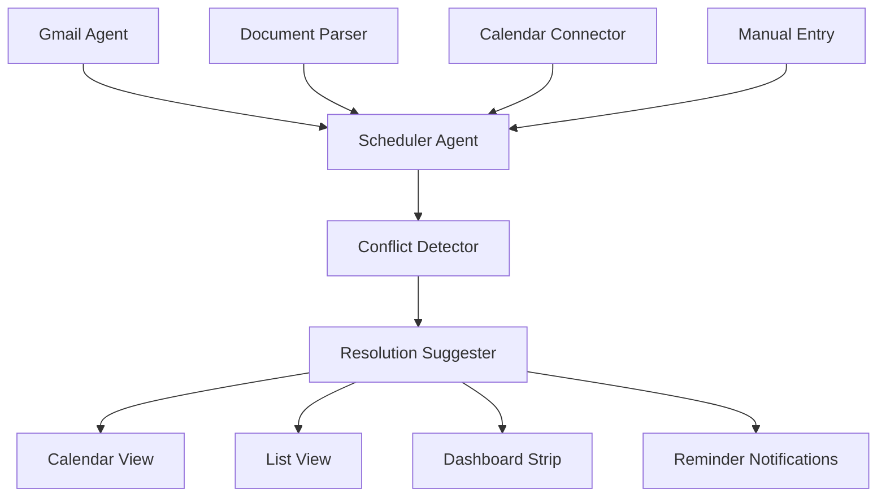
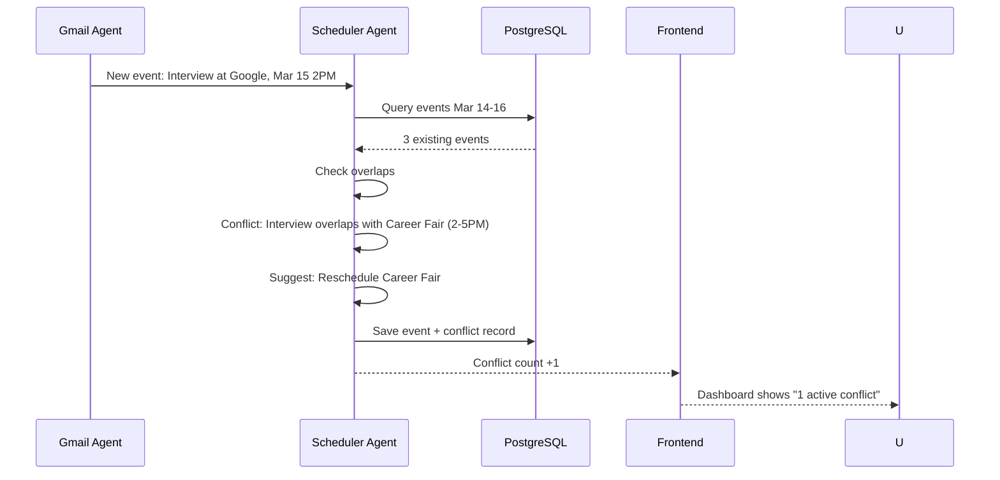

## Header
> **Purpose:** Detailed specification for Deadline & Conflict Detection
> **Status:** 🆕 New
> **Owner:** Product Team
> **Last Updated:** 2026-07-13

## Overview

Deadline & Conflict Detection gives the user a unified, automatically-maintained schedule built from every source the system has access to: emails (application deadlines, interview dates extracted by the Gmail Agent), the user's connected calendar, uploaded documents (offer deadlines, event dates), and manually created entries. The Scheduler Agent continuously monitors this unified schedule for conflicts — overlapping events, insufficient buffer time between critical items, deadlines too close together — and surfaces them before they become problems.

The system distinguishes between hard deadlines (application due dates, interview times, offer acceptance windows) and soft events (suggested study blocks, optional networking events). Conflicts between two hard deadlines are flagged at the highest priority with a mandatory review prompt. Conflicts involving one hard and one soft event suggest moving the soft event. The agent can autonomously schedule reminders for hard deadlines but never moves or deletes a user-created event without explicit permission.

The Schedule screen presents this information in both calendar and list views, with a conflict indicator strip at the top showing how many active conflicts exist. Each conflict includes a suggested resolution (e.g., "You have 45 minutes between Interview A ending and Interview B starting — consider requesting a time change for one of them") that the user can accept, modify, or dismiss. Conflicts that are resolved or dismissed feed back into the agent's understanding of the user's preferences.

## Goals

- Detect all scheduling conflicts involving hard deadlines with >99% recall
- Auto-create schedule events from emails and documents within 2 minutes of detection
- Surface conflicts at least 48 hours before the conflicting events begin
- Never modify or delete a user-created event without explicit permission
- Achieve <1% false positive rate on conflict detection

## User Story

"As a student juggling multiple internship applications with different deadlines and interview slots, I want Vaeloom to automatically find scheduling conflicts so that I never accidentally double-book an interview or miss an offer deadline."

## Acceptance Criteria

| ID | Criterion | Priority |
|----|-----------|----------|
| DD-1 | Events auto-created from Gmail (deadline emails, interview confirmations) | P0 |
| DD-2 | Events auto-created from documents (offer letters, application PDFs) | P0 |
| DD-3 | Conflicts detected between any two events on same day | P0 |
| DD-4 | Conflict severity rated (hard-hard, hard-soft, soft-soft) | P0 |
| DD-5 | Suggested resolution shown per conflict | P1 |
| DD-6 | Calendar view and list view of all events | P1 |
| DD-7 | Conflict strip on Dashboard showing active conflict count | P1 |
| DD-8 | User can add manual events | P1 |
| DD-9 | Connected calendar (Google Calendar) syncs events | P2 |
| DD-10 | Recurring deadline pattern detection (e.g., "monthly application cycles") | P2 |

## Data Model

| Entity | Fields | Usage |
|--------|--------|-------|
| `schedule_events` | `id`, `workspace_id`, `source`, `title`, `description`, `date`, `end_date`, `type` (hard/soft), `category`, `conflict_flag`, `conflict_resolution` | All schedule events |
| `memory_records` | `id`, `workspace_id`, `type`, `content (jsonb)`, `source_document_id` | Deadlines extracted from documents |
| `agent_actions` | `id`, `workspace_id`, `agent_name`, `action_type`, `output_ref` | Conflict detection and resolution audit |
| `connectors` | `id`, `workspace_id`, `type`, `last_synced_at` | Calendar connector state |

Schedule event types: `application_deadline`, `interview`, `offer_deadline`, `career_event`, `personal`, `reminder`, `auto_detected`

## API Endpoints

| Method | Path | Purpose | Auth Scope |
|--------|------|---------|------------|
| `GET` | `/workspaces/{id}/schedule` | Get all events (with date range filter) | `schedule:read` |
| `POST` | `/workspaces/{id}/schedule/event` | Create event manually | `schedule:write` |
| `PATCH` | `/workspaces/{id}/schedule/event/{event_id}` | Update event | `schedule:write` |
| `DELETE` | `/workspaces/{id}/schedule/event/{event_id}` | Delete event | `schedule:write` |
| `GET` | `/workspaces/{id}/schedule/conflicts` | Get all active conflicts | `schedule:read` |
| `POST` | `/workspaces/{id}/schedule/conflicts/{conflict_id}/resolve` | Accept suggested resolution | `schedule:write` |
| `POST` | `/workspaces/{id}/schedule/conflicts/{conflict_id}/dismiss` | Dismiss conflict | `schedule:write` |
| `GET` | `/workspaces/{id}/schedule/summary` | Dashboard conflict summary | `schedule:read` |

## Agent Interactions

| Agent | Action | When |
|-------|--------|------|
| Scheduler Agent | Detect conflicts, suggest resolutions, track deadlines | On new event or scheduled pass |
| Gmail Agent | Extract dates and create schedule events | On email classification |
| Memory Agent | Write conflict resolutions back to preference memory | On conflict resolution |
| Reminder Agent | Send notifications for approaching hard deadlines | Configurable lead time (default 24h, 2h) |
| QA Agent | Validate conflict detection logic | Before surfacing critical conflicts |
| Orchestrator | Route date-extracted events to Scheduler Agent | Event.created from any source |

## Memory Impact

| Memory Type | Read | Write | Notes |
|-------------|------|-------|-------|
| Episodic | Yes | Yes | Schedule events, deadlines logged |
| Preference | Yes | Yes | Conflict resolution preferences, accepted buffer times |
| Career | Yes | Yes | Deadlines linked to application records |
| Profile | No | No | — |
| Document | Yes | No | Source documents for extracted deadlines |
| Working | Yes | No | Current schedule view session |

## Permission Model

| Scope | Required For | Default |
|-------|-------------|---------|
| `schedule:read` | View schedule and conflicts | Granted |
| `schedule:write` | Create, update, delete events | Granted |
| `schedule:auto-create` | Auto-create events from detected deadlines | Suggest-only |
| `schedule:auto-move` | Autonomous event rescheduling | Never granted (MVP) |
| `reminder:send` | Send deadline notifications | Full (notify only) |

Autonomy level: **Suggest / Full for reminders** — auto-creates events from detected deadlines in suggest mode (user confirms before event is added to calendar). Reminders are Full (notify only — no action beyond notification).

## Error Scenarios

| Scenario | Error | User Impact | Recovery |
|----------|-------|-------------|----------|
| Date extracted from email is ambiguous (e.g., "next Friday") | Low confidence date | Event created with "estimated — confirm date" flag | User taps to confirm; correction logged |
| Calendar connector returns events with no timezone | Missing timezone | Event shown with "timezone unknown — verify" badge | User assigns timezone; preference learned for future |
| Two auto-detected events from same source email | Duplicate merge | Duplicate events detected; only one kept | Conflict resolution suggests removal; user approves |
| LLM hallucinates a deadline from non-deadline content | False event | Event created with low confidence score | User dismisses; dismissal teaches classifier |
| Conflict resolution suggestions contradict user preference | Unhelpful suggestion | Resolution shown but user ignores | Agent learns from ignored suggestions; adjusts future proposals |

## Performance Budgets

| Operation | Target | Measurement |
|-----------|--------|------------|
| Conflict detection on new event | <2s (p95) | From event creation to conflict check |
| Full schedule load (90 days) | <1s (p95) | API response time |
| Conflict resolution save | <200ms (p95) | API response time |
| Calendar connector sync | <30s (p95) | From trigger to events loaded |
| Deadline extraction from email | <10s (p95) | From email classification to event proposal |

## Security Considerations

| Concern | Mitigation |
|---------|------------|
| Calendar data exposed to unauthorized users | All schedule data workspace-scoped; calendar connector read-only by default |
| Auto-created events leak application schedule | Event titles are generic ("Interview" not "Interview at Google") unless user chooses detail level |
| Connected calendar token compromised | Calendar connector scope limited to reading events, not writing or deleting |
| LLM-inferred dates incorrect leading to missed deadlines | Low-confidence dates require user confirmation; missed deadline events trigger priority notification |
| Conflict resolution suggests event deletion | Agent never deletes events; suggest-mode only for event modifications |

## UI States

- **Loading:** Calendar skeleton with gradient bars; conflict count shows pulsing number
- **Empty:** "No upcoming deadlines. As you add events or connect your calendar, deadlines will appear here." Empty calendar illustration with "Connect Calendar" CTA
- **Error:** Partial schedule shown; "Calendar sync failed for [source] — last synced [time]" banner; individual malformed events show "Could not parse" with raw data shown
- **Edge cases:** Conflicting events across timezones are normalized to user's local time with original timezone shown in parentheses; all-day events vs. timed events use buffer check (hard deadline on same day as all-day event = potential conflict); events with no end time are assumed 1 hour; recurring events are unrolled for conflict detection up to 90 days; user in a high-volume week (>15 events) gets a "Busy week ahead — review conflicts" banner

## Risks

| Risk | Likelihood | Impact | Mitigation |
|------|------------|--------|------------|
| User misses a hard deadline because it wasn't auto-detected | Low | Critical | Multiple detection paths (email + document + manual); user receives reminder regardless of detection path |
| False conflict alarms desensitize user to real conflicts | Medium | Medium | Hard-hard conflicts always surfaced; soft conflicts show count but don't alert individually |
| Calendar connector fails silently | Medium | High | Connector health check runs hourly; stale connector flagged on Dashboard within 1 hour of failure |
| User becomes dependent on reminders, stops checking manually | Low | Medium | Reminders supplement, don't replace, the schedule view; user must open schedule to dismiss critical conflicts |
| Timezone confusion causes missed interview | Medium | Critical | All extracted times stored with UTC + original timezone; user shown local time prominently; timezone preference configurable |

## Scope

| | |
|---|---|
| **In Scope** | Auto-created events from Gmail (deadlines, interviews); auto-created events from documents (offer letters, application PDFs); conflict detection between any two events (hard-hard, hard-soft, soft-soft); suggested conflict resolutions; calendar + list views; Dashboard conflict strip; manual event creation; connected calendar sync (Google Calendar); recurring deadline pattern detection |
| **Out of Scope** | Auto-scheduling of new events (suggest-only for modifications); calendar sharing with other users; meeting scheduling assistant (send/receive invites); timezone conversion beyond user's configured timezone; integration with non-Google calendars (Outlook, Apple) in MVP |

## Architecture



> **Diagram:** Deadline Detection architecture — 4 input sources feed the Scheduler Agent, which detects conflicts and suggests resolutions.

## Components

| Component | Responsibility | Technology |
|-----------|---------------|------------|
| Scheduler Agent | Conflict detection, resolution suggestion, deadline tracking | FastAPI + Claude API |
| Event Store | Unified schedule events table | PostgreSQL |
| Calendar Connector | Sync Google Calendar events | NestJS + Google API |
| Conflict Detector | Compare events for overlaps, buffer violations | FastAPI |
| Resolution Suggester | Generate suggested resolutions per conflict | FastAPI + Claude API |
| Reminder Engine | Send notifications for approaching deadlines | FastAPI + Push/Email |

## Workflows

### Conflict Detection Workflow

1. New event created (auto-detected, synced, or manual)
2. Scheduler Agent compares against all existing events within ±48 hours
3. For each pair, check: time overlap, insufficient buffer (<30 min between hard deadlines), same-day hard-hard collisions
4. Conflict severity assigned: hard-hard (critical), hard-soft (warning), soft-soft (info)
5. Resolution suggestion generated: "Move soft event" or "Request time change for one hard deadline"
6. Conflict persisted to `schedule_events.conflict_flag` with resolution proposal
7. Dashboard conflict strip updated with new count

## Sequence Diagrams



## Data Flow

1. **Event Detection:** Email/document → entity extraction → date/time parsed → `schedule_events` row
2. **Conflict Detection:** New event → query overlapping window → pairwise comparison → conflict record created
3. **Resolution:** Conflict → LLM suggestion → stored on conflict record → user reviews
4. **Display:** Dashboard queries `schedule_events` with `conflict_flag=true` → rendered as conflict strip
5. **Reminder:** Cron job checks `schedule_events` within alert window → sends notification

## Non-Functional Requirements

| Requirement | Target | Measurement |
|-------------|--------|-------------|
| Conflict detection latency | <2s (p95) per new event | Event creation to conflict check |
| Schedule load (90 days) | <1s (p95) | API response time |
| Deadline extraction accuracy | >90% (verified against Scheduler) | Manual audit sample |
| False positive rate on conflicts | <1% | User dismissal rate |
| Calendar sync latency | <30s (p95) | Trigger to events loaded |

## Scalability

| Dimension | Current Limit | 10x Strategy | 100x Strategy |
|-----------|--------------|--------------|---------------|
| Events per user | 500/year | Archive events >1 year old | Automated lifecycle policies |
| Calendar sync users | 1K per connector instance | Connector worker pool | Dedicated sync service per calendar provider |
| Conflict checks per day | 50K | Batch conflict detection on write | Incremental conflict detection (delta-only) |

## Monitoring

| Metric | Alert Threshold | Severity | Dashboard |
|--------|----------------|----------|-----------|
| Conflict detection latency | >5s for 5 min | Warning | Schedule Performance |
| Deadline extraction accuracy | <85% weekly | Critical | Schedule Quality |
| Calendar sync failure | >5% of sync attempts | Critical | Connector Health |
| False positive rate | >3% | Warning | Schedule Quality |

## Deployment

| Environment | Method | Trigger | Verification |
|-------------|--------|---------|--------------|
| Development | Docker Compose | `docker compose up` | Health endpoint |
| Staging | Helm chart | CI merge | E2E tests |
| Production | ArgoCD | Git tag | Canary deploy |

## Configuration

| Variable | Purpose | Default | Required |
|----------|---------|---------|----------|
| `SCHEDULE_CONFLICT_BUFFER_MIN` | Minimum buffer between hard deadlines (min) | `30` | No |
| `SCHEDULE_REMINDER_LEAD_HOURS` | Reminder lead time before deadline | `24` | No |
| `SCHEDULE_RECURRING_MAX_DAYS` | Max days to unroll recurring events | `90` | No |
| `SCHEDULE_SYNC_INTERVAL` | Calendar connector sync interval (min) | `15` | No |

## Examples

```bash
# Get active conflicts
curl -X GET https://api.Vaeloom.dev/v1/workspaces/{id}/schedule/conflicts \
  -H "Authorization: Bearer $TOKEN"

# Resolve a conflict
curl -X POST https://api.Vaeloom.dev/v1/workspaces/{id}/schedule/conflicts/{conflict_id}/resolve \
  -H "Authorization: Bearer $TOKEN" \
  -d '{"resolution": "reschedule_career_fair"}'
```

## Best Practices

| Practice | Rationale |
|----------|-----------|
| Review conflicts within 24 hours of detection | Conflicts become harder to resolve the closer the conflicting events get — early resolution maximizes options |
| Set buffer preferences in Settings | Configure minimum buffer time between events (30 min default) to match your personal scheduling style |
| Connect calendar for complete conflict coverage | Without calendar sync, only email-extracted and manually entered events are checked for conflicts |
| Use manual events for non-digital commitments | Add events from offline sources (paper offers, in-person notices) manually to ensure full conflict coverage |

## Limitations

| Limitation | Impact | Workaround | Future Resolution |
|------------|--------|------------|-------------------|
| Only Google Calendar sync in MVP | Outlook and Apple Calendar users get manual-entry-only coverage | User can export .ics from other calendars and upload | Multi-calendar sync (Outlook, Apple) in V2 |
| No cross-user conflict detection | Team schedules cannot be checked for meeting conflicts | N/A — single-user feature by design | Enterprise: team calendar conflict detection (Enterprise) |
| Recurring event detection limited to 90-day horizon | Very-long-cycle events (yearly, multi-year) may not be unrolled | Manually add critical annual events | Extended recurrence unrolling (v1.5) |

## Future Improvements

| Improvement | Priority | Complexity | Timeline |
|-------------|----------|------------|----------|
| Outlook and Apple calendar sync | High | Medium | V2 (2027 H2) |
| Extended recurrence unrolling (365 days) | Medium | Low | v1.5 (2027 H1) |
| Smart scheduling suggestions (best time for new events) | Low | High | V3 (2028) |
| Team calendar conflict detection | Low | High | Enterprise (2028) |

## Related Documents

- [Features.md](../Features.md)
- [Gmail-Digest.md](./Gmail-Digest.md)
- [Dashboard.md](./Dashboard.md)
- `/Docs/Vaeloom-Complete-Documentation.md#7-features`
- `/Docs/AI/AI-Agents.md#scheduler-agent`
