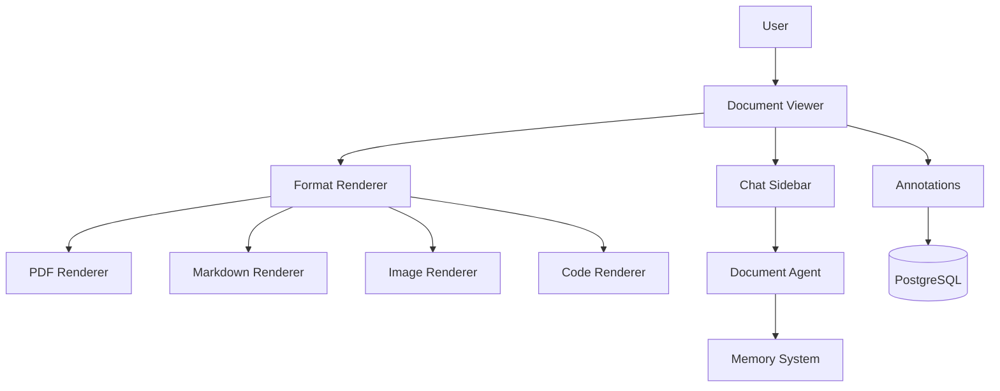
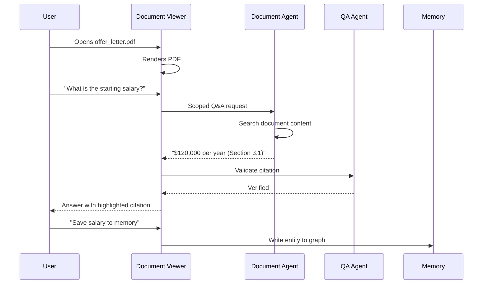

## Header
> **Purpose:** Detailed specification for In-App Document Viewer
> **Status:** 🆕 New
> **Owner:** Product Team
> **Last Updated:** 2026-07-13

## Overview

The In-App Document Viewer eliminates context-switching by letting users read documents directly inside Meridian. Every file the system ingests — PDFs, DOCX, images, code files, Markdown, plain text — renders inline with a consistent reading experience. On top of the viewer sits an annotation layer (highlighting, notes, bookmarks) and a chat sidebar scoped to the current document. The Document Agent powers the chat: users ask questions about the document's content, and the agent answers using the parsed document structure plus the user's broader memory context when relevant.

The viewer is accessible from the Workspace screen (click any file to open), the Resume screen (click source document links), and the Knowledge screen (dedicated full-viewer mode). It uses the same parsed document produced by the Ingestion pipeline, so it works on any file the system has already processed — no format-specific rendering engine needed beyond the initial parser. For files that failed parsing, the viewer falls back to showing the raw text or a "Could not parse — download original" option.

The chat sidebar is the bridge between document reading and the agent system. As the user reads, the Document Agent pre-indexes the document's entities into the working memory context, so the user can ask questions like "What were the key findings?" or "When was this written?" and get answers grounded in the specific document. The chat is purely read-only — it never modifies the document. If the user wants to extract an entity to their memory, they can do so with an explicit "Save to memory" action on a chat response.

## Goals

- Render PDF, DOCX, image (text via OCR), code, Markdown, and plain text inline
- Load and render any document in <2s regardless of format
- Provide scoped document Q&A with <5s response time
- Support highlighting, inline notes, and page/line bookmarks
- Never modify the original document — annotations are separate overlay data

## User Story

"As a student reviewing offer letters and course materials, I want to read documents without leaving Meridian and ask questions about their content so that I stay in my workflow instead of switching between a dozen different file viewers."

## Acceptance Criteria

| ID | Criterion | Priority |
|----|-----------|----------|
| DV-1 | PDF rendering with page navigation, zoom, and text selection | P0 |
| DV-2 | Markdown and plain text rendering with syntax highlighting | P0 |
| DV-3 | Image rendering with zoom-to-fit | P0 |
| DV-4 | Chat sidebar scoped to current document with Q&A | P0 |
| DV-5 | Highlight text with color-coded highlights (yellow, green, red, blue) | P1 |
| DV-6 | Add inline notes anchored to specific text or position | P1 |
| DV-7 | Bookmark pages/sections for quick navigation | P1 |
| DV-8 | Document entity list sidebar (entities extracted from this doc) | P1 |
| DV-9 | "Save to memory" action on chat responses | P2 |
| DV-10 | Code file rendering with language-specific syntax coloring | P1 |
| DV-11 | DOCX rendering (parsed to structured content) | P1 |

## Data Model

| Entity | Fields | Usage |
|--------|--------|-------|
| `documents` | `id`, `workspace_id`, `type`, `raw_storage_key`, `summary`, `parsed_storage_key` | Document metadata and parsed content |
| `memory_records` | `id`, `workspace_id`, `type`, `content (jsonb)`, `source_document_id` | Entities extracted from this document |
| `documents` (annotations) | Annotations stored as JSONB metadata on document record | Highlights, notes, bookmarks |

Annotation schema (stored on `documents` record as `annotations` JSONB):
```json
{
  "highlights": [
    {"id": "hl_1", "color": "yellow", "text": "selected text", "page": 3, "position": {"x": 0.1, "y": 0.2, "w": 0.8, "h": 0.05}, "created_at": "...", "note": "optional note"}
  ],
  "notes": [
    {"id": "nt_1", "text": "inline note", "page": 5, "position": {"x": 0.5, "y": 0.3}, "created_at": "..."}
  ],
  "bookmarks": [
    {"id": "bm_1", "page": 10, "label": "Offer terms", "created_at": "..."}
  ]
}
```

## API Endpoints

| Method | Path | Purpose | Auth Scope |
|--------|------|---------|------------|
| `GET` | `/workspaces/{id}/documents/{doc_id}` | Get document metadata | `documents:read` |
| `GET` | `/workspaces/{id}/documents/{doc_id}/content` | Get parsed content for rendering | `documents:read` |
| `GET` | `/workspaces/{id}/documents/{doc_id}/raw` | Download original file | `documents:read` |
| `POST` | `/workspaces/{id}/documents/{doc_id}/chat` | Ask question about document | `documents:read` |
| `GET` | `/workspaces/{id}/documents/{doc_id}/entities` | List entities extracted from document | `documents:read` |
| `PATCH` | `/workspaces/{id}/documents/{doc_id}/annotations` | Save highlights/notes/bookmarks | `documents:write` |
| `GET` | `/workspaces/{id}/documents/{doc_id}/annotations` | Get saved annotations | `documents:read` |

## Agent Interactions

| Agent | Action | When |
|-------|--------|------|
| Document Agent | Power document-scoped Q&A in chat sidebar | User asks question |
| Memory Agent | Extract entities from new documents | Document uploaded (existing pipeline) |
| Organization Agent | Propose name/folder for uploaded documents | Document uploaded |
| QA Agent | Validate document Q&A answers against content | Before chat response delivery |
| Orchestrator | Route document Q&A to Document Agent | Chat question submitted |

## Memory Impact

| Memory Type | Read | Write | Notes |
|-------------|------|-------|-------|
| Document | Yes | No | Document content and parsed structure for rendering |
| Profile | No | No | — |
| Career | No | No | — |
| Episodic | Yes | Yes | Annotation saves, document views logged |
| Preference | Yes | Yes | Annotation style preferences, viewer settings |
| Working | Yes | Yes | Chat context scoped to current document |

## Permission Model

| Scope | Required For | Default |
|-------|-------------|---------|
| `documents:read` | View document content and annotations | Granted |
| `documents:write` | Save annotations | Granted |
| `memory:write` | Save chat entity to memory | Per-action consent |

Autonomy level: **Read-only** — the Document Agent answers questions but never modifies documents. **Full** for user-initiated actions (annotations are direct user manipulation).

## Error Scenarios

| Scenario | Error | User Impact | Recovery |
|----------|-------|-------------|----------|
| Document parsing failed | Cannot render | "This file could not be parsed — download original" with download button | User downloads original; parsing retry scheduled |
| Chat question exceeds document context window | Partial answer | "This question spans more content than I can analyze at once — try a more specific question" | User refines question |
| Annotation save conflicts with concurrent edit | Optimistic lock | "Annotations were updated elsewhere — refresh to see latest" | Reload annotations |
| Very large PDF (>100 pages) render is slow | Delayed load | Progress bar; pages load progressively as user scrolls | Virtual scrolling; only render visible pages |
| Image file too large for browser render | Resize limit | "Image is too large to display — download to view at full resolution" | Download option; thumbnail shown inline |

## Performance Budgets

| Operation | Target | Measurement |
|-----------|--------|------------|
| Document content load (parsed) | <2s (p95) | API response to renderable content |
| PDF page render (first page) | <1s (p95) | Click to first visible page |
| Document chat response | <5s (p95) | Question submission to answer |
| Annotation save | <500ms (p95) | API response time |
| Entity list for document | <1s (p95) | API response time |
| Large PDF progressive render | <100ms per page | Scroll-triggered page load |

## Security Considerations

| Concern | Mitigation |
|---------|------------|
| Document content exposed via chat to LLM | Document content sent to Document Agent is session-scoped and not stored beyond the Q&A context |
| Annotations contain PII or sensitive notes | Annotations are workspace-scoped and encrypted at rest; annotation content is not indexed by search or exposed to agents |
| Document download leaks source file | Download requires same auth scope as document read; all downloads logged in audit trail |
| Rendered document accessible via shared link | No share-by-link in MVP; document access is workspace-scoped only |
| Chat answers reveal entities from other documents | Document Agent is scoped to the current document only; cannot access entities from unrelated docs |

## UI States

- **Loading:** Document skeleton with page outline; progressive page rendering; chat sidebar shows "Reading document..." while indexing
- **Empty:** "Select a document to view" when no document is open; file browser sidebar visible for navigation
- **Error:** Parsing-failed documents show error state with format icon and "Can't preview" message with download link; chat failure shows "Could not answer — try rephrasing" with the original question preserved
- **Edge cases:** Right-to-left text in PDFs renders correctly based on detected language; embedded images in DOCX shown in-line at their approximate position; scanned documents (image-based PDFs) show text layer from OCR below the rendered page; password-protected documents prompt for password (sent to parser, never stored); code files >5000 lines show line number toggle and collapsing function blocks; annotations lost when document is re-parsed (e.g., new version) shown with "Annotations from previous version" separator

## Risks

| Risk | Likelihood | Impact | Mitigation |
|------|------------|--------|------------|
| PDF rendering quality varies by browser | Medium | Medium | Server-side rendering with canvas fallback for PDFs; test across Chrome, Firefox, Safari |
| Document chat reveals information user didn't intend to ask about | Low | Medium | Chat is scoped to single document; user controls when to use it |
| Annotation storage grows unbounded | High | Low | Annotations stored as JSONB on document record; paginate for large annotation sets (>1000 per doc) |
| Parsing pipeline fails on unusual formats | Medium | Low | Graceful fallback to raw text or download; unknown formats flagged for parser improvement |
| User expects document editing capability | Medium | Low | Viewer is read-only by design; edit surface is in the Resume/Workspace screens, not document viewer |

## Scope

| | |
|---|---|
| **In Scope** | PDF rendering with page nav, zoom, text selection; Markdown/plain text rendering with syntax highlighting; image rendering with zoom-to-fit; document-scoped chat sidebar; highlight, inline notes, page bookmarks; entity list sidebar; code file rendering with language syntax coloring; DOCX rendering |
| **Out of Scope** | Document editing (read-only); document creation (write in other screens); collaborative annotations; shareable document links; offline document access; video/audio file rendering; password-protected document decryption (prompted, not stored) |

## Architecture



> **Diagram:** Document Viewer architecture — format-specific renderers + Document Agent-powered chat sidebar + annotation layer.

## Components

| Component | Responsibility | Technology |
|-----------|---------------|------------|
| Format Renderer | Detect and render any ingestible file type | React + PDF.js + react-markdown |
| Document Agent | Power document-scoped Q&A | FastAPI + Claude API |
| Annotation Engine | Store/manage highlights, notes, bookmarks | React + PostgreSQL (JSONB) |
| Entity Sidebar | List entities extracted from current document | React + Memory API |
| Chat Sidebar | Document-scoped Q&A interface | React + WebSocket |

## Workflows

### Document Q&A Workflow

1. User opens document in viewer
2. Document Agent pre-indexes entities into working memory context
3. User asks question in chat sidebar
4. Document Agent retrieves relevant document sections + entity context
5. Agent generates answer with citations to specific document sections
6. QA Agent validates answer against document content
7. Answer displayed with source section links
8. User can "Save to memory" to extract entities

## Sequence Diagrams



## Data Flow

1. **Document Load:** Document ID → `documents.parsed_storage_key` → parsed content from S3 → format renderer
2. **Chat:** Question → document text chunked and embedded → vector similarity search → LLM prompt → answer with section references
3. **Annotations:** User highlight → `documents.annotations` JSONB updated (optimistic) → rendered as overlay on document
4. **Entity list:** Document ID → Memory Agent query → `entities` with `source_document_id` = document ID → listed in sidebar

## Non-Functional Requirements

| Requirement | Target | Measurement |
|-------------|--------|-------------|
| Document load time | <2s (p95) | API to renderable content |
| PDF first page render | <1s (p95) | Click to visible page |
| Chat response | <5s (p95) | Question to answer |
| Annotation save | <500ms (p95) | API response time |
| Large PDF progressive render | <100ms/page | Scroll-triggered |

## Scalability

| Dimension | Current Limit | 10x Strategy | 100x Strategy |
|-----------|--------------|--------------|---------------|
| Concurrent document views | 500/instance | CDN caching of parsed content | Edge rendering with Cloudflare Workers |
| Annotation storage | 10K annotations/doc (JSONB) | Paginate annotations | Separate annotations table |
| Chat sessions | 100 concurrent doc chats | Per-document context caching | Dedicated chat worker pool |

## Monitoring

| Metric | Alert Threshold | Severity | Dashboard |
|--------|----------------|----------|-----------|
| Document load time | >5s (p95) | Critical | Viewer Performance |
| Chat response time | >10s (p95) | Warning | Viewer Chat |
| Parsing failure rate | >5% | Critical | Ingestion Pipeline |
| Annotation save failure | >2% | Warning | Viewer Operations |

## Deployment

| Environment | Method | Trigger | Verification |
|-------------|--------|---------|--------------|
| Development | Docker Compose | `docker compose up` | Health endpoint |
| Staging | Helm chart | CI merge | E2E tests |
| Production | ArgoCD | Git tag | Canary deploy |

## Configuration

| Variable | Purpose | Default | Required |
|----------|---------|---------|----------|
| `VIEWER_CHAT_MODEL` | LLM for document Q&A | `claude-sonnet-4-20250514` | Yes |
| `VIEWER_MAX_FILE_SIZE_MB` | Max file size for rendering | `50` | No |
| `VIEWER_PAGE_BUFFER` | Pages to pre-render ahead of scroll | `5` | No |

## Examples

```bash
# Get document content
curl -X GET https://api.meridian.dev/v1/workspaces/{id}/documents/{doc_id}/content \
  -H "Authorization: Bearer $TOKEN"

# Ask question about document
curl -X POST https://api.meridian.dev/v1/workspaces/{id}/documents/{doc_id}/chat \
  -H "Authorization: Bearer $TOKEN" \
  -d '{"question": "What are the key terms?"}'
```

## Best Practices

| Practice | Rationale |
|----------|-----------|
| Use document chat to extract key information quickly | Document Q&A is faster than reading an entire document for specific details — ask targeted questions |
| Save important extracted entities to memory | When you find a skill, achievement, or date in a document, use "Save to memory" to enrich your knowledge graph |
| Bookmark critical pages for quick reference | For offer letters, contracts, and application forms, bookmark the key terms page for future access |
| Review entity sidebar after opening a new document | The entity list shows what Meridian extracted — review to catch extraction errors early |

## Limitations

| Limitation | Impact | Workaround | Future Resolution |
|------------|--------|------------|-------------------|
| No offline document viewing | Documents cannot be accessed without internet | Progressive caching of recently viewed docs in browser cache | Offline-first architecture with service worker (V3) |
| Password-protected documents require manual entry | Password is not stored; user must re-enter on each view | Browser session caching of password | Secure password vault integration (Enterprise) |
| Very large PDFs (>200 pages) have slow navigation | Scrolling and rendering may lag for extremely long documents | Use progressive page loading; search within document is faster than scrolling | Streaming PDF renderer (v1.5) |

## Future Improvements

| Improvement | Priority | Complexity | Timeline |
|-------------|----------|------------|----------|
| Offline document caching | Medium | High | V3 (2028) |
| Streaming PDF renderer for large files | High | Medium | v1.5 (2027 H1) |
| Side-by-side document comparison | Low | High | V2 (2027 H2) |
| Document-to-entity relationship visualization | Medium | Medium | V2 (2027 H2) |

## Related Documents

- [Features.md](../Features.md)
- [Chat.md](./Chat.md)
- [Memory-Graph.md](./Memory-Graph.md)
- `/Docs/Meridian-Complete-Documentation.md#7-features`
- `/Docs/Frontend/UI-Architecture.md`
