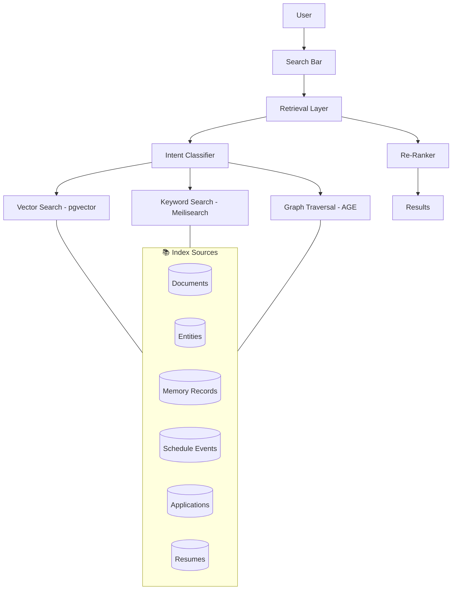
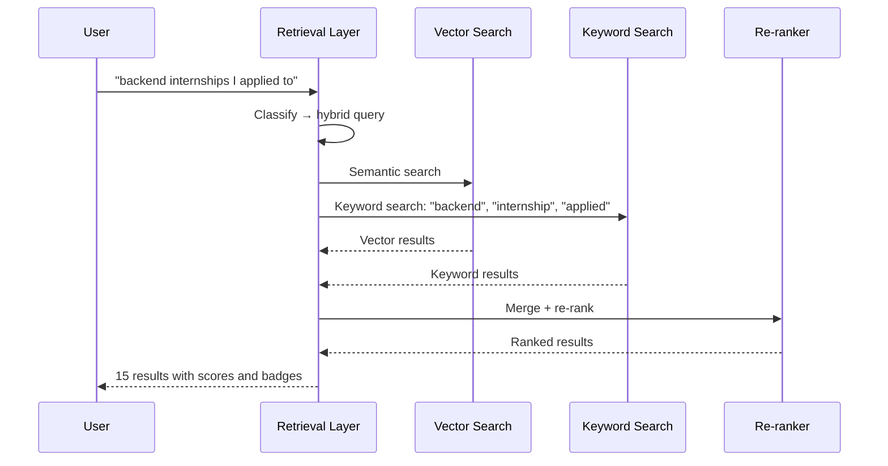

## Header
> **Purpose:** Detailed specification for Global Search
> **Status:** 🆕 New
> **Owner:** Product Team
> **Last Updated:** 2026-07-13

## Overview

Global Search is the unified search surface across all of Meridian's memory types — documents, entities, emails, schedule events, resume entries, applications, and past conversations. It uses the same Agentic RAG retrieval layer that powers internal agent queries, exposed as a first-class user-facing surface. A single search bar accepts natural language queries ("backend internships I applied to last month") or keyword searches ("python project resume"), and returns ranked, faceted results drawn from vector similarity, keyword matching, and graph traversal.

The retrieval strategy is the same one agents use internally (§6.5 of the main docs): the search layer determines per-query which combination of vector, keyword, and graph retrieval will produce the best results. Long-tail natural language queries lean on vector search; precise terms (course codes, names, dates) lean on keyword; relationship queries ("what projects use Python") use graph traversal. Results are re-ranked using the same relevance × freshness × importance × confidence scoring model (§6.7), ensuring the most useful results surface first regardless of memory type.

Every result includes a source type badge (Document, Entity, Email, Event, etc.), a confidence indicator, the workspace location, and a direct link to open the source in its native screen (Document Viewer for files, Entity detail for graph nodes, etc.). Users can filter by memory type, date range, and confidence level. The search index is updated in near-real-time — new documents, entities, and events become searchable within seconds of creation.

## Goals

- Return relevant results for any query within 2 seconds
- Support natural language, keyword, and hybrid queries
- Surface results from all memory types in unified ranked list
- Achieve >90% user satisfaction on first-page relevance (measured by click-through)
- Update search index within 5 seconds of any memory write

## User Story

"As a student who has been using Meridian for months, I want to search across everything — files, skills, emails, deadlines — from a single place so that I can find what I need without remembering where I put it or what I called it."

## Acceptance Criteria

| ID | Criterion | Priority |
|----|-----------|----------|
| GS-1 | Single search bar accepts natural language and keyword queries | P0 |
| GS-2 | Results returned within 2 seconds (p95) | P0 |
| GS-3 | Results ranked by relevance with confidence indicator | P0 |
| GS-4 | Results facet by memory type (document, entity, email, event, etc.) | P0 |
| GS-5 | Each result links to source in its native screen | P1 |
| GS-6 | Filter by date range, type, and confidence level | P1 |
| GS-7 | Search index updates within 5 seconds of memory write | P1 |
| GS-8 | Typeahead suggestions based on top entities and recent searches | P1 |
| GS-9 | Search history (last 50 searches, not cleared on session end) | P2 |
| GS-10 | Saved searches for recurring queries (e.g., "open applications") | P2 |

## Data Model

| Entity | Fields | Search Coverage |
|--------|--------|----------------|
| `documents` | `id`, `workspace_id`, `path`, `type`, `summary`, `parsed_content` | Full-text on summary + content; vector on content |
| `entities` | `id`, `workspace_id`, `type`, `canonical_name`, `aliases[]` | Full-text on name + aliases; vector on canonical_name |
| `memory_records` | `id`, `workspace_id`, `type`, `content (jsonb)` | Full-text + vector on content |
| `schedule_events` | `id`, `workspace_id`, `title`, `description`, `date` | Full-text on title + description |
| `applications` | `id`, `workspace_id`, `status`, `outcome`, `platform` | Full-text on platform + related entities |
| `resumes` | `id`, `workspace_id`, `content (jsonb)` | Full-text + vector on content |
| `agent_actions` | `id`, `workspace_id`, `action_type`, `output_ref` | Full-text on action summary (not raw output) |

Search is powered by **Meilisearch** (keyword) + **pgvector** (semantic) + **AGE graph** (traversal), combined by the Agentic RAG retrieval layer. No new tables needed.

## API Endpoints

| Method | Path | Purpose | Auth Scope |
|--------|------|---------|------------|
| `GET` | `/workspaces/{id}/search?q=&types=&date_from=&date_to=` | Execute global search | `search:read` |
| `GET` | `/workspaces/{id}/search/suggestions?q=` | Typeahead suggestions | `search:read` |
| `GET` | `/workspaces/{id}/search/history` | Recent search history | `search:read` |
| `DELETE` | `/workspaces/{id}/search/history` | Clear search history | `search:write` |
| `POST` | `/workspaces/{id}/search/save` | Save a search query | `search:write` |
| `GET` | `/workspaces/{id}/search/saved` | List saved searches | `search:read` |
| `DELETE` | `/workspaces/{id}/search/saved/{id}` | Delete saved search | `search:write` |

## Agent Interactions

| Agent | Action | When |
|-------|--------|------|
| Agentic RAG layer | Execute hybrid retrieval strategy per query | Every search |
| Memory Agent | Ensure index is updated on memory writes | Post-write event |
| QA Agent | Validate result relevance (internal) | Periodic quality check |
| Orchestrator | Route search query to retrieval layer | Search submitted |

No specialist agent is involved in search execution — it's a direct call to the retrieval layer. The "agent" involved is the Agentic RAG routing itself.

## Memory Impact

| Memory Type | Read | Write | Notes |
|-------------|------|-------|-------|
| Document | Yes | No | Full-text and vector indexed |
| Profile | Yes | No | Entity names and aliases indexed |
| Career | Yes | No | Application records indexed |
| Episodic | Yes | No | Event records indexed |
| Preference | Yes | Yes | Search history, saved searches |
| Working | Yes | No | Current search session ignored |

## Permission Model

| Scope | Required For | Default |
|-------|-------------|---------|
| `search:read` | Execute searches, view history | Granted |
| `search:write` | Save searches, clear history | Granted |

Search results respect existing read permissions — a user cannot search for entities they don't have `memory:read` access to. Search is a read-only cross-cutting concern, not a super-user tool.

## Error Scenarios

| Scenario | Error | User Impact | Recovery |
|----------|-------|-------------|----------|
| Vector search service unavailable | Degraded results | Results returned from keyword search only with "limited results" banner | Retry; fallback to keyword-only until vector store recovers |
| Query returns no results | Empty results | "No results found — try different keywords or broaden your filters" | Suggest related entities or recent documents |
| Index update delayed | Slightly stale results | Newest memory briefly missing from results | Index lag <5s by design; stale results noted with "Indexing..." indicator |
| Query is ambiguous (e.g., "Python" could be skill or document) | Mixed results | Both interpretations shown with type badges | User filters by type to narrow |
| Query is extremely long (>200 chars) | Truncated query | "Query truncated to first 200 characters" | Process full query but prioritize first 200 chars |

## Performance Budgets

| Operation | Target | Measurement |
|-----------|--------|------------|
| Query execution (all memory types) | <2s (p95) | From submit to ranked results |
| Typeahead suggestions | <200ms (p95) | Per keystroke |
| Index update (per memory write) | <5s (p95) | From write event to searchable |
| Search history load (50 items) | <500ms (p95) | API response time |
| Saved search execution | <2s (p95) | Same as query |

## Security Considerations

| Concern | Mitigation |
|---------|------------|
| Search exposes data from restricted memory types | Search results respect each memory type's read scope — user cannot search entities they can't read |
| Search index leaks cross-workspace data | All search indexes are scoped to `workspace_id`; queries are filtered by workspace before execution |
| Query history reveals sensitive information | Search history is visible to the user only; clearable; never logged in audit trail |
| Natural language query leaks PII to LLM | Queries are sent to the retrieval layer (vector database), not to an LLM; entity resolution is vector-based, not generative |
| Typeahead suggests recently deleted entities | Typeahead excludes entities with `deleted_at` set; deletion triggers index update within 5s |

## UI States

- **Loading:** Search bar with subtle loading indicator; results area shows pulsing card skeletons (3-5)
- **Empty:** "No results found" with illustration; suggestion to try different keywords or browse by type; "Did you mean?" suggestions for near-miss queries
- **Error:** Partial results with "Some search sources unavailable" banner; per-source error indicators; retry button for failed search sources
- **Edge cases:** Very common query ("resume") returns many results — grouped by type with count badges; query with typos triggers "Did you mean X?" with highlighted correction; query that matches a single entity with very high confidence shows "Jump to [entity]" quick action button; query returning no results but containing known entity names shows "These entities exist but don't match your query — try different terms"

## Risks

| Risk | Likelihood | Impact | Mitigation |
|------|------------|--------|------------|
| Search returns irrelevant results due to poor ranking | Medium | High | Transparent ranking with per-result relevance breakdown; user can thumbs-up/down to train relevance |
| Vector search drift (embedding model update makes old vectors incompatible) | Low (planned) | High | Store model_version per vector; re-index on model update; fallback to keyword during re-index |
| Search latency degrades as memory store grows | High | Medium | Index partitioning by type; pagination; archival of stale memories reduces searchable corpus |
| Users rely on search instead of structured browsing | Low | Low | Search is designed as a complement, not replacement; each result links to its structured screen |
| Index update throughput can't keep pace with bulk ingestion | Medium | Medium | Batch index writes on a 5-second debounce; bulk ingestion triggers single index update per batch, not per item |

## Scope

| | |
|---|---|
| **In Scope** | Unified search across documents, entities, emails, schedule events, resume entries, applications, agent actions; natural language + keyword + hybrid queries; ranked results with confidence indicators; faceted filters by memory type, date range, confidence; typeahead suggestions; search history (last 50); saved searches |
| **Out of Scope** | Cross-workspace search (workspace-scoped); internet/web search (local-only); full-text search on raw file content (searches parsed content only); real-time collaborative search; search analytics (usage patterns); exportable search results |

## Architecture



> **Diagram:** Global Search architecture — query routed to optimal retrieval strategy (vector, keyword, or graph) via Agentic RAG, then re-ranked.

## Components

| Component | Responsibility | Technology |
|-----------|---------------|------------|
| Retrieval Layer | Route query to optimal search strategy | FastAPI |
| Vector Search | Semantic similarity search | pgvector |
| Keyword Search | Exact match and full-text search | Meilisearch |
| Graph Traversal | Relationship-based search | Apache AGE |
| Re-ranker | Score × freshness × importance × confidence | FastAPI |
| Index Sync | Keep search indexes updated on memory writes | Bull queue + workers |

## Workflows

### Search Execution Workflow

1. User types query in search bar (typeahead triggers at 3 chars)
2. Retrieval Layer classifies query type: natural language (→ vector), precise term (→ keyword), relationship (→ graph)
3. For hybrid queries, execute all three strategies in parallel
4. Results from each strategy merged and de-duplicated
5. Re-ranker scores each result: relevance × freshness (recency weight) × importance (entity centrality) × confidence
6. Top 50 results returned with type badge, confidence indicator, and source link
7. User can filter by type, date range, or confidence level

## Sequence Diagrams



## Data Flow

1. **Indexing:** Memory write event → 5s debounce → index update in Meilisearch + pgvector + AGE
2. **Query:** User input → query classification → parallel retrieval → result merge → re-ranking → response
3. **Typeahead:** Keystroke → prefix search on entity names + recent searches → top 5 suggestions
4. **Filters:** Post-query applied on result set (type, date range, confidence) — no re-execution

## Non-Functional Requirements

| Requirement | Target | Measurement |
|-------------|--------|-------------|
| Query execution | <2s (p95) | Submit to ranked results |
| Typeahead latency | <200ms (p95) | Per keystroke |
| Index update latency | <5s (p95) | Write event to searchable |
| Index freshness | >99% of writes indexed within 5s | Monitoring |

## Scalability

| Dimension | Current Limit | 10x Strategy | 100x Strategy |
|-----------|--------------|--------------|---------------|
| Indexed documents | 100K/workspace | Index partitioning by memory type | Separate search clusters per type |
| Queries per second | 100 | Read replicas for search | Regional search endpoints |
| Index storage | 10GB (pgvector) | Separate vector database (Pinecone/Weaviate) | Hybrid index with tiered storage |

## Monitoring

| Metric | Alert Threshold | Severity | Dashboard |
|--------|----------------|----------|-----------|
| Query latency (p95) | >3s for 5 min | Critical | Search Performance |
| Index update lag | >30s | Warning | Search Infrastructure |
| Typeahead latency | >500ms | Warning | Search Performance |
| Re-ranker error rate | >2% | Critical | Search Quality |

## Deployment

| Environment | Method | Trigger | Verification |
|-------------|--------|---------|--------------|
| Development | Docker Compose | `docker compose up` | Health endpoint |
| Staging | Helm chart | CI merge | Search E2E tests |
| Production | ArgoCD | Git tag | Canary deploy |

## Configuration

| Variable | Purpose | Default | Required |
|----------|---------|---------|----------|
| `SEARCH_MODEL` | Embedding model for vector search | `text-embedding-3-small` | Yes |
| `SEARCH_MAX_RESULTS` | Maximum results per query | `50` | No |
| `SEARCH_TYPEAHEAD_MAX` | Maximum typeahead suggestions | `5` | No |
| `SEARCH_INDEX_DEBOUNCE_MS` | Index update debounce window | `5000` | No |

## Examples

```bash
# Execute search
curl -X GET "https://api.meridian.dev/v1/workspaces/{id}/search?q=backend+internships+2026&types=entities,applications" \
  -H "Authorization: Bearer $TOKEN"

# Get typeahead suggestions
curl -X GET "https://api.meridian.dev/v1/workspaces/{id}/search/suggestions?q=python" \
  -H "Authorization: Bearer $TOKEN"
```

## Best Practices

| Practice | Rationale |
|----------|-----------|
| Use natural language queries for best results | The retrieval layer is optimized for natural language — "what projects use React and Python" works better than keyword fragments |
| Filter by type when searching for specific content | Adding `?types=documents` narrows results and improves precision for known-content-type searches |
| Save recurring searches for quick access | If you frequently search "open applications", save it — saved searches execute with one click |
| Browse typeahead suggestions before completing your query | Typeahead often surfaces the exact entity or document you need before you finish typing |

## Limitations

| Limitation | Impact | Workaround | Future Resolution |
|------------|--------|------------|-------------------|
| No cross-workspace search | Users with multiple workspaces must search each separately | Workspace switcher in UI allows quick context switching | Cross-workspace search (Enterprise) |
| No search within file content (parsed only) | Recent files not yet parsed may not appear in results | Wait for parsing to complete (typically <30s) | Real-time indexing pipeline (v1.5) |
| No search analytics for users | Users cannot see their own search patterns | — | Personal search insights dashboard (V2) |

## Future Improvements

| Improvement | Priority | Complexity | Timeline |
|-------------|----------|------------|----------|
| Cross-workspace search | Low | High | Enterprise (2028) |
| Personal search insights dashboard | Medium | Medium | V2 (2027 H2) |
| Conversational search ("find me X and summarize Y") | Medium | High | V3 (2028) |
| Image search (find documents containing similar images) | Low | High | V3 (2028) |

## Related Documents

- [Features.md](../Features.md)
- [Memory-Graph.md](./Memory-Graph.md)
- [Document-Viewer.md](./Document-Viewer.md)
- `/Docs/AI/RAG.md`
- `/Docs/AI/Agentic-RAG.md`
- `/Docs/Architecture/Search.md`
