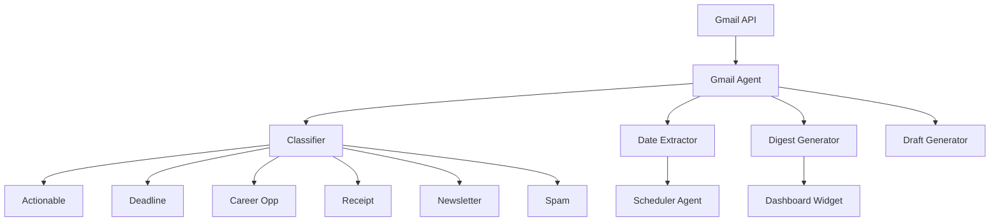
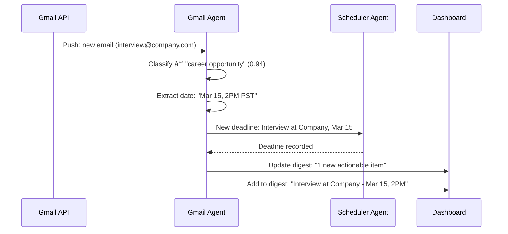

## Header
>
> **Purpose:** Detailed specification for Gmail Digest
> **Status:** 🆕 New
> **Owner:** Product Team
> **Last Updated:** 2026-07-13

## Overview

The Gmail Digest keeps users on top of time-sensitive email without requiring them to constantly check their inbox. The Gmail Agent runs on a scheduled cadence (default 6 AM daily) plus push-based high-priority classification — when an email matches a critical category (interview invitation, offer letter, deadline reminder, application response), the agent classifies it within minutes rather than waiting for the next scheduled pass. Every message is classified into categories (actionable, deadline-related, career-opportunity, receipt/invoice, newsletter, personal, spam), with deadlines and dates extracted and forwarded to the Scheduler Agent for conflict detection.

The agent never auto-sends or auto-replies to any email. It operates exclusively in read-and-classify mode, with a single action allowed: drafting a reply that the user must review and manually send. Drafts are surfaced alongside the classified email in the daily digest, accessible from the Dashboard and the Schedule screen. The classification output feeds career memory (application outcomes inferred from interview/offer/rejection emails) and schedule events (deadlines extracted from confirmation emails).

The digest itself is a morning summary shown on the Dashboard: number of new classified messages, a list of time-sensitive items with deadlines, any detected conflicts with existing schedule events, and one-sentence summaries of important emails with links to open the full message in the In-App Document Viewer. The user can archive, snooze, or mark as read directly from the digest without leaving Vaeloom.

## Goals

- Classify and surface high-priority emails within 5 minutes of receipt (push mode)
- Achieve >95% classification accuracy on actionable vs. non-actionable emails
- Extract deadlines from emails with >90% accuracy (verified against Scheduler)
- Never auto-send or auto-reply under any circumstances
- Reduce time spent on email triage to <5 minutes per day

## User Story

"As a student juggling internship applications, I want Vaeloom to watch my inbox and surface deadlines and interview invitations so that I never miss an opportunity buried in promotional emails."

## Acceptance Criteria

| ID | Criterion | Priority |
|----|-----------|----------|
| GD-1 | Scheduled digest pass at configurable time (default 6 AM) | P0 |
| GD-2 | Push classification of high-priority emails within 5 minutes | P0 |
| GD-3 | Email classified into categories (actionable, deadline, career, etc.) | P0 |
| GD-4 | Deadlines and dates extracted and forwarded to Scheduler Agent | P0 |
| GD-5 | Digest shown on Dashboard with categorized message list | P1 |
| GD-6 | User can archive/snooze/mark-read from digest | P1 |
| GD-7 | Draft reply generated on request (never auto-sent) | P1 |
| GD-8 | Application outcomes inferred from interview/offer/rejection email patterns | P2 |
| GD-9 | Classification confidence score shown for low-confidence items | P1 |
| GD-10 | Daily email volume trend visible on Dashboard | P2 |

## Data Model

| Entity | Fields | Usage |
|--------|--------|-------|
| `memory_records` (Episodic) | `id`, `workspace_id`, `type`, `content (jsonb)`, `source_connector_id` | Classified email records |
| `schedule_events` | `id`, `workspace_id`, `source`, `title`, `date`, `type`, `conflict_flag` | Deadlines extracted from emails |
| `applications` | `id`, `workspace_id`, `status`, `outcome` | Outcome inferred from email classification |
| `agent_actions` | `id`, `workspace_id`, `agent_name`, `action_type`, `output_ref` | Classification audit log |
| `connectors` | `id`, `workspace_id`, `type`, `last_synced_at`, `status` | Gmail connector state |

No new tables — leverages existing memory and schedule models.

## API Endpoints

| Method | Path | Purpose | Auth Scope |
|--------|------|---------|------------|
| `GET` | `/workspaces/{id}/gmail/digest` | Get today's digest | `gmail:read` |
| `GET` | `/workspaces/{id}/gmail/messages` | List classified messages | `gmail:read` |
| `GET` | `/workspaces/{id}/gmail/messages/{msg_id}` | Get full message via viewer | `gmail:read` |
| `POST` | `/workspaces/{id}/gmail/messages/{msg_id}/draft` | Generate reply draft | `gmail:write` |
| `POST` | `/workspaces/{id}/gmail/messages/{msg_id}/action` | Archive/snooze/mark-read | `gmail:write` |
| `PATCH` | `/workspaces/{id}/gmail/settings` | Configure digest schedule, categories | `settings:write` |
| `GET` | `/workspaces/{id}/gmail/trends` | Weekly email volume and category breakdown | `gmail:read` |

## Agent Interactions

| Agent | Action | When |
|-------|--------|------|
| Gmail Agent | Classify emails, extract dates, generate digest | Scheduled pass or push trigger |
| Scheduler Agent | Receive extracted deadlines, check for conflicts | After Gmail Agent classification |
| Application Agent | Receive inferred outcome for application tracking | On outcome-related email detected |
| Memory Agent | Write classified email to episodic memory | After classification |
| Orchestrator | Route Gmail event to Gmail Agent | Push notification or schedule trigger |
| QA Agent | Validate classification confidence | Before surfacing to user |

## Memory Impact

| Memory Type | Read | Write | Notes |
|-------------|------|-------|-------|
| Episodic | Yes | Yes | Classified emails, actions taken |
| Career | Yes | Yes | Outcomes inferred from interview/offer emails |
| Preference | Yes | Yes | Digest preferences, classification corrections |
| Profile | No | No | — |
| Document | No | No | — |
| Working | Yes | No | Current digest session state |

## Permission Model

| Scope | Required For | Default |
|-------|-------------|---------|
| `gmail:read` | Read and classify emails | Granted |
| `gmail:write` | Archive, snooze, mark-read, generate drafts | Granted |
| `gmail:auto-reply` | Auto-send replies | Never granted |
| `connector:gmail:read` | Access Gmail API | OAuth grant required |
| `scheduler:write` | Create schedule events from deadlines | Granted (ephemeral) |

Autonomy level: **Read-only** for email content. **Suggest (drafts only)** for replies — drafts are generated but never sent without user action.

## Error Scenarios

| Scenario | Error | User Impact | Recovery |
|----------|-------|-------------|----------|
| Gmail API rate limit hit | Delayed classification | New emails queued; processed when rate limit resets | Queue automatically drains; user sees "Delayed" indicator |
| Push notification webhook fails | Missed push classification | Falls back to next scheduled pass; critical email delayed by up to 6h | Retry on backoff; alert operations if persistent |
| Classification confidence low | Item flagged for review | Shown in digest with "Uncertain — please review" badge | User can reclassify; correction logged |
| Deadlines extracted from wrong email | False positive conflict | Schedule event created with "inferred, low confidence" flag | User can dismiss; dismissal logged as correction |
| Gmail re-authentication required | Connector disconnected | Digest shows "Re-authenticate Gmail" banner | Connector Agent triggers re-auth before expiry; if missed, user clicks re-auth button |

## Performance Budgets

| Operation | Target | Measurement |
|-----------|--------|------------|
| Scheduled digest pass (100 emails) | <60s (p95) | From trigger to digest ready |
| Push classification (single email) | <30s (p95) | From push notification to classified |
| Deadline extraction | <10s per email (p95) | From classification to schedule event |
| Digest load on Dashboard | <500ms (p95) | API response time |
| Draft generation | <15s (p95) | From request to draft ready |

## Security Considerations

| Concern | Mitigation |
|---------|------------|
| Email content sent to LLM for classification | Classification uses only subject line + first 500 chars of body; full body never leaves the classification pipeline |
| Draft reply contains sensitive information | Drafts are generated but never auto-sent; user reviews before any email leaves the workspace |
| Gmail OAuth token compromised | Token scope limited to `email.readonly` + `email.drafts` (no send); stored in secrets manager |
| Email data visible to unauthorized users | All email records are workspace-scoped; no cross-user access possible |
| Classification model exposes email patterns | Model runs per-user, not cross-user; no pattern aggregation without explicit user consent |

## UI States

- **Loading:** Digest skeleton with card placeholders per category; "Checking your inbox..." with pulsing Gmail icon
- **Empty:** "No new classified messages. Your inbox is up to date." Option to run manual check
- **Error:** Partial digest shown with "Gmail sync delayed — last synced [time]" banner; per-message classification failures show "Could not classify" with manual category selector
- **Edge cases:** Extremely high email volume day (>200) shows top 50, "and 150 more" with expand link; email from unknown sender with urgent keywords gets "Potential phishing?" warning if link-heavy; re-classified email updates in place with "reclassified" animation; email that was already actioned in another context (e.g., application already submitted) shows "Linked to application" badge

## Risks

| Risk | Likelihood | Impact | Mitigation |
|------|------------|--------|------------|
| Critical email classified as non-actionable (false negative) | Medium | High | Push mode for high-priority categories; user can train classifier by re-classifying missed emails |
| Non-urgent email classified as urgent (false positive) | High | Medium | Digest shows confidence score; frequent false positives degrade user trust — tune thresholds conservatively at launch |
| Over-notification erodes trust | Medium | High | Dashboard-only by default; push notifications only for highest-priority categories (interview, offer, deadline within 48h) |
| Draft reply contains factually incorrect information | Low | Medium | QA Agent validates draft content against memory; user always reviews before sending |
| Gmail API deprecation or scope restriction | Low | High | Abstract connector layer isolates API specifics; fallback to IMAP if API becomes restricted |

## Scope

| | |
|---|---|
| **In Scope** | Scheduled daily digest (default 6 AM); push classification of high-priority emails within 5 minutes; email classification into actionable/deadline/career/receipt/newsletter/spam categories; deadline extraction and forwarding to Scheduler Agent; digest on Dashboard with categorized message list; archive/snooze/mark-read from digest; draft reply generation (never auto-sent); application outcome inference from email patterns |
| **Out of Scope** | Auto-sending or auto-replying to emails (never granted); email composition (draft-only); full inbox management (Vaeloom is not an email client); email search within Vaeloom (use Global Search); calendar sync from email (use Calendar Connector); spam filter management |

## Architecture



> **Diagram:** Gmail Digest architecture — Gmail API → Gmail Agent → Classifier (6 categories) → Date extraction → Digest generation.

## Components

| Component | Responsibility | Technology |
|-----------|---------------|------------|
| Gmail Agent | Email classification, date extraction, digest generation | FastAPI + Claude API |
| Gmail Connector | OAuth, API communication, push notifications | NestJS + Google API |
| Classifier | Categorize emails into 6 types | Claude API + few-shot prompts |
| Date Extractor | Parse deadlines, dates, times from email body | FastAPI + Claude API |
| Digest Generator | Aggregate today's classified emails into digest object | FastAPI |
| Draft Generator | Create reply drafts on user request | FastAPI + Claude API |

## Workflows

### Email Classification Workflow

1. Scheduled digest trigger (6 AM default) or push notification from Gmail
2. Gmail Agent fetches unread emails since last scan
3. Classifier categorizes each email into one of 6 types with confidence score
4. Date Extractor parses deadlines, interview times, offer dates
5. Low-confidence classifications flagged for user review
6. Actionable items go to digest; deadlines forwarded to Scheduler Agent
7. Application-related outcomes inferred and forwarded to Application Agent
8. Digest written to memory and pushed to Dashboard

## Sequence Diagrams



## Data Flow

1. **Fetch:** Gmail API → OAuth-scoped read → raw email (subject + first 500 chars body)
2. **Classify:** Email text → LLM classifier → category + confidence + extracted dates
3. **Store:** Classified email → `memory_records` (Episodic type) with source connector ID
4. **Forward:** Deadlines → `schedule_events` creation; Application outcomes → `applications` status update
5. **Digest:** Aggregate today's records → Dashboard widget → user review

## Non-Functional Requirements

| Requirement | Target | Measurement |
|-------------|--------|-------------|
| Scheduled digest (100 emails) | <60s (p95) | Trigger to digest ready |
| Push classification latency | <30s (p95) | Push to classified |
| Classification accuracy | >95% on actionable vs non-actionable | Manual audit |
| Deadline extraction accuracy | >90% | Verified against Scheduler |
| Digest load time | <500ms (p95) | API response |

## Scalability

| Dimension | Current Limit | 10x Strategy | 100x Strategy |
|-----------|--------------|--------------|---------------|
| Emails per digest | 200/user/day | Batch classification (50 emails/call) | Streaming classification pipeline |
| Push notifications | 50/min per user | Webhook batching | Dedicated push service |
| Draft generation | 20/min per user | Rate-limited with queue | Background draft generation workers |

## Monitoring

| Metric | Alert Threshold | Severity | Dashboard |
|--------|----------------|----------|-----------|
| Classification latency | >60s for 10 min | Warning | Gmail Performance |
| Classification accuracy | <90% weekly | Critical | Gmail Quality |
| Digest generation failure | >2% | Critical | Gmail Operations |
| Gmail API error rate | >5% | Warning | Connector Health |
| Deadline extraction false positives | >10% | Warning | Gmail Quality |

## Deployment

| Environment | Method | Trigger | Verification |
|-------------|--------|---------|--------------|
| Development | Docker Compose | `docker compose up` | Health endpoint |
| Staging | Helm chart | CI merge | E2E tests |
| Production | ArgoCD | Git tag | Canary deploy |

## Configuration

| Variable | Purpose | Default | Required |
|----------|---------|---------|----------|
| `GMAIL_DIGEST_TIME` | Scheduled digest time (UTC) | `06:00` | No |
| `GMAIL_PUSH_ENABLED` | Enable push classification | `true` | No |
| `GMAIL_MAX_EMAILS_PER_DIGEST` | Max emails in single digest | `200` | No |
| `GMAIL_CLASSIFY_BODY_CHARS` | Max body chars for classification | `500` | No |

## Examples

```bash
# Get today's digest
curl -X GET https://api.Vaeloom.dev/v1/workspaces/{id}/gmail/digest \
  -H "Authorization: Bearer $TOKEN"

# Generate draft reply
curl -X POST https://api.Vaeloom.dev/v1/workspaces/{id}/gmail/messages/{msg_id}/draft \
  -H "Authorization: Bearer $TOKEN"
```

## Best Practices

| Practice | Rationale |
|----------|-----------|
| Check the Gmail Digest daily at your scheduled time | The morning digest catches critical emails (interviews, offers, deadlines) before your day gets busy |
| Review low-confidence classifications | Emails flagged with "Uncertain — please review" help train the classifier when you correct them |
| Use the Draft feature for quick replies | Drafts are generated with context from your memory — review and send, don't compose from scratch |
| Connect only career-relevant email accounts | The Gmail Agent processes ALL incoming email — connect only the account(s) where career communications arrive |

## Limitations

| Limitation | Impact | Workaround | Future Resolution |
|------------|--------|------------|-------------------|
| Only Gmail supported in MVP | Users of Outlook, Yahoo, ProtonMail cannot use this feature | Manual email forwarding to a Gmail alias | Multi-provider email support (Outlook, IMAP) in V2 |
| Full email body not used for classification | Some context may be missed in the 500-char limit | Use Document Viewer to read full email if digest summary is insufficient | Expandable classification context (v1.5) |
| No auto-send capability | Draft reply must be manually sent from Gmail | Deep-link opens Gmail draft for one-click sending | Secure auto-send with per-action approval (V3) |

## Future Improvements

| Improvement | Priority | Complexity | Timeline |
|-------------|----------|------------|----------|
| Multi-provider email support (Outlook, IMAP) | High | High | V2 (2027 H2) |
| Expanded classification context (full body for long emails) | Medium | Low | v1.5 (2027 H1) |
| Auto-send with per-action approval | Low | High | V3 (2028) |
| Email prioritization scoring (urgency + importance) | Medium | Medium | v1.5 (2027 H1) |

## Related Documents

- [Features.md](../Features.md)
- [Deadline-Detection.md](./Deadline-Detection.md)
- [Tailored-Applications.md](./Tailored-Applications.md)
- [Dashboard.md](./Dashboard.md)
- `/Docs/Vaeloom-Complete-Documentation.md#7-features`
- `/Docs/AI/AI-Agents.md#gmail-agent`
