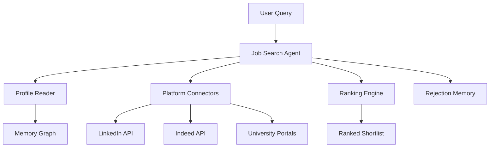
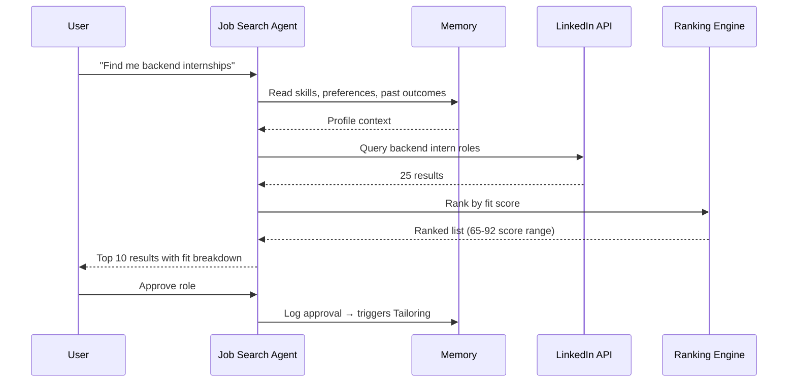

## Header
> **Purpose:** Detailed specification for Job & Internship Search
> **Status:** 🆕 New
> **Owner:** Product Team
> **Last Updated:** 2026-07-13

## Overview

Job & Internship Search connects the user's career memory graph to live opportunity platforms. The Job Search Agent queries configured connector APIs (LinkedIn, Indeed, or university career portals where integrations exist) using a combination of the user's explicit search parameters and their inferred profile from memory — skills, preferred role types, past rejections, compensation expectations, and location preferences. Results are ranked by a multi-factor score that combines skill overlap, preference alignment, and the user's historical outcome data, producing a shortlist the user can review, approve, or reject.

The feature operates in two modes: explicit (user says "find me backend internships") and scheduled background radar (the agent runs a periodic pass and surfaces new matches that clear a quality threshold). The scheduled mode is the key differentiator — it means the user doesn't need to remember to search; the system brings opportunities to them when their profile suggests they'd be a strong fit. Rejected roles are remembered to avoid re-surfacing. Applied roles are tracked through to outcome, closing the loop so the ranking model learns from what actually worked.

This feature is the essential prerequisite for Tailored Applications. Without a ranked, user-approved shortlist, the Application Agent has nothing to tailor against. The tight coupling between search and application means the shortlist screen is designed as a triage step: approve a role and it moves to the tailoring queue; reject it and the agent learns; defer it and the role surfaces again on the next radar pass with increasing prominence.

## Goals

- Return ranked shortlist within 30 seconds of query submission
- Achieve >50% user acceptance rate on scheduled radar suggestions within 4 weeks
- Never re-surface a rejected role (100% adherence to rejection memory)
- Support explicit query mode and scheduled background radar mode
- Rank by skill overlap, preference alignment, and historical outcome data

## User Story

"As a final-year student focused on backend roles, I want relevant opportunities to surface automatically and be ranked by fit so that I stop spending hours scrolling through job boards and start applying to the roles that actually match my profile."

## Acceptance Criteria

| ID | Criterion | Priority |
|----|-----------|----------|
| JS-1 | User can submit explicit search with keywords, filters, location | P0 |
| JS-2 | Ranked shortlist returned within 30 seconds | P0 |
| JS-3 | Each result shows fit score with breakdown (skills, experience, preferences) | P0 |
| JS-4 | User can approve/reject/defer individual results | P0 |
| JS-5 | Rejected roles never re-surface | P1 |
| JS-6 | Scheduled background radar runs daily and surfaces new matches | P1 |
| JS-7 | Radar bypasses roles below configurable fit threshold | P1 |
| JS-8 | Fit score includes historical outcome data (past similar roles) | P2 |
| JS-9 | User can filter shortlist by source platform | P1 |
| JS-10 | Internship-specific search with different ranking weights (learning > comp) | P2 |

## Data Model

| Entity | Fields | Usage |
|--------|--------|-------|
| `entities` (Skill, Job) | `id`, `type`, `canonical_name` | Skill graph for matching; job entities from listings |
| `memory_records` (Career) | `id`, `workspace_id`, `type`, `content (jsonb)` | Past applications, outcomes, rejections |
| `schedule_events` | `id`, `workspace_id`, `source`, `title`, `date`, `type` | Radar schedule tracking |
| `applications` | `id`, `job_external_id`, `platform`, `status`, `outcome` | Outcome history for ranking calibration |
| `connectors` | `id`, `workspace_id`, `type`, `status` | Platform connection state |

No new tables — leverages existing career memory and entities.

## API Endpoints

| Method | Path | Purpose | Auth Scope |
|--------|------|---------|------------|
| `POST` | `/workspaces/{id}/jobs/search` | Execute explicit job search | `jobs:read` |
| `GET` | `/workspaces/{id}/jobs/shortlist` | Get current shortlist | `jobs:read` |
| `POST` | `/workspaces/{id}/jobs/shortlist/{job_id}/approve` | Approve job for application | `jobs:write` |
| `POST` | `/workspaces/{id}/jobs/shortlist/{job_id}/reject` | Reject with optional reason | `jobs:write` |
| `POST` | `/workspaces/{id}/jobs/shortlist/{job_id}/defer` | Defer to next radar pass | `jobs:write` |
| `PATCH` | `/workspaces/{id}/jobs/radar` | Configure radar frequency and threshold | `settings:write` |
| `GET` | `/workspaces/{id}/jobs/history` | View past search and radar results | `jobs:read` |

## Agent Interactions

| Agent | Action | When |
|-------|--------|------|
| Job Search Agent | Query platforms, rank results, build shortlist | Explicit search or scheduled radar |
| Resume Agent | Provide current resume for context | During ranking (skill overlap) |
| ATS Agent | Score shortlisted jobs for fit | Before rank refinement |
| Application Agent | Receive approved jobs for tailoring | On user approval |
| Memory Agent | Persist rejection and outcome data | On user action |
| Orchestrator | Route search request to Job Search Agent | Query submission or radar trigger |
| Reflection Agent | Analyze rejection patterns over time | Weekly periodic pass |

## Memory Impact

| Memory Type | Read | Write | Notes |
|-------------|------|-------|-------|
| Profile | Yes | No | Skills, preferences for matching |
| Career | Yes | Yes | New opportunities, rejections, outcomes |
| Episodic | Yes | Yes | Search events, radar runs logged |
| Preference | Yes | Yes | Role type preferences refined over time |
| Document | No | No | — |
| Working | Yes | No | Current search session state |

## Permission Model

| Scope | Required For | Default |
|-------|-------------|---------|
| `jobs:read` | Search, view shortlist and history | Granted |
| `jobs:write` | Approve/reject/defer opportunities | Granted |
| `jobs:radar-auto` | Autonomous scheduled radar runs | Suggest-only |
| `connector:{platform}:read` | Query external platform | Per-connector grant |

Autonomy level: **Suggest** for scheduled radar (surfaces matches for review, doesn't auto-apply). **Read-only** for search (user initiates).

## Error Scenarios

| Scenario | Error | User Impact | Recovery |
|----------|-------|-------------|----------|
| Platform API rate-limited | Search delayed or partial | Results shown from cache if available; partial results with "X platforms unavailable" note | Retry after backoff; user notified when platform is available again |
| Platform access token expired | Connector broken | Platform shown as "disconnected" with re-authenticate button | Background token refresh before expiry (Connector Agent) |
| No results matching criteria | Empty shortlist | "No matches found. Try broadening your filters or check your skill profile." | Suggestion to add skills or adjust location preference |
| Radar returns no new matches | Silent skip | No notification; shortlist unchanged | Logged as "radar pass — 0 new matches" on history page |
| Platform ToS blocks automated queries | Search disabled for that platform | Platform shown as "API-limited — manual search only" | User can click through to platform in new tab; deep-link flow |

## Performance Budgets

| Operation | Target | Measurement |
|-----------|--------|------------|
| Explicit search across 2-3 platforms | <30s (p95) | From query submission to ranked shortlist |
| Radar pass (background) | <120s (p95) | From trigger to shortlist updated |
| Shortlist load (50 results) | <2s (p95) | API response time |
| Approve/reject write | <500ms (p95) | API response time |
| Fit score calculation per role | <1s (p95) | Per-result ranking step |

## Security Considerations

| Concern | Mitigation |
|---------|------------|
| Platform ToS violation via automated queries | Only official partner APIs are queried; scraping is explicitly out of scope (see Gap Analysis) |
| User job preferences leaked to platform | Search queries are composed from user input + platform filters only; memory graph data never leaves workspace |
| Application data exposed across tenants | All job data is workspace-scoped; platform-agnostic storage prevents cross-tenant leakage |
| Token theft via connector OAuth flow | Tokens stored in secrets manager, never in application code or logged; Connector Agent handles refresh |

## UI States

- **Loading:** Card skeleton grid (3-wide) with pulsing placeholders; progress bar per platform being queried
- **Empty:** "No matching opportunities. Try expanding your search or updating your skills." Search refinement panel with sliders for radius, skill filter, role type
- **Error:** Partial results shown with per-platform error banners; full failure shows "Search unavailable — check connector status" with link to Connectors screen
- **Edge cases:** Duplicate listings across platforms are deduplicated with "Also on [platform]" badge; role already applied to shows "Applied" instead of "Approve"; role the user previously rejected shows "Previously rejected — show anyway?" toggle; extremely high-fit roles (>90%) get a "Top match" badge and appear at the top with a visual accent

## Risks

| Risk | Likelihood | Impact | Mitigation |
|------|------------|--------|------------|
| Platform blocks access or changes API | Medium | High | Multiple platform connectors as fallback; deep-link flow as ultimate fallback |
| Ranking model favors wrong signals | Medium | Medium | Transparent fit-score breakdown lets user identify and correct weighting |
| Radar overwhelms user with low-quality matches | High | Medium | Configurable threshold (default >60% fit); cooldown on repeat same-source roles |
| User rejects all radar suggestions for weeks | Medium | Low | Radar frequency decays; suggestion to update profile or preferences surfaced |
| Platform connector costs exceed value | Low | Medium | Track cost-per-match; pause connectors with zero conversion after 30 days |

## Scope

| | |
|---|---|
| **In Scope** | Explicit search with keywords, filters, location; ranked shortlist with fit score breakdown (skills, experience, preferences); approve/reject/defer results; scheduled background radar with configurable threshold; rejection memory (never re-surface); historical outcome data in ranking; internship-specific search mode; multi-platform search (LinkedIn, Indeed, university portals) |
| **Out of Scope** | Auto-apply to jobs (user must approve each application); resume or cover letter generation (see Master Resume, Tailored Applications); job board scraping (official partner APIs only) |

## Architecture



> **Diagram:** Job Search architecture — user query + memory profile → platform queries → ranking → shortlist with rejection memory.

## Components

| Component | Responsibility | Technology |
|-----------|---------------|------------|
| Job Search Agent | Query platforms, rank results, build shortlist | FastAPI + Claude API |
| Platform Connectors | Interface with job platform APIs | NestJS + platform SDKs |
| Ranking Engine | Multi-factor fit score (skills × preferences × outcomes) | FastAPI |
| Rejection Memory | Store and enforce "never re-surface" rules | PostgreSQL |
| Radar Engine | Scheduled background search with threshold | Bull queue + FastAPI |

## Workflows

### Explicit Search Workflow

1. User submits search with keywords, filters, location
2. Job Search Agent reads profile from memory (skills, preferences, past outcomes)
3. Platform Connectors query each connected platform API in parallel
4. Results normalized to common schema with deduplication
5. Ranking Engine evaluates each result: skill overlap, preference alignment, historical outcome similarity
6. Rejection Memory filters out previously rejected roles
7. Fit score shown with per-factor breakdown
8. Shortlist displayed with approve/reject/defer actions

## Sequence Diagrams



## Data Flow

1. **Search:** User query + profile context → platform API calls → normalized results
2. **Ranking:** Each result → skill overlap calc + preference alignment + outcome similarity → composite score
3. **Filter:** Rejection Memory check → remove rejected → deduplicate across platforms
4. **Storage:** Approved roles → `applications` (status: shortlisted); Rejected → `memory_records` (rejection)

## Non-Functional Requirements

| Requirement | Target | Measurement |
|-------------|--------|-------------|
| Search across 2-3 platforms | <30s (p95) | Query submission to shortlist |
| Radar pass (background) | <120s (p95) | Trigger to shortlist updated |
| Fit score calculation per role | <1s (p95) | Per-result ranking step |
| User acceptance on radar suggestions | >50% within 4 weeks | Radar accept/reject ratio |

## Scalability

| Dimension | Current Limit | 10x Strategy | 100x Strategy |
|-----------|--------------|--------------|---------------|
| Platform queries | 3 parallel queries | Result caching (24h TTL) | Dedicated query worker pool |
| Shortlist storage | 500 active/user | Archive after 90 days | Tiered storage with lifecycle |
| Radar users | 1K per scheduler | Sharded radar scheduling | Regional radar workers |

## Monitoring

| Metric | Alert Threshold | Severity | Dashboard |
|--------|----------------|----------|-----------|
| Search latency | >60s (p95) | Critical | Job Search Performance |
| Platform API error rate | >10% | Warning | Connector Health |
| Radar suggestion acceptance | <20% | Warning | Job Search Quality |
| Platform rate limit hits | >5/day | Info | Connector Health |

## Deployment

| Environment | Method | Trigger | Verification |
|-------------|--------|---------|--------------|
| Development | Docker Compose | `docker compose up` | Health endpoint |
| Staging | Helm chart | CI merge | E2E tests |
| Production | ArgoCD | Git tag | Canary deploy |

## Configuration

| Variable | Purpose | Default | Required |
|----------|---------|---------|----------|
| `JOBS_RADAR_INTERVAL_HOURS` | Radar pass frequency | `24` | No |
| `JOBS_RADAR_THRESHOLD` | Minimum fit score for radar (0-100) | `60` | No |
| `JOBS_SEARCH_TIMEOUT_S` | Per-platform query timeout | `25` | No |
| `JOBS_CACHE_TTL_HOURS` | Platform result cache duration | `24` | No |

## Examples

```bash
# Execute search
curl -X POST https://api.meridian.dev/v1/workspaces/{id}/jobs/search \
  -H "Authorization: Bearer $TOKEN" \
  -d '{"keywords": "backend intern", "location": "remote", "platforms": ["linkedin", "indeed"]}'

# Approve job for application
curl -X POST https://api.meridian.dev/v1/workspaces/{id}/jobs/shortlist/{job_id}/approve \
  -H "Authorization: Bearer $TOKEN"
```

## Best Practices

| Practice | Rationale |
|----------|-----------|
| Keep your skill profile updated in Memory Graph | The ranking engine relies on your skill graph — accurate skills produce better-ranked search results |
| Reject roles you're not interested in | Every rejection trains the ranking model; rejecting clearly mismatched roles improves future radar suggestions |
| Set radar threshold based on your search volume | High-volume searchers should set threshold higher (70+); occasional searchers can use default 60 |
| Review radar results daily | The scheduled radar runs daily — checking results every morning keeps you ahead of application deadlines |

## Limitations

| Limitation | Impact | Workaround | Future Resolution |
|------------|--------|------------|-------------------|
| Only LinkedIn and Indeed connectors in MVP | Users targeting niche platforms cannot use search | Other platforms accessible via deep-link flow | 10+ platform connectors by V2 |
| No company-specific search | Cannot filter by target company list | Manually search company career pages and import via deep-link | Company tracking list with alerts (v1.5) |
| Fit score does not include real-time market data | Score is profile-relative, not market-relative (competition level, hiring velocity) | — | Market-aware ranking (V3) |

## Future Improvements

| Improvement | Priority | Complexity | Timeline |
|-------------|----------|------------|----------|
| Company tracking list with job alerts | High | Medium | v1.5 (2027 H1) |
| 10+ platform connectors | High | High | V2 (2027 H2) |
| Market-aware ranking (competition, hiring velocity) | Low | High | V3 (2028) |
| Salary estimation and negotiation insights | Low | Medium | V3 (2028) |

## Related Documents

- [Features.md](../Features.md)
- [Tailored-Applications.md](./Tailored-Applications.md)
- [ATS-Scoring.md](./ATS-Scoring.md)
- [Dashboard.md](./Dashboard.md)
- `/Docs/Meridian-Complete-Documentation.md#7-features`
- `/Docs/AI/AI-Agents.md#job-search-agent`
