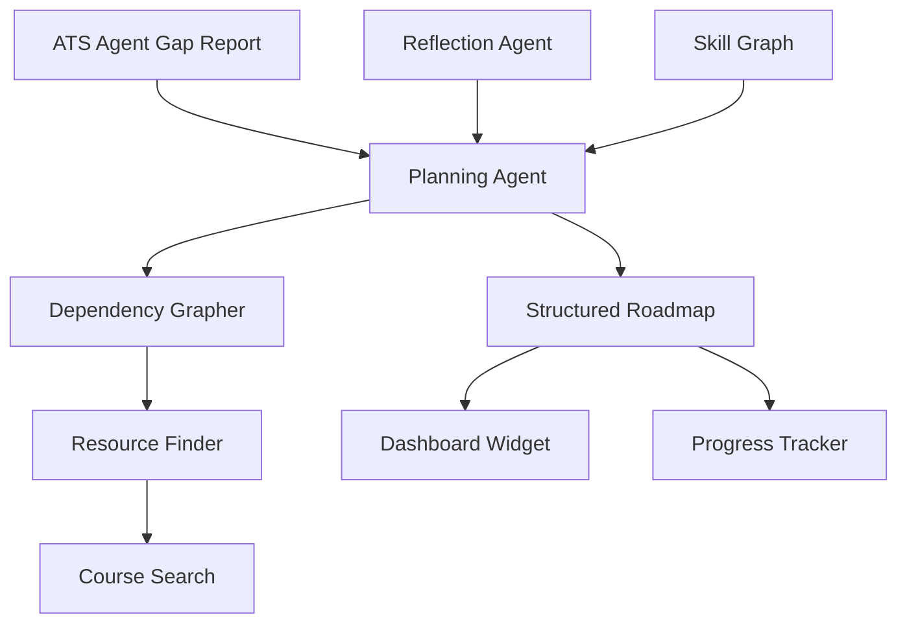
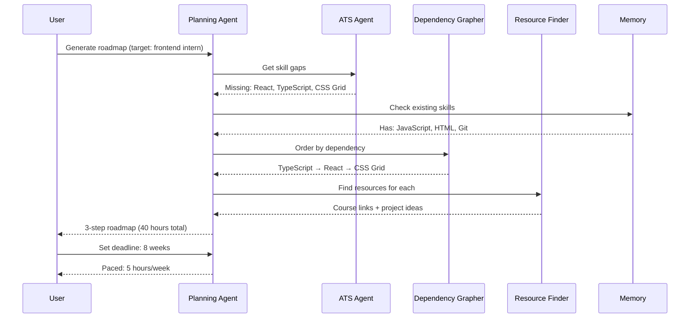

## Header
> **Purpose:** Detailed specification for Learning Roadmap (V2)
> **Status:** 🆕 New
> **Owner:** Product Team
> **Last Updated:** 2026-07-13

## Overview

The Learning Roadmap transforms skill gaps — identified by the ATS Agent during resume scoring or by the Reflection Agent during pattern analysis — into structured, sequenced skill development plans. When the system detects a skill gap that matters for the user's career goals (a required skill for a target role type, a missing qualification for internships the user has been applying to), the Planning Agent generates a learning roadmap: a sequence of concrete steps (courses, projects, certifications, practice) ordered by dependency, estimated effort, and relevance to the user's stated goals.

The roadmap is not a generic course list. It is personalized to the user's current skill graph, learning preferences (self-study vs. structured courses vs. project-based), available time budget, and deadline constraints (e.g., "I need this skill before internship applications open in 3 months"). Each step links to specific resources — online courses (Coursera, Udemy, edX via search), documentation, project ideas, or practice platforms — that the agent has identified as high-quality and appropriate for the user's current level. The user can mark steps complete, adjust timelines, or add their own learning resources.

This is a V2 feature because it depends on several prerequisite conditions: a sufficiently populated skill graph (the system needs to know what the user already knows), a set of completed ATS scans with identified gaps (the system needs to know what's missing), and preferably some application outcome data (the system needs to know which gaps actually matter). It also requires a content source integration (course API or curated resource database) that adds integration complexity beyond the MVP scope. The feature is gated behind a minimum threshold of 10 identified skill gaps and 3 ATS scans.

## Goals

- Generate a sequenced learning roadmap within 30 seconds of request
- Each roadmap step links to a concrete, accessible learning resource
- Achieve >70% user completion rate on roadmap steps (measured at 3 months)
- Prioritize roadmap steps by career goal relevance and dependency order
- Support timeline adjustment (compressed, standard, relaxed pacing)

## User Story

"As a student who keeps getting rejected from frontend roles because I'm missing React experience, I want a personalized plan to learn the skills I'm actually missing so that I stop wasting time on random tutorials and focus on what will make a difference in my applications."

## Acceptance Criteria

| ID | Criterion | Priority |
|----|-----------|----------|
| LR-1 | Roadmap generated from skill gaps identified by ATS Agent | P0 |
| LR-2 | Steps ordered by dependency (prerequisites first) | P0 |
| LR-3 | Each step links to at least one concrete resource | P0 |
| LR-4 | User can set a deadline goal — roadmap paces accordingly | P1 |
| LR-5 | User can mark steps complete, adjust timeline, add custom steps | P1 |
| LR-6 | Roadmap regenerates when new skill gaps are identified | P1 |
| LR-7 | User can set a target role — roadmap fills all gaps for that role | P1 |
| LR-8 | Learning progress tracked and shown on Dashboard | P2 |
| LR-9 | Resource recommendations adapt to user's learning style preference | P2 |
| LR-10 | Completion of steps updates skill confidence in memory graph | P2 |

## Data Model

| Entity | Fields | Usage |
|--------|--------|-------|
| `memory_records` (Learning) | `id`, `workspace_id`, `type`, `content (jsonb)` | Roadmap steps, progress, resource links |
| `entities` (Skill) | `id`, `canonical_name`, `confidence`, `gap_flag` | Skills tracked with gap status |
| `entities` (Relationship) | `from_entity_id`, `to_entity_id`, `relation_type` | `requires_skill` edges for dependency ordering |

Roadmap content stored as JSONB on `memory_records`: roadmap_id, target_role, goal_deadline, pace, steps array (each with skill_id, status, estimated_hours, dependencies, resources list, target_completion), total_estimated_hours, current_progress_pct, generated_from_snapshot.

## API Endpoints

| Method | Path | Purpose | Auth Scope |
|--------|------|---------|------------|
| `POST` | `/workspaces/{id}/learning/roadmap` | Generate roadmap from skill gaps | `learning:write` |
| `GET` | `/workspaces/{id}/learning/roadmap` | Get current roadmap | `learning:read` |
| `PATCH` | `/workspaces/{id}/learning/roadmap/step/{step_id}` | Update step status or timeline | `learning:write` |
| `POST` | `/workspaces/{id}/learning/roadmap/step` | Add custom step | `learning:write` |
| `GET` | `/workspaces/{id}/learning/progress` | Get learning progress summary | `learning:read` |
| `PATCH` | `/workspaces/{id}/learning/preferences` | Set learning style, pace, preferences | `settings:write` |

## Agent Interactions

| Agent | Action | When |
|-------|--------|------|
| Planning Agent | Generate sequenced roadmap from skill gaps | User request or new gap detected |
| Learning Agent | Track progress, update skill confidence | Step completion |
| ATS Agent | Surface skill gaps (input for roadmap) | On scan completion |
| Resume Agent | Reflect completed skills in resume | Step completion (confidence threshold met) |
| Memory Agent | Update skill confidence on completion | Step marked complete |
| QA Agent | Validate roadmap for realistic pacing | Before presentation |
| Orchestrator | Coordinate gap identification to roadmap generation | Gap threshold reached |

## Memory Impact

| Memory Type | Read | Write | Notes |
|-------------|------|-------|-------|
| Profile | Yes | Yes | Skill confidence updated on completion |
| Career | Yes | No | Target roles inform roadmap priority |
| Preference | Yes | Yes | Learning style, pace, resource preferences |
| Episodic | Yes | Yes | Step completions, roadmap changes logged |
| Document | No | No | — |
| Working | Yes | No | Current roadmap session |

## Permission Model

| Scope | Required For | Default |
|-------|-------------|---------|
| `learning:read` | View roadmap and progress | Granted |
| `learning:write` | Update steps, generate roadmap | Granted |
| `profile:write` | Update skill confidence on completion | Per-action consent |
| `settings:write` | Set learning preferences | Granted |

Autonomy level: **Suggest** — the Planning Agent proposes roadmaps but does not enroll the user in courses or commit to deadlines without approval.

## Error Scenarios

| Scenario | Error | User Impact | Recovery |
|----------|-------|-------------|----------|
| Insufficient skill gaps to generate a roadmap | Minimum threshold not met | "You need at least 10 identified skill gaps and 3 ATS scans to generate a roadmap." | Continue using ATS scoring until threshold is reached |
| Resource search returns no relevant courses | Empty resource list | Step shown with "No resources found — add your own" | User can manually add a resource URL or skip the step |
| Course link is dead or behind a paywall | Broken resource | "Resource may no longer be available" flag | User can report broken link; alternative resources suggested |
| User sets unrealistic deadline (e.g., 1 week for 120 hours of learning) | Pacing conflict | "This deadline may be tight for the estimated 120 hours of material" with suggested adjusted timeline | User can accept suggestion or keep original deadline |
| Roadmap generation takes >30s | Timeout | Background generation with notification | Progress bar; notification when ready |

## Performance Budgets

| Operation | Target | Measurement |
|-----------|--------|------------|
| Roadmap generation (10-20 steps) | <30s (p95) | From request to full roadmap |
| Step status update | <500ms (p95) | API response time |
| Progress summary load | <1s (p95) | API response time |
| Resource recommendation per step | <5s (p95) | Per-step resource search |
| Roadmap regeneration (incremental) | <15s (p95) | Reusing existing structure, updating changed gaps |

## Security Considerations

| Concern | Mitigation |
|---------|------------|
| Resource links could contain malicious content | Links are validated before storage; reported-broken links flagged for review |
| Learning progress reveals skill weaknesses | Learning data is workspace-scoped; no cross-user comparison without opt-in |
| Course API integration leaks search history | Course search queries are anonymized; API key stored in secrets manager |
| AI-recommended resources might be outdated | Resource freshness checked periodically; stale resources flagged for replacement |

## UI States

- **Loading:** Roadmap skeleton with step list placeholders; each step appears as a progress bar fills; "Planning your learning path..." with estimated time remaining
- **Empty:** "No skill gaps identified yet. Complete a few ATS scans to identify what to learn next." Link to ATS Scoring screen; progress indicator showing (current gaps / 10 minimum)
- **Error:** Partial roadmap shown if some steps failed; "Some resources couldn't be found — add your own" for empty resource steps; full failure shows retry with "Could not generate roadmap — try again later"
- **Edge cases:** User has no target role set — roadmap generated from most common gap across all past scans with "No target role set — roadmap based on general gaps" note; very ambitious roadmap (>50 steps) shows top 10 prioritized steps with "Show all steps" expansion; step with no available resources gets a "Find a resource" search input inline; user who completes all steps gets a "You've completed your roadmap — run a new ATS scan to see your improved scores" celebration state

## Risks

| Risk | Likelihood | Impact | Mitigation |
|------|------------|--------|------------|
| Users don't complete roadmap steps (low engagement) | High | Medium | Dashboard widget shows progress; weekly reminders; step difficulty calibrated to 2-5 hours each for quick wins |
| Course API quality varies by provider | Medium | Medium | Curated provider allowlist initially; user feedback on resources tracked |
| Skill confidence update on completion is gamed (user marks complete without learning) | Medium | Low | Confidence only updates when verified by follow-up ATS scan demonstrating the skill |
| V2 feature launch feels incomplete without full course catalog integration | High | Medium | Launch with search-based recommendations (not curated catalog) and clear "beta" label; expand catalog in subsequent releases |
| Roadmap becomes irrelevant as user's goals change | Medium | Medium | Regeneration triggered by new target role, new skill gaps, or user-initiated refresh; old roadmap archived |

## Scope

| | |
|---|---|
| **In Scope** | Roadmap generation from ATS-identified skill gaps; dependency-ordered steps; concrete resource links per step; deadline goal pacing (compressed/standard/relaxed); user mark-complete and timeline adjustment; roadmap regeneration on new gaps; target role-based roadmap filling all gaps; learning progress tracking on Dashboard; adaptive recommendations to learning style |
| **Out of Scope** | Course enrollment or payment; certificate verification; skill assessment tests; tutor matching; peer learning groups; offline learning mode; course provider API integration (MVP uses search-based recommendations) |

## Architecture



> **Diagram:** Learning Roadmap architecture — ATS gaps + Reflection patterns → Planning Agent → dependency graph → resources → structured roadmap.

## Components

| Component | Responsibility | Technology |
|-----------|---------------|------------|
| Planning Agent | Generate sequenced roadmap from skill gaps | FastAPI + Claude API |
| Dependency Grapher | Order skills by prerequisite relationships | FastAPI + knowledge graph |
| Resource Finder | Search for courses, docs, projects per skill | FastAPI + course API search |
| Progress Tracker | Track step completion and skill confidence updates | PostgreSQL |
| Dashboard Widget | Show roadmap summary and next steps | React |

## Workflows

### Roadmap Generation Workflow

1. User triggers roadmap generation (or automatic after 10+ gaps detected)
2. Planning Agent collects all identified skill gaps from ATS Agent and Reflection Agent
3. Target role (optional) filters gaps to role-relevant subset
4. Dependency Grapher orders skills by prerequisite relationships
5. Planning Agent estimates effort per skill (hours) based on complexity
6. Resource Finder searches for courses and learning materials per skill
7. Roadmap assembled with steps, dependencies, effort estimates, and resource links
8. User reviews and sets deadline goal; roadmap paces accordingly
9. Steps marked complete update skill confidence in memory graph

## Sequence Diagrams



## Data Flow

1. **Gap Collection:** ATS Agent scans → `entities.skill.gap_flag = true` → collected by Planning Agent
2. **Dependency Resolution:** Skill graph traversed for `requires_skill` edges → topological sort
3. **Resource Search:** Skill name → course API search → filtered by quality + level → resource URLs
4. **Roadmap Storage:** `memory_records` (Learning type) with JSONB containing steps array, progress, goal
5. **Progress Update:** Step completion → skill confidence increases → next ATS scan reflects improvement

## Non-Functional Requirements

| Requirement | Target | Measurement |
|-------------|--------|-------------|
| Roadmap generation (10-20 steps) | <30s (p95) | Request to full roadmap |
| Step status update | <500ms (p95) | API response |
| Resource recommendation per step | <5s (p95) | Per-step resource search |
| User completion rate | >70% at 3 months | Steps completed vs planned |

## Scalability

| Dimension | Current Limit | 10x Strategy | 100x Strategy |
|-----------|--------------|--------------|---------------|
| Concurrent roadmap generations | 10/min | Queue with worker pool | Pre-computed roadmap templates |
| Resource links stored | 50/step | Link health check (monthly) | Curated resource database |
| Progress tracking | 100K steps | Archive completed roadmaps | Aggregated learning analytics |

## Monitoring

| Metric | Alert Threshold | Severity | Dashboard |
|--------|----------------|----------|-----------|
| Generation latency | >60s (p95) | Warning | Learning Performance |
| Resource link health | <80% valid links | Critical | Learning Quality |
| Step completion rate | <40% at 30 days | Warning | Learning Adoption |
| Resource search failure | >20% | Warning | Learning Quality |

## Deployment

| Environment | Method | Trigger | Verification |
|-------------|--------|---------|--------------|
| Development | Docker Compose | `docker compose up` | Health endpoint |
| Staging | Helm chart | CI merge | Generation E2E tests |
| Production | ArgoCD | Git tag | Canary deploy |

## Configuration

| Variable | Purpose | Default | Required |
|----------|---------|---------|----------|
| `LEARN_MIN_GAPS` | Minimum gaps for roadmap generation | `10` | No |
| `LEARN_MIN_SCANS` | Minimum ATS scans required | `3` | No |
| `LEARN_DEFAULT_PACE` | Default roadmap pace (compressed/standard/relaxed) | `standard` | No |
| `LEARN_STEP_HOURS_MIN` | Minimum estimated hours per step | `2` | No |

## Examples

```bash
# Generate roadmap
curl -X POST https://api.meridian.dev/v1/workspaces/{id}/learning/roadmap \
  -H "Authorization: Bearer $TOKEN" \
  -d '{"target_role": "Frontend Engineer Intern"}'

# Mark step complete
curl -X PATCH https://api.meridian.dev/v1/workspaces/{id}/learning/roadmap/step/{step_id} \
  -H "Authorization: Bearer $TOKEN" \
  -d '{"status": "completed"}'
```

## Best Practices

| Practice | Rationale |
|----------|-----------|
| Set a target role before generating your first roadmap | A target role focuses the roadmap on career-relevant skills instead of filling every gap indiscriminately |
| Start with the first dependency step, not the most interesting one | Dependency ordering ensures you build foundational skills before advanced ones — skipping dependencies leads to knowledge gaps |
| Use compressed pacing only if you have dedicated study time | Compressed pace doubles weekly hours; standard pacing (recommended) balances learning with other commitments |
| Run a new ATS scan after completing key roadmap steps | The scan will show improved scores for the skills you've learned, validating your progress |

## Limitations

| Limitation | Impact | Workaround | Future Resolution |
|------------|--------|------------|-------------------|
| V2 feature — not available at MVP launch | Users cannot address skill gaps until graph is sufficiently populated | ATS scoring provides manual gap visibility; users can track learning externally | V2 launch when threshold conditions met |
| Resource recommendations are search-based, not curated | Some recommended resources may be low quality or behind paywalls | User can report low-quality resources; add custom resources manually | Curated resource database with quality ratings (V3) |
| No skill assessment to validate learning | "Mark complete" is self-reported, not verified | Skill confidence only updates when verified by a follow-up ATS scan | Integrated skill assessments (V3) |

## Future Improvements

| Improvement | Priority | Complexity | Timeline |
|-------------|----------|------------|----------|
| Curated resource database with quality ratings | High | High | V3 (2028) |
| Integrated skill assessments for verified completion | Medium | High | V3 (2028) |
| Learning streak tracking and motivation features | Medium | Low | v1.5 (2027 H1) |
| Peer learning group matching | Low | High | Enterprise (2028) |

## Related Documents

- [Features.md](../Features.md)
- [ATS-Scoring.md](./ATS-Scoring.md)
- [Master-Resume.md](./Master-Resume.md)
- [Dashboard.md](./Dashboard.md)
- `/Docs/Meridian-Complete-Documentation.md#7-features`
- `/Docs/AI/AI-Agents.md#planning-agent`
