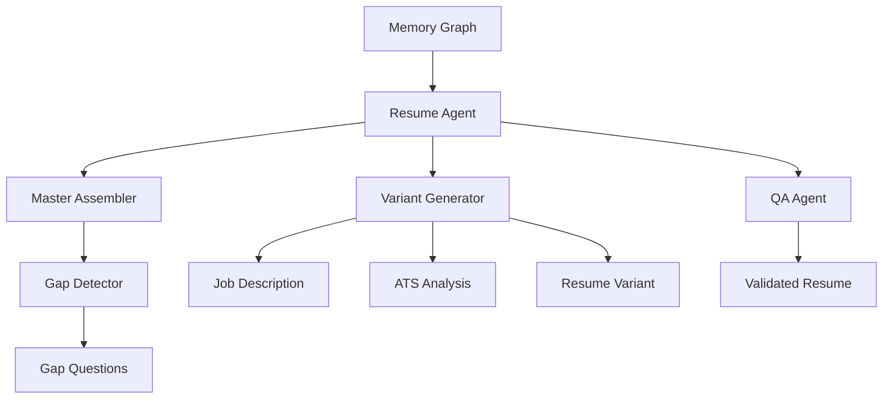
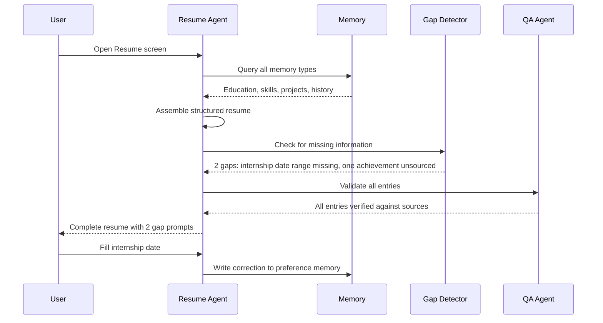

## Header
>
> **Purpose:** Detailed specification for Master Resume
> **Status:** 🆕 New
> **Owner:** Product Team
> **Last Updated:** 2026-07-13

## Overview

The Master Resume is the first "wow" feature of Vaeloom — a living resume that assembles itself from everything the system knows about the user. When memory changes (a new project is extracted from a file, a skill is inferred from code, a certificate is parsed from an email), the Resume Agent checks whether the master resume is missing anything. If complete, it silently updates. If there's a gap — incomplete dates, missing context, an achievement without a source — it asks the user a specific question rather than guessing. The result is a resume that is always current, always traceable to original sources, and never contains fabricated information.

The resume is not a single document. It's a structured JSON representation (the "master") from which any number of variants can be generated: a one-page PDF for a specific job, a two-page academic CV, a plain-text version for application portals, or a LinkedIn-format summary. Each variant is generated on demand from the same underlying master, with the target role's job description and the ATS Agent's gap analysis influencing which sections get emphasized, abbreviated, or reordered. Variants are cached and versioned for audit purposes.

This feature is the proof point for Vaeloom's core thesis: if memory is accurate and comprehensive, the resume should be the easiest thing the system produces, not the hardest. The user never manually adds a bullet point; they answer questions about things the system already knows exist but lacks detail on. Over time, as the memory graph fills in, those questions become rarer and the resume becomes genuinely automatic.

## Goals

- Generate a complete master resume from memory within 60 seconds of user request
- Achieve <5 questions per month for ongoing gap-filling after initial setup
- Support 5+ variant types (standard, ATS-optimized, academic, short-form, LinkedIn)
- Enable full traceability from every resume entry back to its source memory record
- Never fabricate a skill, date, or achievement — always ask when confidence <80%

## User Story

"As a student juggling coursework, internships, hackathons, and side projects, I want a resume that updates itself when I accomplish something new so that I never show up to a career fair with a stale document that misses my best work."

## Acceptance Criteria

| ID | Criterion | Priority |
|----|-----------|----------|
| MR-1 | Master resume auto-generates from memory on first visit to Resume screen | P0 |
| MR-2 | Every entry links to source entities with clickable provenance | P0 |
| MR-3 | User can edit any entry inline, with edits persisted to memory | P0 |
| MR-4 | Gap-fill questions appear as inline prompts, not a separate flow | P1 |
| MR-5 | Variant generation completes in <30s for a given target role | P1 |
| MR-6 | Version history retains last 50 states of master resume | P1 |
| MR-7 | User can manually add entries not yet in memory (with source upload) | P1 |
| MR-8 | Export to PDF, DOCX, and plain text | P1 |
| MR-9 | ATS score panel appears alongside resume in split view | P2 |
| MR-10 | Variant comparison: side-by-side diff between two versions | P2 |

## Data Model

| Entity | Fields | Usage |
|--------|--------|-------|
| `resumes` | `id`, `workspace_id`, `variant_type`, `content (jsonb)`, `version`, `generated_from_snapshot`, `target_role_id` | Resume storage and versioning |
| `entities` | `id`, `type`, `canonical_name`, `aliases[]`, `confidence` | Skills, projects, orgs referenced in resume |
| `memory_records` | `id`, `workspace_id`, `type`, `content (jsonb)`, `source_document_id` | Source facts backing each resume entry |
| `applications` | `id`, `workspace_id`, `resume_version_id` | Links submitted resume versions to applications |

Resume schema (`content`, jsonb):

```json
{
  "sections": [
    {
      "type": "education" | "experience" | "projects" | "skills" | "certifications",
      "title": "Education",
      "entries": [
        {
          "summary": "B.Tech in Computer Science, GPA 3.8",
          "source_entity_ids": ["entity_1", "entity_2"],
          "date_range": {"start": "2023-08", "end": "2027-05"},
          "tags": ["education", "cs"],
          "confidence": 0.95
        }
      ]
    }
  ],
  "variant_type": "master",
  "generated_from_snapshot": "memory_snapshot_v42"
}
```

## API Endpoints

| Method | Path | Purpose | Auth Scope |
|--------|------|---------|------------|
| `GET` | `/workspaces/{id}/resume/master` | Get current master resume | `resume:read` |
| `POST` | `/workspaces/{id}/resume/variant` | Generate a variant for a target role | `resume:write` |
| `PATCH` | `/workspaces/{id}/resume/entries/{entry_id}` | Edit a specific resume entry | `resume:write` |
| `GET` | `/workspaces/{id}/resume/versions` | List version history | `resume:read` |
| `GET` | `/workspaces/{id}/resume/gaps` | Get current gap-fill questions | `resume:read` |
| `POST` | `/workspaces/{id}/resume/gaps/{gap_id}/answer` | Answer a gap-fill question | `resume:write` |
| `GET` | `/workspaces/{id}/resume/export?format=pdf` | Export resume in specified format | `resume:read` |

## Agent Interactions

| Agent | Action | When |
|-------|--------|------|
| Resume Agent | Assemble master resume, detect gaps, generate variants | Memory changes or user request |
| ATS Agent | Score resume against target JD (see ATS-Scoring.md) | Variant generation flow |
| Memory Agent | Persist user edits and gap answers to memory | Entry edit or gap answer |
| QA Agent | Validate resume content for hallucination/fabrication | Before variant is presented |
| Orchestrator | Route resume request to Resume Agent | User opens Resume screen |

## Memory Impact

| Memory Type | Read | Write | Notes |
|-------------|------|-------|-------|
| Profile | Yes | Yes | Education, skills, certs consumed and refined |
| Document | Yes | No | Source documents for project/experience entities |
| Career | Yes | No | Past applications inform resume emphasis |
| Episodic | Yes | No | Events, milestones, achievements |
| Preference | Yes | Yes | Resume formatting preferences, emphasis signals |
| Working | Yes | No | Current editing session state |

## Permission Model

| Scope | Required For | Default |
|-------|-------------|---------|
| `resume:read` | Viewing master resume and variants | Granted |
| `resume:write` | Editing entries, generating variants | Granted |
| `resume:auto-update` | Silent resume update on memory change | Suggest-only |
| `memory:write` | Persisting edited entries back to memory | Granted (scoped to edits) |

Autonomy level: **Suggest** for auto-updates (proposes changes, doesn't apply silently until user approves pattern). **Read-only** for generation (user initiates).

## Error Scenarios

| Scenario | Error | User Impact | Recovery |
|----------|-------|-------------|----------|
| Memory snapshot missing entities | Incomplete resume | Sections titled "(missing information)" with gap prompts | User answers questions to fill |
| LLM hallucinates a skill | QA Agent flags | Entry shown with "low confidence" badge, user must confirm | Reject removes entry, logs correction |
| Gap-fill question has no source material | Cannot answer without new info | Prompt says "Upload a document or type the answer" | User uploads file or types manually |
| Variant generation takes >30s | Timeout | User sees progress bar with "Generating variant..." | Background task; notify when ready |
| Resume export fails | Format conversion error | Error toast with format-specific message | Retry with alternative format, fallback to plain text |

## Performance Budgets

| Operation | Target | Measurement |
|-----------|--------|------------|
| Master resume assembly | <10s (p95) | From user request to rendered resume |
| Variant generation | <30s (p95) | From target role selection to variant ready |
| Entry edit persistence | <500ms (p95) | API write + memory write |
| Version history load | <2s (p95) | 50 versions list |
| PDF export | <5s (p95) | From export request to download |
| Gap detection pass | <60s (background) | Scheduled check after memory changes |

## Security Considerations

| Concern | Mitigation |
|---------|------------|
| Resume contains fabricated achievements | QA Agent validates every entry before display; confidence <80% flagged as "unconfirmed" |
| Resume data exposed via export | Export requires same auth scope as resume read; downloaded files are unencrypted by design but served over HTTPS |
| Edit history exposes sensitive edits | Version history shows only content diffs, not who viewed; full audit trail in `agent_actions` table |
| Variant targeted to inappropriate role | Variant generation requires user-initiated action; agent cannot autonomously create and submit variants |

## UI States

- **Loading:** Skeleton layout matching resume structure; section placeholders pulse
- **Empty:** "Your resume is empty — Vaeloom is analyzing your files. This usually takes a few minutes." Progress indicator for first-time ingestion
- **Error:** Inline error on failed variant generation; retry button; fallback to last known good version
- **Edge cases:** Conflicting date ranges (e.g., two jobs overlapping) are shown with a conflict badge and explanation; entries with zero source entities show "manually added — no source document"; deleted entries show in version history as strikethrough diff

## Risks

| Risk | Likelihood | Impact | Mitigation |
|------|------------|--------|------------|
| Resume contains plausible but fabricated content | Low | Critical | QA Agent checks every line against source memories; below-threshold content is flagged |
| User relies on resume without verifying | Medium | High | Prominent "AI-generated — verify before submitting" banner on every export |
| Stale memory causes resume to miss recent achievements | Medium | Medium | Gap-detection pass runs after every memory write; user notified of gaps within 5 minutes |
| Variant generation cost at scale | High | Medium | Cache variants by target role; debounce re-generation when only minor memory changes occur |
| User prefers manual control over auto-generated content | Medium | Low | Full manual editing available; auto-generated entries are suggestions that user can accept/reject individually |

## Scope

| | |
|---|---|
| **In Scope** | Auto-generated master resume from memory; full traceability to source entities; inline editing with memory persistence; gap-fill questions as inline prompts; variant generation (standard, ATS-optimized, academic, short-form, LinkedIn); 50-version history; manual entry with source upload; PDF/DOCX/plain text export; ATS score panel in split view; variant comparison |
| **Out of Scope** | Resume templates/themes (plain professional format); design/layout customization; video resume; portfolio integration; multilingual resume generation; auto-submission to application portals (see Tailored Applications) |

## Architecture



> **Diagram:** Master Resume architecture — memory graph → assembler → gap detection → variant generation → QA validation.

## Components

| Component | Responsibility | Technology |
|-----------|---------------|------------|
| Resume Agent | Assemble master, detect gaps, generate variants | FastAPI + Claude API |
| Master Assembler | Build structured resume from memory entities | FastAPI |
| Gap Detector | Identify missing information in resume entries | FastAPI + Claude API |
| Variant Generator | Create role-specific resume variants | FastAPI + Claude API |
| QA Agent | Validate resume for hallucination/fabrication | FastAPI + LLM eval |
| Export Service | PDF/DOCX/plain text generation | PDFKit + Pandoc |

## Workflows

### Resume Assembly Workflow

1. User opens Resume screen — trigger master assembly
2. Resume Agent queries all memory types: Profile (education, skills), Document (projects, experience), Career (employment history), Episodic (achievements)
3. Assembly engine structures entries into sections (education, experience, projects, skills, certifications)
4. Every entry linked to source entity IDs for provenance
5. Gap Detector identifies missing fields (incomplete dates, missing context, unsourced achievements)
6. Gap-fill questions generated as inline prompts
7. Resume displayed with source-linked entries and gap prompts
8. User edits trigger memory writes — edits are permanent learning, not one-time fixes

## Sequence Diagrams



## Data Flow

1. **Assembly:** Memory query → entities grouped by type (education, skill, project, certification, experience)
2. **Structuring:** Entities → sections → entries with date ranges, descriptions, source links
3. **Gap Detection:** Each entry checked for completeness → missing fields → gap questions
4. **Generation:** User requests variant → master + target JD + ATS analysis → tailored resume
5. **Export:** Resume JSON → PDF template → rendered PDF → user download

## Non-Functional Requirements

| Requirement | Target | Measurement |
|-------------|--------|-------------|
| Master resume assembly | <10s (p95) | Request to rendered resume |
| Variant generation | <30s (p95) | Target role to variant ready |
| Entry edit persistence | <500ms (p95) | API write + memory write |
| Version history load (50) | <2s (p95) | API response |
| Hallucination rate | <2% (QA-validated) | Manual audit sample |

## Scalability

| Dimension | Current Limit | 10x Strategy | 100x Strategy |
|-----------|--------------|--------------|---------------|
| Master assemblies per user | 5/day | Cache master resume, update incrementally | Event-driven incremental assembly |
| Variant storage | 50/user | Archive old variants after 6 months | Tiered variant storage |
| Version history | 50 versions/user | Compress older versions | Diff-based version storage |
| Export generation | 10/min | Worker pool for exports | Dedicated export microservice |

## Monitoring

| Metric | Alert Threshold | Severity | Dashboard |
|--------|----------------|----------|-----------|
| Assembly time | >20s (p95) | Warning | Resume Performance |
| Variant generation time | >60s (p95) | Critical | Resume Performance |
| QA rejection rate | >5% | Critical | Resume Quality |
| Gap detection accuracy | <80% user satisfaction | Warning | Resume Quality |

## Deployment

| Environment | Method | Trigger | Verification |
|-------------|--------|---------|--------------|
| Development | Docker Compose | `docker compose up` | Health endpoint |
| Staging | Helm chart | CI merge | Assembly E2E tests |
| Production | ArgoCD | Git tag | Canary deploy |

## Configuration

| Variable | Purpose | Default | Required |
|----------|---------|---------|----------|
| `RESUME_MODEL` | LLM for resume generation | `claude-sonnet-4-20250514` | Yes |
| `RESUME_VARIANT_MAX` | Maximum stored variants per user | `50` | No |
| `RESUME_VERSION_MAX` | Maximum version history entries | `50` | No |
| `RESUME_CONFIDENCE_THRESHOLD` | Min confidence for auto-include | `0.8` | No |

## Examples

```bash
# Get master resume
curl -X GET https://api.Vaeloom.dev/v1/workspaces/{id}/resume/master \
  -H "Authorization: Bearer $TOKEN"

# Generate variant
curl -X POST https://api.Vaeloom.dev/v1/workspaces/{id}/resume/variant \
  -H "Authorization: Bearer $TOKEN" \
  -d '{"target_role": "SDE Intern", "company": "Google"}'

# Export as PDF
curl -X GET https://api.Vaeloom.dev/v1/workspaces/{id}/resume/export?format=pdf \
  -H "Authorization: Bearer $TOKEN" \
  -o tailored_resume.pdf
```

## Best Practices

| Practice | Rationale |
|----------|-----------|
| Review the first master resume thoroughly | The first assembly sets the baseline — verify every entry, fill all gaps, and correct errors to train the system |
| Fill gap prompts instead of editing entries directly | Gap prompts teach the system what information was missing; direct edits fix the resume but don't fill the memory gap |
| Generate ATS-optimized variant before submitting | The ATS-optimized variant rearranges content for machine readability — always use this for online applications |
| Check version history before major edits | If you need to revert after editing, version history preserves the last 50 states |

## Limitations

| Limitation | Impact | Workaround | Future Resolution |
|------------|--------|------------|-------------------|
| No visual resume templates (plain format only) | Users wanting design-heavy resumes may be disappointed | Export to DOCX and apply formatting in Word/Google Docs | Resume template marketplace (V3) |
| No multilingual resume support | Users needing resumes in multiple languages must translate manually | Generate in English, then use external translation | Multi-language resume variants (Enterprise) |
| Gap detection requires sufficient memory data | New users with empty graphs get sparse resumes | Use seed flow (upload resume) during onboarding for instant baseline | Progressive gap filling (v1.5) |

## Future Improvements

| Improvement | Priority | Complexity | Timeline |
|-------------|----------|------------|----------|
| Resume template marketplace | Low | High | V3 (2028) |
| Multi-language resume variants | Low | High | Enterprise (2028) |
| LinkedIn profile sync (read → master → write back) | Medium | Medium | V2 (2027 H2) |
| Portfolio-generator integration (link projects to resume entries) | Medium | Medium | v1.5 (2027 H1) |

## Related Documents

- [Features.md](../Features.md)
- [ATS-Scoring.md](./ATS-Scoring.md)
- [Tailored-Applications.md](./Tailored-Applications.md)
- `/Docs/Vaeloom-Complete-Documentation.md#7-features`
- `/Docs/AI/AI-Agents.md#resume-agent`
