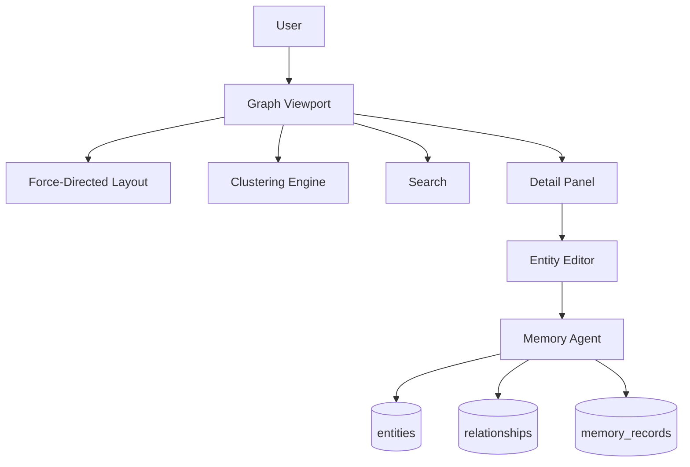
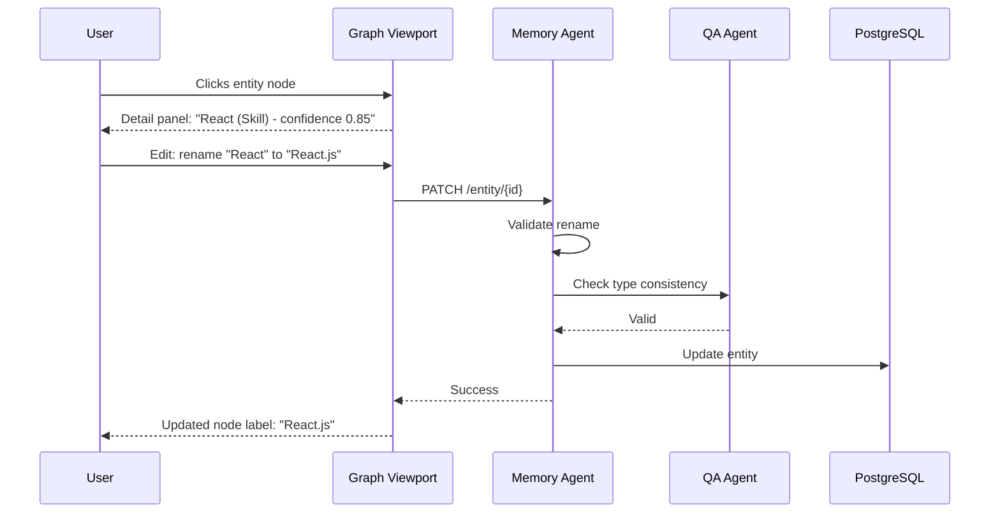

## Header
> **Purpose:** Detailed specification for Memory Graph Explorer
> **Status:** 🆕 New
> **Owner:** Product Team
> **Last Updated:** 2026-07-13

## Overview

The Memory Graph Explorer is an interactive visualization of the user's knowledge graph — every entity the system knows about (skills, projects, organizations, people, certificates, events, jobs, courses, publications) and the relationships between them. Unlike a traditional file browser or database view, the graph is a navigable canvas the user can pan, zoom, and click through to explore what Meridian knows about them, how entities connect, and where gaps exist. It is both a transparency tool ("show me what the system thinks I know") and a direct manipulation interface for correcting the system's understanding.

The graph renders entities as labeled nodes with type-specific icons and colors. Relationships appear as directed edges with labels and confidence indicators. Users can click a node to see its detail panel (properties, source provenance, confidence score), drag to explore connected nodes, or search for a specific entity. From the detail panel, users can correct entity properties (e.g., fix a skill name), merge two entities that should be the same, delete an incorrect entity, or add a missing relationship between two known entities. Every correction writes back to the underlying memory stores through the Memory Agent.

This is the only screen in Meridian where users directly interact with the memory layer itself. Every other feature reads and writes through agents; the Memory Graph exposes the raw material. The design prioritizes clarity and discoverability over density — the default view shows a focused subgraph centered on the most important entities, and the user expands outward by clicking. Performance targets are aggressive because the graph can grow to thousands of nodes over months of use, and the interaction (pan, zoom, click) must feel instantaneous to be useful.

## Goals

- Render a graph of 500+ nodes with <2s initial load and 60fps interaction
- Show entity detail with source provenance on click within 500ms
- Enable entity correction, merge, delete, and relationship creation directly from the graph
- Default view highlights highest-importance nodes with >85% confidence
- Provide search to find any entity by name or alias within 200ms

## User Story

"As a student who wants to trust Meridian, I want to see everything the system knows about me and how it's connected so that I can verify it's correct and fix anything that's wrong before the system uses it to generate resumes or search for jobs."

## Acceptance Criteria

| ID | Criterion | Priority |
|----|-----------|----------|
| MG-1 | Interactive graph canvas with pan, zoom, click-to-select | P0 |
| MG-2 | Entity nodes display type-specific icon and label | P0 |
| MG-3 | Relationship edges display type and direction | P0 |
| MG-4 | Click node shows detail panel with all properties | P0 |
| MG-5 | Detail panel shows source provenance for every fact | P0 |
| MG-6 | User can correct entity name, description, or type | P1 |
| MG-7 | User can merge two entities into one | P1 |
| MG-8 | User can delete an entity (with undo) | P1 |
| MG-9 | User can add a relationship between two entities | P2 |
| MG-10 | Search bar filters and focuses on matching entity | P1 |

## Data Model

| Entity | Fields | Usage |
|--------|--------|-------|
| `entities` | `id`, `workspace_id`, `type`, `canonical_name`, `aliases[]`, `confidence`, `importance`, `embedding_id` | Graph nodes |
| `relationships` | `id`, `workspace_id`, `from_entity_id`, `to_entity_id`, `relation_type`, `confidence`, `source_memory_id` | Graph edges |
| `memory_records` | `id`, `workspace_id`, `type`, `content`, `source_document_id` | Source provenance for each entity |
| `agent_actions` | `id`, `workspace_id`, `agent_name`, `action_type`, `input_ref`, `output_ref` | Correction and merge audit log |
| `documents` | `id`, `workspace_id`, `path`, `summary` | Source documents for memory records |

All entities and relationships are read from the existing graph schema (§11.2).

## API Endpoints

| Method | Path | Purpose | Auth Scope |
|--------|------|---------|------------|
| `GET` | `/workspaces/{id}/memory/graph` | Get graph data (nodes + edges) for viewport | `memory:read` |
| `GET` | `/workspaces/{id}/memory/entity/{entity_id}` | Get entity detail with provenance | `memory:read` |
| `PATCH` | `/workspaces/{id}/memory/entity/{entity_id}` | Correct entity properties | `memory:write` |
| `POST` | `/workspaces/{id}/memory/entity/{entity_id}/merge` | Merge with another entity | `memory:write` |
| `DELETE` | `/workspaces/{id}/memory/entity/{entity_id}` | Delete entity (soft, undoable) | `memory:write` |
| `POST` | `/workspaces/{id}/memory/relationship` | Create relationship between entities | `memory:write` |
| `DELETE` | `/workspaces/{id}/memory/relationship/{rel_id}` | Delete relationship | `memory:write` |
| `GET` | `/workspaces/{id}/memory/search?q=` | Search entities by name/alias | `memory:read` |

## Agent Interactions

| Agent | Action | When |
|-------|--------|------|
| Memory Agent | Process corrections, merges, deletes | User edits entity from graph |
| Reflection Agent | Review correction patterns; identify frequently-corrected entity types | Periodic pass |
| QA Agent | Validate merge operation (e.g., different entity types shouldn't merge) | Before merge executes |
| Orchestrator | Route graph read requests to Memory Agent | User opens graph |

## Memory Impact

| Memory Type | Read | Write | Notes |
|-------------|------|-------|-------|
| Profile | Yes | Yes | Corrections to skills, education, certs |
| Document | Yes | No | Source provenance links |
| Career | Yes | Yes | Corrections to career-related entities |
| Episodic | Yes | Yes | Correction events logged |
| Preference | Yes | Yes | Correction patterns inform confidence |
| Working | Yes | No | Current graph viewport state |

## Permission Model

| Scope | Required For | Default |
|-------|-------------|---------|
| `memory:read` | View graph and entity details | Granted |
| `memory:write` | Correct, merge, delete entities | Granted |
| `memory:write:merge` | Merge two entities | Granted (with confirmation) |
| `memory:write:delete` | Delete an entity | Granted (with undo window) |

Autonomy level: **Read-only** for the graph itself (visualization). **Full** for user-initiated corrections (user explicitly triggers every action — this is direct manipulation, not agent autonomy).

## Error Scenarios

| Scenario | Error | User Impact | Recovery |
|----------|-------|-------------|----------|
| Graph query for large subgraph times out | Partial render | Renders available nodes; "Some connections hidden — zoom in" indicator | Paginate by viewport; deeper nodes load on zoom |
| Merge conflicts (two entities have contradictory properties) | Merge blocked | "Cannot auto-merge — conflicting properties" with side-by-side diff | User manually resolves each conflict |
| Entity deletion with incoming relationships | Cascade warning | "This will also delete N relationships" confirmation dialog | User confirms or cancels; undo available for 30 days |
| Correction write fails due to concurrent edit | Optimistic lock | "Entity was modified — refresh and retry" | Reload entity detail, apply correction again |
| Search finds no matching entity | No results | "No matching entities — adjust your search" | Suggest search by type or browse by category |

## Performance Budgets

| Operation | Target | Measurement |
|-----------|--------|------------|
| Initial graph load (500 nodes + edges) | <2s (p95) | API response to renderable data |
| Viewport interaction (pan/zoom) | 60fps | Browser frame rate |
| Entity detail panel load | <500ms (p95) | Click to panel rendered |
| Graph search response | <200ms (p95) | Typeahead results |
| Entity correction write | <1s (p95) | API response + memory write |
| Merge operation | <3s (p95) | From confirm to merged result |

## Security Considerations

| Concern | Mitigation |
|---------|------------|
| Graph view exposes sensitive entity information | All graph data workspace-scoped; entities extracted from private documents remain private |
| User accidentally deletes important entity | Soft delete with 30-day undo window; deletion logged in audit trail |
| Merge creates incorrect combined entity | Merge preview shows before/after; QA Agent validates type compatibility before allowing merge |
| Graph interaction reveals cross-user correlations | No cross-entity comparison; each graph is single-user workspace |
| Entity correction is overwritten by subsequent automated extraction | User corrections are stored as overrides with higher confidence weight than automated extraction |

## UI States

- **Loading:** Force-directed layout animation; nodes appear with fade-in as they're positioned; progress indicator for large graphs
- **Empty:** "Your knowledge graph is empty. Upload documents or connect sources to start building your graph." Empty canvas with animated connection-line placeholder
- **Error:** Graph section unrenderable nodes marked with "Error loading" badge in dimmed state; retry button on failed subgraph; full failure shows "Unable to load graph — check your connection"
- **Edge cases:** Isolated nodes (no relationships) shown in a "Disconnected" section off to the side; nodes with >50 relationships show expanded children as a separate mini-graph on click to avoid visual clutter; entity with very long name is truncated with ellipsis, full name on hover; extremely dense subgraph (>200 nodes in viewport) uses clustering to group similar nodes with count badges; deleted entities shown in "Recently deleted" section for undo

## Risks

| Risk | Likelihood | Impact | Mitigation |
|------|------------|--------|------------|
| Graph becomes too large for performant browser rendering | High (6+ months) | High | Clustering, viewport-level culling, WebGL-based rendering (e.g., Three.js/regl) for large graphs |
| User performs incorrect merge that corrupts two entity records | Low | High | Merge preview; QA validation; 30-day undo; audit log for rollback |
| Casual users find graph too technical or intimidating | Medium | Medium | Default view is focused subgraph (top 20 entities), not full graph; "explore" mode is opt-in expansion |
| Correction frequency suggests poor extraction quality | Medium | Low | Correction rate tracked as a Memory Agent quality metric; high correction rates trigger prompt improvement |
| Graph interaction does not translate to mobile | Medium | Low | Mobile optimized for search and entity detail only; full graph canvas is desktop-primary with mobile fallback |

## Scope

| | |
|---|---|
| **In Scope** | Interactive graph canvas with pan, zoom, click-to-select; entity nodes with type-specific icons and colors; relationship edges with type and direction labels; entity detail panel with all properties and source provenance; entity correction (name, description, type); entity merge; entity deletion (soft, 30-day undo); relationship creation; search by name/alias; default view showing highest-importance nodes |
| **Out of Scope** | Graph editing by agents (user-initiated only); automatic entity linking suggestions (user must confirm); cross-user graph comparison; graph export/import; real-time graph collaboration; graph-based analytics (degree distribution, centrality scores) |

## Architecture



> **Diagram:** Memory Graph architecture — user interacts with graph viewport → force-directed layout + clustering → detail panel → entity editor → Memory Agent writes back.

## Components

| Component | Responsibility | Technology |
|-----------|---------------|------------|
| Graph Renderer | Force-directed layout with WebGL rendering | Three.js / regl + D3-force |
| Viewport Manager | Pan, zoom, viewport-level culling | Three.js |
| Clustering Engine | Group dense subgraphs (>200 nodes) | FastAPI + community detection |
| Detail Panel | Show entity properties and provenance | React |
| Entity Editor | Correction, merge, delete, relationship creation UI | React |
| Memory Agent Proxy | Route edits to Memory Agent | API Gateway |

## Workflows

### Entity Correction Workflow

1. User searches or navigates to entity in graph
2. Clicks entity to open detail panel
3. Panel shows: entity name, type, aliases, confidence, importance score, source documents
4. User clicks "Edit" to modify entity properties
5. Changes submitted to Memory Agent via API
6. Memory Agent validates: entity type compatibility, relationship consistency
7. QA Agent validates: merge compatibility (different types shouldn't merge)
8. Correction persisted as override (higher weight than automated extraction)
9. Graph re-renders with updated entity

## Sequence Diagrams



## Data Flow

1. **Graph Load:** Workspace ID → query `entities` + `relationships` → limit to 500 highest-importance nodes → return to renderer
2. **Viewport:** Camera position → server requests nodes in viewport bounds (if lazy loading enabled)
3. **Search:** Query → `entities.canonical_name` + `aliases[]` ILIKE match → focused graph centered on result
4. **Correction:** User edit → `entities` row updated → `agent_actions` audit log written → override flag set (higher weight than extraction)
5. **Merge:** Entity A + Entity B → relationship consolidation → redundant entity soft-deleted → new unified entity

## Non-Functional Requirements

| Requirement | Target | Measurement |
|-------------|--------|-------------|
| Initial graph load (500 nodes) | <2s (p95) | API to renderable data |
| Viewport interaction | 60fps | Browser frame rate |
| Detail panel load | <500ms (p95) | Click to panel |
| Search response | <200ms (p95) | Typeahead results |
| Correction write | <1s (p95) | API + memory write |

## Scalability

| Dimension | Current Limit | 10x Strategy | 100x Strategy |
|-----------|--------------|--------------|---------------|
| Graph nodes rendered | 500 initial | Viewport-level pagination | Server-side rendered graph tiles |
| Concurrent graph viewers | 100 | WebGL instances share GPU | Composited graph server |
| Relationships per node | 50 expanded | Clustering groups >50 neighbors | Hierarchical graph with drill-down |
| Correction throughput | 100/min | Async correction queue | Dedicated correction worker |

## Monitoring

| Metric | Alert Threshold | Severity | Dashboard |
|--------|----------------|----------|-----------|
| Graph load time | >5s (p95) | Critical | Memory Graph Performance |
| Interaction frame rate | <30fps | Warning | Memory Graph UX |
| Correction error rate | >5% | Warning | Memory Graph Quality |
| Merge conflicts | >2% of merge attempts | Info | Memory Graph Quality |

## Deployment

| Environment | Method | Trigger | Verification |
|-------------|--------|---------|--------------|
| Development | Docker Compose | `docker compose up` | Health endpoint |
| Staging | Helm chart | CI merge | Graph E2E tests |
| Production | ArgoCD | Git tag | Canary deploy |

## Configuration

| Variable | Purpose | Default | Required |
|----------|---------|---------|----------|
| `GRAPH_INITIAL_NODES` | Max nodes in initial load | `500` | No |
| `GRAPH_UNDO_DAYS` | Soft delete undo window (days) | `30` | No |
| `GRAPH_CLUSTER_THRESHOLD` | Nodes before clustering activates | `200` | No |
| `GRAPH_SEARCH_MAX` | Max search results | `20` | No |

## Examples

```bash
# Get graph data
curl -X GET https://api.meridian.dev/v1/workspaces/{id}/memory/graph \
  -H "Authorization: Bearer $TOKEN"

# Correct entity name
curl -X PATCH https://api.meridian.dev/v1/workspaces/{id}/memory/entity/{entity_id} \
  -H "Authorization: Bearer $TOKEN" \
  -d '{"canonical_name": "React.js"}'

# Merge two entities
curl -X POST https://api.meridian.dev/v1/workspaces/{id}/memory/entity/{entity_id}/merge \
  -H "Authorization: Bearer $TOKEN" \
  -d '{"target_entity_id": "entity_456"}'
```

## Best Practices

| Practice | Rationale |
|----------|-----------|
| Review your graph weekly to correct extraction errors | Early correction prevents the system from building incorrect relationships on top of wrong entities |
| Merge duplicate entities as soon as you spot them | Duplicate entities fragment the graph — merging them improves every agent's accuracy immediately |
| Add missing relationships between known entities | A relationship you add manually is more reliable than an automated one — it also teaches the extraction pipeline |
| Check source provenance before editing | Click through to source documents to verify an entity before correcting it — ensures edits are based on facts |

## Limitations

| Limitation | Impact | Workaround | Future Resolution |
|------------|--------|------------|-------------------|
| Desktop-only visualization | Mobile users cannot view or edit the graph | Search and entity detail available on mobile; graph canvas requires desktop | Mobile-optimized graph view (V3) |
| No automatic merge suggestions | Users must discover and merge duplicates themselves | Search entities by name prefix to find potential duplicates | Automated duplicate detection and merge suggestions (v1.5) |
| Graph rendering limited to 500 initial nodes | Users with 1000+ entities may not see full graph initially | Panning and zooming loads additional nodes incrementally | Infinite canvas with server-side tile rendering (V2) |

## Future Improvements

| Improvement | Priority | Complexity | Timeline |
|-------------|----------|------------|----------|
| Automated duplicate detection and merge suggestions | High | Medium | v1.5 (2027 H1) |
| Infinite canvas with server-side tile rendering | Medium | High | V2 (2027 H2) |
| Graph timeline view (entities over time) | Low | Medium | V2 (2027 H2) |
| Mobile-optimized graph view | Low | High | V3 (2028) |

## Related Documents

- [Features.md](../Features.md)
- [Global-Search.md](./Global-Search.md)
- `/Docs/Meridian-Complete-Documentation.md#6-memory-system`
- `/Docs/AI/Knowledge-Graph.md`
- `/Docs/AI/Memory.md`
