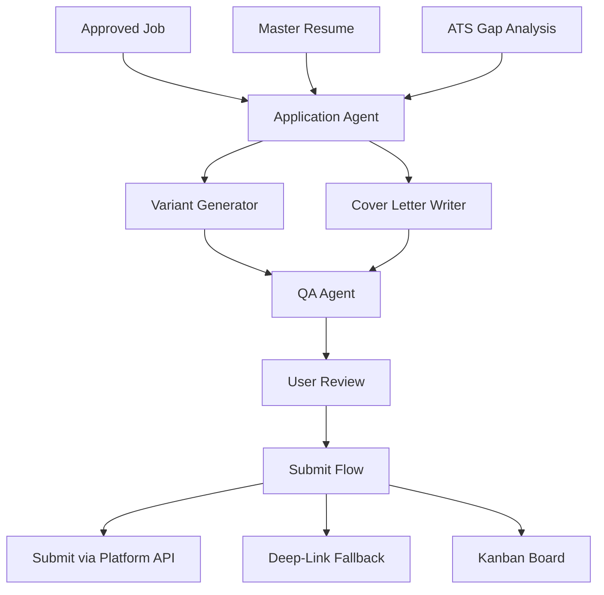
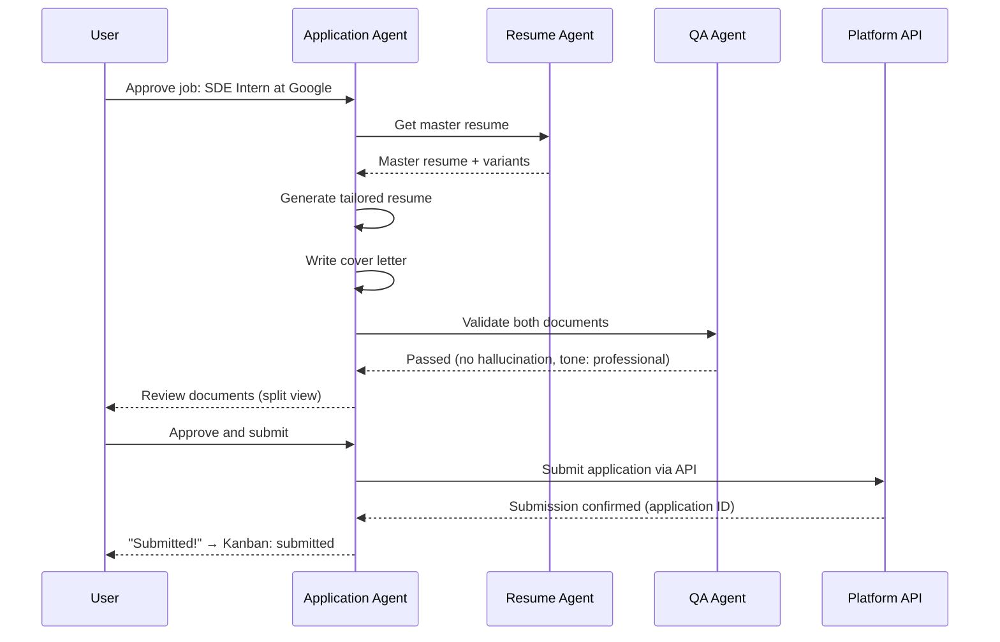

## Header
> **Purpose:** Detailed specification for Tailored Applications
> **Status:** 🆕 New
> **Owner:** Product Team
> **Last Updated:** 2026-07-13

## Overview

Tailored Applications is the end-to-end flow that turns an approved job match into a submitted application. When the user approves a role from their shortlist, the Application Agent generates a tailored resume variant and cover letter using the user's master resume, the ATS gap analysis, and the specific job description. The user reviews the tailored materials, makes any final edits, and either submits via an integrated platform API or receives a deep-link to complete the application on the platform directly. Every submission — outcome known or not — is logged back to career memory for future ranking calibration.

The Application Agent operates exclusively in approval-gated mode. It cannot submit any application without explicit user consent per submission. The QA Agent validates every tailored document before the user sees it, checking for hallucinated skills, incorrect dates, fabricated experience, or mismatched tone. The user can also choose to have the Application Agent pre-fill application forms via API where supported, or generate a "package" (resume + cover letter + portfolio links) they can submit manually.

This feature closes the loop that begins with Job Search and ATS Scoring. Without application tracking and outcome logging, the job search ranking never improves and the user has no history to reference. The application status board (kanban-style) gives the user a single place to track every opportunity from "shortlisted" through "submitted" to "offer/rejected," with all the associated documents and communications linked.

## Goals

- Generate tailored resume and cover letter within 60 seconds of approval
- Never submit an application without explicit per-application user consent
- Achieve <2% hallucination rate in tailored documents (QA-validated)
- Track every application from shortlist through to outcome
- Support submit-via-API where available, deep-link as fallback

## User Story

"As a job seeker who knows generic applications don't work, I want each application to be tailored to the specific role and submitted with my approval so that I maximize my chances without spending two hours per application on customization."

## Acceptance Criteria

| ID | Criterion | Priority |
|----|-----------|----------|
| TA-1 | Tailored resume variant generated from master + JD within 60s | P0 |
| TA-2 | Cover letter generated from memory + JD within 60s | P0 |
| TA-3 | User can review and edit both documents before submission | P0 |
| TA-4 | Explicit per-application confirmation required before submit | P0 |
| TA-5 | Application status tracked on kanban board | P0 |
| TA-6 | Submit via platform API where connector supports it | P1 |
| TA-7 | Deep-link to platform application form as fallback | P1 |
| TA-8 | Outcome (offer/rejected/interviewing) logged by user or Gmail inference | P1 |
| TA-9 | QA Agent validates documents before user review | P2 |
| TA-10 | Application package (resume + cover letter + links) downloadable as zip | P2 |

## Data Model

| Entity | Fields | Usage |
|--------|--------|-------|
| `applications` | `id`, `workspace_id`, `job_external_id`, `platform`, `status`, `resume_version_id`, `cover_letter`, `submitted_at`, `outcome` | Core application tracking |
| `resumes` | `id`, `workspace_id`, `variant_type`, `content (jsonb)`, `target_role_id` | Tailored resume variants |
| `documents` | `id`, `workspace_id`, `type`, `raw_storage_key` | Generated cover letter storage |
| `agent_actions` | `id`, `workspace_id`, `agent_name`, `action_type`, `input_ref`, `output_ref` | Audit trail for every generation and submission |
| `schedule_events` | `id`, `workspace_id`, `source`, `date`, `type` | Follow-up reminders for application status |

Application status enum: `shortlisted → tailoring → ready_for_review → submitted → interviewing → offer → rejected → withdrawn`

## API Endpoints

| Method | Path | Purpose | Auth Scope |
|--------|------|---------|------------|
| `GET` | `/workspaces/{id}/applications` | List all applications with status | `applications:read` |
| `POST` | `/workspaces/{id}/applications` | Create application from approved job | `applications:write` |
| `GET` | `/workspaces/{id}/applications/{app_id}` | Get application detail with documents | `applications:read` |
| `POST` | `/workspaces/{id}/applications/{app_id}/tailor` | Generate tailored materials | `applications:write` |
| `POST` | `/workspaces/{id}/applications/{app_id}/submit` | Submit application | `applications:write` |
| `PATCH` | `/workspaces/{id}/applications/{app_id}/status` | Update status/outcome | `applications:write` |
| `GET` | `/workspaces/{id}/applications/{app_id}/export` | Download application package | `applications:read` |
| `DELETE` | `/workspaces/{id}/applications/{app_id}` | Withdraw application | `applications:write` |

## Agent Interactions

| Agent | Action | When |
|-------|--------|------|
| Application Agent | Generate tailored resume + cover letter | User approves job from shortlist |
| Resume Agent | Provide base resume for tailoring | Tailoring request |
| ATS Agent | Inform which sections to emphasize | During tailoring |
| QA Agent | Validate tailored documents for fabrication | Before user review |
| Gmail Agent | Infer application outcome from emails | Post-submission (incoming interview/offer mail) |
| Memory Agent | Log submission and outcome to career memory | On submit and outcome update |
| Orchestrator | Coordinate agent chain for tailoring | Tailoring request received |

## Memory Impact

| Memory Type | Read | Write | Notes |
|-------------|------|-------|-------|
| Career | Yes | Yes | Applications created, outcomes logged |
| Profile | Yes | No | Skills, education for tailoring |
| Document | Yes | Yes | Cover letters stored |
| Episodic | Yes | Yes | Application events logged |
| Preference | Yes | Yes | Application patterns (which roles get offers) refined |
| Working | Yes | No | Current tailoring session state |

## Permission Model

| Scope | Required For | Default |
|-------|-------------|---------|
| `applications:read` | View applications and materials | Granted |
| `applications:write` | Create, tailor, submit applications | Granted (approval-gated) |
| `applications:auto-submit` | Autonomous submission without review | Never granted (MVP) |
| `connector:{platform}:write` | Submit via platform API | Per-connector, approval-gated |

Autonomy level: **Approval-gated** — every application requires explicit user confirmation per submission. No earned autonomy path for submissions in MVP.

## Error Scenarios

| Scenario | Error | User Impact | Recovery |
|----------|-------|-------------|----------|
| Platform submission API returns 403 | Auth failure | "Could not submit — platform requires manual login" | Fallback to deep-link; user completes manually |
| Tailored resume contains fabricated skill | QA Agent flags | Document shown with "Unverified content" badge, user must edit | User removes or confirms the entry |
| Cover letter generation takes >60s | Timeout | "Still working on your cover letter..." with progress | Background task completes; notify when ready |
| Application already submitted externally | Duplicate | "You already applied to this role on [date]" | Link to existing application record |
| Platform removes job listing while tailoring | Deleted listing | "This listing is no longer available" | Application marked as withdrawn; notification to user |

## Performance Budgets

| Operation | Target | Measurement |
|-----------|--------|------------|
| Tailored resume generation | <30s (p95) | From approval to document ready |
| Cover letter generation | <30s (p95) | From approval to document ready |
| Full package generation (resume + cover letter) | <60s (p95) | Combined |
| Application list load (50 applications) | <1s (p95) | API response time |
| Status update | <200ms (p95) | PATCH response time |
| QA validation pass | <5s (p95) | Per document |

## Security Considerations

| Concern | Mitigation |
|---------|------------|
| Application submitted without user knowledge | Every submission requires explicit per-application confirmation; no autonomous submission possible |
| Cover letter contains private memory data | QA Agent checks for PII, private project details, or inappropriate disclosures before user review |
| Platform API token used for unauthorized actions | Application Agent's connector scope is limited to `apply` action only; cannot read messages, modify profile |
| Application data leaked to third party | Deep-link flow never shares user's auth tokens with the platform; API-submitted data is minimum required |
| Duplicate submission to same role | Job external ID checked before submission; user warned if duplicate detected |

## UI States

- **Loading:** Tailoring progress indicator showing steps: "Reading job description... → Customizing resume... → Writing cover letter... → Validating..." with estimated remaining time
- **Empty:** "No applications yet. Find jobs to apply to in the Jobs screen, or upload a job description to start tailoring."
- **Error:** Specific error per step (e.g., "Cover letter generation failed — retry" with preserved progress); partial results shown if resume is ready but cover letter failed
- **Edge cases:** Very short deadline role (<48h) shows "Quick apply" badge and prioritizes tailoring; application where outcome was inferred by Gmail (not user-reported) shows "Inferred from email" label; withdrawn applications are archived (not deleted) and shown in "Past applications" filter; re-applying to a previously rejected role shows warning with past outcome

## Risks

| Risk | Likelihood | Impact | Mitigation |
|------|------------|--------|------------|
| User submits application without reviewing tailored content | Medium | High | Prominent "Review before submitting" step cannot be skipped; documents open in compare mode by default |
| Generated cover letter is generic or tone-deaf | Medium | Medium | QA Agent checks tone against role type; user can provide tone preference (professional/warm/enthusiastic) |
| Platform API changes break submission flow | Medium | High | Deep-link fallback always available; submission failure alerts team for rapid patch |
| Application outcome never logged back | High | Medium | Gmail Agent infers outcomes from interview/offer/rejection emails; nudges user weekly for un-updated applications |
| User applies to same role through multiple paths | Medium | Low | Cross-platform dedup by job title + company; user warned before creating duplicate |

## Scope

| | |
|---|---|
| **In Scope** | Tailored resume variant from master + JD; cover letter generated from memory + JD; user review and edit before submission; explicit per-application confirmation; kanban application status board; submit-via-API where supported; deep-link fallback; outcome logging (user or Gmail inference); QA validation of tailored documents; downloadable application package (zip) |
| **Out of Scope** | Automated submission without user consent (never granted); direct integration with employer ATS (Greenhouse, Lever); application fee payment; interview scheduling; portfolio/website generation; reference letter management |

## Architecture



> **Diagram:** Tailored Applications architecture — approved job + master resume + ATS analysis → Application Agent → variant + cover letter → QA → user review → submit.

## Components

| Component | Responsibility | Technology |
|-----------|---------------|------------|
| Application Agent | Coordinate tailoring and submission flow | FastAPI + Claude API |
| Variant Generator | Create JD-specific resume variant | FastAPI + Claude API |
| Cover Letter Writer | Generate personalized cover letter | FastAPI + Claude API |
| QA Agent | Validate documents for hallucination, bias, tone | FastAPI + LLM eval |
| Submission Engine | Submit via API or generate deep-link | NestJS |
| Kanban Board | Track application status across pipeline stages | React + drag-and-drop |

## Workflows

### Tailored Application Workflow

1. User approves job from shortlist → Application Agent receives request
2. Agent fetches master resume and ATS gap analysis for the target role
3. Variant Generator creates tailored resume: emphasizes matching skills, de-emphasizes irrelevant sections, reorders content for role fit
4. Cover Letter Writer generates personalized cover letter referencing user's specific experience
5. QA Agent validates both documents: no hallucinated skills, correct dates, appropriate tone
6. User reviews documents in compare mode (variant vs master)
7. User makes final edits if needed
8. User confirms submission — explicit per-application approval required
9. Submit via platform API (if supported) or generate deep-link
10. Application recorded on kanban board with status "submitted"

## Sequence Diagrams



## Data Flow

1. **Trigger:** User approves job → `applications` record created (status: tailoring)
2. **Generation:** Master resume + JD + ATS analysis → LLM prompts → tailored JSON → rendered to documents
3. **Validation:** QA Agent checks each document against source entities → passes or flags issues
4. **Submission:** User confirmation → platform API call → response → `applications.status` updated
5. **Outcome:** User report or Gmail inference → `applications.outcome` updated → ranking model recalibrated

## Non-Functional Requirements

| Requirement | Target | Measurement |
|-------------|--------|-------------|
| Tailored resume generation | <30s (p95) | Approval to document ready |
| Cover letter generation | <30s (p95) | Approval to document ready |
| Full package generation | <60s (p95) | Combined |
| Hallucination rate | <2% (QA-validated) | Manual audit |
| Application list load (50) | <1s (p95) | API response |

## Scalability

| Dimension | Current Limit | 10x Strategy | 100x Strategy |
|-----------|--------------|--------------|---------------|
| Concurrent tailoring | 20/min | Generation queue with worker pool | Pre-computed application templates |
| Application storage | 500/user | Archive submissions >1 year | Cold storage with lifecycle |
| Platform submissions | 10/min per platform | Rate-limited submission queue | Dedicated per-platform submission workers |

## Monitoring

| Metric | Alert Threshold | Severity | Dashboard |
|--------|----------------|----------|-----------|
| Generation time (p95) | >90s | Critical | Application Performance |
| QA rejection rate | >5% | Critical | Application Quality |
| Platform submission failure | >10% | Warning | Connector Health |
| User review-to-submit ratio | <50% (user approves but doesn't submit) | Warning | Application Funnel |

## Deployment

| Environment | Method | Trigger | Verification |
|-------------|--------|---------|--------------|
| Development | Docker Compose | `docker compose up` | Health endpoint |
| Staging | Helm chart | CI merge | Tailoring E2E tests |
| Production | ArgoCD | Git tag | Canary deploy |

## Configuration

| Variable | Purpose | Default | Required |
|----------|---------|---------|----------|
| `APP_MODEL` | LLM for tailoring and cover letters | `claude-sonnet-4-20250514` | Yes |
| `APP_QA_MODEL` | LLM for QA validation | `claude-haiku-4-20250514` | Yes |
| `APP_SUBMIT_TIMEOUT_S` | Platform submission timeout | `30` | No |
| `APP_MAX_DEEP_LINK_RETRY` | Deep-link generation retries | `3` | No |

## Examples

```bash
# Create application from approved job
curl -X POST https://api.meridian.dev/v1/workspaces/{id}/applications \
  -H "Authorization: Bearer $TOKEN" \
  -d '{"job_id": "job_789", "platform": "linkedin"}'

# Generate tailored materials
curl -X POST https://api.meridian.dev/v1/workspaces/{id}/applications/{app_id}/tailor \
  -H "Authorization: Bearer $TOKEN"

# Submit application
curl -X POST https://api.meridian.dev/v1/workspaces/{id}/applications/{app_id}/submit \
  -H "Authorization: Bearer $TOKEN" \
  -d '{"confirm": true}'
```

## Best Practices

| Practice | Rationale |
|----------|-----------|
| Review all tailored documents before submission | The QA Agent catches hallucinated skills and incorrect dates, but only you can verify that the tone and emphasis match your voice |
| Set tone preference for cover letters | Professional, warm, or enthusiastic — setting your tone preference once applies to all future cover letters |
| Log outcomes for every application | Outcome data feeds the ranking engine — logging "rejected after interview" helps the system identify patterns in what roles you succeed at |
| Use the kanban board as your master application tracker | The board shows every application from shortlisted through offer — check it weekly to update statuses and plan next steps |

## Limitations

| Limitation | Impact | Workaround | Future Resolution |
|------------|--------|------------|-------------------|
| No auto-submit (every submission requires user confirmation) | Users must manually confirm each submission | Process is intentional — no application is submitted without your explicit consent; deep-link flow is fast for manual confirmation | Per-platform auto-submit with earned autonomy (V3) |
| Cover letter quality depends on memory richness | Users with sparse memory graphs get generic cover letters | Seed memory with resume upload during onboarding for immediate improvement | Progressive cover letter depth as memory grows |
| Platform API submit support varies | Some platforms require deep-link fallback (manual copy-paste) | Deep-link opens the application form pre-filled as much as possible | Expand platform API integrations over time |

## Future Improvements

| Improvement | Priority | Complexity | Timeline |
|-------------|----------|------------|----------|
| Earned autonomy for auto-submit (per-platform) | Low | High | V3 (2028) |
| Application outcome prediction (likelihood of offer) | Medium | Medium | V2 (2027 H2) |
| Interview scheduling assistant | Low | High | V3 (2028) |
| Bulk apply to multiple similar roles | Medium | Medium | v1.5 (2027 H1) |

## Related Documents

- [Features.md](../Features.md)
- [Job-Search.md](./Job-Search.md)
- [Master-Resume.md](./Master-Resume.md)
- [ATS-Scoring.md](./ATS-Scoring.md)
- [Gmail-Digest.md](./Gmail-Digest.md)
- `/Docs/Meridian-Complete-Documentation.md#7-features`
