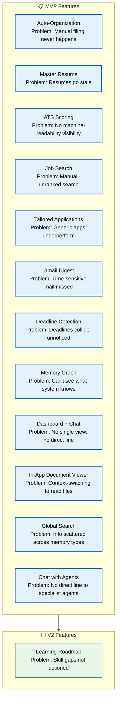

# Features

> **Purpose:** Catalogue of all Vaeloom features
> **Status:** ✅ Upgraded to enterprise quality
> **Owner:** Product Team
> **Last Updated:** 2026-07-13
> **Canonical source:** [`/docs/Vaeloom-Complete-Documentation.md#7-features`](../../docs/Vaeloom-Complete-Documentation.md#7-features)

## Feature Architecture



> **Diagram:** Features architecture — **12 MVP features** (auto-organization through chat with agents) and **1 V2 feature** (learning roadmap). Each feature solves a specific user problem and is backed by a specialist agent.

---

## Feature Summary

| Feature | Problem It Solves | MVP? | Primary Agent |
|---------|------------------|------|---------------|
| Auto-Organization | Manual filing never happens consistently | ✅ | Organization Agent |
| Master Resume | Resumes go stale between updates | ✅ | Resume Agent |
| ATS Scoring | No visibility into machine-readability | ✅ | ATS Agent |
| Job & Internship Search | Manual, unranked search across platforms | ✅ | Job Search Agent |
| Tailored Applications | Generic applications underperform | ✅ | Application Agent |
| Gmail Digest | Time-sensitive mail gets missed | ✅ | Gmail Agent |
| Deadline & Conflict Detection | Deadlines collide unnoticed | ✅ | Scheduler Agent |
| Memory Graph Explorer | Users can't see what the system "knows" | ✅ | Memory Agent |
| In-App Document Viewer | Context-switching to read source files | ✅ | Document Agent |
| Global Search | Info scattered across memory types | ✅ | Agentic RAG |
| Dashboard | No single view of overall state | ✅ | Analytics Agent |
| Learning Roadmap | Skill gaps identified but not actioned | ⬜ V2 | Planning Agent |
| Chat with Agents | Direct line to specialist agents | ✅ | Orchestrator |

## Common Mistakes

| Mistake | Consequence |
|---------|-------------|
| Building features in isolation | Features that don't read from and write to the same memory model create a fragmented user experience |
| Prioritizing visible features over memory improvements | A flashy UI on shallow memory performs worse than a plain UI on deep, compounding memory |
| Calling too many things "MVP" | Every feature claimed as MVP dilutes focus — MVP features should be the critical path to proving the core loop |
| Adding features without deletion criteria | Feature count grows indefinitely — every new feature needs an exit criterion for removal |

## Best Practices

| Practice | Why |
|----------|-----|
| Every feature must teach the memory system | If a feature doesn't produce or consume memory entities, reconsider its priority |
| Ship one agent at a time | Each agent needs time to build enough memory data before the next agent can use it effectively |
| Measure feature adoption weekly | Stop or rework features below 10% weekly active usage after two months |
| Surface features contextually | Don't show all 12 MVP features at once — introduce them as relevant moments in the user journey |

## Overview

Vaeloom's feature set is organized around 12 MVP capabilities and 1 V2 capability, each solving a specific user problem and backed by a dedicated specialist agent. Every feature is designed with the core architectural principle that memory comes first: features are views into the user's persistent knowledge graph, not standalone tools. This document catalogues every feature, its user problem, its associated agent, and its priority level.

Features are not built in isolation — each one reads from and writes to the same shared memory model, ensuring that insights from one feature compound the value of all others. The Auto-Organization Agent's file classifications enrich the Resume Agent's skill detection; the Gmail Agent's deadline extraction feeds the Scheduler Agent's conflict detection; the ATS Agent's gap analysis drives the Learning Roadmap Agent's recommendations.

## Goals

- Deliver all 12 MVP features with >90% user approval rate on agent proposals
- Ensure every feature writes to at least one memory type (no orphan features)
- Achieve <10% feature abandonment rate within 8 weeks of launch for each MVP feature
- Surface features contextually based on user journey stage, not all at once
- Measure weekly active usage per feature and stop features below 10% adoption after 2 months

## Scope

| | |
|---|---|
| **In Scope** | 12 MVP features: Auto-Organization, Master Resume, ATS Scoring, Job Search, Tailored Applications, Gmail Digest, Deadline Detection, Memory Graph, Dashboard, Document Viewer, Global Search, Chat with Agents; 1 V2 feature: Learning Roadmap; Agent system backing each feature; Cross-feature memory sharing |
| **Out of Scope** | Mobile apps (MVP is web-only); Browser extensions; Third-party integrations beyond connectors; API marketplace; Offline mode; Real-time collaboration |

## Workflows

### Feature Activation Workflow

1. User signs up and completes onboarding
2. Core features activate immediately: Auto-Organization, Document Viewer, Global Search, Chat
3. Connector-dependent features activate after source connection: Gmail Digest (after Gmail connector), Job Search (after profile enrichment)
4. Memory-dependent features activate after threshold reached: ATS Scoring (after resume upload), Master Resume (after 50+ entities in graph)
5. Compound features activate after prerequisite features used: Tailored Applications (after Job Search + Master Resume), Deadline Detection (after Gmail Digest)
6. V2 features gate behind usage milestones: Learning Roadmap (after 10 ATS scans and 3 applications)

## Limitations

| Limitation | Impact | Workaround | Future Resolution |
|------------|--------|------------|-------------------|
| Learning Roadmap is V2-only | Users cannot address skill gaps until graph is sufficiently populated | ATS scoring provides manual gap visibility; users can manually track learning | V2 launch when threshold conditions met (10 gaps, 3 scans) |
| Mobile not available in MVP | Users cannot access Vaeloom on mobile devices | Responsive web design provides basic mobile experience | Native mobile apps (iOS, Android) in V3 |
| No offline mode | Users cannot access memory without internet | Progressive caching of recently viewed documents | Offline-first architecture with local-first sync (Enterprise) |

## Examples

### Feature Flag Configuration (JSON)

```json
{
  "features": {
    "auto_organization": { "mvp": true, "agent": "organization_agent" },
    "master_resume": { "mvp": true, "agent": "resume_agent" },
    "ats_scoring": { "mvp": true, "agent": "ats_agent" },
    "learning_roadmap": { "mvp": false, "target": "V2", "agent": "planning_agent" }
  }
}
```

### Feature Activation (CLI)

```bash
# Check feature access for a user
curl -s https://api.Vaeloom.dev/v1/features/check \
  -H "Authorization: Bearer $API_TOKEN" \
  -d '{"feature": "ats_scoring"}' | jq '.accessible'
```

## Future Improvements

| Improvement | Priority | Complexity | Timeline |
|-------------|----------|------------|----------|
| Learning Roadmap (V2 feature) | High | Medium | V2 (2027 H2) |
| Native mobile apps (iOS/Android) | Medium | High | V3 (2028) |
| Third-party plugin/MCP ecosystem | Medium | High | Enterprise (2028 H2) |
| Real-time collaboration on workspaces | Low | High | Post-Enterprise |

## Risks

| Risk | Likelihood | Impact | Mitigation |
|------|------------|--------|------------|
| Feature count grows without deletion criteria | High | Medium | Every new feature must have an exit criterion; annual feature audit removes unused features |
| Features built in isolation weaken memory cohesion | Medium | High | Architecture review gates every feature PR — must demonstrate memory read/write impact |
| Too many features overwhelm new users | High | Medium | Contextual feature introduction based on user journey stage; onboarding checklist limits to 3 features first session |

## Security Considerations

| Consideration | Mitigation |
|--------------|-----------|
| Feature-level permissions | Each agent (feature) operates with its own permission scope — a memory agent cannot trigger an application submission |
| Read-only by default | All features that read user data start in read-only mode — write access is separately gated by user consent |
| Cross-feature data access | Memory entities are visible across features, but actions (resume generation, job application) require explicit per-action consent |

## Performance Considerations

| Consideration | Approach |
|--------------|----------|
| Feature initialization | Heavy features (search, memory graph) should lazy-load — don't initialize all 12 agents on page load |
| Background sync | Connector syncs should be queued and throttled per user — one concurrent sync per user source |
| Memory queries | Feature-level memory reads must be cached with TTL to avoid redundant LLM calls for the same entity |

## Related Documents

- [Roadmap.md](./Roadmap.md)
- [User Journey.md](./User-Journey.md)
- [Product Strategy.md](./Product-Strategy.md)
- [Goals.md](./Goals.md)
- [Success Metrics.md](./Success-Metrics.md)
- [`/docs/Vaeloom-Complete-Documentation.md#7-features`](../../docs/Vaeloom-Complete-Documentation.md#7-features)
