# Goals

> **Purpose:** Define measurable product goals for Vaeloom
> **Canonical source:** [`/Docs/06-Vaeloom-Enterprise-Paper.md#13-goals`](../../Docs/06-Vaeloom-Enterprise-Paper.md#13-goals)

## Goals Architecture

```mermaid
graph TD
    classDef product fill:#e3f2fd,stroke:#1565c0,color:#000,stroke-width:2px
    classDef mvp fill:#e8f5e9,stroke:#2e7d32,color:#000,stroke-width:1.5px
    classDef ent fill:#fff3e0,stroke:#e65100,color:#000,stroke-width:1.5px

    subgraph Product["🎯 Product Goals"]
        G1["Persistent structured memory<br/>Every interaction → knows user better"]
        G2["Zero manual organization<br/>No manual file naming or sorting"]
        G3["Proactive, not reactive<br/>Surface before being asked"]
        G4["Trustworthy autonomy<br/>Explainable, reversible, earned"]
        G5["Platform, not silo<br/>Plugin/MCP ecosystem"]
    end

    subgraph MVP["📋 MVP Goals (Phase 0-6)"]
        M1["Prove core loop: ingest → organize → remember → assist"]
        M2[">90% proposal approval on file organization"]
        M3["Upload resume → submit tailored app in one session"]
        M4["Surface urgent emails within minutes"]
    end

    subgraph Enterprise["🏢 Enterprise Goals (Phase 7+)"]
        E1["Institutions provision accounts without access to memory"]
        E2["25+ connectors across platforms"]
        E3["Verified tenant isolation"]
    end

    Product --> MVP --> Enterprise

    class G1,G2,G3,G4,G5 product
    class M1,M2,M3,M4 mvp
    class E1,E2,E3 ent
```



> **Diagram:** Goals architecture — **5 product goals** (memory, zero organization, proactive, autonomy, platform) → **4 MVP goals** (core loop, 90% approval, one-session application, urgent surfacing) → **3 enterprise goals** (institutional provisioning, 25+ connectors, tenant isolation).

---

## Product Goals

| Goal | What It Means in Practice |
|------|--------------------------|
| Persistent, structured memory | Every interaction makes the system know the user better — nothing is forgotten, nothing has to be re-explained |
| Zero manual organization | The user never has to name a file, sort a folder, or maintain a resume by hand |
| Proactive, not just reactive | The system surfaces opportunities, deadlines, and risks before being asked |
| Trustworthy autonomy | Every autonomous action is explainable, reversible, and was earned through a visible track record |
| Platform, not silo | Third parties can extend Vaeloom through a real plugin/MCP ecosystem |

## MVP Goals (Phase 0-6)

- Prove the core loop: ingest → organize → remember → assist
- Achieve >90% proposal approval rate on file organization
- Enable a user to go from "upload a resume" to "submit a tailored application" in one session
- Surface urgent emails within minutes, not the next scheduled scan

## Enterprise Goals (Phase 7+)

- Enable institutions to provision accounts without gaining access to individual memory
- Support 25+ connectors across cloud storage, communication, code, and career platforms
- Achieve verified tenant isolation for multi-tenant deployments

## Common Mistakes

| Mistake | Consequence |
|---------|-------------|
| Setting goals that can't be measured | "Improve user satisfaction" without a metric is a wish, not a goal — no way to know if it's been achieved |
| Confusing output goals with outcome goals | "Ship 5 agents" is an output — "90% proposal approval rate" is an outcome that actually means something |
| Setting too many simultaneous goals | Spreading focus across 10+ goals means none gets full engineering attention — prioritize the critical path |
| Setting goals without exit criteria | "Launch MVP" is not a goal unless you can define what "launched" means (e.g., 10 users complete first-week journey unaided) |

## Best Practices

| Practice | Why |
|----------|-----|
| Goals should be measurable and time-bound | Each goal needs a specific, numeric target with a deadline — ">90% proposal approval rate by Phase 6" |
| Distinguish product goals from MVP goals | Product goals are enduring principles; MVP goals are the specific milestones that prove the thesis |
| Cascade goals from vision → product → phase | Each phase goal should ladder up to a product goal, which ladders up to the vision — no orphan goals |
| Review goals quarterly | Market conditions and user feedback shift — goals should be updated, not abandoned |

## Security Considerations

| Consideration | Mitigation |
|--------------|-----------|
| Goal-related data collection | Metrics used to track goal progress (e.g., entity count, proposal approval rate) must be aggregated and not personally identifiable |
| Enterprise goal compliance | Enterprise goals around tenant isolation and consent models must be verifiable through automated tests, not manual attestation |

## Overview

Vaeloom's goals are organized across three tiers: enduring product goals that define the platform's character, specific MVP goals that prove the core thesis, and enterprise goals that guide the long-term institutional strategy. Each goal is measurable, time-bound, and cascades from the company vision through product strategy to quarterly OKRs. This document defines all three tiers of goals and provides the framework for tracking progress against them.

The product goals — persistent structured memory, zero manual organization, proactive intelligence, trustworthy autonomy, and platform ecosystem — are not features to ship but properties the system must exhibit. They serve as decision filters for every product and engineering choice: "Does this bring us closer to zero manual organization?" is a more useful question than "Does this increase DAU?"

## Scope

| | |
|---|---|
| **In Scope** | 5 enduring product goals with definitions; 4 MVP goals with numeric targets; 3 enterprise goals; goal cascading framework from vision → product → phase; quarterly review process |
| **Out of Scope** | Per-sprint goals (tracked in project management); individual team OKRs; feature-specific success criteria (see individual Feature Specs); non-product goals (hiring, fundraising, marketing) |

## Workflows

### Goal Tracking Workflow

1. Vision → Product Strategy → Goals cascade defined at product inception
2. Each phase (MVP, v1.5, V2, Enterprise) derives phase-specific goals from product goals
3. Goals assigned numeric targets and deadlines during quarterly planning
4. Weekly automated metrics collection tracks progress against each target
5. Monthly goal review: product manager reviews progress and adjusts tactics
6. Quarterly goal refresh: goals updated based on actual data, not abandoned

## Limitations

| Limitation | Impact | Workaround | Future Resolution |
|------------|--------|------------|-------------------|
| Goals are directional for early phases before baseline data exists | Targets may be arbitrary or aspirational rather than data-driven | Set initial targets as conservative estimates; adjust after first cohort data | Implement baseline measurement phase before setting numeric targets for each new goal |
| Not all goals are equally measurable | "Trustworthy autonomy" is harder to quantify than "90% proposal approval rate" | Define proxy metrics for less-measurable goals (e.g., autonomy grant rate, audit trail completeness) | Develop composite goal health score with weighted sub-metrics |
| Phase goals may conflict with each other | Speed of feature delivery vs. depth of memory accuracy | Prioritize accuracy over speed during MVP — slow but correct beats fast but wrong | Explicit trade-off documentation in quarterly planning |

## Examples

### Goal Tracking Configuration (JSON)

```json
{
  "goals": [
    {
      "name": "Proposal approval rate",
      "target": 90,
      "unit": "percent",
      "measurement": "agent_audit",
      "owner": "product_team"
    },
    {
      "name": "DAU/MAU ratio",
      "target": 30,
      "unit": "percent",
      "measurement": "auth_analytics",
      "owner": "growth_team"
    }
  ]
}
```

### Goal Status Check (CLI)

```bash
# Check current goal progress
curl -s https://api.Vaeloom.dev/v1/admin/goals/status \
  -H "Authorization: Bearer $ADMIN_TOKEN" | jq '.goals[] | {name, current, target}'
```

## Future Improvements

| Improvement | Priority | Complexity | Timeline |
|-------------|----------|------------|----------|
| Automated goal health dashboard with trend lines | High | Low | MVP (2026 Q4) |
| Cascade template for vision → product → phase → sprint alignment | Medium | Low | v1.5 (2027 H1) |
| Goal conflict detection (when two goals push in opposite directions) | Low | Medium | V2 (2027 H2) |
| External benchmark comparison for industry-relative goals | Low | High | Enterprise (2028) |

## Risks

| Risk | Likelihood | Impact | Mitigation |
|------|------------|--------|------------|
| Goals set before baseline measurement are arbitrary | High | Medium | Label pre-baseline goals as "aspirational targets" and commit to recalibration after first cohort |
| Too many simultaneous goals dilute focus | Medium | High | No more than 3 phase-level goals active at any time; secondary goals tracked as "watch items" |
| Goal owners change without handoff | Medium | Medium | Document goal ownership in quarterly planning doc with named primary and secondary owners |

## Performance Considerations

| Concern | Mitigation |
|---------|------------|
| Goal-tracking metrics can increase database load | Aggregate performance metrics asynchronously, not on every user request |
| Real-time goal dashboards may impact page load times | Cache goal metric data with periodic refresh (5-15 min intervals) |
| AI goal evaluation (e.g., proposal approval rate) adds inference cost | Batch AI evaluation runs rather than evaluating in real-time |

## Related Documents

- [Vision.md](./Vision.md)
- [Success Metrics.md](./Success-Metrics.md)
- [Product Strategy.md](./Product-Strategy.md)
- [Mission.md](./Mission.md)
- [Features.md](./Features.md)
- [`/Docs/06-Vaeloom-Enterprise-Paper.md#13-goals`](../../Docs/06-Vaeloom-Enterprise-Paper.md#13-goals)
