# KPIs

> **Purpose:** Define the Key Performance Indicators (KPIs) that measure Vaeloom's success across product, AI, business, and engineering dimensions
> **Status:** 🆕 New
> **Owner:** Product Team
> **Version:** 1.0
> **Last Updated:** 2026-07-16
> **Dependencies:** [`Success-Metrics.md`](./Success-Metrics.md), [`Business-Requirements.md`](./Business-Requirements.md), [`../AI/Eval-Datasets.md`](../AI/Eval-Datasets.md)
> **Implementation Status:** 📋 Spec Only

## Overview

KPIs are the vital signs of the business. This document defines every KPI Vaeloom tracks, organized by category (Product, AI, Business, Engineering). Each KPI has a definition, formula, target, owner, and alert threshold. If a KPI isn't defined here, it's not tracked officially.

## Goals

- Define all KPIs with formulas and targets
- Assign ownership and alert thresholds
- Establish the measurement cadence
- Differentiate KPIs from vanity metrics

## KPI Hierarchy

```mermaid
graph TD
    classDef category fill:#e3f2fd,stroke:#1565c0,color:#000,stroke-width:2px
    classDef kpi fill:#e8f5e9,stroke:#2e7d32,color:#000,stroke-width:1.5px

    PROD["Product KPIs<br/>(user engagement)"]:::category
    AI["AI KPIs<br/>(quality + cost)"]:::category
    BIZ["Business KPIs<br/>(revenue + growth)"]:::category
    ENG["Engineering KPIs<br/>(delivery + reliability)"]:::category

    PROD --> DAU["DAU/MAU"]:::kpi & RET["Retention"]:::kpi & TTV["Time-to-Value"]:::kpi & ADOPT["Feature Adoption"]:::kpi
    AI --> TASK["Task Completion"]:::kpi & RAG["RAG Relevance"]:::kpi & COST["Cost/Run"]:::kpi & GUARD["Guardrail Block Rate"]:::kpi
    BIZ --> MRR["MRR/ARR"]:::kpi & CAC["CAC"]:::kpi & LTV["LTV"]:::kpi & CHURN["Churn"]:::kpi
    ENG --> DEPLOY["Deploy Frequency"]:::kpi & CFR["Change Failure Rate"]:::kpi & MTTR["MTTR"]:::kpi
```

> **Diagram:** KPI hierarchy. Four categories, each with its vital metrics. Product measures engagement; AI measures quality and cost; Business measures revenue; Engineering measures delivery.

## Product KPIs

| KPI | Definition | Formula | Target | Cadence | Owner |
|-----|-----------|---------|--------|---------|-------|
| **DAU** | Daily Active Users | Count of unique users active in 24h | Growth trending up | Daily | Product |
| **MAU** | Monthly Active Users | Count of unique users active in 30 days | Growth trending up | Monthly | Product |
| **DAU/MAU Ratio** | Stickiness | DAU ÷ MAU | >25% | Weekly | Product |
| **D1 Retention** | Day-1 retention | Users returning on day after signup ÷ signups | >40% | Daily | Product |
| **D7 Retention** | Week-1 retention | Users returning 7 days after signup ÷ signups | >25% | Weekly | Product |
| **D30 Retention** | Month-1 retention | Users returning 30 days after signup ÷ signups | >15% | Monthly | Product |
| **Time-to-First-Value** | Minutes from signup to first document processed | Avg time | <5 min | Weekly | Product |
| **Feature Adoption Rate** | % of MAU using a feature | Feature users ÷ MAU | >30% per core feature | Monthly | Product |
| **NPS** | Net Promoter Score | % Promoters − % Detractors | >40 | Quarterly | Product |

## AI KPIs

| KPI | Definition | Formula | Target | Cadence | Owner |
|-----|-----------|---------|--------|---------|-------|
| **Agent Task Completion Rate** | % of agent runs that complete successfully | Completed ÷ total runs | >95% | Daily | AI |
| **Memory Hit Rate** | % of RAG queries that find relevant context | Hits ÷ queries | >80% | Daily | AI |
| **RAG Answer Relevance** | Human-rated relevance of RAG answers | Avg score (1-5) | >4.0 | Weekly | AI |
| **Guardrail Block Rate** | % of outputs blocked by safety check | Blocked ÷ total | <1% (high = over-blocking) | Daily | AI |
| **Hallucination Rate** | % of agent outputs with fabricated claims | Fabricated ÷ total | 0% (zero tolerance) | Weekly | AI |
| **AI Cost per User** | Monthly AI cost per active user | Total AI cost ÷ MAU | <25% of ARPU | Monthly | AI + Finance |
| **Eval Regression Rate** | % of PRs that regress eval scores | Regressed ÷ total PRs | <5% | Per PR | AI |

## Business KPIs

| KPI | Definition | Formula | Target | Cadence | Owner |
|-----|-----------|---------|--------|---------|-------|
| **MRR** | Monthly Recurring Revenue | Sum of active subscriptions | Growth trending up | Monthly | Finance |
| **ARR** | Annual Recurring Revenue | MRR × 12 | Growth trending up | Monthly | Finance |
| **ARPU** | Average Revenue per User | MRR ÷ paying users | >$19 | Monthly | Finance |
| **CAC** | Customer Acquisition Cost | Sales+marketing spend ÷ new customers | < $50 (individual) | Monthly | Growth |
| **LTV** | Customer Lifetime Value | ARPU × avg customer lifespan × gross margin | >3× CAC | Quarterly | Finance |
| **LTV:CAC Ratio** | Efficiency | LTV ÷ CAC | >3 | Quarterly | Finance |
| **Churn Rate** | % of customers who cancel | Cancelled ÷ total | <5% monthly | Monthly | Product |
| **Free→Paid Conversion** | % of free users who upgrade | Upgrades ÷ free users | >8% | Monthly | Growth |
| **Gross Margin** | Revenue minus COGS | (Revenue − COGS) ÷ Revenue | >75% | Monthly | Finance |
| **Enterprise Pipeline** | Qualified enterprise leads in pipeline | Count | Growth | Monthly | Sales |

## Engineering KPIs

| KPI | Definition | Formula | Target | Cadence | Owner |
|-----|-----------|---------|--------|---------|-------|
| **Deployment Frequency** | Deploys to production per week | Count | >5/week | Weekly | Engineering |
| **Change Failure Rate** | % of deploys causing incidents | Failed ÷ total | <10% | Monthly | Engineering |
| **MTTR** | Mean Time to Recovery | Avg time from incident to resolution | <1 hour | Per incident | SRE |
| **Change Lead Time** | Time from PR open to merge | Avg hours | <24 hours | Weekly | Engineering |
| **Test Coverage** | % of code covered by tests | Covered lines ÷ total | >80% | Per PR | Engineering |
| **Documentation Coverage** | % of features with complete docs | Documented ÷ total features | >95% | Monthly | Architecture |
| **p99 API Latency** | 99th percentile response time | Tracing percentile | <500ms | Daily | SRE |
| **Uptime** | Platform availability | Uptime ÷ total time | >99.9% | Monthly | SRE |

## Alert Thresholds

| KPI | Alert Condition | Severity | Action |
|-----|----------------|----------|--------|
| D30 Retention | Drops >5% week-over-week | P2 | Product review |
| Agent Task Completion | Drops below 90% | P1 | AI on-call |
| Hallucination Rate | Any non-zero | P1 | AI on-call; block agent |
| AI Cost per User | Exceeds 30% of ARPU | P2 | Cost review |
| Churn Rate | Exceeds 8% monthly | P2 | Product + Growth review |
| MTTR | Exceeds 2 hours | P1 | SRE post-mortem |
| Uptime | Drops below 99.5% | P1 | Incident response |

## KPIs vs Vanity Metrics

| Metric | Type | Why |
|--------|------|-----|
| Total signups | Vanity | Doesn't reflect engagement or revenue |
| Page views | Vanity | Doesn't reflect value delivery |
| **DAU/MAU ratio** | KPI | Reflects genuine engagement |
| **LTV:CAC ratio** | KPI | Reflects business sustainability |
| **Agent task completion** | KPI | Reflects product quality |

## Best Practices

| # | Practice | Rationale |
|---|----------|-----------|
| 1 | Every KPI has an owner | Unowned KPIs are unacted-upon KPIs |
| 2 | Review KPIs on a fixed cadence | Regular review prevents drift |
| 3 | Distinguish leading from lagging indicators | Leading (e.g., feature adoption) predict lagging (e.g., churn) |
| 4 | Alert on anomaly, not just threshold | A sudden change is more actionable than a static threshold |

## Related Documents

- [`Success-Metrics.md`](./Success-Metrics.md) — success metrics (broader)
- [`Business-Requirements.md`](./Business-Requirements.md) — business objectives
- [`../AI/Eval-Datasets.md`](../AI/Eval-Datasets.md) — AI quality measurement
- [`../Operations/SLO.md`](../Operations/SLO.md) · [`SLI.md`](../Operations/SLI.md) — service-level objectives
