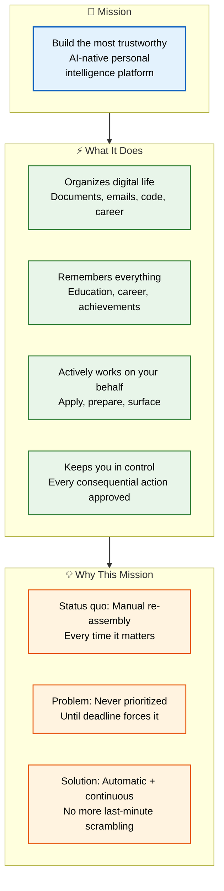

# Mission

> **Purpose:** Define the mission that drives Vaeloom
> **Canonical source:** [`/docs/Vaeloom-Complete-Documentation.md#2-the-product-story`](../../docs/Vaeloom-Complete-Documentation.md#2-the-product-story)

## Mission Architecture



> **Diagram:** Mission architecture — **core mission** (most trustworthy AI-native platform) → **4 capabilities** (organize, remember, act, control) → **why** (status quo manual reassembly → always last-minute → automated approach).

---

## Mission Statement

Build the most trustworthy AI-native personal intelligence platform: one that organizes a person's digital life, remembers everything that matters about their education and career, and actively works on their behalf — applying to opportunities, preparing them for interviews, surfacing what they'd otherwise forget — while keeping the person in control of every consequential action.

## Why This Mission

The status quo forces every person to manually re-assemble scattered information about their own life every time it matters — updating a resume, remembering achievements, applying to opportunities. This is exactly the kind of work that never gets prioritized until a deadline forces it, at which point it's too late to do well. Vaeloom exists to make this re-assembly automatic and continuous.

## Common Mistakes

| Mistake | Consequence |
|---------|-------------|
| Mission drift — expanding scope without updating the mission | The mission statement becomes meaningless if it tries to cover everything — "AI platform" without the "trustworthy" qualifier loses the differentiator |
| Using jargon instead of plain language | "Memory layer with agentic RAG" doesn't land with users — "one place that knows your career" is the real mission |
| Mission without measurable checkpoints | A vision without phase-level milestones means no way to know if you're still on track |

## Best Practices

| Practice | Why |
|----------|-----|
| Lead with the problem, not the solution | Users connect with "my resume is always outdated" before "memory layer with agentic RAG" |
| Use the "one brain" metaphor consistently | "Chat is one view into your Vaeloom brain" builds a clear mental model for users |
| Show compounding value over time | Month 1 value is organization; Month 6 is career intelligence — the mission scales |
| Emphasize trust architecture | "Nothing happens without your approval" addresses the core objection before it's raised |

## Security Considerations

| Consideration | Mitigation |
|--------------|-----------|
| Trustworthy platform = auditable actions | Every autonomous action must have an audit trail that non-technical users can review |
| Mission alignment with data practices | The mission to "actively work on users' behalf" must be paired with transparent data-use policies |

## Overview

Vaeloom's mission — to build the most trustworthy AI-native personal intelligence platform — defines the product's character, its boundaries, and the criteria by which every decision is judged. Unlike a vision (which describes a future state) or a strategy (which describes a path), the mission is the enduring purpose that remains constant as tactics shift. This document articulates the mission, the four capabilities it requires (organize, remember, act, control), and the reasoning behind why this mission matters.

The mission is designed to be memorable, actionable, and differentiating. It answers three questions for every stakeholder: what are we building (a personal intelligence platform), for whom (every person building a career), and what makes it different (trustworthy — earned through consent, transparency, and control).

## Goals

- Every team member can recite the mission statement and explain its implications for their work
- External stakeholders (users, partners, investors) associate Vaeloom with "trustworthy personal AI" within 18 months
- Mission serves as the primary decision filter for all product and engineering choices
- Achieve >80% team alignment on "does this decision align with our mission?" measured in quarterly surveys

## Scope

| | |
|---|---|
| **In Scope** | Mission statement; 4 capability pillars (organize, remember, act, control); reasoning behind the mission; common mission-drift risks; best practices for communicating mission to different audiences |
| **Out of Scope** | Specific product features (see Features.md); competitive positioning (see Competitive Analysis); financial targets (see Business Model); implementation timelines (see Roadmap) |

## Workflows

### Mission Application Workflow

1. Every major product initiative starts with a mission alignment check: "Does this serve a person's career intelligence?"
2. If yes, proceed to strategy evaluation; if no, deprioritize or reject
3. During quarterly planning, each proposed initiative is scored against the mission
4. Initiatives that score low on mission alignment are either dropped or re-scoped
5. Annual mission review validates the mission is still relevant and has not drifted
6. Any material mission drift requires founder/CEO approval and team-wide communication

## Limitations

| Limitation | Impact | Workaround | Future Resolution |
|------------|--------|------------|-------------------|
| Mission is intentionally narrow (career/academic focus) | Excludes adjacent use cases (health, finance, general productivity) | Those use cases may be served by future platform extensions or plugins | MCP/plugin ecosystem in Enterprise phase enables third-party use cases without mission drift |
| "Trustworthy" constraint slows feature velocity | Competitors without trust constraints may ship faster | Accept slower pace as a feature of the mission, not a bug | Trust architecture becomes competitive advantage as users mature |

## Examples

### Mission Alignment Score (JSON)

```json
{
  "mission_check": {
    "initiative": "Add AI-powered resume builder",
    "aligned": true,
    "principles": ["memory_before_features", "earned_autonomy"],
    "score": 4
  }
}
```

### Mission Decision Filter (CLI)

```bash
# Check initiative against mission
curl -s -X POST https://api.Vaeloom.dev/v1/admin/mission-check \
  -H "Authorization: Bearer $ADMIN_TOKEN" \
  -d '{"initiative": "Add code review feature", "description": "..."}' | jq '.aligned'
```

## Future Improvements

| Improvement | Priority | Complexity | Timeline |
|-------------|----------|------------|----------|
| Internal mission alignment scoring rubric for quarterly planning | High | Low | MVP (2026 Q4) |
| External mission perception tracking (surveys, brand studies) | Medium | Low | v1.5 (2027 H1) |
| Mission-based OKR cascade template for all teams | Medium | Low | v1.5 (2027 H1) |

## Risks

| Risk | Likelihood | Impact | Mitigation |
|------|------------|--------|------------|
| Mission drift through feature creep | Medium | High | Annual mission review with explicit drift detection; founder veto on mission-inconsistent features |
| "Trustworthy" positioning creates expectations engineering cannot yet meet | High | Medium | Map every trust claim to a verifiable engineering requirement; avoid aspirational trust claims |
| Competitors adopt similar mission language | Medium | Low | Mission is lived through architecture (consent model, audit trails), not marketing copy |

## Performance Considerations

| Concern | Mitigation |
|---------|------------|
| Mission doc is accessed frequently by new team members | Cache at the documentation site level — mission content rarely changes |
| Mermaid diagrams explaining mission add page weight | Use lightweight SVGs or simple diagrams for brand-adjacent content |
| Translation/localization of mission for global teams | Pre-translate static mission content, serve based on locale |

## Related Documents

- [Vision.md](./Vision.md)
- [Problem.md](./Problem.md)
- [Product Strategy.md](./Product-Strategy.md)
- [Goals.md](./Goals.md)
- [Features.md](./Features.md)
- [`/docs/Vaeloom-Complete-Documentation.md#12-executive-summary`](../../docs/Vaeloom-Complete-Documentation.md#12-executive-summary)
