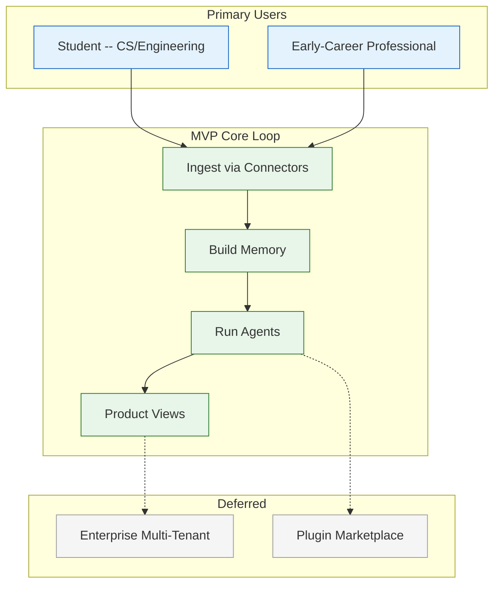

# Product Requirements Document (PRD) — Vaeloom MVP

| Metadata         | Value                                                                |
|------------------|----------------------------------------------------------------------|
| **Purpose**      | Formal product requirements for Vaeloom MVP — scope, users, features, success criteria |
| **Status**       | ✅ Enterprise Ready |
| **Owner**        | Product Team |
| **Last Updated** | 2026-07-15 |
| **Canonical source** | [`01-Vaeloom-MVP-Spec.md`](../01-Vaeloom-MVP-Spec.md) |

---

## Overview

This PRD defines **what** Vaeloom MVP must deliver for students and early-career professionals: a personal intelligence platform that ingests documents, email, and code; builds persistent structured memory; and runs permission-scoped AI agents that organize work, maintain resumes, search jobs, and track deadlines.

This document is the authoritative product requirements layer above implementation specs. Engineering derives technical design from this PRD and the companion SRS (Not yet created). Business stakeholders use the companion BRD (Not yet created) for ROI and market framing.

**Audience:** Product managers, engineering leads, AI architects, QA, enterprise evaluators.

## Goals

- Define MVP product scope with explicit in/out boundaries
- Specify user personas, jobs-to-be-done, and success metrics
- Enumerate functional requirements with priorities (P0/P1/P2)
- Establish non-functional requirements (performance, security, availability)
- Provide traceability to feature specs and implementation guides

## Scope

### In Scope (MVP v1)

- Single-user workspaces with Gmail, GitHub, Google Drive, and local folder connectors
- Eight specialist agents (Organization, Memory, Resume, ATS, Job Search, Gmail, Scheduler, Orchestrator)
- Memory system: knowledge graph (Apache AGE), vector store (pgvector), six structured memory types
- Core product views: Dashboard, Workspace, Memory Graph, Resume, Jobs, Applications, Chat, Schedule, Connectors, Settings
- Suggest-mode-by-default autonomy; Permission Engine; audit logging
- REST API (NestJS) + AI service (FastAPI) two-service architecture

### Out of Scope (Deferred to Enterprise)

- Multi-tenant admin, SSO/SAML, ABAC at scale
- Plugin marketplace and public SDK
- Kafka event bus (Redis queue at MVP)
- Formal SOC 2 Type II certification
- Mobile native apps (responsive web only)

## Functional Requirements

| ID | Requirement | Priority | Acceptance Criteria |
|----|-------------|----------|---------------------|
| FR-001 | User can connect Gmail, GitHub, Google Drive, local folders | P0 | OAuth flows complete; sync status visible |
| FR-002 | System ingests and parses documents (PDF, DOCX, code, email) | P0 | Metadata + text extraction; p95 ingestion < 30s |
| FR-003 | Memory Agent extracts entities and relationships into knowledge graph | P0 | Entities queryable; graph visualized in Memory Graph view |
| FR-004 | Organization Agent proposes file names, folders, deduplication | P0 | Suggestions shown; user approves before apply |
| FR-005 | Resume Agent maintains master resume from memory | P0 | Resume updates reflect new achievements within 24h of ingestion |
| FR-006 | ATS Agent scores resume against job descriptions | P1 | Score 0–100 with keyword gap analysis |
| FR-007 | Job Search Agent surfaces ranked opportunities | P1 | Shortlist with match rationale |
| FR-008 | Gmail Agent classifies mail and detects deadlines | P0 | Deadlines appear in Schedule view |
| FR-009 | Scheduler Agent detects conflicts and reminders | P1 | Calendar integration; conflict alerts |
| FR-010 | Global search across documents, memory, and graph | P0 | Sub-second p95 for typical queries |
| FR-011 | Agent chat with tool use and memory context | P0 | Streaming responses; citations to source documents |
| FR-012 | Permission Engine enforces connector and agent scopes | P0 | Denied actions logged; no scope escalation |
| FR-013 | Audit log of all agent actions and user approvals | P0 | Immutable log; exportable |
| FR-014 | Dashboard at-a-glance summary | P1 | Deadlines, applications, recent activity |

## Non-Functional Requirements

| ID | Requirement | Target | Measurement |
|----|-------------|--------|-------------|
| NFR-001 | API availability | 99.9% | Uptime monitoring |
| NFR-002 | AI agent availability | 99.5% | Service health checks |
| NFR-003 | Document ingestion latency | p95 < 30s | Distributed tracing |
| NFR-004 | Search latency | p95 < 500ms | APM |
| NFR-005 | Data encryption | AES-256 at rest; TLS 1.3 in transit | Security audit |
| NFR-006 | GDPR readiness | Designed-in | Privacy review |
| NFR-007 | Suggest-mode default | 100% destructive actions require approval | Permission Engine tests |

## User Personas & Jobs-to-be-Done

| Persona | Job-to-be-Done | MVP Feature Mapping |
|---------|----------------|---------------------|
| **Alex — CS Student** | Keep resume current without manual effort | Resume Agent, Memory Agent |
| **Alex** | Never miss internship deadlines | Gmail Agent, Scheduler Agent |
| **Jordan — New Grad** | Find relevant jobs quickly | Job Search Agent, ATS Agent |
| **Jordan** | Organize scattered project files | Organization Agent, Workspace |

See [User Personas](./User-Personas.md) and [User Stories](./User-Stories.md).

## Success Metrics

| Metric | MVP Target | Source |
|--------|------------|--------|
| Weekly active users (WAU) | 500 beta users | Analytics |
| Connector attach rate | ≥ 2 connectors/user | Product analytics |
| Agent suggestion acceptance rate | ≥ 40% | Audit logs |
| Resume freshness | Updated within 7 days of new achievement | Memory timestamps |
| Time-to-first-value | < 15 minutes from signup | Onboarding funnel |

See [Success Metrics](./Success-Metrics.md).

## Security

| Concern | Requirement | Verification |
|---------|-------------|--------------|
| Least privilege | Connectors scoped to declared purpose | Permission Engine unit tests |
| Data isolation | Per-user workspace boundary | Integration tests |
| LLM data handling | No training on user data; retention policies | Vendor DPAs |
| Auditability | All agent writes logged | Audit log E2E tests |

## Performance

| Operation | Budget | Notes |
|-----------|--------|-------|
| Dashboard load | p95 < 1s | Cached summaries |
| Agent execution | p95 < 30s | Async queue for long runs |
| Graph query (100 nodes) | p95 < 200ms | AGE indexes |

## Risks

| Risk | Likelihood | Impact | Mitigation |
|------|-----------|--------|------------|
| LLM cost overrun | Medium | High | Model routing (Haiku default); caching |
| Connector OAuth friction | Medium | Medium | Clear UX; retry flows |
| Memory extraction quality | Medium | High | Golden datasets; human-in-loop corrections |
| Scope creep to enterprise | High | Medium | Strict MVP boundary in this PRD |

## Limitations

| Limitation | Impact | Workaround |
|------------|--------|------------|
| No multi-tenant | Cannot sell to universities at scale yet | Single-user MVP validation first |
| Redis queue only | Lower throughput than Kafka | Sufficient for MVP load |
| 8 agents only | Limited automation surface | Orchestrator routes to specialists |

## Future Improvements

| Improvement | Priority | Timeline |
|-------------|----------|----------|
| Enterprise multi-tenant | High | Post-MVP Phase 7 |
| Plugin marketplace | Medium | V2 |
| Mobile companion app | Low | V3 |

## Related Documents

- BRD (Not yet created) — Business requirements
- SRS (Not yet created) — Software requirements specification
- [MVP Spec](../01-Vaeloom-MVP-Spec.md) — Detailed MVP specification
- [Features](./Features.md) — Feature catalog
- [Feature Specs](./Feature-Specs/) — Per-feature implementation docs
- [Roadmap](./Roadmap.md) — Product timeline
