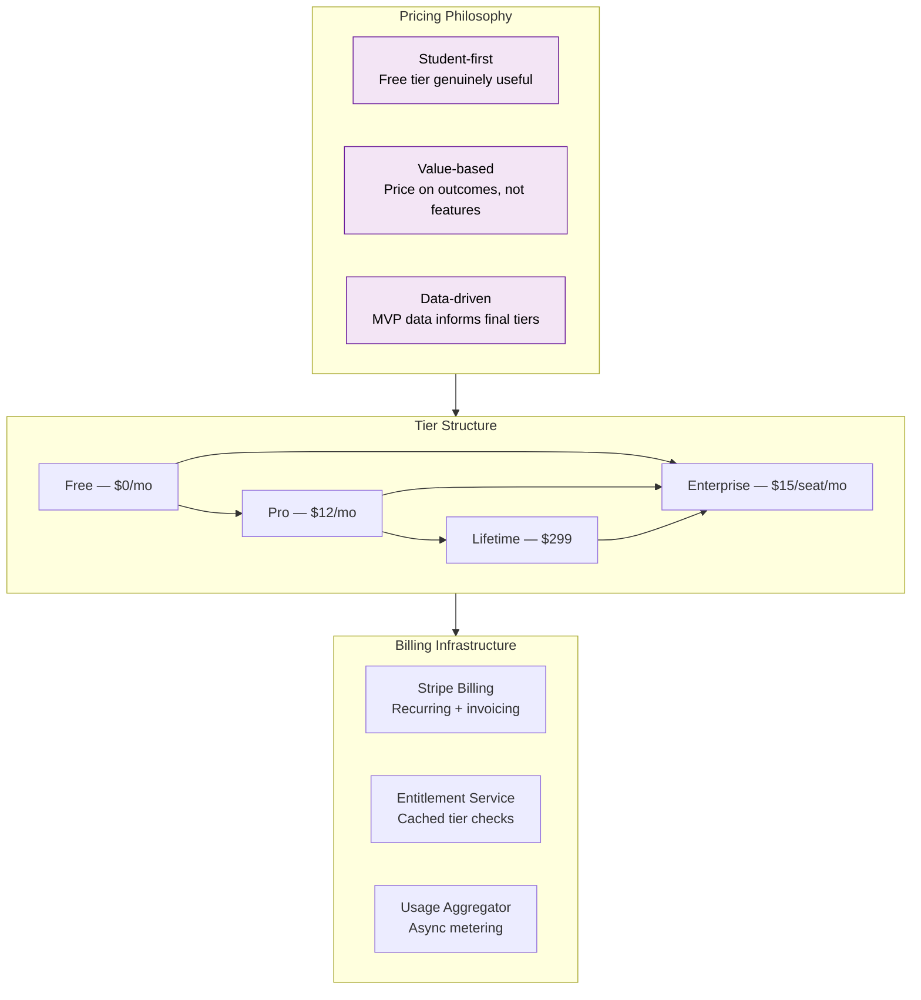
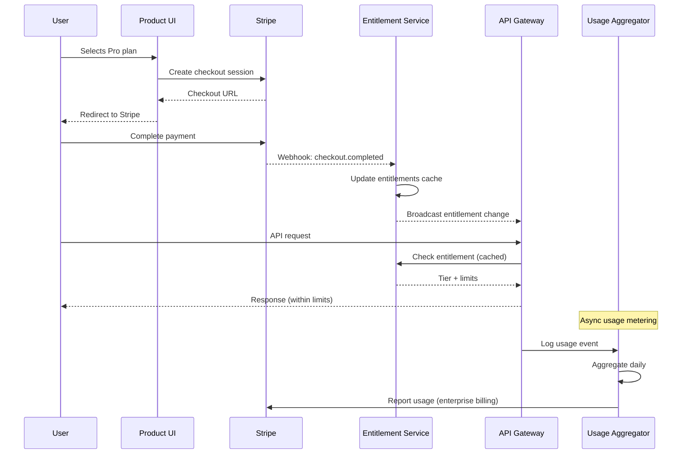

# Pricing

> **Purpose:** Define the concrete pricing tiers and monetization strategy for Meridian
> **Status:** 🆕 New
> **Owner:** Product Team
> **Last Updated:** 2026-07-13

## Overview

Meridian uses a four-tier pricing model designed to maximize adoption among students while capturing value from power users and enterprises. The model is grounded in three principles: student-first (free tier must be genuinely useful), value-based (price on outcomes, not features), and data-driven (tiers validated through MVP usage data).

This document defines the concrete pricing for all four tiers — Free, Pro ($12/month), Lifetime ($299 one-time), and Enterprise ($15/seat/month) — along with the feature boundaries, enforcement mechanisms, and billing architecture.

## Pricing Architecture



## Tier Comparison

| Feature | Free | Pro ($12/mo) | Lifetime ($299) | Enterprise ($15/seat/mo) |
|---------|------|--------------|-----------------|--------------------------|
| **Storage** | 100 MB | 10 GB | 10 GB | 100 GB (configurable) |
| **Documents** | 10/month | Unlimited | Unlimited | Unlimited |
| **Connectors** | 1 (Gmail or GitHub) | All connectors | All connectors | All + custom |
| **Agents** | Basic agents only | All agents | All agents | All + custom agents |
| **Resume Variants** | 1 | Unlimited | Unlimited | Unlimited |
| **ATS Scoring** | — | 10 JDs/month | 10 JDs/month | Unlimited |
| **Priority Support** | Community | Priority | Priority | Dedicated SLA |
| **SSO/SAML** | — | — | — | Included |
| **Multi-tenant Admin** | — | — | — | Included |
| **Audit Logs** | — | 30-day | 30-day | 7-year retention |
| **Custom Integrations** | — | — | — | Available |
| **SLA** | None | 99.5% | 99.5% | 99.99% |

## Billing Architecture



## Pricing Philosophy

- **Student-first:** Free tier must be genuinely useful, not a teaser. Students are the wedge — price accordingly.
- **Value-based:** Price on outcomes (applications submitted, interviews scheduled), not feature count.
- **Data-driven:** Real usage data from MVP informs final pricing tiers. Prices above validated through beta testing.

## Best Practices

| Practice | Rationale |
|----------|----------|
| Price below the pain threshold of the alternative | Free tier must be cheaper than a career coaching session ($50-200) — the product replaces that expense |
| Enforce tiers server-side | Feature-gating must happen at the API layer, not the client — prevents privilege escalation via API calls |
| Cache entitlements aggressively | Entitlement checks must complete in <5ms — use a dedicated entitlement service with TTL caching, not real-time billing API calls |
| Keep enterprise pricing simple | Per-seat monthly with no usage-based complexity — enterprise procurement teams prefer predictable costs |

## Common Mistakes

| Mistake | Consequence | Fix |
|---------|-------------|-----|
| Making the free tier too restrictive | Users never experience real value — they churn before converting and tell peers the product is a teaser | Ensure free tier allows at least one complete workflow (upload → agent process → export) |
| Client-side feature gating | Users can bypass restrictions by inspecting network requests or modifying client code | Move all entitlement checks to the API gateway with signed tier tokens |
| Complex enterprise pricing | Tiered usage-based pricing (per-seat + per-connector + per-query) confuses procurement and slows deals | Use flat per-seat pricing with clear inclusion boundaries |
| No grace period on downgrade | Users lose access to their data immediately on non-payment, causing data loss and churn | Preserve read access for 30 days post-expiry; only block new syncs and agent runs |

## Security Considerations

| Concern | Mitigation |
|---------|-----------|
| Billing data exposure | Payment methods, invoices, and billing history stored separately from memory data with equivalent encryption (AES-256 at rest, TLS 1.3 in transit) |
| Tier privilege escalation | Entitlement tokens signed with HMAC-SHA256 and verified at the API gateway on every request |
| Trial abuse / fraud | Stripe Radar + rate-limited account creation; fraud scoring on checkout; email domain validation for enterprise |
| Payment data storage | Never store raw payment details on Meridian infrastructure — Stripe tokenization only |
| Downgrade data safety | Grace periods preserve read access; hard delete with 30-day soft delete window per data retention policy |

## Performance Considerations

| Concern | Mitigation |
|---------|-----------|
| Entitlement check latency | Dedicated entitlement service with Redis cache (TTL 5 min); typical check <3ms |
| Billing API dependency | Entitlement service operates independently of Stripe — webhook updates cache; no synchronous billing calls |
| Usage tracking at scale | Usage events batched and processed asynchronously via queue (Pub/Sub); never on critical request path |
| Concurrent seat reconciliation | Enterprise seat counts reconciled nightly via async job; overages invoiced monthly |
| Free tier limit enforcement | Storage limits enforced at write path (S3 presigned + rejection); document count checked at upload via cached counter |

## Goals

- Achieve >5% free-to-paid conversion rate within 90 days of each user's signup
- Maintain enterprise tier ACV (annual contract value) above $15K per account
- Keep Pro tier monthly churn below 5% through consistent value delivery
- Reach $50K MRR within 12 months of public launch
- Validate all pricing tiers through beta testing before setting final prices

## Scope

| | |
|---|---|
| **In Scope** | 4-tier pricing model (Free, Pro $12/mo, Lifetime $299, Enterprise $15/seat/mo); feature-per-tier matrix; Stripe billing integration; entitlement service; usage metering; pricing philosophy and principles; common pricing mistakes |
| **Out of Scope** | Usage-based or consumption pricing (planned for V3); ad-supported tiers; cryptocurrency payments; marketplace rev-share; white-label pricing |

## Workflows

### Tier Enforcement Workflow

1. User makes API request with auth token
2. API Gateway extracts user_id and retrieves cached entitlement
3. Entitlement Service checks tier limits (storage, documents, agents, features)
4. If within tier limits: request proceeds normally
5. If limit exceeded: API returns 403 with specific limit code and upgrade CTA
6. Upgrade CTA includes feature comparison table and direct link to Stripe checkout
7. On upgrade completion, Stripe webhook updates entitlement cache within 5 seconds

## Limitations

| Limitation | Impact | Workaround | Future Resolution |
|------------|--------|------------|-------------------|
| No consumption-based pricing option | Large users may prefer pay-as-you-go | Annual commitment with soft caps and overage notifications | V3 hybrid pricing (base + consumption for LLM-heavy features) |
| Enterprise tier requires annual commitment | Some organizations prefer monthly billing | Offer quarterly billing at 10% premium | Monthly enterprise billing option in V2 |
| Lifetime tier cannot be revoked for abuse | Once purchased, access is permanent | Terms of Service include violation clause for lifetime accounts | Limit lifetime to core features; advanced features require active subscription |

## Examples

### Stripe Pricing Configuration (JSON)

```json
{
  "products": {
    "pro_monthly": {
      "price_id": "price_abc123",
      "amount": 1200,
      "currency": "usd",
      "interval": "month",
      "features": ["unlimited_connectors", "all_agents", "ats_scoring"]
    },
    "lifetime": {
      "price_id": "price_def456",
      "amount": 29900,
      "currency": "usd",
      "interval": "one_time"
    }
  }
}
```

### Entitlement Enforcement (CLI)

```bash
# Force entitlement cache refresh for a user
curl -X POST https://api.meridian.dev/v1/admin/entitlements/refresh \
  -H "Authorization: Bearer $ADMIN_TOKEN" \
  -d '{"user_id": "usr_abc123"}'

# Check current tier and limits
curl -s https://api.meridian.dev/v1/entitlements/me \
  -H "Authorization: Bearer $API_TOKEN" | jq '{tier, limits}'
```

## Future Improvements

| Improvement | Priority | Complexity | Timeline |
|-------------|----------|------------|----------|
| Usage-based enterprise pricing tier | Medium | High | V3 (2028) |
| Self-serve enterprise portal with automated provisioning | High | Medium | V2 (2027 H2) |
| Annual billing discount (2 months free) | High | Low | v1.5 (2027 H1) |
| Team tier (2-5 seats, no enterprise features) | Medium | Low | v1.5 (2027 H1) |

## Risks

| Risk | Likelihood | Impact | Mitigation |
|------|------------|--------|------------|
| Free tier users never convert to paid | High | Critical | Free tier capped at 10 docs/month — enough for evaluation, not indefinite use; conversion prompts at key friction points |
| Enterprise price too high for small universities | Medium | Medium | Offer educational discount (40% off) for under-2000-student institutions |
| Pro pricing ($12/mo) undercuts perceived value | Medium | Low | Bundle Pro with features that demonstrate clear ROI (ATS scoring, tailored applications) |
| Lifetime tier cannibalizes Pro revenue | Low | Medium | Limit lifetime offer to first 6 months post-launch; price at ~24x monthly for quick payback |

## Related Documents

- [Business Model.md](./Business-Model.md)
- [Product Strategy.md](./Product-Strategy.md)
- [Backend API Architecture.md](../Backend/API-Architecture.md)
- [Security Architecture.md](../Security/Security-Architecture.md)
- [Enterprise Architecture.md](../Enterprise/Enterprise-Architecture.md)
