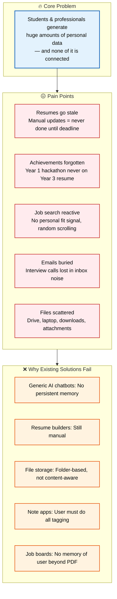

# Problem

> **Purpose:** Define the problem Meridian solves
> **Canonical source:** [`/Docs/01-Meridian-MVP-Spec.md#2-the-problem`](../../Docs/01-Meridian-MVP-Spec.md#2-the-problem)

## Problem Architecture



> **Diagram:** Problem architecture — **core problem** (data scattered, unconnected) → **5 pain points** (stale resumes, forgotten achievements, reactive search, buried emails, scattered files) → **5 solution failures** (no memory, manual, not content-aware, user-dependent, no personalization).

---

## The Core Problem

Students and early professionals generate a huge amount of personal data — project files, certificates, transcripts, resumes, emails about internships, GitHub repos, course notes — and almost none of it is connected.

## Specific Pain Points

| Problem | Impact |
|---------|--------|
| Resumes go stale | Updating them is manual and tedious, so it never gets done until a deadline |
| Achievements get forgotten | A hackathon win in year 1 doesn't make it onto the resume in year 3 |
| Job search is reactive | Scrolling platforms, guessing what to apply to — no personal fit signal |
| Important emails get buried | Interview calls, deadline reminders lost in inbox noise |
| Files are scattered | Drive, laptop folders, downloads, email attachments — no single source of truth |

## Why Existing Solutions Fail

| Solution | Why It Falls Short |
|----------|-------------------|
| Generic AI chatbots | No persistent, structured memory of *this specific person* — every session starts from zero |
| Resume builders | Static templates; user still has to remember and type everything manually |
| File storage (Drive, Dropbox) | Organizes by folder structure, not by what content means |
| Note apps (Notion, Obsidian) | Powerful but require the user to do all linking and tagging |
| Job boards | Search and apply, but have no memory of the user beyond a stored resume PDF |

## Common Mistakes

| Mistake | Consequence |
|---------|-------------|
| Framing the problem too broadly | "Personal data is scattered" is true but not urgent — the specific pain is "my resume is always outdated when I need it" |
| Assuming users understand the problem | Most users don't realize how much time they waste on manual re-assembly — the problem needs to be made visible, not assumed |
| Solving the wrong pain point | If users say "I need a better resume template" but the real problem is "I can't remember what I did last year" — a template solves nothing |
| Over-indexing on a single persona's pain | Student pain (no resume) differs from professional pain (stale skills) — the problem statement must accommodate both |

## Best Practices

| Practice | Why |
|----------|-----|
| Lead with a specific, relatable pain | "Your resume is outdated the moment you finish it" lands harder than generic data-disorganization claims |
| Validate problem statements with user interviews | Every pain point should be confirmed by at least 5 target users — don't assume you know what hurts |
| Quantify the cost of the problem | "Students spend 8+ hours rebuilding resumes each application cycle" is more compelling than qualitative claims |
| Distinguish the problem from the solution | The problem statement should be solution-agnostic — if it mentions "AI" or "agents," you've jumped ahead |

## Security Considerations

| Consideration | Mitigation |
|--------------|-----------|
| Problem data sensitivity | User interviews and pain-point surveys may contain personal career information — anonymize before analysis |
| Problem validation ethics | Don't ask users to share actual resumes or personal data during problem validation — use hypothetical scenarios |

## Overview

The problem Meridian solves is fundamental and universal: every student and professional generates enormous amounts of personal data — project files, certificates, transcripts, resumes, emails, GitHub repos, course notes — and none of it is connected. When it matters most (applying for internships, updating a resume, preparing for interviews), this information must be manually reassembled from scattered sources, often under time pressure. This document defines the core problem, the five specific pain points it creates, and why existing solutions fail to address it.

The problem is not that people lack tools — they have resume builders, note apps, file storage, and AI chatbots. The problem is that each tool operates in isolation, has no persistent memory of the user, and requires manual effort to keep current. Meridian exists to replace this manual reassembly with automatic, continuous organization driven by a persistent knowledge graph that compounds in value over time.

## Goals

- Validate all 5 pain points through user interviews with at least 10 target users before MVP launch
- Quantify the cost of each pain point (hours wasted, opportunities missed) to inform product positioning
- Ensure problem statement resonates with >80% of target users in blind testing
- Maintain solution-agnostic problem framing — never mention "AI," "agents," or "memory" in the problem statement
- Review problem statement quarterly against user feedback to ensure it remains accurate

## Scope

| | |
|---|---|
| **In Scope** | Core problem definition; 5 specific pain points with user impact; analysis of why existing solutions fail (5 categories); common mistakes in problem framing; validation methodology |
| **Out of Scope** | Solution description (see Vision and Mission); competitive analysis (see Competitive Analysis); feature specifications (see individual Feature Specs); quantitative market sizing |

## Workflows

### Problem Validation Workflow

1. Recruit 10-15 target users spanning student, job-seeker, and early-career professional personas
2. Conduct 30-minute structured interviews focusing on career documentation pain points
3. Code interview transcripts against 5 predefined pain point categories
4. Quantify frequency and severity of each pain point across personas
5. Adjust problem statement weighting based on actual user data
6. Re-validate revised problem statement with a second cohort of 5-10 users
7. Final problem statement locked for MVP; reviewed quarterly

## Limitations

| Limitation | Impact | Workaround | Future Resolution |
|------------|--------|------------|-------------------|
| Problem validation limited to English-speaking, tech-comfortable users | May miss pain points of non-English or low-tech users | Supplement with translated surveys for international markets | V2 international user research program |
| Solution-agnostic framing may feel abstract to some users | Users want to hear about the solution, not just the problem | Follow problem interviews with solution concept testing in separate session | Separate problem and solution validation phases in user research |

## Examples

### Pain Point Tracking (JSON)

```json
{
  "pain_points": [
    {
      "id": "stale_resumes",
      "description": "Resumes go stale between updates",
      "frequency": "every_cycle",
      "user_impact": "high",
      "validated_by": 12
    },
    {
      "id": "forgotten_achievements",
      "description": "Past wins never make it to current resume",
      "frequency": "permanent",
      "user_impact": "medium",
      "validated_by": 8
    }
  ]
}
```

### Validation Interview (CLI)

```bash
# Record problem validation result
curl -X POST https://api.meridian.dev/v1/admin/problem/validate \
  -H "Authorization: Bearer $ADMIN_TOKEN" \
  -d '{"pain_point": "stale_resumes", "respondents": 15, "confirmed": 14}'
```

## Future Improvements

| Improvement | Priority | Complexity | Timeline |
|-------------|----------|------------|----------|
| Quantitative problem cost calculator (hours lost, opportunities missed) | High | Low | MVP (2026 Q4) |
| Longitudinal problem tracking (does pain decrease with Meridian use?) | Medium | Medium | v1.5 (2027 H1) |
| International problem validation across 3+ countries | Low | High | V2 (2027 H2) |

## Risks

| Risk | Likelihood | Impact | Mitigation |
|------|------------|--------|------------|
| Problem changes as market evolves (e.g., AI chatbots add memory) | Medium | High | Quarterly problem statement review; pivot positioning if competitive landscape shifts |
| Team assumes they understand the problem without user validation | High | Medium | Mandatory user interview requirement before any product decision; no internal-only problem framing |
| Problem framed too broadly loses urgency | Medium | High | Lead with specific pain ("your resume is outdated the moment you finish it") before general data-disorganization claim |

## Performance Considerations

| Concern | Mitigation |
|---------|------------|
| Problem validation surveys and user interviews generate large qualitative datasets | Use automated sentiment analysis rather than manual review of every response |
| Problem-quantification analytics (e.g., time spent on resume updates) requires instrumentation | Sample a representative subset of users rather than instrumenting the entire user base |
| Mermaid diagrams explaining the problem space add to documentation load times | Optimize diagrams as SVGs and lazy-load below the fold |

## Related Documents

- [Vision.md](./Vision.md)
- [Mission.md](./Mission.md)
- [Product Strategy.md](./Product-Strategy.md)
- [User Personas.md](./User-Personas.md)
- [User Journey.md](./User-Journey.md)
- [`/Docs/01-Meridian-MVP-Spec.md#2-the-problem`](../../Docs/01-Meridian-MVP-Spec.md#2-the-problem)
