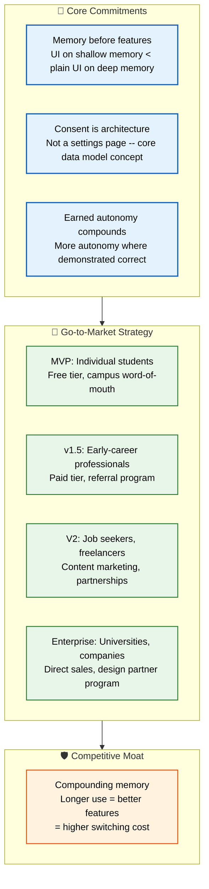

# Product Strategy

> **Purpose:** Define the product strategy and approach for Vaeloom
> **Canonical source:** [`/docs/01-Vaeloom-MVP-Spec.md#3-product-philosophy`](../../docs/01-Vaeloom-MVP-Spec.md#3-product-philosophy)

## Strategy Architecture



> **Diagram:** Product strategy — **3 core commitments** (memory-first, consent-as-architecture, earned autonomy) → **4-phase go-to-market** (MVP→v1.5→V2→Enterprise targeting specific segments) → **competitive moat** (compounding memory — longer use improves everything).

---

## Core Strategy

Vaeloom's strategy is built on three commitments:

1. **Memory before features.** A flashier UI on a shallow memory loses to a plain UI on a deep one. Every new feature is evaluated by what it teaches the memory system, not just what it shows the user.
2. **Consent is the architecture, not a settings page.** Permission scopes, autonomy levels, and audit trails are core data-model concepts, present in every agent and every connector from the schema up — not a layer added later for compliance.
3. **Earned autonomy compounds.** The system starts conservative everywhere and becomes more autonomous only where it has demonstrated it's right — per agent, per user, per action type.

## Go-to-Market Strategy

| Phase | Target | Strategy |
|-------|--------|----------|
| MVP | Individual students | Free tier, word-of-mouth via campus communities |
| v1.5 | Early-career professionals | Paid individual tier, referral program |
| V2 | Job seekers, freelancers | Content marketing, career service partnerships |
| Enterprise | Universities, companies | Direct sales, design partner program |

## Competitive Moat

Vaeloom's moat isn't any single feature — resume builders, job boards, and note apps are all individually replicable. The moat is the **compounding memory**: the longer a person uses Vaeloom, the better every feature gets, and the more painful it becomes to start over somewhere else.

## Common Mistakes

| Mistake | Consequence |
|---------|-------------|
| Confusing strategy with tactics | A list of features to build is a roadmap, not a strategy — strategy is *what you choose not to do* |
| Chasing competitors instead of users | Copying a competitor's feature doesn't create differentiation — it makes your product more like theirs |
| Strategy without resource constraints | A strategy that assumes unlimited engineering time isn't a strategy — it's a wish list |
| Setting strategy once and never revisiting | Market conditions, user feedback, and competitive landscape shift — quarterly strategy reviews prevent drift |

## Best Practices

| Practice | Why |
|----------|-----|
| Strategy is about what you won't do | Vaeloom won't build a resume builder without memory — that constraint, not the feature list, is the strategy |
| Let principles replace rules | "Memory before features" is a principle — it guides decisions without needing a playbook for every edge case |
| Align strategy with user lifecycle | The go-to-market phases (MVP → v1.5 → V2 → Enterprise) should follow user maturity, not calendar dates |
| Review strategy against actual data | Stale strategy assumptions ("users want X") should be replaced with real usage data from each phase |

## Security Considerations

| Consideration | Mitigation |
|--------------|-----------|
| Strategy document confidentiality | Product strategy documents contain competitive positioning and launch timing — access should be need-to-know |
| Partner program data | Design partner programs generate strategy-shaping feedback — partner identity and feedback must be aggregated |

## Overview

Vaeloom's product strategy is built on three foundational commitments that distinguish it from every competitor in the market: memory before features, consent as architecture, and earned autonomy. These commitments are not marketing claims — they are engineering constraints that shape every architectural decision, from the data model through the agent permission system. The strategy also defines a four-phase go-to-market approach targeting increasingly mature user segments, and identifies the compounding memory moat that protects Vaeloom from single-feature competitors.

The strategy is designed to answer the question "what won't we do?" as much as "what will we do?" By choosing memory depth over feature breadth, Vaeloom deliberately limits its initial feature set to ensure every feature compounds the system's understanding of the user. A flashier UI on shallow memory loses to a plain UI on deep, compounding memory — this principle guides every priority decision.

## Goals

- Achieve >90% proposal approval rate across all agent types by end of MVP
- Complete all 4 go-to-market phase transitions within the planned timeline
- Establish compounding memory as the primary switching cost within 12 months of launch
- Maintain memory-before-features principle as the #1 product decision filter
- Secure 5+ design partner commitments before Enterprise phase launch

## Scope

| | |
|---|---|
| **In Scope** | 3 core commitments with definitions and implications; 4-phase go-to-market strategy with targets; competitive moat analysis; strategy principles and constraints; quarterly strategy review process |
| **Out of Scope** | Specific feature implementation details (see Feature Specs); pricing and revenue model (see Business Model and Pricing); detailed competitive analysis (see Competitive Analysis); technical architecture (see Architecture docs) |

## Workflows

### Strategy Review Workflow

1. Quarterly strategy review meeting: product, engineering, and leadership
2. Review actual metrics against strategy assumptions (proposal approval rates, memory growth, user retention)
3. Identify gaps between strategy and reality
4. Adjust strategy or execution plan to close gaps
5. Document changes with rationale in strategy changelog
6. Communicate updates to all teams within 48 hours

## Limitations

| Limitation | Impact | Workaround | Future Resolution |
|------------|--------|------------|-------------------|
| Memory-before-features prioritizes depth over breadth | Users may perceive feature set as limited compared to general AI tools | Focus marketing on depth and trust over feature count; surface memory depth as a feature itself | V2 expands feature set while maintaining memory-first architecture |
| Consent-as-architecture increases engineering complexity | Longer development time for agent and connector implementations | Accept slower initial velocity as investment in trust moat | Patterns and abstractions reduce per-agent consent implementation cost over time |
| Earned autonomy requires patience from power users | Users who want full automation immediately may be frustrated | Default suggestions are still fast for simple actions; autonomy thresholds are user-configurable | Power-user mode with accelerated autonomy track (v1.5) |

## Examples

### GTM Phase Configuration (JSON)

```json
{
  "phases": {
    "mvp": { "target": "students", "strategy": "word-of-mouth", "tier": "free" },
    "v1_5": { "target": "early-career", "strategy": "referral", "tier": "pro" },
    "v2": { "target": "job-seekers", "strategy": "content-marketing", "tier": "pro" },
    "enterprise": { "target": "universities", "strategy": "direct-sales", "tier": "enterprise" }
  }
}
```

### Strategy Principle Check (CLI)

```bash
# Evaluate a proposed feature against strategy
curl -s -X POST https://api.Vaeloom.dev/v1/admin/strategy-check \
  -H "Authorization: Bearer $ADMIN_TOKEN" \
  -d '{"feature": "file_tagging", "principle": "memory_before_features"}' | jq '.passes'
```

## Future Improvements

| Improvement | Priority | Complexity | Timeline |
|-------------|----------|------------|----------|
| Plugin/MCP ecosystem based on consent architecture | Medium | High | Enterprise (2028 H2) |
| Cross-user strategy insights (anonymized) | Low | Medium | V2 (2027 H2) |
| Strategy simulation tool for "what-if" planning | Low | High | Post-Enterprise |

## Risks

| Risk | Likelihood | Impact | Mitigation |
|------|------------|--------|------------|
| Memory-before-features delays time-to-market for visible features | High | Medium | Ship minimum viable agents quickly; iterate on memory depth in parallel |
| Competitor launches with similar positioning and faster execution | Medium | High | Patent key architecture; build brand trust as first-mover in transparent AI |
| Strategy assumptions invalidated by user behavior | Medium | Critical | Quarterly strategy review with actual user data; identify assumption failures early; pivot fast |

## Security Considerations

| Consideration | Approach |
|--------------|----------|
| Phase transitions | The strategy depends on phased rollout — data infrastructure must scale incrementally without rewrites at each phase boundary |

## Related Documents

- [Vision.md](./Vision.md)
- [Business Model.md](./Business-Model.md)
- [Competitive Analysis.md](./Competitive-Analysis.md)
- [Mission.md](./Mission.md)
- [Goals.md](./Goals.md)
- [Roadmap.md](./Roadmap.md)
