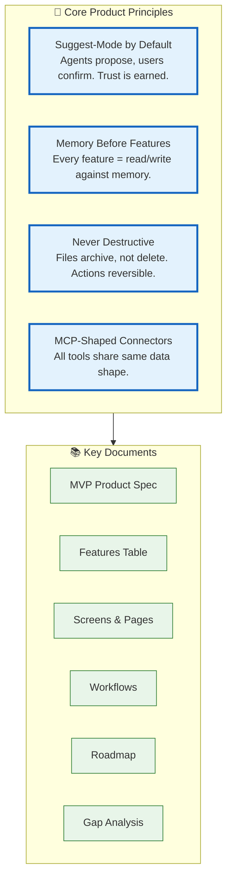

# Product

> **Purpose:** Product specifications, features, user flows, and roadmap
> **Status:** Active
> **Owner:** Product Team
> **Last Updated:** 2026-07-13

## Overview

The Product directory contains Meridian's product specifications, feature definitions, user flows, and roadmap documentation. It serves as the primary reference for understanding what Meridian does and how users interact with the platform.

Key documents include the MVP Product Spec, features table, screens and pages documentation, workflows, roadmap, and gap analysis. The product is built on four core principles: suggest-mode by default, memory before features, never destructive operations, and MCP-shaped connectors.

This directory should be cross-referenced with the AI and Engineering directories, as product decisions are shaped by AI capabilities and engineering constraints.

## What's here

| Document | Location | Status |
|----------|----------|--------|
| MVP Product Spec | [`/Docs/01-Meridian-MVP-Spec.md`](../../Docs/01-Meridian-MVP-Spec.md) | ✅ Canonical |
| Features Table | [`/Docs/Meridian-Complete-Documentation.md#7-features`](../../Docs/Meridian-Complete-Documentation.md#7-features) | ✅ Canonical |
| Screens & Pages | [`/Docs/Meridian-Complete-Documentation.md#8-screens`](../../Docs/Meridian-Complete-Documentation.md#8-screens) | ✅ Canonical |
| Workflows | [`/Docs/Meridian-Complete-Documentation.md#9-workflows`](../../Docs/Meridian-Complete-Documentation.md#9-workflows) | ✅ Canonical |
| Roadmap | [`/Docs/Meridian-Complete-Documentation.md#14-roadmap`](../../Docs/Meridian-Complete-Documentation.md#14-roadmap) | ✅ Canonical |
| Gap Analysis | [`/Docs/Meridian-Complete-Documentation.md#15-gap-analysis`](../../Docs/Meridian-Complete-Documentation.md#15-gap-analysis) | ✅ Canonical |



## Key product decisions

| Decision | Rationale |
|----------|-----------|
| Suggest-mode by default | Agents propose; users confirm. Trust is earned. |
| Memory before features | Every feature is a read/write against memory. If it can't be expressed that way, question it. |
| Never destructive | Files archive, not delete. Every action is reversible. |
| MCP-shaped connectors | All tools share the same shape (name, input, output, scope) — transport layer can change later. |

## Common Mistakes

| Mistake | Better Approach |
|---------|----------------|
| Reading product docs in isolation | Product decisions are shaped by AI capabilities and engineering constraints — cross-reference with [`AI/`](../AI/) and [`Engineering/`](../Engineering/) |
| Treating canonical docs as the only source | The canonical specs (MVP Spec, Complete Documentation) are comprehensive — category docs are distilled views |
| Skipping the Mermaid diagrams | Every product doc begins with an architecture diagram — it's the fastest way to understand the system structure |

## Best Practices

| Practice | Why |
|----------|-----|
| Start with the canonical MVP spec | [`/Docs/01-Meridian-MVP-Spec.md`](../../Docs/01-Meridian-MVP-Spec.md) contains the complete product definition — category docs focus on specific aspects |
| Follow the principle hierarchy | Core Principles (this page) → Product Decisions → Feature Details — start at the right abstraction level |
| Cross-reference with the interactive dashboard | The [Documentation Dashboard](../../docs/Documentation-Dashboard.html) provides a visual overview of all docs and quality metrics |

## Security Considerations

| Concern | Mitigation |
|---------|------------|
| Product docs reference internal architecture | Avoid including specific IP addresses, port numbers, or infrastructure details in product-facing docs |
| Links to canonical docs may expose implementation details | Use relative links within the documentation system, not direct references to internal systems |
| Product decision docs may reveal strategic roadmap | Classify roadmap docs appropriately — public product docs should describe what, not how |

## Performance Considerations

| Concern | Mitigation |
|---------|------------|
| Product README is the entry point for many users | Keep the page lightweight — use inline SVGs for diagrams rather than heavy image assets |
| Cross-referencing many external canonical docs adds navigation overhead | Open canonical docs in new tabs to preserve the README context |
| Documentation pages with multiple Mermaid diagrams can load slowly | Lazy-load diagrams below the fold and use diagram caching |

## Goals

- Provide a clear, navigable entry point to all Meridian product documentation for every team member
- Ensure every doc links to its canonical source and is tagged with current status and ownership
- Maintain cross-referencing between Product, AI, and Engineering directories to reflect the interdependency of product decisions
- Keep the README itself lightweight — principles and index only, not detail — so it loads fast and stays scannable
- Update the What's here table whenever a new product doc is created or promoted to canonical status

## Scope

| | |
|---|---|
| **In Scope** | Product directory index with document listing, status, and canonical source links; core product principles (suggest-mode, memory-first, never destructive, MCP-shaped); cross-reference to AI and Engineering directories; common mistakes and best practices for navigating product documentation |
| **Out of Scope** | Detailed feature specifications (see individual Feature Specs); implementation timelines (see Roadmap); competitive positioning (see Competitive Analysis); technical architecture details (see Architecture docs); user-facing product copy or marketing content |

## Examples

### Document Index (JSON)

```json
{
  "documents": [
    { "name": "MVP Product Spec", "path": "/Docs/01-Meridian-MVP-Spec.md", "status": "canonical" },
    { "name": "Features Table", "path": "/Docs/Meridian-Complete-Documentation.md#7-features", "status": "canonical" },
    { "name": "Roadmap", "path": "/Docs/Meridian-Complete-Documentation.md#14-roadmap", "status": "canonical" }
  ]
}
```

### Quick Doc Search (CLI)

```bash
# Search across product docs
curl -s "https://api.meridian.dev/v1/docs/search?q=consent+architecture" \
  -H "Authorization: Bearer $API_TOKEN" | jq '.results[:3] | .[] | {title, path}'
```

## Future Improvements

| Improvement | Priority | Complexity | Timeline |
|-------------|----------|------------|----------|
| Product analytics integration for feature usage | High | Medium | Q1 2027 |
| User research synthesis and persona validation | Medium | Medium | Q2 2027 |
| Competitive landscape quarterly refresh | Low | Low | Q4 2026 |

## Related categories

- [`Project/`](../Project/) — Project vision
- [`AI/`](../AI/) — Agent system that powers these features
- [`Engineering/`](../Engineering/) — How features are built

## Related Documents

- [MVP Product Spec](../01-Meridian-MVP-Spec.md) — Canonical MVP specification
- [Enterprise Product Vision](../06-Meridian-Enterprise-Paper.md) — Enterprise-scale vision
- [Product Strategy](./Product-Strategy.md) — Go-to-market and competitive moat
