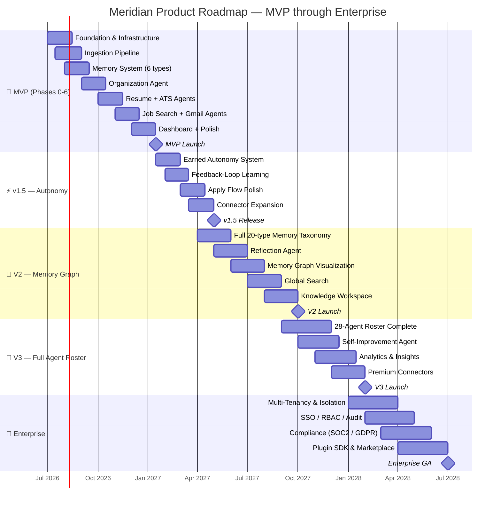

# Roadmap

> **Purpose:** Define the product roadmap across MVP through enterprise
> **Canonical source:** [`/Docs/Meridian-Complete-Documentation.md#14-roadmap`](../../Docs/Meridian-Complete-Documentation.md#14-roadmap)

## Roadmap Overview



> **Chart:** The product roadmap spans 4 years from MVP through Enterprise. **MVP** (🚀) delivers core ingestion, organization, and agent capabilities in 6 phases over 6 months. **v1.5** (⚡) layers autonomy and learning feedback. **V2** (🧠) expands memory to 20 types with graph visualization. **V3** (🤖) completes the 28-agent roster. **Enterprise** (🏢) adds multi-tenancy, SSO, compliance, and a plugin marketplace. Milestones mark each major release.

---

| Stage | Scope | Exit Criteria |
|-------|-------|---------------|
| **MVP** (Phases 0-6) | Ingestion, Organization Agent, 6-type memory, Resume + ATS, Job Search, Gmail + Scheduler, Dashboard | Real users complete a full first-week journey with no manual team intervention |
| **v1.5** | Earned autonomy, feedback-loop learning, deep-link apply flow polish | >80% of active users grant at least one autonomous action type |
| **V2** | Full 20-type memory taxonomy, Reflection Agent, Memory Graph, Global Search, Knowledge Workspace | Memory-driven suggestions outperform user-initiated actions |
| **V3** | Full 28-agent roster, Self-Improvement Agent, Analytics, richer connectors | Agent accuracy metrics tracked and improving release over release |
| **Enterprise** | Multi-tenancy, consent model, SSO/RBAC, Plugin SDK, Marketplace | First enterprise design partner live with verified tenant isolation |

## Current Phase

**MVP (Phases 0-6)** — Implementation not yet started. Full build order defined in [`build-prompts/mvp/`](../../Documents/build-prompts/mvp/).

## Common Mistakes

| Mistake | Consequence |
|---------|-------------|
| Over-promising on timelines | Public roadmaps with specific dates become liabilities when priorities shift — users and stakeholders hold you to them |
| Confusing roadmap with release plan | A roadmap communicates direction and priorities — exact dates and specific features belong in a release plan |
| Showing only the next quarter | A roadmap that shows only the next 3 months gives no confidence that there's a long-term vision |
| Never removing items | Roadmaps that only add and never remove become impossibly long — stale items erode credibility |

## Best Practices

| Practice | Why |
|----------|-----|
| Use now/next/later buckets instead of specific dates | Stakeholders need to know the order of priorities, not the exact ship date — "next" communicates soon without committing to a month |
| Review and update quarterly | Roadmaps should be recast each quarter based on actual progress and user feedback, not locked in from the last planning cycle |
| Include exit criteria for each stage | Each stage should have a clear "done" condition — "real users complete first-week journey unaided" is better than "launch MVP" |
| Communicate what you're not doing | An explicit "not now" section prevents stakeholders from assuming features will ship in the current cycle |

## Security Considerations

| Consideration | Mitigation |
|--------------|-----------|
| Roadmap confidentiality | Early-stage feature plans and enterprise timelines are commercially sensitive — share with NDA where appropriate |
| Compliance deadlines | Roadmap items related to SOC2, GDPR, or other compliance must have hard deadlines that are not negotiable |

## Overview

Meridian's product roadmap spans from MVP through Enterprise across four major releases over approximately 2.5 years. The roadmap is organized by phase rather than strict dates, with each phase having explicit exit criteria that must be met before the next phase begins. This structure allows for flexibility in timing while maintaining strategic direction — phases are sequenced by dependency, not calendar pressure.

The MVP phase (Phases 0-6) is the critical path: proving the core loop of ingest → organize → remember → assist with real users. Each subsequent phase layers on additional capabilities: v1.5 adds earned autonomy and feedback loops, V2 expands the memory system to 20+ types, V3 completes the 28-agent roster, and Enterprise adds multi-tenancy, compliance, and a plugin marketplace.

## Goals

- Complete MVP (Phases 0-6) within 6 months of project start
- Achieve MVP exit criteria: real users complete first-week journey with no manual team intervention
- Maintain <20% schedule variance per phase (actual vs. estimated duration)
- Deliver each phase with measurable user impact, not just feature completion
- Pause or reprioritize any phase that fails exit criteria within 30 days

## Scope

| | |
|---|---|
| **In Scope** | 5-stage roadmap (MVP, v1.5, V2, V3, Enterprise) with Gantt chart, phase descriptions, exit criteria, and current phase status |
| **Out of Scope** | Specific sprint-level plans (tracked in project management); individual feature specifications (see Feature Specs); detailed migration paths between phases; resource allocation per phase |

## Workflows

### Phase Transition Workflow

1. Current phase nears completion — engineering lead runs exit criteria checklist
2. Product manager validates each criterion with actual data (not team assessment)
3. If all criteria met: phase complete; next phase kickoff scheduled
4. If criteria partially met: product team decides: extend phase (up to 30 days) or proceed with conditions
5. If criteria not met after extension: phase re-scoped; roadmap adjusted accordingly
6. Phase transition documented with metrics snapshot and lessons learned

## Limitations

| Limitation | Impact | Workaround | Future Resolution |
|------------|--------|------------|-------------------|
| Roadmap extends beyond reliable forecasting horizon (6+ months) | V3 and Enterprise dates are estimates with high uncertainty | Mark post-12-month items as "target horizons" not committed dates; use now/next/later framework for external communication | Roll planning window to keep only 12 months firm; revisit quarterly |
| MVP phase has the most unknowns but least schedule buffer | Early delays compound into later phases | Build 20% buffer into each phase estimate; protect MVP scope by deferring non-critical features to v1.5 | Apply learning from MVP velocity to future phase estimation |
| Phase exit criteria may not capture user satisfaction | "Technical completion" ≠ "user value" | Include at least one user-experience metric per exit criterion (approval rate, NPS, retention) | Develop composite "phase health score" combining technical and experience metrics |

## Examples

### Phase Definition (JSON)

```json
{
  "phases": [
    {
      "id": "mvp",
      "name": "MVP (Phases 0-6)",
      "duration": "6 months",
      "exit_criteria": "Real users complete first-week journey unaided",
      "milestones": ["Foundation", "Ingestion", "Memory", "Organization Agent", "Resume + ATS", "Job Search + Gmail", "Dashboard"]
    },
    {
      "id": "v1_5",
      "name": "v1.5 — Autonomy",
      "duration": "4 months",
      "exit_criteria": ">80% users grant autonomous action",
      "milestones": ["Earned Autonomy", "Feedback Loops", "Apply Flow", "Connector Expansion"]
    }
  ]
}
```

### Phase Transition (CLI)

```bash
# Check if phase exit criteria are met
curl -s https://api.meridian.dev/v1/admin/roadmap/phase/mvp/check \
  -H "Authorization: Bearer $ADMIN_TOKEN" | jq '.criteria_met'
```

## Future Improvements

| Improvement | Priority | Complexity | Timeline |
|-------------|----------|------------|----------|
| Public roadmap view for external stakeholders | Medium | Low | v1.5 (2027 H1) |
| Automated phase transition tracking dashboard | High | Low | MVP (2026 Q4) |
| What-if scenario modeling for roadmap changes | Low | Medium | V2 (2027 H2) |
| Feature-level dependency graph for critical path optimization | Medium | Medium | v1.5 (2027 H1) |

## Risks

| Risk | Likelihood | Impact | Mitigation |
|------|------------|--------|------------|
| MVP phase underestimates memory system complexity | High | Critical | Phase 0 dedicated entirely to data model and infrastructure; resist pressure to start features before foundation |
| v1.5 autonomy features create trust issues with users | Medium | High | Earned autonomy is opt-in and per-action-type; users can revoke at any time; no autonomous actions in MVP |
| Enterprise features take longer than expected | Medium | Medium | Enterprise phase is last; foundation laid in earlier phases via consent architecture and tenant isolation |
| Key team member leaves during critical phase | Low | High | Cross-train on critical paths; document architecture decisions; maintain bus factor of 2 for each service |

## Performance Considerations

| Consideration | Approach |
|--------------|----------|
| Phase capacity planning | Each roadmap phase should include infrastructure scaling estimates — don't assume current capacity will serve next phase |
| Milestone performance gates | Each release milestone must include a performance regression check — no feature ships that degrades p95 response time |

## Related Documents

- [Features.md](./Features.md)
- [Vision.md](./Vision.md)
- [Goals.md](./Goals.md)
- [Product Strategy.md](./Product-Strategy.md)
- [Success Metrics.md](./Success-Metrics.md)
- [`/Docs/Meridian-Complete-Documentation.md#14-roadmap`](../../Docs/Meridian-Complete-Documentation.md#14-roadmap)
- [`/Docs/Meridian-Complete-Documentation.md#12-implementation-plan`](../../Docs/Meridian-Complete-Documentation.md#12-implementation-plan)
