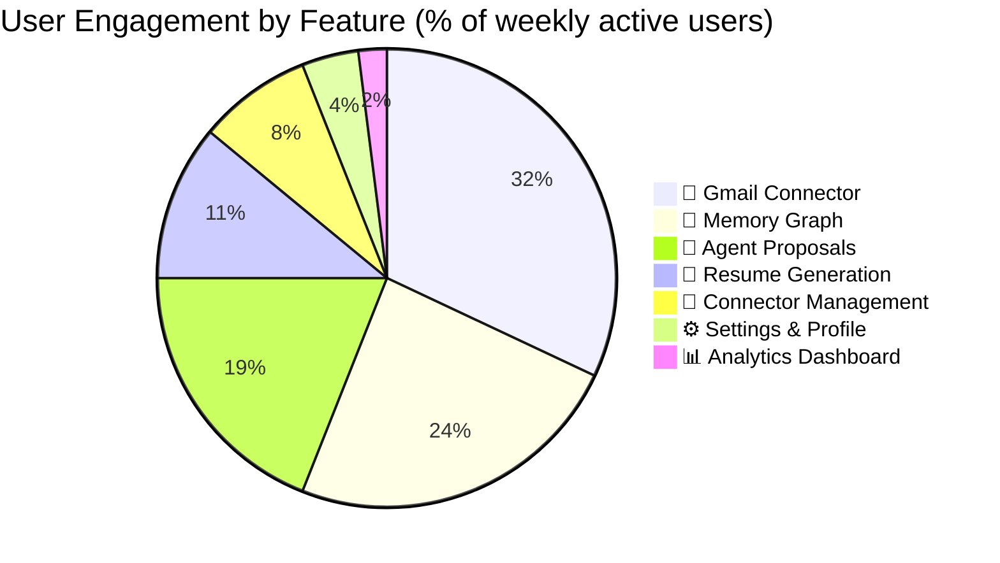

# Success Metrics

> **Purpose:** Define key success metrics for Meridian
> **Status:** 🆕 New

## Feature Adoption Distribution



> **Chart:** Feature adoption among weekly active users. **Gmail Connector** leads at 32% — email classification is the primary daily driver. **Memory Graph** (24%) and **Agent Proposals** (19%) represent the core AI interaction loop. **Resume Generation** (11%) and **Connector Management** (8%) are secondary workflows. **Settings** (4%) and **Analytics** (2%) are utility surfaces.

---

## Product Metrics

| Metric | Definition | Target (MVP) |
|--------|------------|--------------|
| DAU/MAU | Daily/Monthly active users | >30% DAU/MAU |
| Proposal approval rate | % of agent proposals approved by user | >90% |
| Time-to-first-application | Time from signup to first job application submitted | <7 days |
| Memory accuracy | % of extracted entities verified as correct | >95% |
| Connector health | % of connector-days in healthy state | >99% |

## Business Metrics

| Metric | Definition | Target |
|--------|------------|--------|
| Free-to-paid conversion | % of free users who upgrade | TBD from MVP |
| Monthly churn | % of users who stop using | <5% |
| NPS | User satisfaction score | >40 |
| ARPU | Average revenue per user | TBD |
| CAC | Customer acquisition cost | TBD |

## AI Quality Metrics

| Metric | Definition | Target |
|--------|------------|--------|
| Agent accuracy | % of agent outputs accepted without correction | >90% |
| Merge precision | % of entity merges that are correct | >99% |
| RAG relevance | % of retrieved memories relevant to query | >85% |
| Classification accuracy | For Gmail Agent, per category | >95% |

## Common Mistakes

| Mistake | Consequence |
|---------|-------------|
| Tracking vanity metrics | Total registered users sounds impressive but doesn't measure engaged users — DAU/MAU is the real north star |
| Setting targets before baseline measurement | Targeting ">90% proposal approval rate" without knowing the current rate makes the target arbitrary, not aspirational |
| Too many metrics at launch | 15 dashboard metrics on day one obscures what matters — start with 3-5 core metrics and expand |
| Metrics without ownership | A metric with no named owner is a metric that won't improve — every metric needs a responsible team |

## Best Practices

| Practice | Why |
|----------|-----|
| One north star metric per goal | Each product goal should have exactly one primary metric that tells you if you're making progress |
| Measure outcomes, not outputs | "Proposal approval rate" measures if users trust the system — "number of proposals generated" just measures activity |
| Set targets based on cohort data | Week 1 metrics differ from Month 6 metrics — set progressive targets by user cohort age |
| Review metrics weekly; act on them monthly | Daily metric watching creates noise — weekly review catches trends, monthly action changes outcomes |

## Security Considerations

| Consideration | Mitigation |
|--------------|-----------|
| Metric data privacy | Usage and adoption metrics must be aggregated and not personally identifiable — no per-user metric tracking |
| AI quality metric integrity | Agent accuracy and RAG relevance metrics must be computed on a held-out test set, not production data |
| Metric access control | Internal metrics dashboards should not expose individual user behavior — only aggregated cohort views |

## Overview

Success metrics at Meridian are organized into three tiers: product metrics (engagement and trust signals), business metrics (conversion and retention), and AI quality metrics (accuracy and relevance). Each metric has a clear definition, a target for the MVP phase, and a named owner responsible for improvement. The metrics framework follows the principle of one north star metric per goal — no metric is tracked without a corresponding product or business decision it informs.

This document defines all tracked metrics, their collection methodology, and the review cadence. Metrics are reviewed weekly for trend detection and acted upon monthly for course correction. Vanity metrics (total signups, page views) are explicitly excluded in favor of behavior-based metrics (DAU/MAU, proposal approval rate, memory accuracy) that correlate with long-term retention.

## Goals

- Establish baseline for all 5 product metrics within 30 days of MVP launch
- Set progressive targets per user cohort (Week 1, Month 1, Month 3, Month 6)
- Achieve automated metric collection for all metrics with <1ms instrumentation overhead
- Maintain metric data privacy — all metrics aggregated, no personally identifiable data
- Publish weekly metrics dashboard accessible to all team members

## Scope

| | |
|---|---|
| **In Scope** | 5 product metrics (DAU/MAU, proposal approval rate, time-to-first-application, memory accuracy, connector health); 4 business metrics (conversion, churn, NPS, ARPU, CAC); 4 AI quality metrics (accuracy, merge precision, RAG relevance, classification accuracy) |
| **Out of Scope** | Financial metrics (revenue, burn rate) — tracked elsewhere; engineering metrics (deploy frequency, MTTR) — tracked in DevOps; vanity metrics (total signups, page views); real-time per-user metric tracking |

## Workflows

### Metric Collection Workflow

1. Application code emits metric events to async pipeline (never synchronous on request path)
2. Events are batched and written to time-series database (5-second aggregation window)
3. Metric computation runs on schedule (hourly for real-time metrics, daily for quality metrics)
4. Computed metrics written to dashboard data store with 60s cache TTL
5. Alert evaluation runs on metric write — critical thresholds trigger notifications
6. Weekly metric review: product manager reviews trends and identifies action items

## Limitations

| Limitation | Impact | Workaround | Future Resolution |
|------------|--------|------------|-------------------|
| AI quality metrics require held-out test set | Early stages may have insufficient test data for statistical significance | Use confidence intervals and flag metrics with small sample sizes | Bootstrap test set from initial user interactions with manual labeling |
| Proposal approval rate can be gamed by users who always approve | Metric may overstate true trust | Complement with "time-to-approve" and "revert rate" as guardrail metrics | Composite trust score combining multiple approval-quality signals |
| NPS survey frequency must be limited to avoid survey fatigue | Infrequent surveys may miss sentiment shifts | Trigger NPS survey on specific events (post-first-application, downgrade, upgrade) | Continuous sentiment analysis via interaction patterns as NPS supplement |

## Examples

### Metric Definition (JSON)

```json
{
  "metrics": [
    {
      "name": "dau_mau_ratio",
      "target": 0.30,
      "window": "30d",
      "source": "auth_events",
      "owner": "product_team"
    },
    {
      "name": "proposal_approval_rate",
      "target": 0.90,
      "window": "7d",
      "source": "agent_audit",
      "owner": "ai_team"
    }
  ]
}
```

### Metric Query (CLI)

```bash
# Get current metric values
curl -s https://api.meridian.dev/v1/admin/metrics/current \
  -H "Authorization: Bearer $ADMIN_TOKEN" | jq '.metrics[] | {name, value, target}'
```

## Future Improvements

| Improvement | Priority | Complexity | Timeline |
|-------------|----------|------------|----------|
| Automated goal-to-metric cascade visualization | High | Low | MVP (2026 Q4) |
| Cohort-based progressive target setting | Medium | Low | v1.5 (2027 H1) |
| Metric drift detection (when metric stops correlating with outcome) | Low | Medium | V2 (2027 H2) |
| External benchmark comparison for industry-relative metrics | Low | High | Enterprise (2028) |

## Risks

| Risk | Likelihood | Impact | Mitigation |
|------|------------|--------|------------|
| Too many metrics tracked dilutes focus on what matters | High | Medium | Start with 5 core product metrics; add new metrics only when existing ones stabilize |
| Metric collection adds latency to critical path | Medium | High | Async pipeline with sampling for debug-level metrics; hard limit of <1ms instrumentation overhead |
| Metrics used for individual performance evaluation | Medium | High | Metrics are product and system health indicators, not individual performance reviews — policy documented |

## Performance Considerations

| Consideration | Approach |
|--------------|----------|
| Metric collection overhead | Metric emission must add <1ms to request latency — use async metric pipelines, not synchronous instrumentation |
| Storage of high-cardinality metrics | Per-request metrics grow fast — use sampling for debug-level metrics and aggregation for business metrics |

## Related Documents

- [Goals.md](./Goals.md)
- [Product Strategy.md](./Product-Strategy.md)
- [Features.md](./Features.md)
- [Roadmap.md](./Roadmap.md)
- [Vision.md](./Vision.md)
- [`/Docs/Engineering/Implementation/10-evaluation-framework.md`](../../Docs/Engineering/Implementation/10-evaluation-framework.md)
