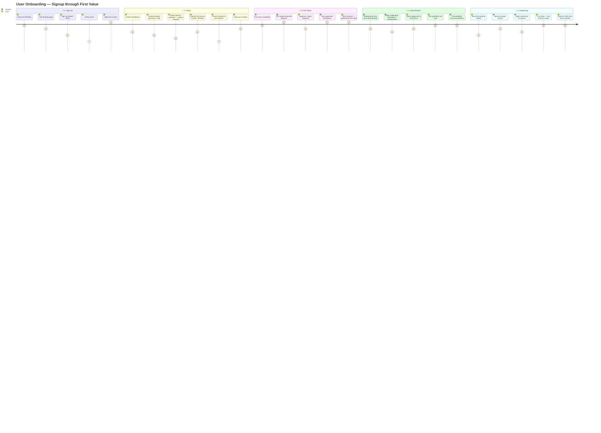

# User Journey

> **Purpose:** Define the end-to-end user journey through Meridian
> **Canonical source:** [`/Docs/06-Meridian-Enterprise-Paper.md#3-user-journey`](../../Docs/06-Meridian-Enterprise-Paper.md#3-user-journey)

## Onboarding Journey Map



> **Chart:** The user's emotional journey from signup through first value. Excitement peaks at the **First Sync** and **First Proposal** — this is the "aha moment" where the user understands Meridian's value. The setup phase has the lowest scores due to OAuth friction and seed data decisions. Daily rhythm stabilizes with high satisfaction as the system runs autonomously and the user trusts it more over time.

---

## Journey Stages

### Stage 1: Registration

User signs up via email or SSO. Identity decision: personal vs. organization-provisioned account.

### Stage 2: Workspace Creation

New workspace provisioned: isolated memory namespace, default folder taxonomy, blank knowledge graph. Nothing pre-populated — Meridian builds understanding from what the user actually connects.

### Stage 3: Memory Initialization

Optional seed flow: upload a resume, connect one or two sources. Not required — Meridian works from zero — but gives the memory system useful signal from day one.

### Stage 4: Connector Setup

Connect Gmail, GitHub, Drive, local folder, VS Code. Each is a distinct, scoped OAuth/permission grant.

### Stage 5: Daily Usage

System runs in the background. User's active time is spent in short, high-value interactions — approving file moves, picking job matches, asking specific questions.

### Stage 6: Continuous Learning

Every approval, correction, and rejection is written to Preference Memory. The system is never "done" learning the user.

### Stage 7: Long-Term Personalization

Over months and years, Meridian shifts from "organizes my stuff" to "knows my trajectory."

## Day 1 vs. Month 6

| Metric | Day 1 | Month 6 |
|--------|-------|---------|
| Documents organized | 10-50 | 500-5000 |
| Knowledge graph entities | 20-100 | 1000-10000 |
| Resume accuracy | Partial | Comprehensive |
| Agent autonomy earned | None | 1-2 action types |
| User dependency | Low | High (switching costs) |

## Common Mistakes

| Mistake | Consequence |
|---------|-------------|
| Designing the ideal journey, not the real one | The happy path (user signs up, connects sources, sees value) is never the user's actual path — edge cases dominate |
| Ignoring the emotional low points | The chart shows OAuth consent as the lowest score — designing better consent UX improves the entire journey more than polishing the already-good parts |
| Making assumptions about user motivation | Assuming users will "naturally" connect more sources over time — in reality, users need explicit prompts and clear benefits |
| One journey for all personas | A student's onboarding differs from a professional's — the journey must have persona-aware branching |

## Best Practices

| Practice | Why |
|----------|-----|
| Map the emotional journey, not just the functional one | The chart shows satisfaction scores — users remember how the product made them feel, not what steps they took |
| Design for the lowest-scoring moments | The biggest improvement opportunity is where the journey score dips — invest in OAuth UX, not the welcome screen |
| Define "aha moment" explicitly | The "First Proposal" is the aha moment — every upstream step should be measured by how quickly users reach this point |
| Measure journey completion rates | Track what percentage of users complete each stage — a drop-off at Stage 4 (Connector Setup) means the OAuth flow needs work |

## Security Considerations

| Consideration | Mitigation |
|--------------|-----------|
| OAuth consent transparency | Users grant OAuth permissions during the lowest-sentiment moment — provide clear, jargon-free explanations of what each scope allows |
| Seed data upload handling | Uploaded resumes and documents during seed flow must be treated with the same encryption and isolation as all user data |
| Journey analytics privacy | Funnel analysis and drop-off tracking must be aggregated — never attribute specific drop-off events to identifiable users |

## Overview

The User Journey document maps the emotional and functional experience of a Meridian user from first discovery through long-term partnership. Unlike a traditional user flow diagram that shows only functional steps, this journey map tracks user satisfaction scores at each stage, identifying the critical "aha moment" where the user understands Meridian's value and the friction points where users are most likely to drop off.

The journey is divided into 7 stages spanning signup through months of continuous use. Each stage has specific design goals, known failure modes, and optimization opportunities. The lowest-scoring moments — particularly the OAuth consent flow during connector setup — represent the highest-leverage improvement opportunities for overall user experience.

## Goals

- Reduce time from signup to "aha moment" (first agent proposal) to under 5 minutes
- Achieve >80% stage completion rate from Stage 1 (Signup) through Stage 5 (Daily Usage)
- Increase satisfaction score at the OAuth consent step (currently the lowest point) by 2+ points
- Define persona-specific journey branches for Student vs. Professional vs. Enterprise users
- Measure and reduce drop-off at each journey stage through targeted UX improvements

## Scope

| | |
|---|---|
| **In Scope** | 7-stage journey map with satisfaction scores; stage descriptions; Day 1 vs. Month 6 comparison; emotional low-point analysis; common journey mistakes; journey optimization best practices |
| **Out of Scope** | Specific UI designs (see Frontend design docs); technical implementation of onboarding flows (see Feature Specs); enterprise-specific journey paths (see Enterprise docs); A/B test results for journey optimization |

## Workflows

### Journey Optimization Workflow

1. Product analytics tracks funnel completion rates at each journey stage
2. Weekly review identifies stages with >10% week-over-week drop-off increase
3. UX research conducts targeted interviews with users who dropped off at that stage
4. Root cause identified and prioritized against other improvements
5. Design sprint to address the specific friction point
6. A/B test the improvement with 50% of new users
7. If improvement moves drop-off rate by >5%, roll out to all users

## Limitations

| Limitation | Impact | Workaround | Future Resolution |
|------------|--------|------------|-------------------|
| Journey map based on MVP user base (students) | May not generalize to professionals or enterprise users | Segment journey analytics by user persona; add persona-specific stages as user base diversifies | Persona-branching journey maps in V2 |
| Satisfaction scores are self-reported and subjective | Scores may not correlate with actual behavior | Cross-reference satisfaction with behavioral metrics (time-in-stage, return rate) | Composite experience score combining sentiment and behavior |
| Journey optimization focuses on early stages (1-5) | Later stages (6-7) may have hidden friction | Include quarterly deep-dive on long-term user experience | Automated long-term user health scoring (V2) |

## Examples

### Journey Stage Configuration (JSON)

```json
{
  "stages": [
    {
      "name": "Sign Up",
      "satisfaction_score": 5,
      "drop_off_rate": 0.02,
      "target_time_min": 2,
      "optimization_priority": "medium"
    },
    {
      "name": "Connector Setup",
      "satisfaction_score": 3,
      "drop_off_rate": 0.15,
      "target_time_min": 3,
      "optimization_priority": "high"
    },
    {
      "name": "First Proposal",
      "satisfaction_score": 9,
      "drop_off_rate": 0.01,
      "target_time_min": 5,
      "optimization_priority": "critical"
    }
  ]
}
```

### Funnel Analysis (CLI)

```bash
# Check journey completion rates
curl -s "https://api.meridian.dev/v1/admin/journey/funnel?cohort=2026-07" \
  -H "Authorization: Bearer $ADMIN_TOKEN" | jq '.stages[] | {stage, completion_rate}'
```

## Future Improvements

| Improvement | Priority | Complexity | Timeline |
|-------------|----------|------------|----------|
| Persona-specific journey branches with adaptive onboarding | High | Medium | V2 (2027 H2) |
| Real-time journey progress tracking for user | Medium | Low | v1.5 (2027 H1) |
| Automated drop-off root cause analysis | Low | Medium | V2 (2027 H2) |
| Journey-based personalization (content, timing, features) | Medium | High | V3 (2028) |

## Risks

| Risk | Likelihood | Impact | Mitigation |
|------|------------|--------|------------|
| Journey optimization improves early-stage metrics but ignores long-term value | Medium | High | Include Month 1, Month 3, Month 6 retention as secondary journey metrics |
| Over-optimizing for the "aha moment" creates coercive onboarding patterns | Low | Medium | Journey improvements must pass "would this feel manipulative?" design review |
| Single journey path doesn't accommodate different user motivations | High | Medium | Build persona-aware branching from day one; minimum two paths (student, professional) |

## Performance Considerations

| Consideration | Approach |
|--------------|----------|
| First sync speed | The first connector sync is the highest-expectation moment — prioritize time-to-first-completed-sync over sync depth |
| Background sync impact | Daily sync must not degrade user device or browser performance — use idle-time scheduling and throttle network usage |

## Related Documents

- [User Personas.md](./User-Personas.md)
- [Features.md](./Features.md)
- [Problem.md](./Problem.md)
- [Vision.md](./Vision.md)
- [Success Metrics.md](./Success-Metrics.md)
- [`/Docs/06-Meridian-Enterprise-Paper.md#3-user-journey`](../../Docs/06-Meridian-Enterprise-Paper.md#3-user-journey)
