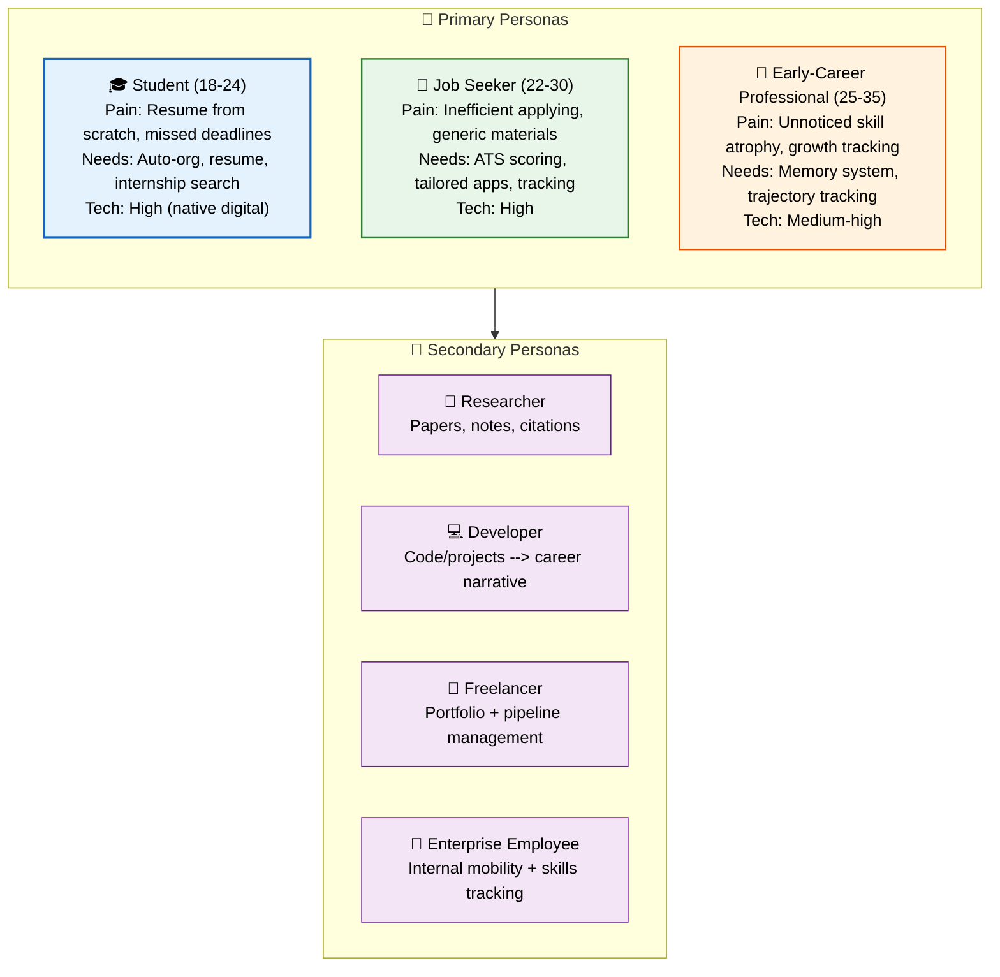

# User Personas

> **Purpose:** Define the target user personas for Vaeloom
> **Canonical source:** [`/docs/06-Vaeloom-Enterprise-Paper.md#21-who-its-for`](../../docs/06-Vaeloom-Enterprise-Paper.md#21-who-its-for)

## Persona Architecture



> **Diagram:** Personas — **3 primary personas** (Student 18-24, Job Seeker 22-30, Early-Career Professional 25-35) with age, pain points, needs, and tech comfort → **4 secondary personas** (Researcher, Developer, Freelancer, Enterprise Employee).

---

## Primary Personas

### Student

| Attribute | Detail |
|-----------|--------|
| **Age** | 18-24 |
| **Pain** | Building a resume from scratch, remembering achievements, missing deadlines |
| **Needs** | Auto-organization, resume agent, internship search, deadline tracking |
| **Primary modules** | Organization Agent, Resume Agent, Job/Internship Search, Scheduler |
| **Tech comfort** | High — native digital |

### Job Seeker

| Attribute | Detail |
|-----------|--------|
| **Age** | 22-30 |
| **Pain** | Applying inefficiently, losing track of applications, generic materials |
| **Needs** | ATS scoring, tailored applications, application tracking, skill gap analysis |
| **Primary modules** | Career Intelligence, ATS Agent, Application tracking |
| **Tech comfort** | High |

### Early-Career Professional

| Attribute | Detail |
|-----------|--------|
| **Age** | 25-35 |
| **Pain** | Keeping a living record of growth across roles, skills atrophying unnoticed |
| **Needs** | Memory system, knowledge workspace, career trajectory tracking |
| **Primary modules** | Memory system, Resume Agent, Knowledge Workspace |
| **Tech comfort** | Medium-high |

### Secondary Personas

- **Researcher** — organizing papers, notes, citations
- **Developer** — connecting code/projects to career narrative
- **Freelancer** — portfolio and pipeline management
- **Enterprise employee** — internal mobility, skills tracking within org

## Common Mistakes

| Mistake | Consequence |
|---------|-------------|
| Personas based on assumptions, not research | Fictional personas that reflect internal stereotypes rather than real user data lead to products that don't fit anyone |
| Too many personas | Defining 15+ personas makes it impossible to design for any of them — 3 primary + a few secondary is the maximum |
| Static personas that never update | Personas should evolve as the product matures and user base grows — the student persona at MVP may differ from the student persona at V2 |
| Designing for the "average" persona | The average of 3 personas serves none of them — design for specific personas, not the hypothetical composite |

## Best Practices

| Practice | Why |
|----------|-----|
| Base personas on real user interviews | Each persona attribute (pain, need, tech comfort) should come from actual user conversations, not team assumptions |
| Include what the persona is NOT | A persona's boundaries are as important as its attributes — the Student persona is NOT enterprise procurement, NOT a hiring manager |
| Prioritize personas by business strategy | The Student is the wedge — design decisions that serve the Student should take priority over secondary personas |
| Link each persona to specific features | Each persona should map to specific primary modules — if a feature doesn't serve any persona, reconsider its priority |

## Security Considerations

| Consideration | Mitigation |
|--------------|-----------|
| Persona data handling | Persona descriptions should be anonymized composites, not identifiable individuals — no real user data in persona documents |
| Secondary persona privacy | Researcher and Developer personas may involve sensitive workflows — ensure persona-related feature planning accounts for data protection |
| Persona-based access control | Enterprise Employee personas should never imply shared memory or cross-account data access |

## Overview

Vaeloom serves three primary personas — Student (18-24), Job Seeker (22-30), and Early-Career Professional (25-35) — and four secondary personas — Researcher, Developer, Freelancer, and Enterprise Employee. Each persona has distinct pain points, needs, tech comfort levels, and primary feature modules. The persona framework ensures that product decisions are grounded in the needs of real user archetypes rather than internal assumptions.

The Student persona is the wedge: Vaeloom's go-to-market strategy targets students first, which means design decisions that serve the Student should generally take priority over secondary personas. However, the architecture must not preclude serving other personas — the same memory system that organizes a student's academic documents works equally well for a freelancer's client portfolio or a developer's project history.

## Goals

- Validate all 3 primary persona profiles through user interviews (minimum 5 users per persona)
- Link every feature to at least one primary persona's needs — no orphan features
- Achieve >80% persona-representation accuracy: actual user base matches persona profiles within 20%
- Update persona descriptions quarterly based on real user data, not team assumptions
- Maintain persona-based prioritization framework for feature decisions

## Scope

| | |
|---|---|
| **In Scope** | 3 primary persona definitions with age, pain points, needs, tech comfort, and primary modules; 4 secondary persona descriptions; persona architecture diagram; common persona mistakes; persona-based prioritization best practices |
| **Out of Scope** | Enterprise buyer personas (HR directors, university career office admins) — covered in Enterprise docs; competitor user personas; demographic market sizing; persona-specific UX designs |

## Workflows

### Persona-Based Feature Prioritization Workflow

1. Proposed feature is assessed against each persona's needs
2. Feature scores: 0 (serves no persona) to 3 (serves primary persona's critical need)
3. Features scoring 0 are deprioritized or rejected
4. Features scoring 2-3 for the Student persona get highest priority
5. Features scoring 2-3 only for secondary personas are scheduled for later phases
6. Quarterly persona review ensures feature-persona mappings remain accurate as personas evolve

## Limitations

| Limitation | Impact | Workaround | Future Resolution |
|------------|--------|------------|-------------------|
| Personas based on early assumptions until validated with user data | Risk of designing for fictional users | Flag pre-validation personas as "draft" in documentation; commit to validation timeline | Full persona validation study before V2 feature planning |
| Three primary personas may not cover all user archetypes | Some users may not identify with any persona | Add "other" tracking in analytics; create new persona cluster if >10% of users fall outside existing personas | Annual persona audit and cluster analysis |
| Persona attributes (age, tech comfort) may correlate with region/culture | Personas developed from English-speaking, tech-comfortable users may not generalize | Include international user research in V2 research plan | Region-specific persona variants in Enterprise phase |

## Examples

### Persona Definition (JSON)

```json
{
  "personas": [
    {
      "name": "Student",
      "age_range": "18-24",
      "pain_points": ["resume_from_scratch", "missed_deadlines", "forgotten_achievements"],
      "primary_modules": ["organization_agent", "resume_agent", "job_search", "scheduler"],
      "tech_comfort": "high",
      "priority": "primary"
    },
    {
      "name": "Job Seeker",
      "age_range": "22-30",
      "pain_points": ["inefficient_applying", "generic_materials", "lost_tracking"],
      "primary_modules": ["career_intelligence", "ats_agent", "application_tracking"],
      "tech_comfort": "high",
      "priority": "primary"
    }
  ]
}
```

### Persona Assignment (CLI)

```bash
# Classify user persona from behavior
curl -s https://api.Vaeloom.dev/v1/admin/persona/classify \
  -H "Authorization: Bearer $ADMIN_TOKEN" \
  -d '{"user_id": "usr_abc123"}' | jq '.persona'
```

## Future Improvements

| Improvement | Priority | Complexity | Timeline |
|-------------|----------|------------|----------|
| Quantitative persona validation study with statistical clustering | High | Medium | v1.5 (2027 H1) |
| Dynamic persona assignment based on user behavior | Medium | Medium | V2 (2027 H2) |
| Persona-specific onboarding flows | High | Medium | v1.5 (2027 H1) |
| International persona variants | Low | High | Enterprise (2028) |

## Risks

| Risk | Likelihood | Impact | Mitigation |
|------|------------|--------|------------|
| Student persona dominates product decisions to exclusion of other personas | Medium | Medium | Reserve 20% of roadmap capacity for non-student personas; review feature backlog for persona balance quarterly |
| Personas become static and team stops validating | High | Medium | Schedule quarterly persona review in team calendar; include persona check in every feature kickoff |
| Persona-based prioritization causes feature fragmentation | Low | Medium | Core memory system serves all personas equally; persona-specific features are surface-layer only |

## Performance Considerations

| Concern | Mitigation |
|---------|------------|
| Persona documents with many nested tables and sections can become large | Break persona content into collapsible sections or separate per-persona pages |
| Mermaid diagrams for persona architecture add rendering overhead | Use simplified persona maps instead of full multi-subgraph diagrams |
| Maintaining detailed persona attributes for multiple personas is high effort | Centralize persona data in a structured format (e.g., YAML or JSON) and render dynamically |

## Related Documents

- [User Journey.md](./User-Journey.md)
- [Problem.md](./Problem.md)
- [Features.md](./Features.md)
- [Product Strategy.md](./Product-Strategy.md)
- [Vision.md](./Vision.md)
- [`/docs/06-Vaeloom-Enterprise-Paper.md#21-who-its-for`](../../docs/06-Vaeloom-Enterprise-Paper.md#21-who-its-for)
