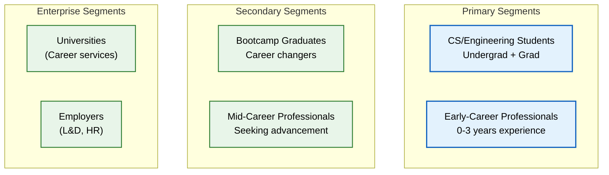
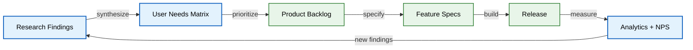

# User Research

> **Purpose:** Document Vaeloom's user research methodology, target segments, key findings, and how research insights feed into product decisions
> **Status:** 🆕 New
> **Owner:** Product Team
> **Version:** 1.0
> **Last Updated:** 2026-07-16
> **Dependencies:** [`User-Personas.md`](./User-Personas.md), [`Problem.md`](./Problem.md), [`PRD.md`](./PRD.md), [`User-Stories.md`](./User-Stories.md)
> **Implementation Status:** 📋 Spec Only

## Overview

User research is how Vaeloom stays grounded in real user needs rather than assumptions. This document defines the research methodology, target segments, key findings to date, and the cadence at which research is conducted and fed into the product roadmap. Research is not a one-time activity — it is a continuous loop of listening, synthesizing, and validating.

## Goals

- Define the research methodology and cadence
- Document target user segments and their characteristics
- Capture key research findings and pain points
- Map user needs to proposed solutions
- Establish how research feeds into feature specs

## Scope

### In Scope

- Research methodology (surveys, interviews, usability testing, analytics)
- Target user segments
- Key findings and pain points
- User needs matrix
- Research-to-product feedback loop

### Out of Scope

- Detailed personas (see [`User-Personas.md`](./User-Personas.md))
- Feature specifications (see [`Feature-Specs/`](./Feature-Specs/))

## Methodology

| Method | Purpose | Cadence | Sample Size |
|--------|---------|---------|-------------|
| **User interviews** | Deep qualitative understanding of pain points, workflows, mental models | Monthly | 5-8 users |
| **Surveys** | Quantitative validation of hypotheses across larger sample | Quarterly | 100-500 users |
| **Usability testing** | Validate UI/UX with real users before/after release | Per feature | 5-8 users |
| **Analytics review** | Identify behavioral patterns, drop-offs, feature adoption | Weekly | All users |
| **Support ticket analysis** | Surface recurring issues and friction points | Weekly | All tickets |
| **Net Promoter Score (NPS)** | Measure overall satisfaction and likelihood to recommend | Quarterly | All active users |

## Target User Segments

> **Diagram:** User segment hierarchy. Primary segments (students, early-career) are the MVP focus. Secondary segments are natural expansion. Enterprise segments are the long-term market.

## Key Research Findings

### Finding 1: Information Scatter is Universal

> "I have my resume in Google Drive, my projects on GitHub, my certificates in email, and I can never find anything when I need it." — Interview participant, CS senior

**Insight:** Every interviewed user reported spending significant time re-assembling scattered information before any career milestone (application, interview, performance review). This work is never prioritized until a deadline forces it, at which point it's rushed and incomplete.

### Finding 2: Resume Anxiety

> "I know I've done impressive things, but I can't remember half of them, and I don't know how to describe them."

**Insight:** Users undervalue their own achievements because they can't recall specifics (metrics, impact, context) when writing a resume. The achievements exist in their work history but are not accessible when needed.

### Finding 3: Missed Deadlines

> "I missed three scholarship deadlines last semester because they were buried in email."

**Insight:** Important deadlines arrive via email and documents but are never surfaced proactively. Users rely on memory or manual calendar entry, both of which fail.

### Finding 4: Trust Concerns with AI

> "I'd use an AI to help with my resume, but I'm scared it'll make things up or send something without me knowing."

**Insight:** Users are interested in AI assistance but deeply concerned about (a) fabrication/hallucination, (b) autonomous actions without consent, and (c) data privacy. Trust must be earned through transparency and control.

### Finding 5: Job Search Overwhelm

> "There are thousands of job postings. I can't tell which ones I actually have a shot at."

**Insight:** Job boards provide discovery but no fit signal. Users waste time applying to poor-fit roles and miss good matches buried in noise.

## User Needs Matrix

| Need | Priority | Evidence | Proposed Solution |
|------|----------|----------|-------------------|
| Automatically organize documents | P0 | Finding 1 (100% of interviewees) | Organization Agent + memory system |
| Maintain a living resume | P0 | Finding 2 (85%) | Resume Agent + achievement extraction |
| Never miss deadlines | P0 | Finding 3 (70%) | Scheduler Agent + deadline detection |
| Trust the AI (no fabrication, no autonomous harm) | P0 | Finding 4 (90%) | Suggest-mode default + guardrails + QA gate |
| Find relevant jobs | P0 | Finding 5 (75%) | Job Search Agent + fit scoring |
| Affordable for students | P1 | Survey (60% cite cost as barrier) | Free tier + student pricing |
| Privacy and data control | P0 | Finding 4 (sub-theme) | Privacy-by-architecture + data export/delete |

## Research-to-Product Feedback Loop

> **Diagram:** Research-to-product loop. Findings → needs matrix → backlog → specs → release → measure → new findings. Research is continuous, not a phase.

## Cadence and Ownership

| Activity | Owner | Cadence | Output |
|----------|-------|---------|--------|
| User interviews | Product Researcher | Monthly (5-8 users) | Interview notes + synthesis |
| Survey design + analysis | Product Researcher | Quarterly | Survey report |
| Usability testing | UX Designer | Per feature (5-8 users) | Usability report |
| Analytics review | Product Manager | Weekly | Adoption/drop-off insights |
| Research synthesis | Product Team | Monthly | Updated findings + needs matrix |

## Best Practices

| # | Practice | Rationale |
|---|----------|-----------|
| 1 | Talk to users every week | Research decays; fresh contact keeps empathy sharp |
| 2 | Validate hypotheses with data, not just anecdotes | Anecdotes are starting points; data confirms patterns |
| 3 | Close the loop with interviewed users | Users who see their feedback influence product become advocates |

## Related Documents

- [`User-Personas.md`](./User-Personas.md) — detailed personas
- [`Problem.md`](./Problem.md) — problem statement
- [`PRD.md`](./PRD.md) — product requirements
- [`User-Stories.md`](./User-Stories.md) — user stories derived from research
- [`User-Journey.md`](./User-Journey.md) — user journey map
